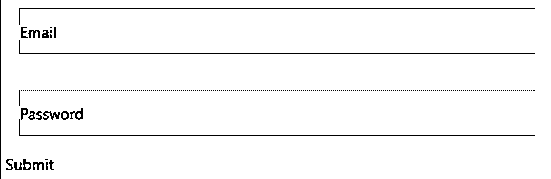

# 对本机文本输入做出反应

> 原文：<https://www.educba.com/react-native-textinput/>


## React 原生文本输入简介

react native 中的 TextInput 用于从表单中写入输入字段值(电子邮件、用户名、密码等)。);它有各种重要的特性，使它对任何输入值都是完美的；例如，它给了我们 onchange 函数来管理输入事件相关的工作。此外，它为一个简单的输入提供了动力，我们可以轻松地用更少的 html 代码为它自己的设计设计一个占位符。除了设计和工作之外，它还具有管理事件、条件编辑和渲染的能力，这使它比任何其他选项都好(输入长度应小于，或者字符应为大写或小写，等等类似条件)。

**语法:**

<small>网页开发、编程语言、软件测试&其他</small>

在下面的例子中，我们使用了 react-native component TextInput 和 passing style(使我们的输入字段看起来更有吸引力或根据我们的需要)、onChangeText(这是一个函数，用于在文本发生任何变化的情况下执行任何操作)、autoCapitalize(如果我们希望获得大写字母，将使用该属性)、autoCorrect(该属性允许输入字段在出现任何错误的输入字段时自动更正)

```
<TextInput
style={comma separated css style for this input box}
onChangeText={function be executed on change the value of input box}
value={value of input box}
autoCapitalize={enum value containing 'off', 'password','username', 'email','name', 'tel', 'street-address', 'cc-number', 'postal-code','cc-exp', 'cc-csc','cc-exp-month', 'cc-exp-year' }
autoCorrect={used to auto correct the input value,it’s default value is true}
/>
```

### React 原生文本输入的属性

下面是 react 的属性。

**1。allowFontScaling** :定义字体是否将缩放到定义的文本大小可访问性设置。如果我们没有传递任何属性，那么它将是真的。

**2。自动大写**:允许你自动大写字母。我们可以为它传递一些参数，如下所示。

*   '无'，
*   句子'，
*   单词'，
*   '字符'

假设我们正在写一个有多页的大段，我们希望我们的语法能够根据给定的条件改变 alpha-bet 值。借助这些类型的属性，我们可以减少人为错误。

**3。autoCompleteType:** 该字段定义输入框的自动字段值，在这里它将给出匹配输入字段的建议。它支持一些值，如'关闭'，'密码'，'用户名'，'邮政编码'，'电子邮件'，'街道地址'，'抄送号码'，'抄送月'，'姓名'，'电话'，'抄送 csc '，'抄送支出'，'抄送支出年'。在所有的 android 设备中，autocomplete 是最好的默认设置，如果我们不想使用它，我们需要将它设置为 false。

**4。自动更正**:它将更正输入字段，它接受一个布尔值。如果我们不指定它的值，它将为真。

**5。autoFocus** :在默认情况下，它将为 false，如果为 true，那么它将聚焦在 componentDidMount 上。

**6。blurOnSubmit** :当我们想要在提交时模糊输入字段时，我们使用这个属性。

**7。clearTextOnFocus** :当编辑开始时，当我们希望我们的输入框被清空时，就会用到它。

**8。defaultValue** :在开始输入时设置一些初始值，这在用户不想写全名的情况下会很有帮助。

**9。Editable** :如果我们不想编辑文本输入，那么我们可以将 Editable 设为 false。不允许不可编辑的字段从前端编辑是有用的。

10。keyboardType :指定将要打开的键盘的类型，这种类型可以是各种类型，数字键盘，数字，电话键盘，电子邮件地址。

**11。maxLength** :它将用于我们希望字符具有固定最大长度的情况。例如，如果 maxLength 是 6 位数，那么它只允许长度为 6 的字符。

**12。numberOfLines** :如果我们想让 TextInput 具有固定的行数，将使用这些属性。

13。onBlur :在文本输入模糊的情况下，它会调用一个回调函数，我们可以在那里写我们需要的东西。

**14。onChange** :当文本输入有任何变化时，它会调用一个回调函数

15。onFocus :在文本输入获得焦点的情况下，它会调用一个回调函数，在那里我们可以执行与之相关的各个任务。

16。onKeyPress :在文本输入被按下的情况下，它将调用一个回调函数，在那里我们可以执行与之相关的各个任务

**17。onSelectionChange** :在文本输入选择 get changed 的情况下，它会调用一个回调函数，在这里我们可以执行与之相关的各个任务。

18。onSubmitEditing :在文本输入提交被按下的情况下，它将调用一个回调函数，在那里我们可以执行与之相关的各自的任务。

**19。占位符**:它是在输入实际字符串之前第一次呈现的字符串。

20。placeholderTextColor :它是在输入实际字符串之前第一次呈现的字符串的颜色。

**21。样式**:这里是输入文本的自定义样式。

**22。值**:这是文本输入的值。

### 实现 React 本机 TextInput 的示例

下面是各种文本输入的例子。这里我们要设计一个登录输入框。我们在此执行的任务在下面的示例中给出。

*   第一步，我们创建一个 react 类 InputType，扩展 react 核心组件。
*   在 InputType 类中，我们为电子邮件和密码定义了一些初始状态。

**代码:**

```
import React, { Component } from "react";
import {
View,
Text,
TouchableOpacity,
TextInput,
StyleSheet
} from "react-native";
class InputsTypes extends Component {
state = {
customerEmail: "",
customerPass: ""
};
handleEmailChange = email => {
this.setState({ customerEmail: email });
};
handlePasswordChange = pass => {
this.setState({ customerPass: pass });
};
login = (customerEmail, customerPass) => {
console.log(
"email of customer: " +
customerEmail +
" password of customer: " +
customerPass
);
};
render() {
return (
<View style={styles.containerStyle}>
<TextInput
style={styles.inputStyle}
underlineColorAndroid="transparent"
placeholder="Email"
placeholderTextColor="green"
autoCapitalize="none"
onChangeText={this.handleEmailChange}
/>
<TextInput
style={styles.inputStyle}
underlineColorAndroid="transparent"
placeholder="Password"
placeholderTextColor="green"
autoCapitalize="none"
onChangeText={this.handlePasswordChange}
/>
<TouchableOpacity
style={styles.submitButton}
onPress={() =>
this.login(this.state.customerEmail, this.state.customerPass)
}
>
<Text style={styles.submitButtonText}> Submit </Text>
</TouchableOpacity>
</View>
);
}
}
export default InputsTypes;
const styles = StyleSheet.create({
containerStyle: {
paddingTop: 23
},
inputStyle: {
margin: 16,
height: 42,
borderColor: "pink",
borderWidth: 1
},
submitButtonStyle: {
backgroundColor: "pink",
padding: 11,
margin: 16,
height: 42
},
submitButtonText: {
color: "shyam"
}
});
```

**输出:**




### 推荐文章

这是一个反应原生文本输入的指南。这里我们讨论 React Native TextInput 的顶级属性及其示例和代码实现。您也可以浏览我们推荐的其他文章，了解更多信息——

1.  [什么是 React Native？](https://www.educba.com/what-is-react-native/)
2.  [反应原生布局](https://www.educba.com/react-native-layout/)
3.  [React Native FlatList](https://www.educba.com/react-native-flatlist/)
4.  [反应原生表](https://www.educba.com/react-native-table/)