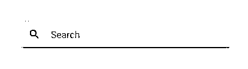
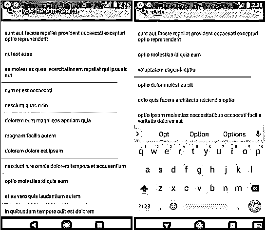
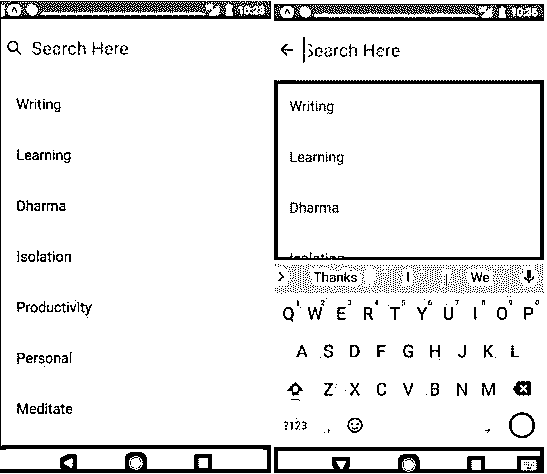
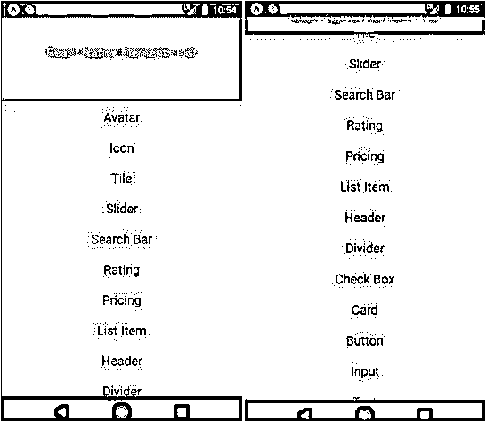

# React 本机搜索栏

> 原文：<https://www.educba.com/react-native-search-bar/>

## React 本机搜索栏简介

要搜索特定项目或筛选出特定项目，可以使用搜索栏。简单来说，我们可以说搜索栏是一个简单的输入框，用户可以在其中输入搜索查询。搜索栏的开发使用了不同的工具，如 platform、clearIcon、searchIcon、inputStyle、containerStyle、onClear、onChangeText、placeholder 等。在这方面，我们有不同种类的搜索栏，有助于提供最佳的用户体验。下图显示了基本搜索栏的外观:

<small>网页开发、编程语言、软件测试&其他</small>

**语法:**

`<SearchBar round
searchIcon={{ size: 24 }}
onChangeText={text => this.SearchFilterFunction(text)} onClear={text => this.SearchFilterFunction('')} placeholder="Type Here..."
value={this.state.search}
/>`

### 实现 React 本机搜索栏的示例

以下是一些例子:

#### 示例#1

基本搜索栏

**代码:**

`import React, { Component } from 'react'; import { View,
Text, StyleSheet
}from 'react-native';
import { SearchBar } from 'react-native-elements';
export default class App extends React.Component { state = {
search: '',
};
updateSearch = search => { this.setState({ search });
};
render() {
const { search } = this.state;
return (
<SearchBar
placeholder="Type Here to Search..." onChangeText={this.updateSearch} value={search}
/>
);
}
}`

**输出:**

#### 实施例 2

使用 React Native 中的搜索栏在列表中搜索-

**代码:**

`import * as React from 'react'; import {
Text, View,
StyleSheet, FlatList, ActivityIndicator, Platform,
} from 'react-native';
import { SearchBar } from 'react-native-elements';
export default class App extends React.Component { constructor(props) {
super(props);
this.state = { search: '', isLoading: true }; this.arrayholder = [];
}
componentDidMount() {
return fetch('https://jsonplaceholder.typicode.com/posts')
.then(response => response.json())
.then(responseJson => { this.setState(
{
isLoading: false, dataSource: responseJson,
},
function() {
this.arrayholder = responseJson;
}
);
})
.catch(error => { console.error(error);
});
}
search = text => { console.log(text);
};
clear = () => { this.search.clear();
};
SearchFilterFunction(text) {
const newData = this.arrayholder.filter(function(item) { const itemData = item.title ? item.title.toUpperCase() :
''.toUpperCase();
const textData = text.toUpperCase(); return itemData.indexOf(textData) > -1;
});
this.setState({ dataSource: newData, search: text,
});
}
ListViewItemSeparator = () => { return (
<View
style={{ height: 0.4,
width: '89%',
backgroundColor: '#141313',
}}
/>
);
};
render() {
if (this.state.isLoading) { return (
<View style={{ flex: 1, paddingTop: 21 }}>
<ActivityIndicator />
</View>
);
}
return (
<View style={styles.viewStyle}>
<SearchBar round
searchIcon={{ size: 25 }}
onChangeText={text => this.SearchFilterFunction(text)} onClear={text => this.SearchFilterFunction('')} placeholder="Type Here to Search..." value={this.state.search}
/>
<FlatList data={this.state.dataSource}
ItemSeparatorComponent={this.ListViewItemSeparator} renderItem={({ item }) => (
<Text style={styles.textStyle}>{item.title}</Text>
)}
enableEmptySections={true} style={{ marginTop: 11 }}
keyExtractor={(item, index) => index.toString()}
/>
</View>
);
}
}
const styles = StyleSheet.create({ viewStyle: {
justifyContent: 'center', flex: 1,
backgroundColor: '#bffff4',
marginTop: Platform.OS == 'ios' ? 29 : 0,
},
textStyle: { padding: 11,
},
});`

**输出:**

#### 实施例 3

动画搜索栏

**代码:**

`import * as React from 'react'; import {
Text, View,
StyleSheet, TextInput, FlatList, Keyboard,
} from 'react-native';
import Icon from 'react-native-vector-icons/Ionicons'; import * as Animate from 'react-native-animatable'; const listItems = [
'Writing', 'Learning', 'Dharma', 'Isolation', 'Productivity', 'Personal', 'Meditate',
'Mindfulness',
'Buddha',
'Health', 'Fitness', 'Music',
];
export default class App extends React.Component { state = {
searchBarFocused: false,
};
componentDidMount() {
this.keyboardDidShow = Keyboard.addListener( 'keyboardDidShow',
this.keyboardDidShow
);
this.keyboardWillShow = Keyboard.addListener( 'keyboardWillShow',
this.keyboardWillShow
);
this.keyboardWillHide = Keyboard.addListener( 'keyboardWillHide',
this.keyboardWillHide
);
}
keyboardDidShow = () => {
this.setState({ searchBarFocused: true });
};
keyboardWillShow = () => {
this.setState({ searchBarFocused: true });
};
keyboardWillHide = () => {
this.setState({ searchBarFocused: false });
};
render() { return (
<View style={{ flex: 1, paddingTop: 21 }}>
<View
style={{ height: 82,
backgroundColor: '#c5ff59', justifyContent: 'center', paddingHorizontal: 5,
}}>
<Animate.View animation="slideInRight"
duration={1000} style={{
height: 51, backgroundColor: '#ffffff', flexDirection: 'row', padding: 4,
alignItems: 'center',
}}>
<Icon
name={
this.state.searchBarFocused ? 'md-arrow-back' : 'ios-search'
}
style={{ fontSize: 24 }}
/>
<TextInput placeholder="Search Here"
style={{ fontSize: 24, paddingLeft: 14 }}
/>
</Animate.View>
</View>
<FlatList style={{
backgroundColor: this.state.searchBarFocused
? '#6e6363'
: '#ffffff',
}}
data={listItems} renderItem={({ item }) => (
<Text style={{ padding: 21, fontSize: 19 }}>{item}</Text>
)}
keyExtractor={(item, index) => index.toString()}
/>
</View>
);
}
}`

**输出:**

#### 实施例 4

可折叠的搜索栏

**代码:**

`import React, { Component } from 'react'; import { ScrollView
, StyleSheet
, View
, Animated
, Text
, Platform, }
from 'react-native';
const Header_Maximum_Height = 150; const Header_Minimum_Height = 50;
//Minimum Height of the Header
export default class Mynewproject extends Component<{}> { constructor() {
super();
this.AnimatedHeaderValue = new Animated.Value(0);
}
render() {
const AnimateHeaderBackgroundColor = this.AnimatedHeaderValue.interpolate({
inputRange: [0, Header_Maximum_Height - Header_Minimum_Height], outputRange: ['#ba52ff', '#f522ab'],
extrapolate: 'clamp',
});
const AnimateHeaderHeight = this.AnimatedHeaderValue.interpolate({ inputRange: [0, Header_Maximum_Height - Header_Minimum_Height], outputRange: [Header_Maximum_Height, Header_Minimum_Height], extrapolate: 'clamp',
});
} },
return (
<View style={styles.MainContainer}>
<ScrollView scrollEventThrottle={16}
contentContainerStyle={{ paddingTop: Header_Maximum_Height }} onScroll={Animated.event([
{ nativeEvent: { contentOffset: { y: this.AnimatedHeaderValue }
])}>
{*/** Put all of the Components here inside ScrollView */}
t;Text style={styles.TextViewStyle}>Avatar</Text>
<Text style={styles.TextViewStyle}>Icon</Text>
<Text style={styles.TextViewStyle}>Tile</Text>
<Text style={styles.TextViewStyle}>Slider</Text>
<Text style={styles.TextViewStyle}>Search Bar</Text>
<Text style={styles.TextViewStyle}>Rating</Text>
<Text style={styles.TextViewStyle}>Pricing</Text>
<Text style={styles.TextViewStyle}>List Item</Text>
<Text style={styles.TextViewStyle}>Header</Text>
<Text style={styles.TextViewStyle}>Divider</Text>
<Text style={styles.TextViewStyle}>Check Box</Text>
<Text style={styles.TextViewStyle}>Card</Text>
<Text style={styles.TextViewStyle}>Button</Text>
<Text style={styles.TextViewStyle}>Input</Text>
<Text style={styles.TextViewStyle}>Text</Text>
</ScrollView>
<Animated.View style={[
styles.Header,
{
height: AnimateHeaderHeight,
backgroundColor: AnimateHeaderBackgroundColor,
},
]}>
<Text style={styles.HeaderInsideText}> React Native Elements List
</Text>
</Animated.View>
</View>
);
}
}
const styles = StyleSheet.create({ MainContainer: {
flex: 1,
paddingTop: Platform.OS == 'ios' ? 20 : 0,
},
Header: {
justifyContent: 'center', alignItems: 'center', position: 'absolute', left: 0,
right: 0,
top: Platform.OS == 'ios' ? 20 : 0,
},
HeaderInsideText: { color: '#ffe48f', fontSize: 19, textAlign: 'center',
},
TextViewStyle: { textAlign: 'center', color: '#0a0a0a', fontSize: 19,
margin: 4,
padding: 6,
},
});`

**输出:**

### 结论

在上述讨论的基础上，我们知道了可以在 it 中开发的不同种类的搜索栏，因为它的这种能力，即提供多种选项，这有助于提供最佳的用户体验。搜索栏的不同属性有助于开发更多的交互式搜索栏。我们已经讨论了不同格式的搜索栏，从基本的搜索栏到动画搜索栏，最后到可折叠的搜索栏，我们知道用动画来开发搜索栏是非常容易的。因此，对于拥有良好图形和动画的出色用户体验来说，这是可以考虑的最佳选择。

### 推荐文章

这是一个反应原生搜索栏的指南。这里我们讨论 React 本机搜索栏的介绍，并给出相应的例子和适当的语法。您也可以浏览我们的其他相关文章，了解更多信息——

1.  [反应原生获取](https://www.educba.com/react-native-fetch/)
2.  [反应本地本地存储](https://www.educba.com/react-native-local-storage/)
3.  [反应原生导航](https://www.educba.com/react-native-navigation/)
4.  [反应自然取向](https://www.educba.com/react-native-orientation/)

