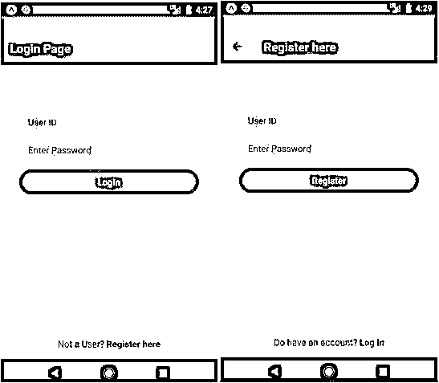
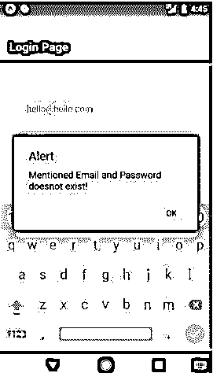

# React 本机登录屏幕

> 原文：<https://www.educba.com/react-native-login-screen/>

## React 本机登录屏幕简介

登录屏幕可以定义为需要一组用于验证用户身份的凭据的屏幕。登录是对用户进行身份验证并向他/她提供对其帐户的访问的过程。登录界面主要由用户 ID 或用户名和密码组成。登录屏幕还可以包括指纹、生物标识符、密码、PIN 码或视网膜扫描。React Native 提供了创建登录屏幕的最佳平台，因为有各种各样的模板可供使用。开发的登录屏幕是最好的用户体验，非常容易使用。

### 句法

**1。在 React Native 中导入登录屏幕**

<small>网页开发、编程语言、软件测试&其他</small>

**语法:**

`Transition-property: value of property to be applied;`

**2。创建登录屏幕组件**

**语法:**

`<LoginScreen spinnerEnable spinnerVisibility source={source}
switchValue={switchValue}
onPressSettings={() => alert("Settings Button is clicked")} onPressLogin={() => alert("Login Button is clicked")} onSwitchValueChange={switchValue => setSwitchValue(switchValue)} usernameOnChangeText={username => setUsername(username)} passwordOnChangeText={password => alert("Password is: ", password)}
>
<View
style={{
position: "relative", alignSelf: "center", marginTop: 65
}}
>
<Text style={{ color: "white", fontSize: 29 }}>{switchValue}</Text>
</View>
</LoginScreen>`

### 例子

以下是注册按钮的示例:

**tab pages 文件夹的组件**

#### 1.Form.js

**代码:**

`import React, { Component } from 'react';
import { StyleSheet
, Text
, View
, TextInput
, TouchableOpacity
, AsyncStorage
, Keyboard } from 'react-native';
import {Actions} from 'react-native-router-flux';
export default class Form extends Component {
constructor(props){ super(props); this.state={
email:'', password: ''
}
}
saveData =async()=>{
const {email,password} = this.state;
let loginDetails={ email: email, password: password
}
if(this.props.type !== 'Login')
{
AsyncStorage.setItem('loginDetails', JSON.stringify(loginDetails));
Keyboard.dismiss();
alert("You have registered successfully. " + 'Your credentials are:- User-ID: ' + email + ' P.W.:' + password);
this.login();
}
else if(this.props.type == 'Login')
{
try{
let loginDetails = await AsyncStorage.getItem('loginDetails');
let ld = JSON.parse(loginDetails);
if (ld.email != null && ld.password != null)
{
if (ld.email == email && ld.password == password)
{
alert('Welcome Back !');
}
else
{
alert('Mentioned Email and Password doesnot
exist!');
}
}
}catch(error)
{
alert(error);
}
}
}
showData = async()=>{
let loginDetails = await AsyncStorage.getItem('Login Details Are'); let ld = JSON.parse(loginDetails);
alert('email: '+ ld.email + ' ' + 'password: ' + ld.password);
}
render() {
return(
<View style={styles.container}>
<TextInput style={styles.inputBox} onChangeText={(email) => this.setState({email})} underlineColorAndroid='rgba(0,0,0,0)' placeholder="User ID"
placeholderTextColor = "#850c22" selectionColor="#fff" keyboardType="email-address"
onSubmitEditing={()=> this.password.focus()}/>
<TextInput style={styles.inputBox} onChangeText={(password) => this.setState({password})} underlineColorAndroid='rgba(0,0,0,0)' placeholder="Enter Password"
secureTextEntry={true}
placeholderTextColor = "#850c22" ref={(input) => this.password = input}
/>
<TouchableOpacity style={styles.button}>
<Text style={styles.buttonText} onPress={this.saveData}>{this.props.type}</Text>
</TouchableOpacity>
</View>
)
}
}
const styles = StyleSheet.create({ container: {
justifyContent: 'center', alignItems: 'center',
},
inputBox: {
width: 299, backgroundColor: '#ede8e8', borderRadius: 24,
paddingHorizontal: 15,
fontSize: 15,
color: '#991172',
marginVertical: 9
},
button: {
width: 299,
backgroundColor: '#b8236b', borderRadius: 24,
marginVertical: 9,
paddingVertical: 11
},
buttonText: {
fontSize: 15,
fontWeight: '500', color: '#ffffff', textAlign: 'center'
}
});`

#### 2.Login.js

**代码:**

`import React, { Component } from 'react'; import { StyleSheet
, Text
, View
, TextInput
, TouchableOpacity
, AsyncStorage
, Keyboard } from 'react-native';
import {Actions} from 'react-native-router-flux';
import Form from './Form';
export default class Login extends Component {
signup() {
Actions.signup()
}
render() {
return(
<View style={styles.container}>
<Text>{'\n'}</Text>
<Text>{'\n'}</Text>
<Form type="Login"/>
<View style={styles.signupTextCont}>
<Text style={styles.signupText}>Not a User? </Text>
<TouchableOpacity onPress={this.signup}><Text style={styles.signupButton}>Register here</Text></TouchableOpacity>
</View>
</View>
)
}
}
const styles = StyleSheet.create({ container: {
flex: 1,
justifyContent: 'center', alignItems: 'center', backgroundColor: '#ffffff',
},
signupTextCont: { flexGrow: 1,
justifyContent: 'center', alignItems: 'flex-end', paddingVertical: 15, flexDirection: 'row',
},
signupText: { color: '#bd157a', fontSize:15,
},
signupButton: { color: '#700d49', fontSize:15,
fontWeight: '500',
}
});`

#### 3.注册. js

**代码:**

`render() {
return(
<View style={styles.container}>
<Text>{'\n'}</Text>
<Text>{'\n'}</Text>
<Form type="Register"/>
<View style={styles.signupTextCont}>
<Text style={styles.signupText}>Do have an account?
</Text>
<TouchableOpacity onPress={this.goBack}><Text style={styles.signupButton}>Log in</Text></TouchableOpacity>
</View>
</View>
)
}
}
const styles = StyleSheet.create({
container: {
flex: 1,
justifyContent: 'center', alignItems: 'center', backgroundColor: '#ffffff'
},
signupTextCont: { flexGrow: 1,
justifyContent: 'center', alignItems: 'flex-end', paddingVertical: 15, flexDirection: 'row'
},
signupText: { color: '#c7226c', fontSize:15
},
signupButton: { color: '#c7226c', fontSize:15, fontWeight: '500'
}
});`

#### 4.Routes.js(路由器)

**代码:**

`import React, { Component } from 'react'; import {Router
, Stack
, Scene} from 'react-native-router-flux';
import Login from './Login'; import Signup from './Signup';
export default class Routes extends Component { render() {
return (
<Router barButtonIconStyle ={styles.barButtonIconStyle} hideNavBar={false} navigationBarStyle={{backgroundColor: '#b51271',}} titleStyle={{color: '#ffffff',}}
>
<Stack key="root">
<Scene key="login" component={Login} title="Login Page"/>
<Scene key="signup" component={Signup} title="Register
here"/>
</Stack>
</Router>
)
}
}
const styles = { barButtonIconStyle: {
tintColor: '#ffffff'
}
}`

#### 5.App.js

**代码:**

`import React, { Component } from 'react'; import {
StyleSheet, View, StatusBar
} from 'react-native';
import Routes from './pages/TabPages/Routes';
export default class App extends Component   { render() {
return (
<View style={styles.container}>
<StatusBar backgroundColor="#6e052f"
barStyle="light-content"
/>
<Routes/>
</View>
);
}
}
const styles = StyleSheet.create({ container: {
flex: 1,
}
});`

**输出:**

*   图 1 显示了登录屏幕，图 2 显示了当您单击登录屏幕底部的注册按钮时将出现的注册屏幕。
*   图 3 显示了当您使用电子邮件 ID 和密码成功注册时将出现的弹出窗口。
*   图 4 显示了当您使用注册的电子邮件 ID 登录时将出现的弹出窗口。
*   图 5 显示了当您尝试使用错误的凭证登录时将出现的弹出窗口。

图像 1 和图像 2

图 3 和图 4

图 5

### 结论

在上面讨论的基础上，我们了解了如何导入登录屏幕和创建登录屏幕组件。我们创建的例子是一个创建登录屏幕的基本和高级例子。因此，在这个示例的帮助下，可以创建基本登录屏幕以及高级登录屏幕，其中有一个单独的注册屏幕，如示例中所创建的。我们创建的登录屏幕非常易于使用，React Native 提供了创建高级登录屏幕的最佳平台。

### 推荐文章

这是一个引导 React 本机登录的屏幕。在这里，我们将讨论简介及其主要示例以及代码实现。您也可以浏览我们推荐的其他文章，了解更多信息——

1.  [反应本地异步存储](https://www.educba.com/react-native-asyncstorage/)
2.  [反应原生进度条](https://www.educba.com/react-native-progress-bar/)
3.  [React 原生模板](https://www.educba.com/react-native-template/)
4.  [反应原生导航](https://www.educba.com/react-native-navigation/)