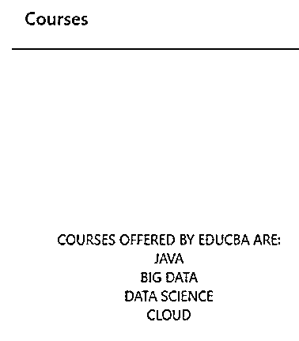

# 反应本地导航

> 原文：<https://www.educba.com/react-native-navigation/>

## React 本机导航简介

导航可以定义为一个组件，它允许用户与应用程序交互，并在应用程序的上下文中跨不同页面执行导航。为了在 react 本机应用程序中使用导航，我们需要将 react 本机导航的依赖性添加到我们的项目中，依赖性对 android 和 IOS 都可用。

**语法:**

<small>网页开发、编程语言、软件测试&其他</small>

`// import react component
import React, { Component } from 'react';
import React from 'react';
import { StyleSheet, Text, View } from 'react-native';
import { createStackNavigator, createAppContainer } from "react-navigation"; // import react native navigation
import <Screen1> from './components/<Screen1>';
import <Screen2> from './components/<Screen2>';
export default class <ClassName> extends React.Component {
render() {
// return container
return <ApplicationContainer />;
}
}
// calling createStackNavigator to define different screens
const AppNavigator = createStackNavigator({
// define different screens eligible for navigation
<Screen1_Name>: {
screen: <Screen1>
},
<Screen2_Name>: {
screen: <Screen1>
}
});
const ApplicationContainer = createAppContainer(AppNavigator);
const styles = StyleSheet.create({
container: {
// define different style parameters as per our requirement
},
});`

在我们将依赖导航添加到项目中之后，首先需要将导航导入到我们的代码中。在 render 方法中，我们使用了 ApplicationContainer 标记，并使用相应的方法指定了 ApplicationContainer 的实现。这里<classname>代表 react 类的名称。如您所见，我们使用了 createStackNavigator 方法来定义适合导航的不同屏幕。</classname>

### 在 React Native 中导航是如何工作的？

为了使用 react 本机导航，我们需要将依赖项添加到 react 本机项目中。

可以通过运行以下命令来添加导航依赖项:

`npm install --save react-native-navigation`

在上面的命令成功运行之后，我们可以将依赖项导入到我们的项目中，并根据我们的需求使用它。从上面的语法中可以看出，createStackNavigator 方法用于定义导航可用的不同屏幕。除了上面提到的库之外，还有其他几个库用来提供有吸引力的动画和功能。

### 例子

下面给出了一个例子:

**代码:**

`importReactfrom'react';
import { StyleSheet, Text, View } from'react-native';
import {  createAppContainer } from"react-navigation";
importHomeScreenfrom'./components/HomeScreen';
importCoursesScreenfrom'./components/CoursesScreen';
import { createStackNavigator } from'react-navigation-stack';
exportdefaultclassAppextendsReact.Component {
render() {
return<ApplicationContainer />;
}
}
// define different screens eligible for navigation
constAppNavigator = createStackNavigator({
Home: {
screen: HomeScreen
},
Courses: {
screen: CoursesScreen
}
});
constApplicationContainer = createAppContainer(AppNavigator);
const styles = StyleSheet.create({
container: {
flex: 1,
backgroundColor: '#fff',
alignItems: 'center',
justifyContent: 'center',
},
});`

上述主屏幕的源代码如下:

**代码:**

`importReact, { Component } from'react';
import { Button, View, Text } from'react-native';
import { createStackNavigator, createAppContainer } from'react-navigation';
exportdefaultclassHomescreenextendsComponent {
render() {
return (
<View style={{ flex: 1, alignItems: 'center', justifyContent: 'center' }}>
<Text>WELCOMETOEDUCBA</Text>
<Button
title="Go to Courses"
// navigation to CoursesScreen on click of button
onPress={() =>this.props.navigation.navigate('CoursesScreen')}
/>
</View>
)
}
}`

课程屏幕的源代码如下:

**代码:**

`importReact, { Component } from'react';
import { Button, View, Text } from'react-native';
import { createStackNavigator, createAppContainer } from'react-navigation';
exportdefaultclassCoursesScreenextendsComponent {
render() {
return (
<View style={{ flex: 1, alignItems: 'center', justifyContent: 'center' }}>
<Text>COURSESOFFEREDBYEDUCBAARE:</Text>
<Text>JAVA</Text>
<Text>BIGDATA</Text>
<Text>DATASCIENCE</Text>
<Text>CLOUD</Text>
</View>
)
}
}`

上面的例子显示了如何使用导航。执行上述代码后，我们将在手机屏幕上看到以下输出:

**输出:**

单击“转到课程”按钮，我们将导航到另一个屏幕，显示提供的课程列表，如下所示:

除了上面提到的导航之外，还可以有另一种类型的导航，它可以以类似于上面所示的方式来实现，只需稍作修改。

### 推荐文章

这是一个反应原生导航的指南。在这里，我们讨论 React 本机导航的介绍，导航如何与示例一起工作。有几个第三方库可以用来为导航提供更多的定制。您也可以看看以下文章，了解更多信息–

1.  [React 原生搜索栏](https://www.educba.com/react-native-search-bar/)
2.  [React 原生图表](https://www.educba.com/react-native-charts/)
3.  [React 原生库](https://www.educba.com/react-native-libraries/)
4.  [反应原生闪屏](https://www.educba.com/react-native-splash-screen/)