# 反应本色

> 原文：<https://www.educba.com/react-native-color/>

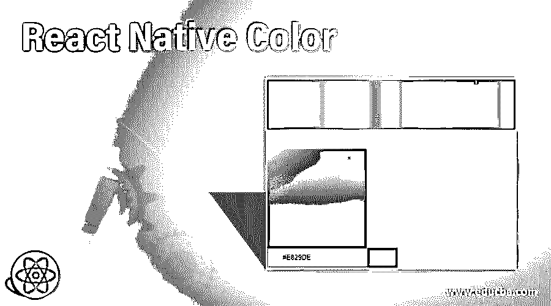

## 反应本色简介

颜色是任何视觉事物不可或缺的一部分。就软件、应用程序和网站而言，色彩在增强用户界面和用户体验方面发挥着重要作用。它还支持颜色来增强网站或应用程序的用户界面。React 本地组件的样式是使用 JavaScript 完成的。颜色属性就像 CSS 在 web 上的工作方式一样。有许多不同的颜色 API 帮助我们利用平台的设计和用户的偏好。

*   PlatformColor 用于引用平台的颜色系统。
*   DynamicColorIOS 仅用于 IOS，它帮助我们指定适合在黑暗和光明模式下使用的颜色。

在本文中，我们将通过不同的例子来理解应用程序。

<small>网页开发、编程语言、软件测试&其他</small>

### 句法

语法如下所示:

#### 1.红绿蓝(RGB)

它支持函数表示法和十六进制表示法中的 rgba()和 rgb()。

`'#3cf' (#rgb)
'#b4ff33' (#rrggbb)
'#eba3' (#rgba)
'#ff00ff00' (#rrggbbaa)
'rgb(235, 163, 63)'
'rgba(90, 224, 171, 1.0)'`

#### 2.色调饱和度亮度(HSL)

它支持函数表示法中的 hsla()和 hsl()。

`'hsl(156, 69%, 62%)'
'hsla(307, 69%, 62%, 1.0)'`

#### 3.颜色

在 RGB 颜色模式下，它支持颜色作为 int 值。

`0xff00ff00 (0xrrggbbaa)`

#### 4.命名颜色

在 React Native 中，可以使用颜色名称字符串作为值。

`aqua (#00ffff)
chartreuse (#7fff00)
darkcyan (#008b8b)`

### 反应自然颜色的工作

它可以有多种用途。我们已经在上面陈述了可以在 React Native 中应用颜色的语法。可以使用 RGB 符号、色调饱和度亮度值来应用颜色。它可以作为 RGB 模式中颜色的整数值应用，不同颜色的名称字符串也可以用于应用颜色。react native 接受 rgba()和 rgb()符号。

### 反应本色的例子

下面是一些例子:

#### 1.给图像着色的基本示例

在下面的例子中，我们通过 backgroundColor 给背景上色:“青色”，用 tintColor 给图像上色:“黄色”。用于实施以下课程的文件有:

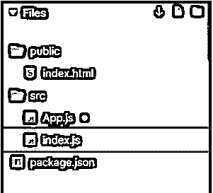

**App.js**

`import React from "react";
import { View
, Image } from "react-native";
class App extends React.Component {
render() {
return (
<View style={{ flex: 1, backgroundColor: "cyan" }}>
<Image
style={{
flex: 1,
resizeMode: "contain",
tintColor: "yellow",
padding: 15
}}
source={{ uri: "https://cdn.onlinewebfonts.com/svg/img_541880.png" }}
/>
</View>
);
}
}
export default App;`

**index.js**

`import { AppRegistry } from "react-native";
import App from "./App";
AppRegistry.registerComponent("App", () => App);
AppRegistry.runApplication("App", {
rootTag: document.getElementById("root")
});`

**输出:**

#### 2.用拾色器反应自然颜色

在下面的例子中，我们使用了颜色选择器来选择要在边框中显示和编辑的颜色。用于实现以下代码的文件是:

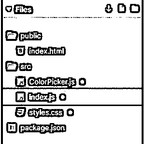

**ColorPicker.js**

`import React from "react";
import { CustomPicker } from "react-color";
import {
EditableInput
, Hue
, Saturation
} from "react-color/lib/components/common";
export constMyPicker = ({ hex, hsl, hsv, onChange }) => {
const styles = {
hue: {
height: 100,
position: "relative",
marginBottom: 40
},
saturation: {
width: 200,
height: 200,
position: "relative"
},
input: {
height: 35,
border: `1px solid ${hex}`,
paddingLeft: 30
},
swatch: {
width: 60,
height: 40,
background: hex
}
};
return (

<Hue hsl={hsl} onChange={onChange} />

<Saturation hsl={hsl} hsv={hsv} onChange={onChange} />

<EditableInput
style={{ input: styles.input }}
value={hex}
onChange={onChange}
/>

);
};
export default CustomPicker(MyPicker);`

**index.js**

`import React from "react";
import ReactDOM from "react-dom";
import ColorPicker from "./ColorPicker";
function App() {
return (

<ColorPickercolor="#E829DE" />

);
}
constrootElement = document.getElementById("root");
ReactDOM.render(<App />, rootElement);
**styles.css**
.App {
font-family: 'Times New Roman'
, Times
, serif
text-align: center;
}`

**输出:**

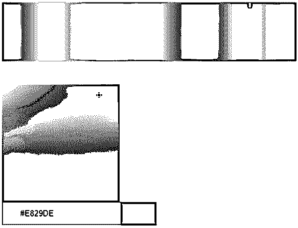

#### 3.使用 processColor 反应本色

在下面的例子中，我们从 react native like 导入了 processColor。

`import { processColor } from "react-native";`

并使用了函数 hexStringFromCSSColorand 和(" rgba(209，0，255，0.5)")为背景着色。

用于实现以下代码的文件是:

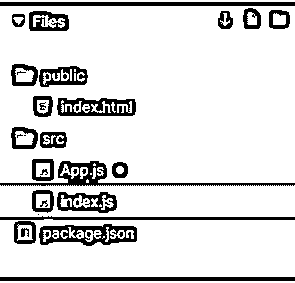

**App.js**

`import React from "react";
import { View
, processColor } from "react-native";
function hexStringFromCSSColor(color) {
constprocessedColor = processColor(color);
constcolorStr = `${processedColor.toString(16)}`;
constwithoutAlpha = colorStr.substring(2, colorStr.length);
const alpha = colorStr.substring(0, 2);
return `#${withoutAlpha}${alpha}`;
}
class App extends React.Component {
render() {
const hex = hexStringFromCSSColor("rgba(209,0,255,0.5)");
return <View style={{ flex: 1, backgroundColor: hex }} />;
}
}
export default App;`

**index.js**

`import { AppRegistry } from "react-native";
import App from "./App";
AppRegistry.registerComponent("App", () => App);
AppRegistry.runApplication("App", {
rootTag: document.getElementById("root")
});`

**输出:**

#### 4.用按钮反应自然颜色变化

在下面的例子中，不同的按钮用于改变不同框的背景颜色。用于实现以下代码的文件是:

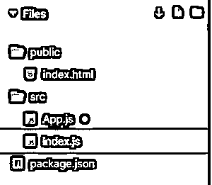

**App.js**

`import React
, { useRef } from "react";
import { Button
, StyleSheet
, Text
, View } from "react-native";
import { animated } from "react-spring/native";
constAnimatedView = animated(View);
const styles = StyleSheet.create({
item: {
alignItems: "center",
justifyContent: "center",
width: 200,
height: 100,
margin: 15,
backgroundColor: "pink"
},
text: {
color: "white"
}
});
export default function App() {
const cache = useRef({
toggle1: false,
toggle2: false
});
const ref1 = useRef(null);
const ref2 = useRef(null);
return (
<View>
<View ref={ref1} style={styles.item}>
<Text style={styles.text}>BOX 1</Text>
</View>
<Button
onPress={() => {
cache.current.toggle1 = !cache.current.toggle1;
ref1.current.setNativeProps({
style: { backgroundColor: cache.current.toggle1 ? "lightgreen" : "orange" }
});
}}
title=" Box 1 - Change Color"
/>
<AnimatedView ref={ref2} style={styles.item}>
<Text style={styles.text}>BOX 2</Text>
</AnimatedView>
<Button
onPress={() => {
cache.current.toggle2 = !cache.current.toggle2;
ref2.current.setNativeProps({
style: { backgroundColor: cache.current.toggle2 ? "purple" : "brown" }
});
}}
title="Box 2 - Change Color"
/>
</View>
);
}`

**index.js**

`import { AppRegistry } from "react-native";
import App from "./App";
AppRegistry.registerComponent("App", () => App);
AppRegistry.runApplication("App", {
rootTag: document.getElementById("root")
});`

**输出:**

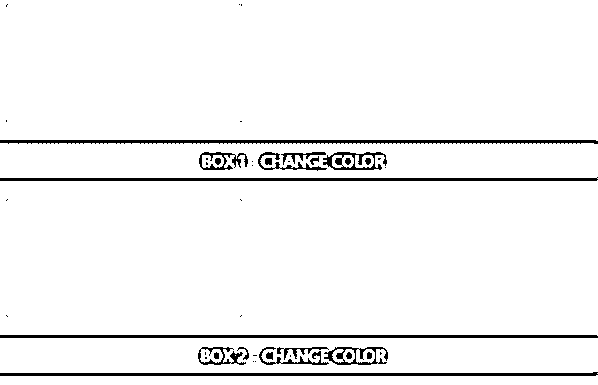

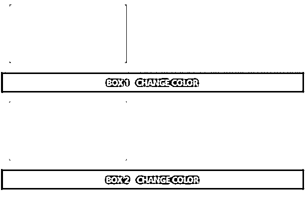

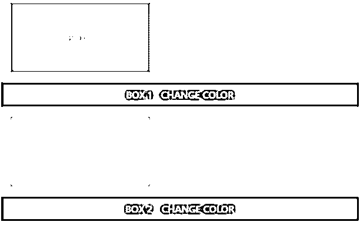

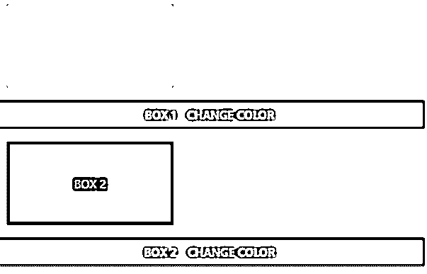

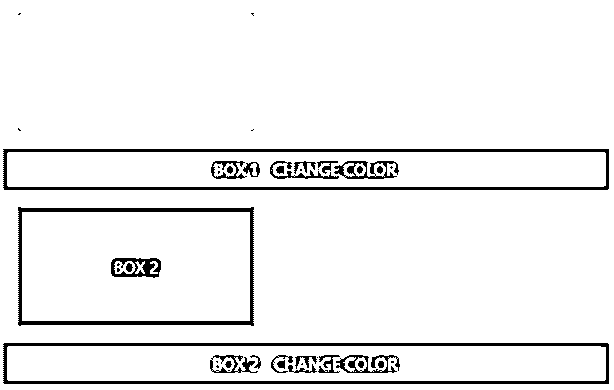

### 推荐文章

这是一个反应本色的指南。在这里，我们还将讨论 react native color 的介绍和工作原理，以及不同的示例和代码实现。您也可以看看以下文章，了解更多信息–

1.  [React Native 中的造型](https://www.educba.com/styling-in-react-native/)
2.  [React 本机调试器](https://www.educba.com/react-native-debugger/)
3.  [React 本地认证](https://www.educba.com/react-native-authentication/)
4.  [反应本地路由器](https://www.educba.com/react-native-router/)