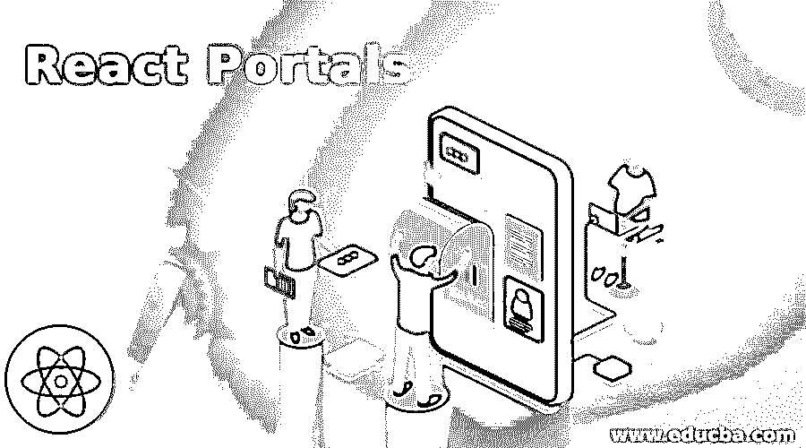
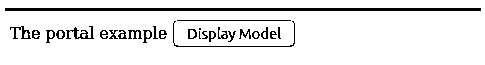
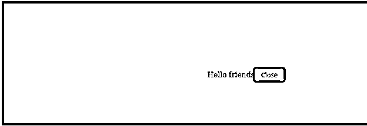

# react 门户

> 原文：<https://www.educba.com/react-portals/>

## React 门户简介

很多时候，当我们在任何主组件上呈现任何子组件时，子组件会溢出到主组件上，因此应用程序的布局会被打乱，所以为了处理这种情况，我们可以使用门户的概念。它允许我们在另一个节目中直接插入一个子组件，这样它会粘在那个组件上，不会溢出。我们可以使用 ReacDOM.createPortal(子容器，我们的容器将在这里)，用它我们将能够处理组件渲染中的溢出类型的干扰。

**语法:**

<small>网页开发、编程语言、软件测试&其他</small>

我们可以看到下面的简单语法，其中我们传递子容器和容器。这里，我们将两个属性传递给 ReacDOM.createPortal 函数，其中第一个是可呈现的子组件。我们可以借助下面的语法创建一个 react 门户。

`ReacDOM.createPortal (the Child goes here, the  container goes here)`

### 门户如何在 React 中工作？

在深入分析门户的工作之前，我们需要了解在什么情况下需要使用门户的概念。您已经多次看到在显示组件时发生溢出，这是因为子组件可能不在组件的实际节点内。在门户的帮助下，我们可以直接将子组件插入到另一个组件中，它将处理溢出情况。我们在创建门户时传递两个属性，其中第一个是子对象，第二个是容器。这里的第一个属性是哪个子组件是任何可呈现组件(可呈现意味着它可以被呈现并且可以对最终用户可见)

### React 门户示例

下面我们写了一个例子，这个例子包含三个部分:第一部分是 HTML 部分，第二部分是 JavaScript 部分，第三部分是 CSS 部分。让我们理解 react js 中实现门户概念的每个部分。如果我们想运行下面的例子，我们可以创建一个 HTML 文件，我们可以将 html css 和 javascript 与所需的依赖关系放在一起，我们可以运行这些例子，或者我们可以使用一些在线 react 编译器，我们可以执行下面的例子。

#### 示例 1–Html 内容

下面是 HTML 部分，在这里我们使用了两个 div 标签，其中一个用于主要组件，另一个用于显示带有一些消息的弹出窗口。

`<!--Div for showing main component -->

<!--Div for popup showing -->

`

#### 示例 2–JavaScript 内容

下面我们写了 react javascript 的代码，这里我们写了两个组件，一个用于显示主组件，另一个用于显示弹出窗口。在主组件上将有一个按钮，单击该按钮时，显示状态将从“假”变为“真”,并将显示一个弹出窗口，一旦我们单击关闭打开的弹出窗口，状态将再次变为“假”,弹出窗口将不可见。我们已经将三个弹出窗口的显示状态初始化为假。

#### 示例 3–用于弹出窗口的第一个组件

`//Here we are creating a component which will display in the form of the popups and we can also include some text messages on this model
class Pop extends React.Component {
constructor(props) {
super(props)
//Creating or capturing details of the div element
this.element = document.createElement('div')
}
//This function called automatically after rendering of the components
componentDidMount() {
//Appending of the element to the popup model
document.getElementById('popup').appendChild(this.element)
}
//This function unmount the displayed popups and this also et automatically called
componentWillUnmount() {
//removing the element popups from the appended previously
document.getElementById('popup').removeChild(this.element)
}
render() {
//Creating a portal for handling our cases
return ReactDOM.createPortal(
//Taking child and element
this.props.children,
this.element
)
}
}`

主组件和第二组件或默认组件，该组件包含弹出窗口的子组件。

`class Portalexample extends React.Component {
constructor(props) {
super(props)
//Initializing the model as the false which means the popups will be closed at the starting time and later according to the operations the value will be either true or false.
this.state = {showhideModel: false}
this.manageShowHide = this.manageShowHide.bind(this)
this.manageHide = this.manageHide.bind(this)
}
//Changing of the true and false of the show hide will be managed in this function and it will be called when clicked the button .
manageShowHide() {
this.setState({showhideModel: true})
}
manageHide() {
this.setState({showhideModel: false})
}
render() {
//Show and hide will be handles here on clicking the button
constshowpopups = this.state.showhideModel ? (
<Pop>

Hello friends <button onClick={this.manageHide}>Close</button>

</Pop>
) : ''
return (

The portal example <button onClick={this.manageShowHide}>Display Model</button>
{showpopups}

)
}
}
//Attaching the component with the div of html which we have created
ReactDOM.render(<Portalexample />, document.getElementById('example'))`

#### 示例 4–CSS 内容

下面是设计弹出窗口的 css 代码，我们将在点击主要组件的按钮时打开它。

`#popup {
position: fixed;
z-index: 997;
}
/* popup designing with css is goes here */
#popup div {
background-color: green;
/*  Defining the height of the popups */
height: 99%;
/*  Defining the position of the popups */
position: fixed;
top: 0;
/*  Defining the display of the popups */
display: flex;
align-items: center;
left: 0;
/*  Defining the width of the popups *
width: 99%;
justify-content: center;
}`

**图片说明**

下面我们给出了两个屏幕图像，第一个图像是主要组件，第二个图像是弹出窗口。当点击显示模式按钮时，将出现第二个图像，再次点击第二个图像的关闭时，将出现屏幕的第一个图像。

### 推荐文章

这是 React 门户网站的指南。在这里，我们还讨论了简介和门户如何在 react 中工作，以及它的不同示例和代码实现。您也可以看看以下文章，了解更多信息–

1.  [React 本地认证](https://www.educba.com/react-native-authentication/)
2.  [React 路由器转换](https://www.educba.com/react-router-transition/)
3.  [React 组件库](https://www.educba.com/react-component-library/)
4.  [React Redux Connect](https://www.educba.com/react-redux-connect/)