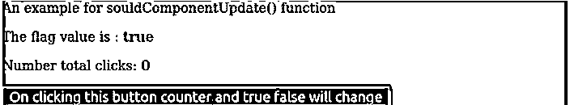
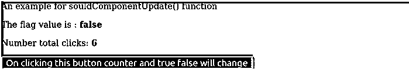
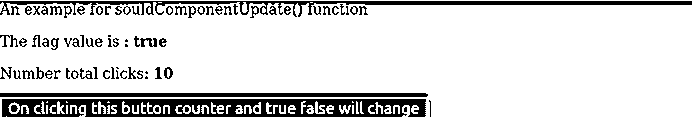
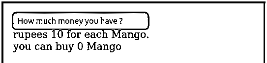
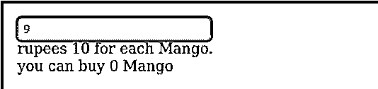
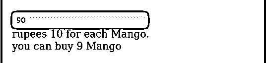

# React shouldComponentUpdate()

> 原文：<https://www.educba.com/react-shouldcomponentupdate/>

## React shouldComponentUpdate()的定义

在 react js 中，函数 shouldComponentUpdate()是最有用的函数之一。它允许我们检查并意识到是否需要组件的渲染。它总是返回布尔值，根据真值和假值，我们将渲染组件。如果我们不使用这个函数，那么，在这种情况下，默认值将为真。这意味着它将呈现组件，我们可以使用 shouldComponentUpdate()来提高性能，但我们不应该依赖它来控制组件的呈现，否则它可能很难管理。

**语法:**

<small>网页开发、编程语言、软件测试&其他</small>

在下面的语法中，我们展示了一个非常简单的 shouldComponentUpdate()语法。

`shouldComponentUpdate(nextProps, nextState) {
return this.state.stateName != nextState.stateName;
}`

### ComponentUpdate()在 React 中应该如何工作？

在理解这个函数的工作原理之前，让我们先理解为什么我们需要这个函数。假设我们在某种情况下不想呈现组件，那么在这种情况下，我们可以使用这个函数。这个函数的默认行为是 true，这意味着如果我们不传递任何东西，那么它将返回 true，因此组件将执行。这个函数有两个参数，一个是 nextprops，另一个是 nextState。通过比较，我们可以决定渲染组件是否重要。因此，它允许我们提高组件的性能。我们在使用它的时候应该小心，因为很多人用它来控制组件的渲染，这不是一个好的做法。

### React shouldComponentUpdate()的示例

下面是一些例子:

#### 示例#1

下面是一个例子，我们显示各种屏幕，点击按钮，我们将看到差异计数和值的标志为真和假。在函数 shouldComponentUpdate()中，我们检查是否应该呈现计数器和标志的新值。在 clickContermanagement()函数中，我们管理并更改每次点击的计数器和标志值。

**代码:**

`class Example extends React.Component {
constructor() {
super();
//Initialization of the initial state for the components
this.state = {
flag: true,
numberOfClick: 0
};
//Binding the function to call with this
this.clickCountermanagement = this.clickCountermanagement.bind(this);
}
//Here this is the function which will be used for calculating counters and flag values
clickCountermanagement() {
let flagVal =Math.random() > 0.5
let clickVal =this.state.numberOfClick + 1
this.setState({
flag:flagVal ,
numberOfClick: clickVal
});
}
//Inside this function we will check if we should render components or not. If it returns true then component will render else component will not render .
shouldComponentUpdate(nextProps, nextState) {
return this.state.flag != nextState.flag;
}
render() {
let stringFlag =this.state.flag.toString()
return (

An example for souldComponentUpdate() function

The flag value is :<b>{stringFlag}</b>

Number total clicks: <b>{this.state.numberOfClick}</b>

<button className="button-class" onClick={this.clickCountermanagement}>
On clicking this button counter and true false will change
</button>

);
}
}
//Finally attaching all the components with html
ReactDOM.render(
<Example />,
document.getElementById('main')
);`

**CSS 代码:**

下面是为最终用户设计组件视图的 css 代码。

`.main-div {
margin:2;
background-color:green;
font-size: 18px;
}
.button-class {
background-color:black;
font-size:20px;
font-color:yellow;
}`

**HTML 代码:**

下面是处理和显示我们在上面创建的组件的 HTML 代码。

`<body>

</body>`

**输出:**

#### 实施例 2

下面是我们显示一个输入框的简单代码。在输入框中，我们需要输入购买一个芒果的总费用。这里每个芒果的价格是 10 卢比，因此我们只能买芒果，如果我们有 10 的倍数。因此这将在 shouldComponentUpdate()函数中进行检查。

**代码:**

`class Example extends React.Component {
constructor(props) {
//Initializing the initial value for the state of the components .
super(props);
this.state = {
currency: 0
};
//Binding the functions .
this.manageMoneyChange = this.manageMoneyChange.bind(this);
}
//This is the function to calculate the currency
manageMoneyChange(event) {
let x=event.target.value
this.setState({currency: (x)|0});
}
//Here in this function we will decide the rendering of the component
shouldComponentUpdate(props, state){
let ableToBuy =state.currency%10==0
return ableToBuy;
}
render() {
return (

<input placeholder="How much money you have ?" className="input-class"type="text" onChange={this.manageMoneyChange} />

rupees 10 for each Mango. 
you can buy {this.state.currency/10} Mango

)
}
}
//This is the main component which will call the Example component
class Main extends React.Component {
render() {
return (

<Example />

)
}
}
//Finally attaching all the components with html
ReactDOM.render(<Main />, document.getElementById('root'));`

**CSS 代码:**

下面是为最终用户设计组件视图的 css 代码。

`.main-class {
background-color:red;
padding: 21px;
font-size:18px;
width:50%;
}`

**HTML 代码，**

下面是处理和显示我们在上面创建的组件的 HTML 代码。

`

`

**输出:**

### 优势

使用这个函数有许多优点，我们可以给出一些要点，如下所示。

*   在函数 shouldComponentUpdate 的帮助下，检查我们什么时候需要渲染组件，什么时候不需要渲染组件将变得非常容易。
*   它给了我们一个更好的方法来管理组件的性能，因为有了它的帮助，我们可以检查我们的条件，如果我们需要渲染特定的条件，而不是渲染不必要的。
*   我们可以针对特定条件停止渲染，可能我们要向最终用户显示的数据可能不太好，我们希望针对特定更改停止渲染，因此我们也可以在这种情况下使用此功能。

### 推荐文章

这是 React shouldComponentUpdate()的指南。在这里，我们还将讨论 shouldcomponentupdate()在 react 中的定义和工作方式，以及不同的示例和代码实现。您也可以看看以下文章，了解更多信息–

1.  [React 本地认证](https://www.educba.com/react-native-authentication/)
2.  [React 路由器转换](https://www.educba.com/react-router-transition/)
3.  [React 组件库](https://www.educba.com/react-component-library/)
4.  [React Redux Connect](https://www.educba.com/react-redux-connect/)