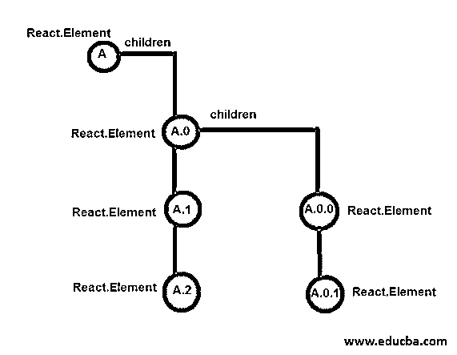
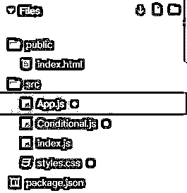
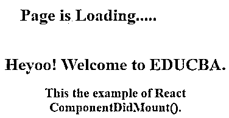
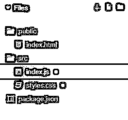
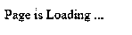
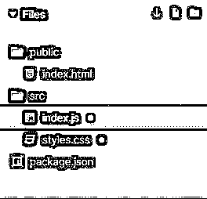
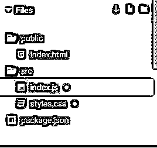
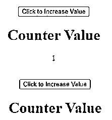

# React ComponentDidMount()

> 原文：<https://www.educba.com/react-componentdidmount/>

## React ComponentDidMount()简介

componentDidMount()方法是安装阶段的最后一步。这种方法称为后安装。当所有的子元素和组件都安装在文档对象模型(DOM)中时，我们就调用这个方法。调用此方法允许我们触发新的渲染，并为我们提供对 NativeUI 和子引用的访问。componentDidMount()方法是调用 setState()方法的最合适的地方，setState()方法有助于更改应用程序的状态和呈现更新。在本文中，我们将了解 componentDidMount()方法以及它在不同示例中的工作情况。

### React ComponentDidMount()是如何工作的？

在 React 中，我们提供了一组可以在生命周期的每个阶段使用的钩子。这些钩子帮助我们理解组件在组件生命周期中的位置。

<small>网页开发、编程语言、软件测试&其他</small>

组件生命周期的三个阶段简述如下:

**挂载:**挂载阶段，配置状态和道具，进入初始 UI 显示。在这个阶段，我们将子组件安装到 DOM 中。

**更新:**在更新阶段，更新状态、道具。组件的大部分时间都花在更新阶段，在这个阶段，所有的新数据都被合并，用户动作的变化被定义。

**卸载:**当组件完成所有更新后，它进入卸载阶段。在这个阶段，组件从本机 UI 堆栈中卸载。当 UI 发生变化并且元素树没有与组件匹配的键时，我们就处于卸载阶段。

生命周期方法以特定的顺序调用。componentDidMount()是安装阶段使用的最后一个步骤或方法。如上所述，当所有子元素或组件都安装在 DOM 中时，就会调用这个方法。除了 componentDidMount()之外，挂载阶段的所有方法都是从上到下开始工作的。ComponentDidMount()方法自下而上工作。

让我们看看下面的元素树。

这种自下而上的工作方式确保了每个子元素都已挂载，并且父元素可以访问本机 UI 元素。

### 实现 React ComponentDidMount()的示例

下面是提到的例子:

#### 示例#1:基本反应组件 DidMount()

在下面的示例中，首先显示文本。但是在几秒钟之内，新的内容会被安装到先前的文本上，并且会出现一个包含新文本的新窗口。这是在 ComponentDidMount()的帮助下完成的

用于实现以下示例的文件是:

**App.js**

**代码:**

`import React from "react";
import "./styles.css";
import Conditional from "./Conditional";
class App extends React.Component {
constructor() {
super();
this.state = {
isLoading: true,
status: "In progression..."
};
}
componentDidMount() {
setTimeout(() => {
this.setState({
isLoading: false,
status: "Completed!"
});
}, 2000);
}
render() {
console.log("Status: ", this.state.status);
return (

{this.state.isLoading ? <h1>Page is Loading.....</h1> : <Conditional />}

);
}
}
export default App;`

**Conditional.js**

**代码:**

`import React from "react";
function Conditional(props) {
return (

<h1>
Heyoo! Welcome to EDUCBA.
</h1>
<h2>
This the example of React ComponentDidMount().
</h2>

);
}
export default Conditional;`

**index.js**

**代码:**

`import React from "react";
import ReactDOM from "react-dom";
import App from "./App";
const rootElement = document.getElementById("root");
ReactDOM.render(<App />, rootElement);`

**styles.css**

**代码:**

`.App {
font-family: 'Times New Roman'
, Times
, serif;
text-align: center;
}`

**输出:**

#### 示例 2: React ComponentDidMount()示例，在线获取数据

在下面的例子中，首先出现“页面正在加载…”的文本，然后从[https://jsonplaceholder.typicode.com/users](https://jsonplaceholder.typicode.com/users)在线获取内容，并使用 ComponentDidMount()在预先显示的文本上安装。安装后，屏幕上会显示新内容。

用于实现以下示例的文件是:

**index.js**

**代码:**

`import React
, { Component } from "react";
import ReactDOM from "react-dom";
import "./styles.css";
class Users extends Component {
state = {
users: [],
loading: true
};
componentDidMount() {
fetch("https://jsonplaceholder.typicode.com/users")
.then(res => res.json())
.then(users => {
this.setState({
loading: false,
users
});
});
}
render() {
return (

{this.state.loading && 
Page is Loading ...
}
<ul>
{this.state.users.map((user, index) => (
<li key={index}>
<h1>{user.name}</h1>
<h4>Email Address: ({user.email})</h4>
<h5>Phone number: {user.phone}</h5>
</li>
))}
</ul>

);
}
}
function App() {
return (

<Users />

);
}
const rootElement = document.getElementById("root");
ReactDOM.render(<App />, rootElement);`

**styles.css**

**代码:**

`.App {
font-family: 'Times New Roman'
, Times
, serif;
}`

**输出:**

#### 示例 3:在第三行文本上安装 React ComponentDidMount()示例

在下面的例子中，整个内容保持不变，只是带有“注册参加我们培训的人:”的文本在安装后得到更新。

用于实现以下代码的文件是:

**index.js**

**代码:**

`import React from "react";
import ReactDOM from "react-dom";
class MyComponent extends React.Component {
constructor(props) {
super(props);
this.state = {
activeUsers: null
};
}
componentDidMount() {
setTimeout(() => {
this.setState({
activeUsers: 1200000
});
}, 2500);
}
render() {
return (

<h1>Welcome to EDUCBA</h1>
<h2>We are the best Training providers on Latest Emerging Technologies.</h2>
<h3>People Enrolled for our Training: {this.state.activeUsers}</h3>

);
}
ReactDOM.render(<MyComponent />, document.getElementById("root"));`

**styles.css**

**代码:**

`.App {
font-family: 'Times New Roman'
, Times
, serif;
text-align: center;
}`

**输出:**

#### 示例 4:使用 React ComponentDidMount()的反例

在下面的示例中，当单击“单击以增加值”按钮时，计数器的值使用 ComponentDidMount()安装，并使用 componentDidUpdate()更新。下面的例子是一个增量计数器。

用于实现以下代码的文件是:

**index.js**

**代码:**

`import React
, { useState
, useEffect
, Component } from "react";
import ReactDOM from "react-dom";
import "./styles.css";
function App() {
const [counter, setCounter] = useState(1);
useEffect(() => {
console.log("Counter was incremented");
return () => console.log("Counter was cleared");
}, [counter]);
const increment = () => {
setCounter(counter + 1);
};
return (

<button onClick={increment}>Click to Increase Value</button>
{counter % 3 !== 0 && <Child counter={counter} />}

);
}
class Child extends Component {
componentDidMount() {
console.log("Child was Mounted");
}
componentDidUpdate() {
console.log("Child was updated");
}
componentWillUnmount() {
console.log("Child was Unmounted");
}
render() {
return (

<h1>Counter Value</h1>
{this.props.counter}

);
}
}
const rootElement = document.getElementById("root");
ReactDOM.render(<App />, rootElement);`

**styles.css**

**代码:**

`.App {
font-family: 'Times New Roman'
, Times
, serif;
text-align: center;
}`

**输出:**

### 结论

根据上面的文章，我们理解了 componentDidMount()方法的用法。我们介绍了它的工作原理和不同的例子，这将有助于您理解在构建 React 应用程序时如何使用这种方法。我希望这篇文章能让 componentDidMount()更容易理解。

### 推荐文章

这是 React ComponentDidMount()的指南。在这里，我们讨论 React ComponentDidMount()的介绍，以及编程示例。您也可以浏览我们的其他相关文章，了解更多信息——

1.  [React 本地认证](https://www.educba.com/react-native-authentication/)
2.  [反应本地本地存储](https://www.educba.com/react-native-local-storage/)
3.  [React Native Redux](https://www.educba.com/react-native-redux/)
4.  [反应原生获取](https://www.educba.com/react-native-fetch/)