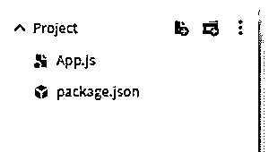
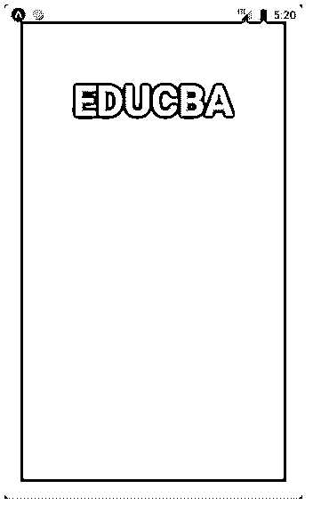
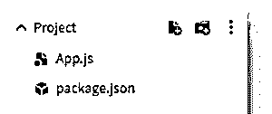
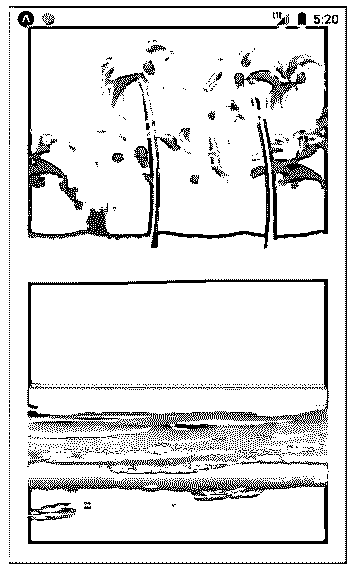
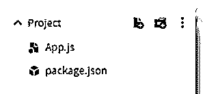
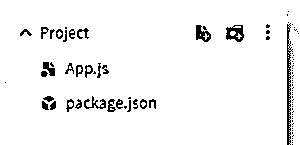
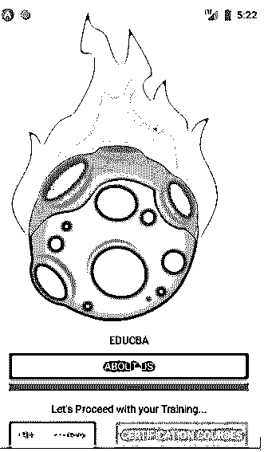
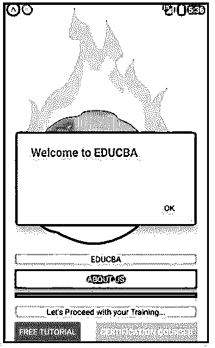
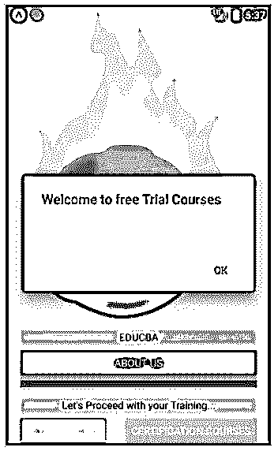
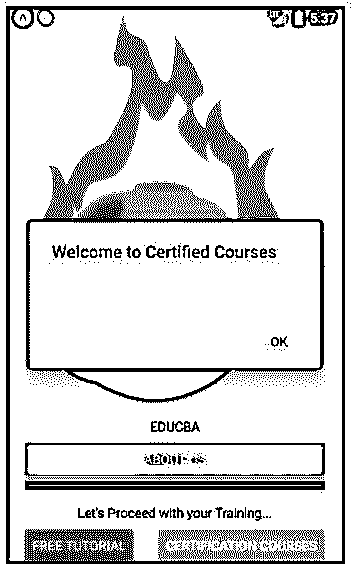

# 反应本机安全区域视图

> 原文：<https://www.educba.com/react-native-safeareaview/>

## React 本机安全区域视图简介

下面的文章提供了 React 本机安全区域视图的概述。SafeAreaView 用于呈现设备安全区域边界之间的内容。该功能仅适用于 iOS 版本 11 或其高级版本的设备。SafeAreaView 提供填充以显示工具栏、导航栏、选项卡栏和其他祖先视图未覆盖的视图区域。除此之外，SafeAreaView 还显示了手机显示屏的物理限制，如尺寸、圆角或摄像头凹口。这是 React Native 提供的一个很酷的选项；它使应用程序在屏幕上看起来很完美。

**语法:**

<small>网页开发、编程语言、软件测试&其他</small>

`<SafeAreaView style={{ flex: 1 }}>
<Image>
<View style={{ flex: 1 }}>
<Text>
<Button>
</Button>
</Text>
</View>
</Image>
</SafeAreaView>`

在安全区域视图中，我们可以插入图像、视图、文本、按钮等。，这有助于在 React 本机应用程序中提供最佳用户体验。

### React 本机安全区域视图的示例

下面是提到的例子:

#### 示例#1

下面我们展示了一个基本的 React Native SafeAreaView 示例，其中我们使用“padding、backgroundColor、borderWidth 和 borderColor 我们已经在 Safeareaview 视图中显示了所需的文本“EDUCBA”。

为了正确执行代码，需要以下文件:

**App.js**

**代码:**

`import React from 'react';
import { StyleSheet
, Text
, SafeAreaView } from 'react-native';
const decoration = StyleSheet.create({
tex: {
flex: 1,
padding: 20,
marginTop: 20,
fontWeight: "bold",
textAlign: "center",
color: "#f7f068",
fontSize: 50,
},
rex: {
flex: 1,
padding: 20,
backgroundColor: "#fa003a",
borderWidth: 20,
borderColor: "#b4fa57",
},
});
const Result = () => {
return (
<SafeAreaView style={decoration.rex}>
<Text style={decoration.tex}>
EDUCBA</Text>
</SafeAreaView>
);
}
export default Result;`

**输出:**

#### 实施例 2

我们将 SafeAreaView 的样式设置为类似于示例 1。这里，在文本的地方，我们在安全区域视图中显示了图像，使用它们各自的 URL 直接导入它们。

为了正确执行代码，需要以下文件:

**App.js**

**代码:**

`import React from 'react';
import { StyleSheet
, Text
, SafeAreaView
, Image } from 'react-native';
const decoration = StyleSheet.create({
rex: {
flex: 1,
backgroundColor: "#fa003a",
borderWidth: 20,
borderColor: "#b4fa57",
},
wex:{
flex: 1,
}
});
const Result = () => {
return (
<SafeAreaView style={decoration.rex}>
<Image
source={{ uri: 'http://pngimg.com/uploads/beach/beach_PNG83.png'}}
style={decoration.wex}
/>
<Image
source={{ uri: 'http://pngimg.com/uploads/beach/beach_PNG60.png' }}
style={decoration.wex}
/>
</SafeAreaView>
);
}
export default Result;`

**输出:**

#### 实施例 3

这里，样式类似于前面讨论的例子。这个例子是前面讨论的例子的混合，我们从上到下首先显示一个文本，然后是一个图像，最后是一个文本。

为了正确执行代码，需要以下文件:

**App.js**

**代码:**

`import React from 'react';
import { StyleSheet
, Text
, SafeAreaView
, Image } from 'react-native';
const decoration = StyleSheet.create({
tex: {
flex: 1,
padding: 20,
marginTop: 20,
fontWeight: "bold",
textAlign: "center",
color: "#f7f068",
fontSize: 50,
},
rex: {
flex: 1,
padding: 20,
backgroundColor: "#fa003a",
borderWidth: 20,
borderColor: "#b4fa57",
},
wex:{
flex: 1.1,
padding: 50,
}
});
const Result = () => {
return (
<SafeAreaView style={decoration.rex}>
<Text style={decoration.tex}>
EDUCBA
</Text>
<Image
source={{ uri: 'http://pngimg.com/uploads/husky/husky_PNG48.png' }}
style={decoration.wex}
/>
<Text style={{ fontSize: 16 }}>
EDUCBA(Corporate Bridge Consultancy Pvt Ltd)is an initiative to provide the world’s best skill based education, it was initiated by  IIM and IIT Graduates. There are more than 1,000,000 members from 70+ countries who have received skill based training from EDUCBA. EDUCBA provides step by step, online learning plan with more than 5000 courses and 500 above learning paths designed by top professionals of the industry. The trainings are totally job oriented, which aims to skill the participants and make them job ready.    EDUCBA has a vision to provide skill based trainings anytime & anywhere and to make the participants job ready EDUCBA allows enrollments 24 hours a day, 7 days a week and 365 days a year. The courses are self paced, so learn at your preferred place, time and pace.The participants can make their own preffered schedule for their study.
</Text>
</SafeAreaView>
);
}
export default Result;`

**输出:**

#### 实施例 4

下面的例子是在 React Native 中使用安全区域视图的高级版本，我们在安全区域视图中使用了 3 个按钮；当接下来的两个按钮根据插入其中的文本进行自我调整时，第一个按钮居中对齐。我们已经使用 justifyContent、marginHorizontal 和 backgroundColor 对安全区域视图进行了样式化。我们还插入了一个顶部没有背景的 PNG 图像。使用 textAlign、marginVertical 和 backgroundColor 设置背景样式的每个按钮前也会插入文本。

为了正确执行代码，需要以下文件:

**App.js**

**代码:**

`import React from 'react';
import { StyleSheet
, Button
, View
, SafeAreaView
, Text
, Alert
, Image } from 'react-native';
const decoration = StyleSheet.create({
spacer: {
marginVertical: 6,
borderBottomColor: '#292a8c',
borderBottomWidth: 10,
},
fixtext: {
flexDirection: 'row',
justifyContent: 'space-between',
},
heading: {
textAlign: 'center',
marginVertical: 8,
backgroundColor: "#fced62"
},
docker: {
flex: 1,
justifyContent: 'center',
marginHorizontal: 20,
backgroundColor: "#fff1ab",
},
wex:{
flex: 1,
width: 300,
height: 200,
},
});
const Whole = () => (
<SafeAreaView style={decoration.docker}>
<Image
source={{ uri: 'http://pngimg.com/uploads/meteor/meteor_PNG37.png'}}
style={decoration.wex}
/>
<View>
<Text style={decoration.heading}>
EDUCBA
</Text>
<Button
color="#d6315a"
title="ABOUT US"
onPress={() => Alert.alert('Welcome to EDUCBA')}
/>
</View>
<Spacer />
<View>
<Text style={decoration.heading}>
Let's Proceed with your Training...
</Text>
<View style={decoration.fixtext}>
<Button
color="#4eed78"
title="Free Tutorial"
onPress={() => Alert.alert('Welcome to free Trial Courses')}
/>
<Button
color="#f2ab55"
title="Certification Courses"
onPress={() => Alert.alert('Welcome to Certified Courses ')}
/>
</View>
</View>
</SafeAreaView>
);
const Spacer = () => (
<View style={decoration.spacer} />
);
export default Whole;`

**输出:**

**正确执行时的输出:**

**在“关于我们”上输出按:**

**在“免费教程”上输出按:**

**

** 

**在“认证课程”上输出按:**

### 结论

在文章的基础上，我们在 React Native 中看到了 SafeAreaView 的概念。我们看到了在 React Native 上开发 iOS 应用程序时如何应用这一点。本文提供了多个例子来解释 SafeAreaView 的工作原理，这将有助于读者将这个概念应用到他们的应用程序开发项目中。

### 推荐文章

这是一个反应原生安全区域视图的指南。在这里，我们分别讨论 React 本机安全区域视图的介绍和示例。您也可以看看以下文章，了解更多信息–

1.  [反应原生标签栏](https://www.educba.com/react-native-tab-bar/)
2.  [反应原生权限](https://www.educba.com/react-native-permissions/)
3.  [反应原生迅捷](https://www.educba.com/react-native-swift/)
4.  [反应本地路由器](https://www.educba.com/react-native-router/)

