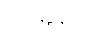
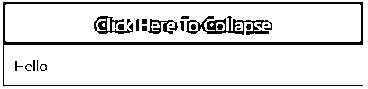
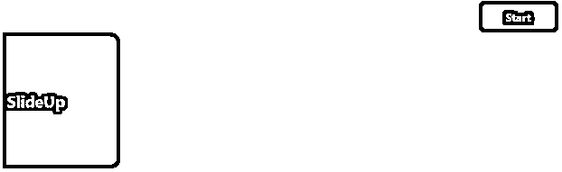
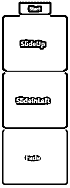

# 反应本地动画

> 原文：<https://www.educba.com/react-native-animation/>


## 介绍对原生动画的反应

为了在使用应用程序时创造良好的用户体验，动画非常重要。动画允许界面中的物理上可信的运动。静止的物体要克服惯性才能开始运动，运动中的物体有动量，很少会马上来到静止的位置。

React Native 提供了两个动画:

<small>网页开发、编程语言、软件测试&其他</small>

**LayoutAnimation:** 用于动画全局布局事务，

**动画:**它用于非常交互地控制微小级别上的特定值。React-Native 提供了最好的动画 API，提供了制作不同动画的能力。

### React Native 中动画的语法

以下是给出的语法:

#### 1.配置动画

下面的代码创建了一个对象的 2 秒钟动画，在到达最终位置之前，它会稍微后退。

**语法:**

```
Animated.timing(this.state.xPosition,  { toValue:  100,
easing:  Easing.back(), duration:  2000,
}).start();
```

#### 2.创作动画

动画边缘停止；然后，它一边平行旋转一边跳回来。

**语法:**

```
Animated.sequence([ Animated.decay(position,  {
velocity:  {x:  gestureState.vx,  y:  gestureState.vy}, deceleration:  0.997,
}),
Animated.parallel([ Animated.spring(position,  {
toValue:  {x:  0,  y:  0},
}),
Animated.timing(twirl,  { toValue:  360,
}),
]),
]).start();
```

#### 3.组合动画值

**语法:**

```
const  a  =  new  Animated.Value(1);
const  b  =  Animated.divide(1,  a);
Animated.spring(a,  {
toValue:  2,
}).start();
```

### React Native 中的动画示例

这里我们将通过几个例子来讨论动画是如何完成的:

#### 1.淡化动画

**代码:**

```
import
React, { Component
} from
"react";
import {
Text,
View,
StyleSheet,
Animated,
TouchableOpacity
}  from  "react-native";
export  default  class  Fade  extends  Component  {
state  =  {
fadeValue:  new  Animated.Value(0)
};
_start  =  ()  =>  {
Animated.timing(this.state.fadeValue,  {
toValue:  1,
duration:  1000
}).start();
};
render() {
return  (
<View  style={styles.container}>
<TouchableOpacity  style={styles.btn}  onPress={()  =>  this._start()}>
<Text  style={styles.textBtn}>Start</Text>
</TouchableOpacity>
<Animated.View
style={{
opacity:  this.state.fadeValue,
height:  250,
width:  200,
margin:  5,
borderRadius:  12,
backgroundColor:  "#347a2a",
justifyContent:  "center"
}}
>
<Text  style={styles.text}>Fade  </Text>
</Animated.View>
</View>
);
}
}
const  styles  =  StyleSheet.create({
container:  {
flex:  1,
backgroundColor:  "#FFF",
alignItems:  "center",
justifyContent:  "center"
},
item: {},
btn: {
backgroundColor:  "#480032",
width:  100,
height:  40,
padding:  3,
justifyContent:  "center",
borderRadius:  6
},
text: {
fontSize:  20,
color:  "#fff",
fontWeight:  "bold",
textAlign:  "center"
},
item1:  {
backgroundColor:  "red",
padding:  20,
width:  100,
margin:  10
},
textBtn:  {
color:  "#f4f4f4",
fontWeight:  "bold",
textAlign:  "center"
}
});
```

**输出:**


**点击开始按钮:**




**点击开始按钮后:**


#### 2.向下滑动和向上滑动动画

**代码:**

```
import React, { Component } from 'react';
import { StyleSheet, View, Text, TouchableOpacity, LayoutAnimation, UIManager,
Platform } from 'react-native';
export default class Mynewapp
extends Component<{}>
{
constructor()
{
super();
if( Platform.OS === 'android' )
{
UIManager.setLayoutAnimationEnabledExperimental(true);
}
this.state = {
textLayoutHeight: 0,
updatedHeight: 0,
expand: false,
buttonText : 'Click Here To Expand'
}
}
expand_collapse_Function =()=>
{
LayoutAnimation.configureNext( LayoutAnimation.Presets.easeInEaseOut );
if( this.state.expand == false )
{
this.setState({
updatedHeight: this.state.textLayoutHeight,
expand: true,
buttonText: 'Click Here To Collapse'
});
}
else
{
this.setState({
updatedHeight: 0,
expand: false,
buttonText: 'Click Here To Expand'
});
}
}
getHeight(height)
{
this.setState({ textLayoutHeight: height });
}
render()
{
return(
<View style = { styles.MainContainer }>
<View style = { styles.ChildView }>
<TouchableOpacity activeOpacity = { 0.7 }
onPress = { this.expand_collapse_Function }
style = { styles.TouchableOpacityStyle }>
<Text style = { styles.TouchableOpacityTitleText
}>{this.state.buttonText}</Text>
</TouchableOpacity>
<View style = {{ height: this.state.updatedHeight, overflow:
'hidden' }}>
<Text style = { styles.ExpandViewInsideText }
onLayout = {( value ) => this.getHeight(
value.nativeEvent.layout.height )}>
Hello
</Text>
</View>
</View>
</View>
);
}
}
const styles = StyleSheet.create(
{
MainContainer:
{
flex: 1,
justifyContent: 'center',
paddingTop: (Platform.OS === 'ios') ? 20 : 0
},
ChildView:
{
borderWidth: 1,
borderColor: '#00BCD4',
margin: 5
},
TouchableOpacityStyle:
{
padding: 10,
backgroundColor: '#00BCD4'
},
TouchableOpacityTitleText:
{
textAlign: 'center',
color: '#fff',
fontSize: 20
},
ExpandViewInsideText:
{
fontSize: 16,
color: '#000',
padding: 12
}
});
```

**输出:**


**点击按钮**后




#### 3.动画组

**代码:**

```
import
React, { Component
} from
"react";
import {
Text,
View,
StyleSheet,
Animated,
TouchableOpacity
}  from  "react-native";
export  default  class  MyComponent  extends  Component  {
state  =  {
ready:  false,
SlideInLeft:  new  Animated.Value(0),
slideUpValue:  new  Animated.Value(0),
fadeValue:  new  Animated.Value(0)
};
_start  =  ()  =>  {
return  Animated.parallel([
Animated.timing(this.state.SlideInLeft,  {
toValue:  1,
duration:  500,
useNativeDriver:  true
}),
Animated.timing(this.state.fadeValue,  {
toValue:  1,
duration:  500,
useNativeDriver:  true
}),
Animated.timing(this.state.slideUpValue,  {
toValue:  1,
duration:  500,
useNativeDriver:  true
})
]).start();
};
render() {
let  {  slideUpValue,  fadeValue,  SlideInLeft  }  =  this.state;
return  (
<View  style={styles.container}>
<TouchableOpacity  style={styles.btn}  onPress={()  =>  this._start()}>
<Text  style={styles.textBtn}>Start</Text>
</TouchableOpacity>
<Animated.View
style={{
transform:  [
{
translateX:  slideUpValue.interpolate({
inputRange:  [0,  1],
outputRange:  [-600,  0]
})
}
],
flex:  1,
height:  250,
width:  200,
borderRadius:  12,
backgroundColor:  "#c00",
justifyContent:  "center"
}}
>
<Text  style={styles.text}>SlideUp  </Text>
</Animated.View>
<Animated.View
style={{
transform:  [
{
translateY:  SlideInLeft.interpolate({
inputRange:  [0,  1],
outputRange:  [600,  0]
})
}
],
flex:  1,
height:  250,
width:  200,
borderRadius:  12,
backgroundColor:  "#347a2a",
justifyContent:  "center"
}}
>
<Text  style={styles.text}>SlideInLeft  </Text>
</Animated.View>
<Animated.View
style={{
opacity:  fadeValue,
flex:  1,
height:  250,
width:  200,
borderRadius:  12,
backgroundColor:  "#f4f",
justifyContent:  "center"
}}
>
<Text  style={styles.text}>Fade  </Text>
</Animated.View>
</View>
);
}
}
const  styles  =  StyleSheet.create({
container:  {
flex:  1,
backgroundColor:  "#FFF",
alignItems:  "center"
},
item: {},
btn: {
backgroundColor:  "#480032",
width:  100,
height:  40,
padding:  3,
justifyContent:  "center",
borderRadius:  6,
marginTop:  29
},
text: {
fontSize:  20,
color:  "#fff",
fontWeight:  "bold",
textAlign:  "center"
},
item1:  {
backgroundColor:  "red",
padding:  20,
width:  100,
margin:  10
},
textBtn:  {
color:  "#f4f4f4",
fontWeight:  "bold",
textAlign:  "center"
}
});
```

**输出:**


**点击开始按钮:**




**点击开始按钮后:**




### 结论

基于上面的讨论，我们知道了如何在 [React Native](https://www.educba.com/what-is-react-native/) 中创建不同的动画，如 Fade、SlideUp、SlideDown 和 SlideInLeft。它提供了各种各样的动画，在这些动画的帮助下，人们可以在应用程序中设计出最佳的用户体验。可以配置不同的动画，也可以组合不同的动画值，甚至可以组成不同的动画。

### 推荐文章

这是一个反应原生动画的指南。在这里，我们将讨论 react native 中的简介和动画制作，以及不同的示例和代码实现。您也可以看看以下文章，了解更多信息–

1.  [反应原生架构](https://www.educba.com/react-native-architecture/)
2.  [React Native FlatList](https://www.educba.com/react-native-flatlist/)
3.  [反应本地异步存储](https://www.educba.com/react-native-asyncstorage/)
4.  [反应原生进度条](https://www.educba.com/react-native-progress-bar/)


