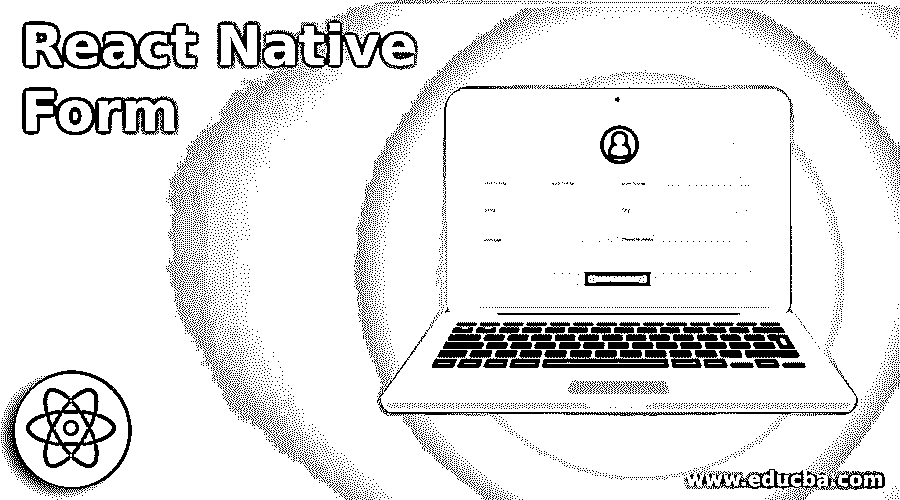
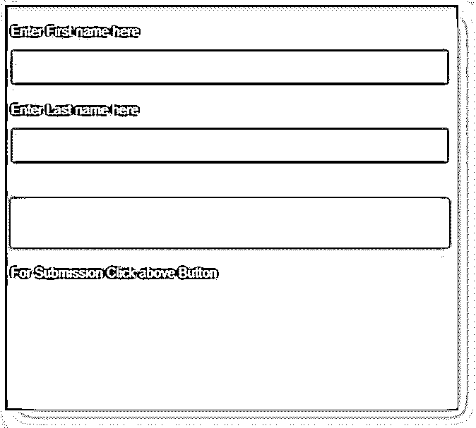
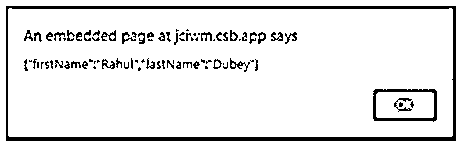
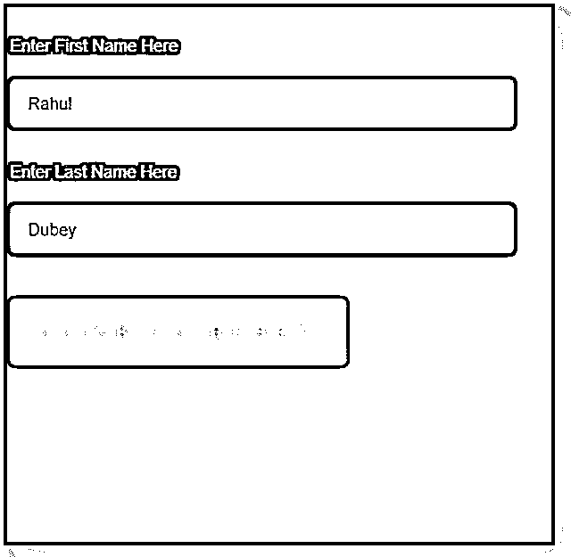
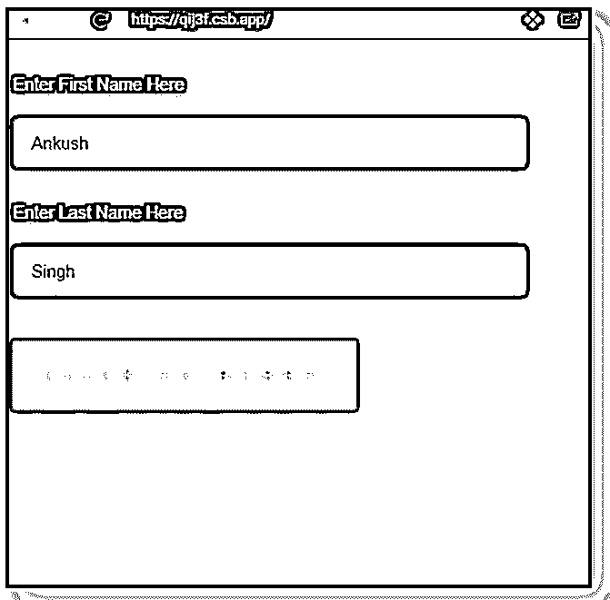
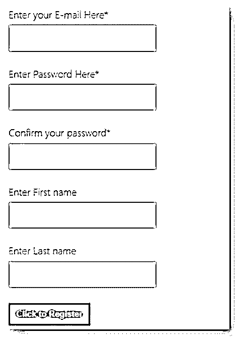

# 反应自然形式

> 原文：<https://www.educba.com/react-native-form/>

## 反应原生形式简介

下面的文章提供了 React 本机形式的概述。在当前的数据时代，表单是任何应用程序或网站的重要组成部分之一。表格可用于调查和数据收集，这有助于满足某些要求，如果我们不创建良好的响应表格，用户将很难正确提交信息。它支持在应用程序中创建表单，令人印象深刻。

**语法:**

<small>网页开发、编程语言、软件测试&其他</small>

`import Form from 'react-native-form'
<Form ref="form">
<View>
<View>
<TextInput type="TextInput" name="myTextInput" />
</View>
</View>
<Switch type="Switch" name="mySwitch"/>
<Slider type="Slider" name="mySlider"/>
<DatePickerIOS type="DatePickerIOS" name="myBirthday" />
<Picker type="Picker" name="myPicker" />
<PickerIOS type="PickerIOS" name="pickers[ios]" />
</Form>`

### 反应原生形式的示例

下面是提到的例子:

#### 示例#1

简单形式。

src 文件夹中的组件:

*   索引. js
*   样式. css

**a. index.js**

`import React from "react";
import ReactDOM from "react-dom";
import useForm from "react-hook-form";
import "./styles.css";
function App()
{ const { register
, handleSubmit } = useForm({
nativeValidation: true
});
constonSubmit
= async data =>{ alert(JSON.stringify(data));
};
return (
<form onSubmit={handleSubmit(onSubmit)}>
<label>Enter First name here</label>
<input
name="firstName"
ref={register({ required: "Please enter your first name." })}
/>
<label>Enter Last name here</label>
<input
name="lastName"
ref={register({ required: "Please enter your last name." })}
/>
<input type="submit" />
<label> For Submission Click aboveButton</label>
</form>
);
}
constrootElement = document.getElementById("root");
ReactDOM.render(<App />, rootElement);`

**b. styles.css**

`body {
background: #547a8a;
font-family: sans-serif
, "Helvetica Neue"
,"Helvetica Neue"
, "Droid Sans"
,"Fira Sans"
, "Cantarell"
,"Ubuntu"
,"Oxygen"
,"Roboto"
, "Segoe UI"
, BlinkMacSystemFont
,  -apple-system
;
}
form {
max-width: 501px;
margin: 0 auto;
}
h1 {
font-weight: 99;
color: #f0f3f5;
text-align: center;
padding-bottom: 11px;
border-bottom: 1.5px solid #bfeb81;
}
.form {
background: #1b1c1b;
max-width: 399px;
margin: 0 auto;
}
p {
color: #d43360;
}
p::before {
display: inline;
content: "⚠";
}
input {
display: block;
box-sizing: border-box;
width: 99%;
border-radius: 2px;
border: 2px solid #6f6db3;
padding: 9px16px;
margin-bottom: 9px;
font-size: 15px;
}
label {
line-height: 1;
text-align: left;
display:block;
margin-bottom: 14px;
margin-top: 21px;
color:#e6e6ed;
font-size: 15px;
font-weight: 201;
}
button[type="submit"],
input[type="submit"] {background: #ffad73;
color: #faf7f5;
text-transform: uppercase;
border: none;
margin-top: 41px;
padding: 19px;
font-size: 15px;
font-weight: 101;
letter-spacing: 11px;
}
button[type="submit"]:hover,
input[type="submit"]:hover {
background: #c772ed;
}
button[type="submit"]:active,
input[type="button"]:active,
input[type="submit"]:active {
transition: 0.2s all;
transform: translateY(2px);
border: 2px solid transparent;
opacity:0.7;
}
input:disabled{
opacity:0.3;
}
input[type="button"]:hover { transition: 0.2s all;
}
button[type="submit"],
input[type="button"],
input[type="submit"] {
-webkit-appearance: none;
}
.App {
max-width: 601px;
margin: 0 auto;
}
button[type="button"] { display: block;
appearance: none;
background: #fc5b91;
color: #f5f2f3;
border: none;
text-transform:uppercase;
padding: 11px21px;
border-radius:5px;
}
hr {
margin-top: 31px;
}
button {
display: block;
appearance: none;
margin-top: 41px;
border: 1px solid #fc5b91;
margin-bottom: 21px;
text-transform:uppercase;
padding: 11px21px;
border-radius:3px;
}`

**输出:**

#### 实施例 2

带复位按钮的挂钩表单。

src 文件夹中的组件:

*   索引. js
*   样式. css

**a. index.js**

`import React, { useEffect } from "react";
import ReactDOM from "react-dom";
import { useForm, Controller } from "react-hook-form";
import "./styles.css";
constdefaultValues = {
firstName: "Rahul",
lastName: "Dubey"
};
constmodfiedValues = {
firstName: "Ankush",
lastName: "Singh"
};
export default function App() {
const{ register, reset, watch, setValue, control } = useForm({ defaultValues
});
const values = watch();
useEffect(() => {
register({ name: "firstName" }, { required: true });
register({ name: "lastName" });
}, [register]);
return(
<form>
<label>Enter First Name Here</label>
<Controller
name="firstName"
as={<input placeholder="First Name" />}
control={control}
/>
<label>Enter Last Name Here</label>
<Controller
name="lastName"
as={<input placeholder="Last Name" />
} control={control}
/>
<button
type="button"
onClick={() => {
reset(modfiedValues);
setValue("firstName", "Ankush");
setValue("lastName", "Singh");
}}
>
Click to Reset
</button>
</form>
);
}
constrootElement = document.getElementById("root");
ReactDOM.render(<App />, rootElement);`

**b . styles . CSS****T3】**

`body {
background: #3b1c4a;
font-family: sans-serif
, "Helvetica Neue"
,"Helvetica Neue"
, "Droid Sans"
,"Fira Sans"
, "Cantarell"
,"Ubuntu"
,"Oxygen"
,"Roboo"
, "Segoe UI"
, BlinkMacSystemFont
,  -apple-system
;
}
form {
max-width: 501px;
margin: 0 auto;
}
h1 {
font-weight: 101;
color: #dedae0;
text-align: center;
padding-bottom: 11px;
border-bottom: 2px solid #9cd669;
}
.form {
background: #381a24;
max-width: 401px;
margin: 0 auto;
}
p {
color: #9fbf54;
}
p::before { display: inline;
content: "⚠";
}
input {
display: block;
box-sizing: border-box;
width: 90%;
border-radius: 5px;
border: 2px solid #e7edd8;
padding: 11px14px;
margin-bottom: 11px;
font-size: 15px;
}
label {
line-height: 2.5;
text-align: left;
display: block;
margin-bottom: 12px;
margin-top: 21px;
color: #f0f2eb;
font-size: 15px;
font-weight: 201;
}
button,
input[type="submit"] {
background: #52c7bd;
color: #e9f7cd;
text-transform: uppercase;
border: none;
margin-top: 41px;
padding: 21px;
font-size: 15px;
font-weight: 101;
letter-spacing: 9px;
}
button {
display: block;
appearance: center;
border-radius: 5px;
width: 60%;
}
input[type="submit"]:hover {
background: #71d184;
}
input[type="button"]:active,
input[type="submit"]:active {
transition: 0.2s all;
transform: translateY(4px);
border: 2px solid transparent;
opacity:0.9;
}
input:disabled{
opacity:0.5;
}
input[type="button"]:hover {
transition: 0.4s all;
}
input[type="button"],
input[type="submit"] {
-webkit-appearance: none;
}
.App {
max-width: 601px;
margin: 0 auto;
}`

**输出:**

**

** 

#### 实施例 3

预先表格。

src 文件夹中的组件:

*   RegistrationForm.jsx
*   索引. js
*   样式. css
*   验证-消息. js
*   验证-rules.js

**a. RegistrationForm.jsx**

`import React from 'react'
import { Form, Field } from 'react-advanced-form'
import { Input, Button } from 'react-advanced-form-addons'
export default class RegistrationForm extends React.Component {
registerUser = ({ serialized, fields, form }) => { return fetch('https://backend.dev', {
body: JSON.stringify(serialized)
})
}
render() {
return (
<Form
action={this.registerUser}
onSubmitStart={this.props.onSubmitStart}>
<Field.Group name="primaryInfo">
<Input
name="userEmail"
type="email"
label="Enter your E-mail Here" required />
</Field.Group>
<Input
name="userPassword"
type="password"
label="Enter Password Here"
required/>
<Input
name="confirmPassword"
type="password"
label="Confirm your password"
required
skip />
<Field.Group name="primaryInfo">
<Input
name="firstName"
label="Enter First name"
required={({ get }) => {
return !!get(['primaryInfo'
, 'lastName'
, 'value'])
}} />
<Input
name="lastName"
label="Enter Last name"
required={({ get }) => {
return !!get(['primaryInfo'
, 'firstName'
, 'value'])
}} />
</Field.Group>
<Button primary>Click to Register</Button>
</Form>
);
}
}`

**b. index.js**

`import Preview from 'react-data-preview'
import { FormProvider } from 'react-advanced-form'
import rules from './validation-rules'
import messages from './validation-messages'
import RegistrationForm from './RegistrationForm'
class App extends React.Component{
state = {
serialized: null
}
handleSubmitStart
= ({ serialized }) => {
this.setState({ serialized })
}
render() { return (
<FormProvider rules={rules} messages={messages}>

<RegistrationFormonSubmitStart={this.handleSubmitStart} />
<Preview data={this.state.serialized} />

</FormProvider>
)
}
}
ReactDOM.render(<App />, document.getElementById('root'))`

**c. styles.css**

`body {
font-family: -apple-system
, BlinkMacSystemFont
, "Segoe UI"
,Roboto
,Oxygen
,Ubuntu
, Cantarell
, "Open Sans"
, "Helvetica Neue"
, sans-serif
}
.flex {
display: flex;
}
.flex> * { flex: 1;
}`

**d. validation-messages.js**

`export default {
general: {
missing: 'Kindly provide the required field',
invalid: 'Mentioned value is invalid'
},
type: {
email: {
missing: 'Kindly provide an e-mail',
invalid: 'The e-mail mentioned by you is invalid'
},
password: {
rule: {
capitalLetter: 'Kindly include at least one capital letter',
oneNumber: 'Kindly include at least one number',
minLength: 'Length of Password must be at least 8 characters'
}
}
},
name: {
confirmPassword: {
rule: {
matches: 'The mentioned passwords do not match'
}
}
}
}`

**e . validation-rules . js****T3】**

`import isEmail from 'validator/lib/isEmail'
export default {
type: {
email: ({ value }) =>isEmail(value),
password: {
capitalLetter: ({ value }) => /[A-Z]/.test(value),
oneNumber: ({ value }) => /[0-9]/.test(value),
minLength: ({ value }) =>value.length> 7
}
},
name: {
confirmPassword: {
matches:
({ value, get }) => {
return value === get(['userPassword', 'value'])
}
}
}
}`

**输出:**

### 结论

根据上面的例子，我们看到了如何为我们的应用程序创建表单，用户可以在其中提交所需的信息，这些信息可用于调查、数据收集等。在第一个例子中，我们看到了如何创建一个基本的窗体，然后我们创建了一个钩子窗体，在第二个例子中也有一个重置按钮，最后一个例子非常高级，它从用户那里获取了大量的信息。

### 推荐文章

这是一个反应原生形态的指南。这里我们分别讨论 React Native Form 的介绍以及编程示例。您也可以看看以下文章，了解更多信息–

1.  [React 组件库](https://www.educba.com/react-component-library/)
2.  [React Redux Connect](https://www.educba.com/react-redux-connect/)
3.  [反应自然取向](https://www.educba.com/react-native-orientation/)
4.  [MobX 反应原生](https://www.educba.com/mobx-react-native/)