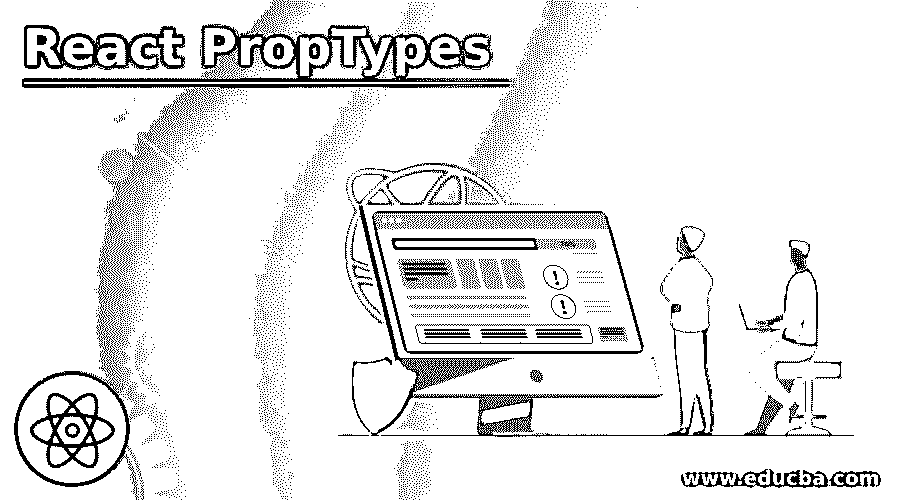
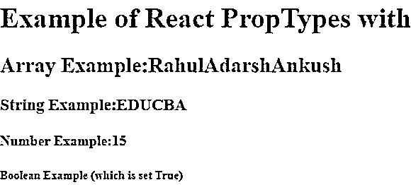

# 反应属性类型

> 原文：<https://www.educba.com/react-proptypes/>

## React 属性类型简介

React 有一个内置的机制来为组件添加类型检查。一个称为 PropTypes 的特殊属性用于设置类型检查。每当属性传递给 React 组件时，都会对照配置的类型定义检查属性。每当传递无效值时，JavaScript 控制台上就会弹出一条警告。如果将默认属性传递给 React 组件，则需要在根据属性类型检查类型之前解析这些值。这也意味着还必须根据 PropTypes 定义检查默认值。

### 不同的支柱类型及其工作原理

PropTypes 导出不同的验证器来配置类型定义。

<small>网页开发、编程语言、软件测试&其他</small>

用于基本数据类型的验证器如下所述:

*   **any:** 任何数据类型的道具都可以通过这个得到验证。
*   **符号:**符号数据类型的道具可以通过此进行验证。
*   **func:** 函数 PropType 可以被这个验证器用于验证。
*   **array:** 带有数组数据类型的属性可以由此得到验证。
*   **bool:** 具有布尔数据类型的道具可以由此得到验证。
*   **String:**String 数据类型的道具可以由此得到验证。
*   **对象:**道具的对象类型可以由此得到验证。
*   **number:**Numeric 数据类型的道具可以由此得到验证。

在构建 react 应用程序时，可以使用上述 PropTypes。

**代码:**

`Component.propTypes = {
numberProp: PropTypes.number,
functionProp: PropTypes.func
anyProp: PropTypes.any,
}`

#### 1.可呈现类型

下面陈述的验证器也由 PropTypes 导出，以确保被传递的值可以由 React 呈现。

**a . prop types . node:**React 可以渲染的数组、元素、字符串、数字等任何属性值。

**b. PropTypes.element:** 一个元素应该作为道具使用。

**代码:**

`Component.propTypes = {
Propnodesyntax: PropTypes.node,
Propelementsyntax: PropTypes.element
}`

PropTypes.element 通常用于确保组件的单个子组件。只要组件有多个子组件或没有子组件，就会显示警告。

**代码:**

`Component.propTypes = {
singlechild: PropTypes.element.isRequired
}`

#### 2.实例验证器

PropTypes.instanceOf validator 在一个 prop 要成为特定 JavaScript 类的实例时使用。它利用了基本的 instanceof 方法。

**代码:**

`Component.propTypes = {
IndividualProp: PropTypes.instanceOf(Individual)
}`

#### 3.多数据类型验证器

验证器也可以由 PropTypes 导出，以允许一组不同的值或不同的数据类型组。

用于此目的的验证器如下:

**a. PropTypes.oneOf:** 在一个 prop 中设置了一组特定的值。

**b. PropTypes.oneOfType:** 道具需要表现得像类型的联合，并且它需要来自指定的类型集合。

**代码:**

`Component.propTypes = {
Propenum: PropTypes.oneOf(
[‘move’,[1,2,3],True]),
Propunion: PropTypes.oneOfType
([
PropType.string,
PropType.array,
PropType.bool,
PropType.object
])
}`

#### 4.数据类型验证器集合

除了验证器 PropTypes . object & the PropTypes . array 之外，prop types 还提供了其他类型的验证器。这些验证器为对象和数组提供了更精确的验证。可以使用的验证器。

#### **5** 中的一个。pro types . array 验证器

这个验证器用于确保属性是一个与指定用于验证的类型相匹配的数组。

**代码:**

`Component.propTypes =
{
GroupArrayProp: PropTypes.arrayOf(
PropTypes.instanceOf(Individual)
),
NumerousArrayProp: PropTypes.arrayOf
(
PropTypes.oneOfType
([
PropType.bool,
PropType.number
])
)
}`

#### 6.props types . validator 物件

这用于确保属性是一个对象，并且所有属性值都应该与为验证指定的类型相匹配。

**代码:**

`Component.propTypes =
{
PropObjectString: PropTypes.objectOf
(
PropTypes.string
),
PropObjectMultiple: PropTypes.objectOf
(
PropTypes.oneOfType
([
PropType.bool,
PropType.number,
PropType.func,
])
)
}`

#### 7.PropTypes.shape

当我们需要更广泛的验证时，就使用 PropTypes.shape。它确认 prop 是一个对象，该对象包含具有特定类型值的特定键集。

**代码:**

`Component.propTypes =
{
BiodataProp: PropTypes.shape
({
isEmployee: PropTypes.bool,
DOJ: PropTypes.instanceOf(Date),
identityNo: PropTypes.number,
Department: PropTypes.string,
Sex: PropTypes.oneOf(['M', 'F']),
})
}`

#### 8.proptypes.exact .精确的验证器

为了严格匹配对象，PropTypes.exact 的用法如下。

**代码:**

`Component.propTypes =
{
MarksProp: PropTypes.exact({
Language: PropTypes.oneOf
(['Sanskrit', 'Devnagri', 'Gurumukhi']),
score: PropTypes.number
})
}`

#### 9.必需的验证程序

到目前为止，我们看到的所有属性类型都不需要强制属性。虽然我们可以添加是必需的，它看到一个不正确的道具的时间，警告消息显示。

**代码:**

`Component.propTypes =
{
PropString: PropTypes.string.isRequired,
PropBoolean: PropTypes.bool.isRequired,
PropObject: PropTypes.object.isRequired,
PropArray: PropTypes.array.isRequired,
PropNumeric: PropTypes.number.isRequired,
BiodataProp: PropTypes.shape
({
IdentityNo: PropTypes.number.isRequired,
DOJ: PropTypes.instanceOf(Date).isRequired,
isEmployee: PropTypes.bool
}).isRequired
}`

#### 10.自定义类型

有些情况下，会为组件属性定义自定义验证逻辑。PropTypes 允许使用自定义验证进行类型检查。

**基本示例:**

自定义验证支持三个参数:

*   **componentName:** 该参数包含组件的名称。
*   **道具名:**这个参数有道具的名字。
*   **props:** 这包含了将要传递给组件的属性。

### React 属性类型的示例

下面是提到的例子:

#### 示例#1

React 属性类型的基本示例。

在下面的示例中，PropTypes 是从 prop-types 导入的。这里，主要关注使用 PropTypes.string.isRequired 验证字符串值。

**index.js**

**代码:**

`import React
, { Component } from "react";
import { render } from "react-dom";
import PropTypes from "prop-types";
export default class App extends Component {
render() {
return (

<h1>Heyoo {this.props.name}</h1>

);
}
}
App.propTypes = {
name: PropTypes.string.isRequired
};
if (typeof window !== "undefined") {
render(<App name="Buddy!" />, document.getElementById("root"));
}`

**输出:**

#### 实施例 2

使用数组、字符串、数字和布尔值对 PropTypes 示例进行反应。

在下面的示例中，数组、字符串、数字和布尔值等值分别使用 this.props.arrayProp、this.props.stringProp、this.props.numberProp、this.props.boolProp 进行验证。

**index.js**

**代码:**

`import PropTypes from 'prop-types';
import React from 'react';
import ReactDOM from 'react-dom';
class ComponentExample extends React.Component{
render(){
return(

{}
<h1>Example of React PropTypes with</h1>
<h2>
Array Example:
{this.props.arrayProp}
 
</h2>
<h3>
String Example:
{this.props.stringProp}
 
</h3>
<h4>
Number Example:
{this.props.numberProp}
 
</h4>
<h5>
Boolean Example (which is set True)
{this.props.boolProp}
 
</h5>

);
}
}
ComponentExample.propTypes = {
arrayProp: PropTypes.array,
stringProp: PropTypes.string,
numberProp: PropTypes.number,
boolProp: PropTypes.bool,
}
ComponentExample.defaultProps = {
numberProp: "15",
stringProp: "EDUCBA",
arrayProp: ['Rahul', 'Adarsh', 'Ankush'],
boolProp: true,
}
ReactDOM.render(
<ComponentExample />,
document.getElementById("root")
);`

**输出:**

### 结论

在上述文章的基础上，我们看到了 PropTypes 及其工作原理。我们讨论了验证 props 的不同方法，上面的例子有助于理解它们的应用。

### 推荐文章

这是 React 属性类型的指南。在这里，我们讨论 React PropTypes 的介绍、不同的 PropTypes 及其各自的工作示例。您也可以看看以下文章，了解更多信息–

1.  [React 本地认证](https://www.educba.com/react-native-authentication/)
2.  [React 路由器转换](https://www.educba.com/react-router-transition/)
3.  [React Redux Connect](https://www.educba.com/react-redux-connect/)
4.  [反应自然取向](https://www.educba.com/react-native-orientation/)

