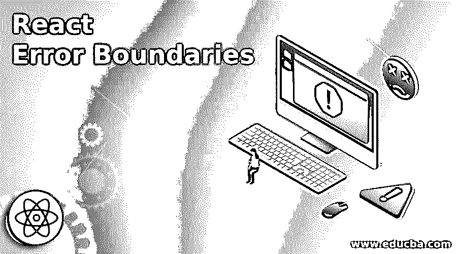
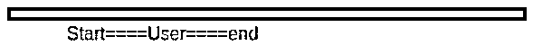
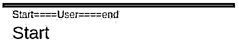
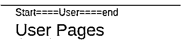

# 反应误差边界

> 原文：<https://www.educba.com/react-error-boundaries/>

## 反应误差边界简介

在 react js 中，react 错误边界允许我们处理错误，它帮助我们的组件不会因为任何内部状态中的错误而损坏。因此，我们可以这样理解它，假设我们有 3 个组件 A、B、C，A 是 B 和 C 的父组件，那么如果组件 C 和 B 中出现任何错误，将会发生什么。在这种情况下，它会影响父组件 A。在 react 16 中，他们介绍了它，表明整个流程不会因为任何错误而受到干扰，借助这一概念，它可以在子组件的任何位置捕获错误。

**语法**

<small>网页开发、编程语言、软件测试&其他</small>

下面是一个简单的语法，我们可以用任何组件来扩展它，基本上在下面我们可以创建一个组件和页面的任何内容，假设页面不可用，在这种情况下我们可以写这一行将被处理。我们将在组件内部编写逻辑来检查是否发生了错误。该错误消息将出现在任何显示错误的子组件中，这样即使子组件中出现错误，其他组件也可以执行。

`throw new Error("Occurs error while rendering");`

### React 中的错误边界是如何工作的？

在理解 react js 中的错误边界是如何工作的之前，我们需要理解它的一些重要方面。它是在 react 版本 16 中引入的。在这个版本之后，我们将能够处理 react js 的任何子组件中出现的错误。

*   它不是任何特定的包，它是一个新错误和一个组件类的组合，该组件类将检查错误是否发生。
*   在任何情况下，错误将发生在任何组件中，而不是影响所有组件，它只会影响子组件。
*   我们在这个概念中添加了一个边界，因为边界意味着我们在讨论我们想要处理错误的限制，所以在一个 div 内部或者在另一个 div 内部。
*   一旦我们定义了错误的边界，在该边界内发生的任何事情都将捕获我们为其定义的错误消息并显示出来，以表明其他组件的显示不会停止。

### 反应误差边界例子

以下示例包含两个部分，一个是 HTML 部分，另一个是 react js 核心 javascript 代码，我们将更多地关注 react js 部分。

在使用 react js 时，我们已经创建了一个组件和几个 html 常量，每个组件和 html 常量都执行各自的任务，我们将看到组件和常量的工作。

*   首先，我们有一些程序所需的重要包。
*   就像我们有重要的开关、路线和一些与导航有关的东西。
*   然后我们创建了一个名为 ExampleError 的组件，在这个组件中我们执行一些重要的任务。
*   在名为 ExampleError 的函数中，我们已经初始化了渲染的初始状态。
*   我们已经编写了组件 didmount 和渲染相关函数。
*   这个组件主要是用来控制点击不同页面时出现的错误。

接下来，我们创建了几个常量，它们将执行显示各种页面数据的任务。我们将看到每个常数和他们的作品。

*   首先，我们为各种页面创建了常量，如开始屏幕的常量、用户屏幕的常量和结束屏幕的常量以及 html 内容。
*   最后，我们设计了示例常量，它是主常量，将在显示所有内容时发挥重要作用。

请参见下面的示例以及输出屏幕。

**错误渲染组件**

**代码:**

`//Importing the required packages
const { Switch, Route, NavLink,BrowserRouter } = ReactRouterDOM;
//Creating the error components which will come to play when any error will happen
class ExampleError extends React.Component {
//Defining the initial states for this component
state = { isError: false };
componentDidCatch() {
//Setting the value of the error state as the true when catching any error .
this.setState({ isError: true });
}
//Render function to render the html screens
render() {
if (this.state.isError) {
//This message will be display in case if any error happens
return <h2>An issue happens while opening end.</h2>;
}
return this.props.children;
}
}`

**各种屏幕和显示输出的常量**

**代码:**

`//Defining the various constants for the screens of start ,user and end
const StartScreen = () => <h3>Start</h3>;
const UserScreen = () => <h3>User Pages</h3>;
const EndScreen = () => {
//Throw an error
throw new Error("Occurs error while rendering");
};`

**主常量处理所有常量并显示**

**代码:**

`//This is the main constant it will contain all other constants in the form of display which we can see in the image below .
const Example = () => (
<BrowserRouter>
//Start displaying the various screens

<nav>
<NavLink exact to="/start" className="link">
Start====
</NavLink>
<NavLink to="/user" className="link">
User====
</NavLink>
<NavLink to="/end" className="link">
end
</NavLink>
//end of NavLink
</nav>
//end of nav
<Switch>
//Start of of Switch
<Route
exact
path="/start"
render={() => (
<ExampleError>
<StartScreen />
</ExampleError>
)}
/>
<Route
path="/user"
render={() => (
<ExampleError>
<UserScreen />
</ExampleError>
)}
/>
<Route
path="/end"
render={() => (
<ExampleError>
<EndScreen />
</ExampleError>
)}
/>
//End of switch
</Switch>

</BrowserRouter>
);
ReactDOM.render(<Example />, document.getElementById("main"));
HTML section ,
Below is the Html which will contains the above Example on the main id

`

在下面，我们展示了四个屏幕，每个屏幕在点击相应的链接时出现，如点击开始时的屏幕，点击用户时的屏幕和点击结束时的错误屏幕。

**输出:**

### 结论

从本教程中，我们看到了反应错误边界的基本概念，我们也看到了它的简单语法。我们看到了 React 边界错误的工作原理及其在编程中的重要性。我们看到了一个例子，它有一个恰当的解释。

### 推荐文章

这是一个反应误差边界的指南。这里我们分别用例子来讨论错误边界是如何工作的。您也可以看看以下文章，了解更多信息–

1.  [React 路由器转换](https://www.educba.com/react-router-transition/)
2.  [React 组件库](https://www.educba.com/react-component-library/)
3.  [反应原生导航](https://www.educba.com/react-native-navigation/)
4.  [React Native SQLite](https://www.educba.com/react-native-sqlite/)