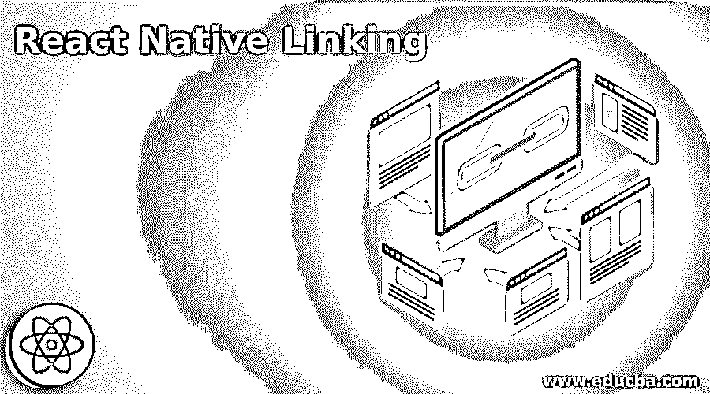
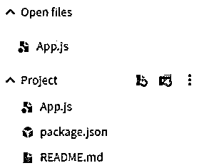
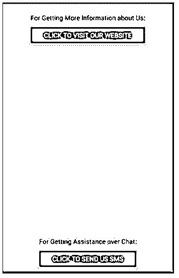
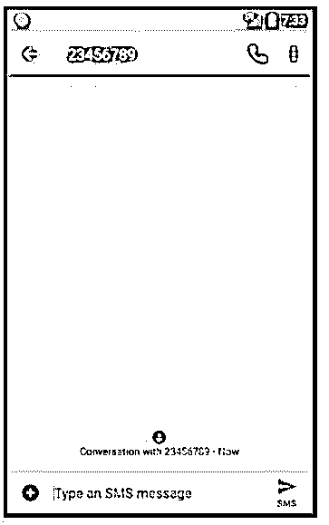
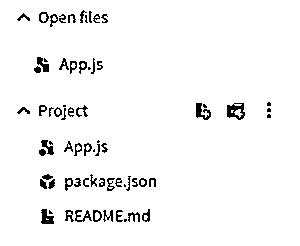
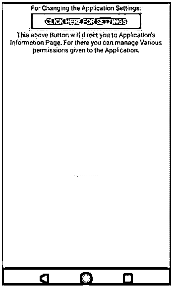
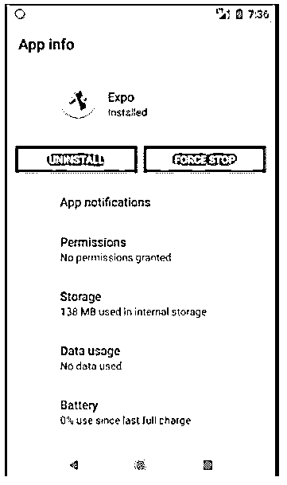
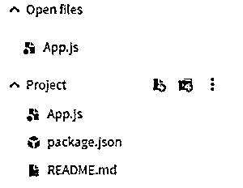
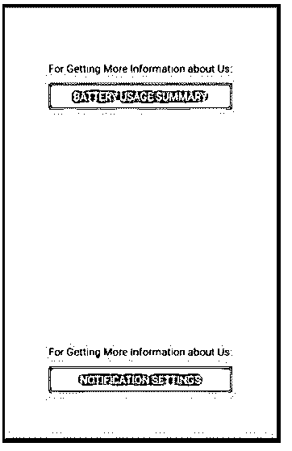
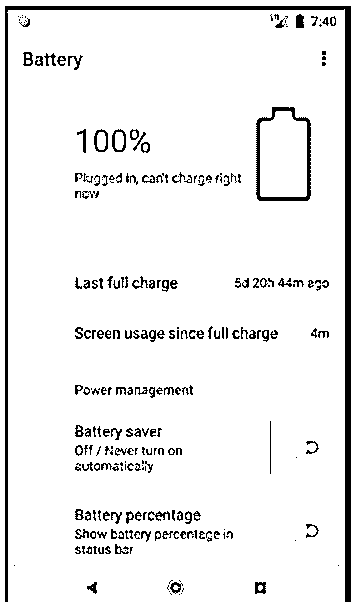

# 反应本地链接

> 原文：<https://www.educba.com/react-native-linking/>

## React 本机链接简介

对于传入的应用程序链接和传出的链接，React Native 提供链接作为一个接口，有助于应用程序链接之间的交互。每一个链接都有一个 URL 方案，网站的前缀要么是 https://要么是 http://。http 被称为 URL 的方案。除了 HTTPS，我们也非常习惯 mailto 方案。打开 mailto scheme 链接时，会执行预装的邮件应用程序。还有其他一些帮助我们打电话、发短信等的方案。

### 如何在 React Native 中使用链接？

为了将不同的应用程序链接到 React 应用程序，我们可以使用不同的自定义 url 方案。就像我们从 Slack 得到的一封神奇链接邮件。将有一个启动松弛按钮是这样的东西:松弛://秘密/魔术-登录/其他-秘密。在 Slack 的情况下，我们可以通知操作系统我们想要使用的自定义方案。打开 Slack 应用程序时，会收到一个使用过的 URL。这被称为深度链接。

<small>网页开发、编程语言、软件测试&其他</small>

正如我们已经看到的 URL 方案，下面是一些执行核心功能的 URL 方案，它们在每个平台上都可用。

*   **mailto:** 这个 URL 方案有助于调用邮件应用程序来打开。

**举例:**

info@educba.com。

*   **Tel:** 此 URL 方案有助于调用手机应用程序打开。

**举例:**

电话:+123456789

*   **短信:**此 URL 方案有助于调用短信应用程序打开。

**举例:**

短信:+123456789

*   **https/http:** 这种 URL 方案有助于调用 web 浏览器打开。

**举例:**

https: //educba.com

### React 本机链接的示例

以下是 React 本机链接的示例:

#### 示例#1

通用链接(深度链接和开放链接)。

在下面的示例中，显示了两个按钮。第一个按钮链接用户到我们的网站 eduCba.com 时，它被点击，第二个按钮直接链接用户直接与我们聊天。

用于实现以下代码的文件有:

**App.js**

`import React
, { useCallback } from "react";
import { Alert
, Button
, Linking
, StyleSheet
, View
, Text
, SafeAreaView } from "react-native";
const supportedURL = "https://www.educba.com/";
const unsupportedURL = "sms: +123456789";
const OpenURLButton = (
{
url
, children
}
) => {
const handlePress
= useCallback(async () =>
{
const supported = await Linking.canOpenURL(url);
if (supported) {
await Linking.openURL(url);
}
}, [url]);
return <Button
title={children}
onPress={handlePress}
color= "#922ce6"/>;
};
const Separator = () => (
<View style={styles.separator} />
);
const App = () => {
return (
<SafeAreaView style={styles.container}>
<View>
<Text style={styles.title}>
For Getting More Information about Us:
</Text>
<OpenURLButton url={supportedURL}>Click to Visit our Website</OpenURLButton>
</View>
<Separator />
<View>
<Text style={styles.title}>
For Getting Assistance over Chat:
</Text>
<OpenURLButton url={unsupportedURL}>Click to Send us SMS</OpenURLButton>
</View>
</SafeAreaView>
);
};
const styles = StyleSheet.create({
container: { flex: 1
, justifyContent: "center"
, alignItems: "center"
, backgroundColor:"#faed75"
},
title: {
textAlign: 'center',
marginVertical: 10,
},
separator: {
marginVertical: 200,
borderBottomColor: '#d94e9a',
borderBottomWidth: StyleSheet.hairlineWidth,
},
});
export default  App;`

**输出:**

**执行代码时出现屏幕:**

**点击网站访问按钮出现画面:**

点击聊天按钮时出现**画面:**

#### 实施例 2

正在打开电话设置。

在下面的例子中，按钮直接链接到应用程序的设置。

用于实现以下代码的文件是:

**App.js**

`import React
, { useCallback } from "react";
import { Button
, Linking
, StyleSheet
, View
, Text
, SafeAreaView } from "react-native";
const Opentel = (
{
children
}
) => {
const handlePress
= useCallback(
async () => {
await Linking.openSettings();
}, []);
return <Button
title={children}
onPress={handlePress}
color="#e62c7f"  />;
};
const Separator = () => (
<View style={styles.separator} />
);
const App = () => {
return (
<SafeAreaView style={styles.container}>
<View>
<Text style={styles.title}>
For Changing the Application Settings:
</Text>
<Opentel>Click Here for Settings</Opentel>
</View>
<View>
<Text style={styles.title}>
This above Button will direct you to Application's Information Page. For there you can manage Various permissions given to the Application.
</Text>
</View>
<Separator />
</SafeAreaView>
);
};
const styles = StyleSheet.create({
container: { flex: 1
, justifyContent: "center"
, alignItems: "center"
, backgroundColor: "#c6f55f"
, marginVertical: 15
},
title: {
textAlign: 'center',
marginVertical: 2,
},
separator: {
padding: 30,
marginVertical: 200,
borderBottomColor: '#d94e9a',
borderBottomWidth: StyleSheet.hairlineWidth,
},
});
export default App;`

**输出:**

**执行代码时出现屏幕:**

**点击设置按钮时出现屏幕:**

#### 实施例 3

在 Android 中发送意图。

在下面的示例中，显示了两个按钮。第一个按钮将用户链接到应用程序显示的电池使用情况，第二个按钮将用户定向到该应用程序的通知设置，但它是一个不受支持的 URL，单击它会显示为弹出窗口。

用于实现以下代码的文件有:

**App.js**

`import React
, { useCallback } from "react";
import { Alert
, Button
, Linking
, StyleSheet
, View
, Text
, SafeAreaView } from "react-native";
const unsupportedURL = "slack://open?team=123456";
const SendIntentButton
= (
{
action
, extras
, children
}
) => {
const handlePress
= useCallback(
async () => {
try {
await Linking.sendIntent(action, extras);
} catch (e) {
Alert.alert(e.message);
}
}, [action, extras]);
return <Button
title={children}
onPress={handlePress}
color="#ed213c" />;
};
const Separator = () => (
<View style={styles.separator} />
);
const App = () => {
return (
<SafeAreaView style={styles.container}>
<View>
<Text style={styles.title}>
For Getting More Information about Us:
</Text>
<SendIntentButton action="android.intent.action.POWER_USAGE_SUMMARY">
Battery Usage Summary
</SendIntentButton>
</View>
<Separator />
<View>
<Text style={styles.title}>
For Getting More Information about Us:
</Text>
<SendIntentButton
action="android.intent.action.settings.APP_NOTIFICATION_SETTINGS"
>
Notification Settings
</SendIntentButton>
</View>
</SafeAreaView>
);
};
const styles = StyleSheet.create({
container: { flex: 1
, justifyContent: "center"
, alignItems: "center"
, backgroundColor:"#7ab6ff" },
title: {
textAlign: 'center',
marginVertical: 10,
},
separator: {
marginVertical: 150,
borderBottomColor: '#d94e9a',
borderBottomWidth: StyleSheet.hairlineWidth,
},
});
export default App;`

**输出:**

**执行代码时出现屏幕:**

**点击“电池使用总结”按钮后出现屏幕:**

**点击“通知设置”(不支持的 URL)按钮时出现屏幕:**

### 结论

在上述文章的基础上，我们看到了 React Native 中链接的概念。我们看到了链接如何有助于将不同的其他应用程序链接到我们的 React 应用程序。上面的例子将帮助我们了解链接在 React 本地应用中根据不同需求的应用。

### 推荐文章

这是一个反应本地链接的指南。这里我们讨论一下入门，如何在 react native 中使用链接？并附有示例。您也可以看看以下文章，了解更多信息–

1.  [反应受控输入](https://www.educba.com/react-controlled-input/)
2.  [反应参考](https://www.educba.com/react-refs/)
3.  [反应三元运算符](https://www.educba.com/react-ternary-operator/)
4.  [反应原生导航](https://www.educba.com/react-native-navigation/)

