# React 本机日期选择器

> 原文：<https://www.educba.com/react-native-datepicker/>

## 对本机日期选择器作出反应的介绍

以下文章提供了 React Native DatePicker 的概述。日期选择器用于以日历的形式向用户显示选项，用户可以根据需要从中选择所需的日期或时间。这种选择日期的选择也通过文本框连接，该文本框显示所选择的日期和时间，这也有助于简化选择。对于不同的图书馆，可以选择不同的 CDN 链接。React Native Community 为 Android 和 iOS 的开发人员提供了日期选择器和时间选择器两种选择。在下面的文章中，我们使用不同的 React 本地库实现了不同的 DatePicker。

**语法:**

<small>网页开发、编程语言、软件测试&其他</small>

1.使用基本日期选择器的语法。

`<DatePicker showToday onChange={onChange("DatePicker")} />`

2.使用范围日期选择器的语法。

`<RangeDatePicker onChange={onChange("Range DatePicker")} />`

3.将 DatePicker 与 TimePicker 一起使用的语法。

`<DatePicker
includeTime
showToday
onChange={onChange("DatePicker include time")}
/>`

### 使用 React 本机日期选择器

有三种拾取器模式，定义如下:

*   **日期时间模式:**该模式通过 react native 提供了一个日期时间选择器，可以同时选择日期和时间。当前日期将显示为“今天”。
*   **DatePicker 模式:**该模式通过 react native 提供了一个 DatePicker，可以选择年、月、日。日期-月份-年份的顺序根据各自的区域设置进行调整。
*   **时间选择器模式:**如果只需要显示时间，则使用该模式。AM/PM 是根据区域设置和用户设置添加的。可以添加时间间隔，以便在时间间隔相等的情况下显示时间。

### 例子

下面是提到的例子:

#### 示例#1

基本 React 本机日期选择器。

在下面的示例中，显示了基本日期选取器。您可以直接通过日历或在框中输入首选日期来选择日期。

用于实现以下代码的文件是:

**a. index.js**

`import React from "react";
import ReactDOM from "react-dom";
import { DatePicker
, RangeDatePicker } from "@y0c/react-datepicker";
import "@y0c/react-datepicker/assets/styles/calendar.scss";
import "dayjs/locale/ko";
import "dayjs/locale/en";
import "./styles.css";
const Panel = ({ header, children }) => (

<h1>{header} {'\u2764'}</h1>

{children}

);
function App() {
const onChange = title => (...args) => console.log(title, args);
return (

<Panel header="Basic DatePicker">
<DatePicker showToday onChange={onChange("DatePicker")} />
<h2>{'\u2740'}{'\u2740'}{'\u2740'}{'\u2740'}{'\u2740'}{'\u2740'}{'\u2740'}{'\u2740'}{'\u2740'}{'\u2740'}{'\u2740'}{'\u2740'}</h2>
</Panel>

);
}
const rootElement = document.getElementById("root");
ReactDOM.render(<App />, rootElement);`

**b. styles.css**

`.App {
font-family: 'Times New Roman'
, Times
, serif;
}`

**输出:**

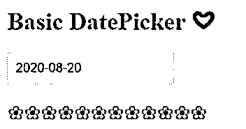

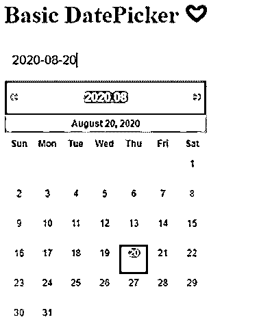

#### 实施例 2

范围日期选择器。

在下面的示例中，用户可以从日历中显示的日期范围中选择日期。

用于实现以下代码的文件是:

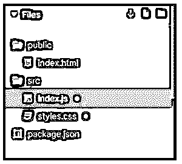

**a. index.js**

`import React from "react";
import ReactDOM from "react-dom";
import { DatePicker
, RangeDatePicker } from "@y0c/react-datepicker";
import "@y0c/react-datepicker/assets/styles/calendar.scss";
import "dayjs/locale/ko";
import "dayjs/locale/en";
import "./styles.css";
const Panel = ({ header, children }) => (

<h1>{header} {'\u2764'}</h1>

{children}

);
function App() {
const onChange = title => (...args) => console.log(title, args);
return (

<Panel header="Range DatePicker">
<RangeDatePicker onChange={onChange("Range DatePicker")} />
<h2>{'\u2740'}{'\u2740'}{'\u2740'}{'\u2740'}{'\u2740'}{'\u2740'}{'\u2740'}{'\u2740'}{'\u2740'}{'\u2740'}{'\u2740'}{'\u2740'}</h2>
</Panel>

);
}
const rootElement = document.getElementById("root");
ReactDOM.render(<App />, rootElement);`

**b. styles.css**

`.App {
font-family: 'Times New Roman'
, Times
, serif;
}`

**输出:**

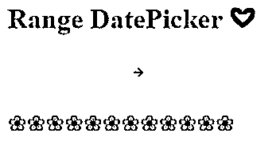

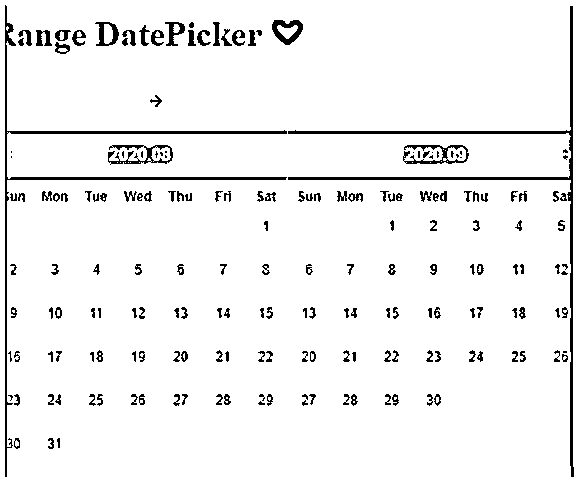

#### 实施例 3

带有时间选择器的日期选择器。

**类型 1:**

在下面的例子中，用户可以从顶部的日期菜单中选择日期，从时间菜单中选择时间。或者直接在框中输入所需的日期和时间。

用于实现以下代码的文件是:

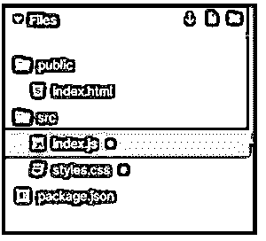

**a. index.js**

`import React from "react";
import ReactDOM from "react-dom";
import { DatePicker
, RangeDatePicker } from "@y0c/react-datepicker";
import "@y0c/react-datepicker/assets/styles/calendar.scss";
import "dayjs/locale/ko";
import "dayjs/locale/en";
import "./styles.css";
const Panel = ({ header, children }) => (

<h1>{header} {'\u2764'}</h1>

{children}

);
function App() {
const onChange = title => (...args) => console.log(title, args);
return (

<Panel header="DatePicker with TimePicker">
<DatePicker
includeTime
showToday
onChange={onChange("DatePicker include time")}
/>
</Panel>

);
}
const rootElement = document.getElementById("root");
ReactDOM.render(<App />, rootElement);`

**b. styles.css**

`.App {
font-family: 'Times New Roman'
, Times
, serif;
}`

**输出:**

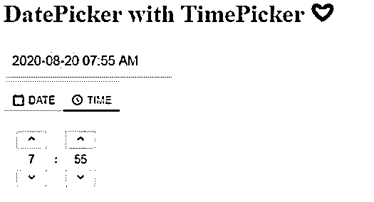

**类型 2:**

在下面的例子中，用户可以同时选择日期和时间。

用于实现以下代码的文件是:

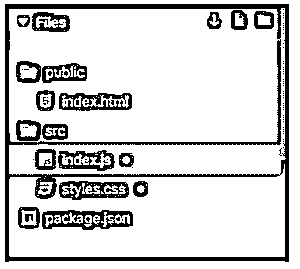

**a. index.js**

`import React from "react";
import ReactDOM from "react-dom";
import DatePicker from "react-datepicker";
import moment from "moment";
import "react-datepicker/dist/react-datepicker.css";
import "./styles.css";
class Example extends React.Component {
constructor(props) {
super(props);
this.state = {
startDate: moment("2020-08-20"),
endDate: moment("2020-08-24")
};
}
handleChange = (
{
startDate
, endDate
}
) => {
startDate = startDate || this.state.startDate;
endDate = endDate || this.state.endDate;
if (startDate.isAfter(endDate)) {
endDate = startDate;
}
this.setState({ startDate, endDate });
};
handleChangeStart =
startDate => this.handleChange(
{
startDate
}
);
handleChangeEnd =
endDate => this.handleChange(
{
endDate
}
);
render() {
return (

<h1>DatePicker with TimePicker</h1>
<DatePicker
selected={this.state.startDate}
selectsStart
inline
showTimeSelect
startDate={this.state.startDate}
endDate={this.state.endDate}
onChange={this.handleChangeStart}
timeFormat="hh:mm A"
timeIntervals={60}
/>

<DatePicker
selected={this.state.startDate}
selectsStart
onChange={this.handleChangeStart}
showTimeSelect
showTimeSelectOnly
dateFormat="hh:mm A"
/>

);
}
}
const rootElement = document.getElementById("root");
ReactDOM.render(<Example />, rootElement);`

**b. styles.css**

`.react-datepicker__time-list {
padding: 0 !important;
}`

**输出:**

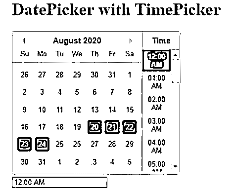

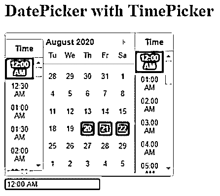

#### 实施例 4

带有取消和确定按钮。

在下面的例子中，我们开发了一个日期选择器，用户可以从中选择所需的日期，它还有一个取消按钮来取消用户采取的操作，还有一个确定按钮来批准用户采取的操作。

用于实现以下代码的文件是:

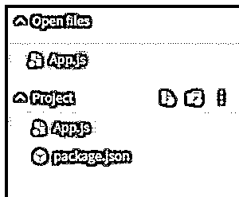

**a. App.js**

`import React
, { Component } from 'react';
import { View
, StyleSheet } from 'react-native';
import DatePicker from 'react-native-datepicker';
export default class MyDatePicker extends Component {
constructor(props) {
super(props);
this.state = { date: '20-08-2020' };
}
render() {
return (
<View style={styles.container}>
<DatePicker
style={{ width: 200 }}
date={this.state.date}
mode="date"
placeholder="select date"
format="DD-MM-YYYY"
minDate="01-01-2020"
maxDate="01-01-2030"
confirmBtnText="Confirm"
cancelBtnText="Cancel"
customStyles={{
dateIcon: {
position: 'absolute',
left: 0,
top: 3,
marginLeft: 0.2,
},
dateInput: {
marginLeft: 30,
},
}}
onDateChange={date => {
this.setState({ date: date });
}}
/>
</View>
);
}
}
const styles = StyleSheet.create({
container: {
flex: 1,
alignItems: 'center',
justifyContent: 'center',
marginTop: 40,
padding: 12,
backgroundColor: '#f79eff',
},
});`

**输出:**

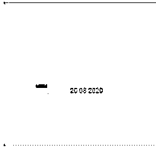

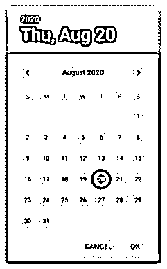

### 推荐文章

这是一个反应原生日期选择器的指南。这里我们分别讨论 react native DatePicker 的介绍、工作原理和示例。你也可以看看下面的文章来了解更多

1.  [React Native 中的造型](https://www.educba.com/styling-in-react-native/)
2.  [反应自然取向](https://www.educba.com/react-native-orientation/)
3.  [React Native Redux](https://www.educba.com/react-native-redux/)
4.  [反应原生模板](https://www.educba.com/react-native-template/)

