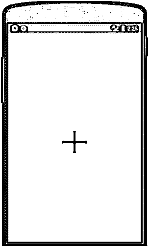

# 反应本机图像

> 原文：<https://www.educba.com/react-native-image/>


## React 本机映像简介

在 react native 中，图像是 react native 的一部分，借助 react native 中的该属性，我们能够管理和显示各种大小的图像，这些图像的来源可能来自本地图像(基本上可能是本地系统上存在的图像)、网络图像(在这种情况下，图像将来自第三方或来自其他系统或服务器)， 它允许开发人员为映像编写设计，我们可以用它来控制映像(允许我们根据不同设备的不同设备配置来管理映像)。

### 句法

我们有三种基于图像来源的语法用于反应原生图像，如下所示:

<small>网页开发、编程语言、软件测试&其他</small>

**1。静态图像**:这些图像可能来自本地计算机，也可能是任何静态源。

```
<Image source={require('./local_file.png')} />
```

在上面的语法中，我们传递了将在应用程序上显示图像的文件的路径和名称。

**2。混合映像**:这些是来自 react-native 和 by code 的源代码。

在下面的语法中，我们在 uri 的属性中写了一些样式表和一个源名称。

```
<Image source={{uri: 'name_of_icon'}} style={{width: 55, height: 55}} />
```

**3。网络图像**:我们也可以称之为动态图像，这些图像是来自第三方或其他服务器(网络计算机)的源，如果网络图像出于安全原因应该来自 https 服务器，而不是简单地来自 http 服务器。我们必须为这些情况定义尺寸，因为图像来自其他来源，所以它们可能会干扰我们的应用程序 ui，所以如果我们为图像定义自己的尺寸，这将是很好的。

在下面的语法中，我们传递 url 图像来代替 uri 属性以及图像的维度。

//正确的做法是，我们用图像的尺寸来传递样式。

```
<Image source={{uri: 'https://image_url.png'}}
style={{width: 55, height: 55}} />
```

//这不是正确的做法，因为我们没有传递图像的维度

```
<Image source={{uri: 'https://image_url.png'}} />
```

**4。Uri 数据** : Uri 数据图像是以数据源的形式嵌入的图像。在这些情况下，我们需要为图像部分的 uri 属性定义数据部分。在这些情况下，我们还需要为图像传递尺寸。

```
<Image
style={{width: 66, height: 66}}
source={{uri: 'data:image/png;base64,iVBORw0KGgoAAAANSUhEUgAAADMAAAAzCAYAAAA6oTAqAAAAEXRFWsHRTb2Z0d2FyZQBwbmdjcnVzaEB1SfMAAABQSURBVGje7sddSxssCQBACARB+21/ab8BEesdsQNhFi6WSYzYLYudDQYGBgYGBgYGBgYGBgYGBgZmcvDqsdYGBgmhivGsdQYGBgYGBgYGBgYGBgYGBgbmQw+P/eMrC5UTVAAAAABJRUdsds5ErkJggg=='}}
/>
```

**5。背景图像(通过嵌套)**:使用背景图像，并使用背景图像设置图像。它允许您将任何组件作为子组件添加到其中。

在下面的语法代码中，我们显示了图像，并且提到了图像的尺寸。

```
return (
<ImageBackground source={source for images} style={{width: '51%', height: '51%'}}>
<Text>Into It</Text> //text for image
</ImageBackground>
);
```

### 在 React Native 中处理图像

react 本机映像的工作原理可以在以下步骤中解释:

*   这个库将两个参数作为主参数，即 source 和 style。
*   Source，正如我们所讨论的，它将参数作为图像的来源，它可以来自本地系统(静态)，可以来自网络(来自其他计算机或服务器)，也可以来自数据源。
*   在这种情况下，传递的下一个参数是样式表，如果图像来源来自任何第三方或其他 url，在这种情况下，我们可以通过在我们的终端定义维度来管理，而不是依赖他们发送适合我们应用程序的适当大小的图像。
*   react native 的图像库是由 react 的核心库定义的，因此当您调用该库并为其传递参数时，会在内部管理图像源并为我们返回/呈现合适的组件。

### 例子

下面是一些例子:

#### 示例#1

在本例中，我们显示了来自其他 URL 的图像图标(网络图像)。

*   我们创建了一个名为 ImageExample 的类，这个类扩展了 react 核心组件。
*   我们正在从 react-native 库中提取一个图像库(导入)。
*   最后，在 render 函数中，我们只是传递源并为其定义维度。

**代码:**

```
import React, { Component } from 'react';
//importing the Image library from react native component.
import {StyleSheet, AppRegistry,Text, View, Image,ImageBackground } from 'react-native';
export default class ImageExample extends Component {
render() {
return (
<ImageBackground source = {{uri:'https://cdn.educba.com/academy/wp-content/uploads/2019/01/cropped-EDUCBA_LOGO.png'}}
style={{width: '100%', height: '100%'}}>
<Image source = {{uri:'https://cdn.educba.com/academy/wp-content/uploads/2019/01/cropped-EDUCBA_LOGO.png'}}
style = {{ width: '80%', height: 70 }}
/>
</ImageBackground>
);
}
}
// you can ignore below line if you have create with react native app
AppRegistry.registerComponent('DisplayAnImage', () => DisplayAnImage);
```

**输出:**


#### 实施例 2

在这个例子中我们显示的图标为加号，这个图标已经以数据的形式传递了。我们可以在代码中看到，在 uri 部分，一个大的字符串以数据的形式被传递，最终将被转换成一个加号图像。

**代码:**

```
import React, { Component } from 'react';
//import react in our code.
import { Text, Image, View, StyleSheet } from 'react-native';
//import all the components we are going to use.
export default class ImageExample extends Component {
render() {
return (
<View style={imageStyles.containerStyle}>
<Image
style={{ width: 67, height: 59 }}
source={{
uri:
'data:image/png;base64,iVBORw0KGgoAAAANSUhEUgAAADMAAAAzCAYAAAA6oTAqAAAAEXRFWHRTb2Z0d2FyZQBwbmdjcnVzaEB1SfMAAABQSURBVGje7dSxCQBACARB+2/ab8BEeQNhFi6WSYzYLYudDQYGBgYGBgYGBgYGBgYGBgZmcvDqYGBgmhivGQYGBgYGBgYGBgYGBgYGBgbmQw+P/eMrC5UTVAAAAABJRU5ErkJggg==',
}}
/>
</View>
);
}
}
//defining the constant for the css design
const imageStyles = StyleSheet.create({
containerStyle: {
flex: 1,
alignItems: 'center',
justifyContent: 'center',
paddingTop: 50,
backgroundColor: 'green',
},
});
```

**输出:**




### 结论

从本教程中，我们学习了 react-native image 属性的用法，我们了解到我们可以使用该属性来显示来自各种来源的图像，如网络、本地、混合等。

### 推荐文章

这是一个反应原生图像的指南。在这里，我们讨论 React 本机映像的介绍以及工作示例和相应的示例。您也可以看看以下文章，了解更多信息–

1.  [React 原生图像拾取器](https://www.educba.com/react-native-image-picker/)
2.  [反应原生架构](https://www.educba.com/react-native-architecture/)
3.  [反应原生布局](https://www.educba.com/react-native-layout/)
4.  [React 原生库](https://www.educba.com/react-native-libraries/)


