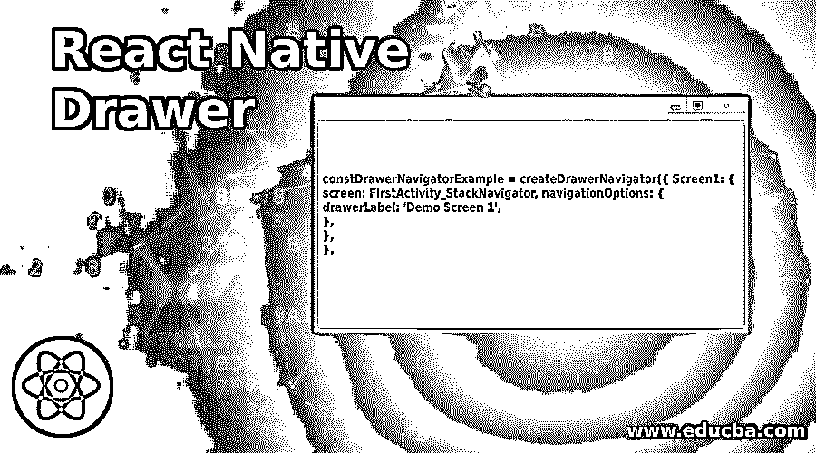
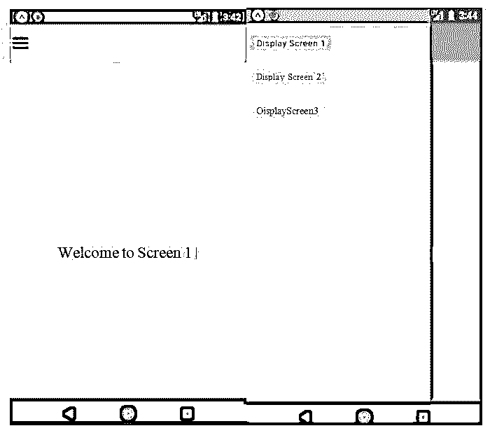
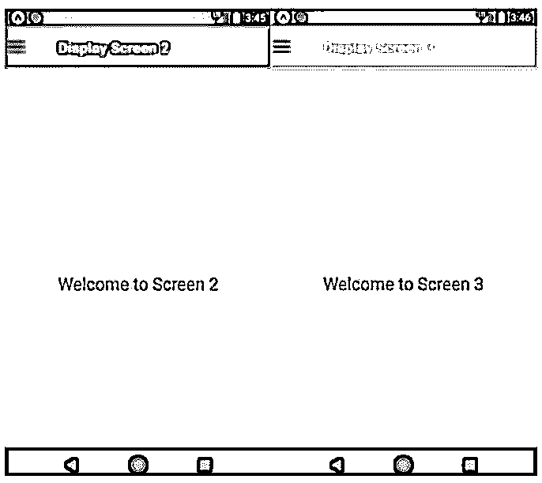
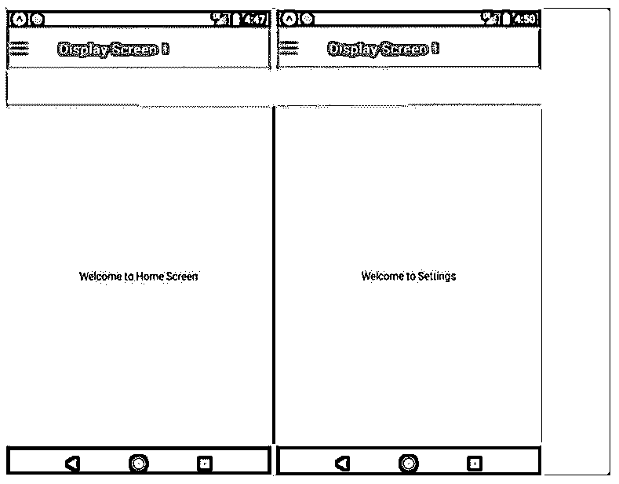
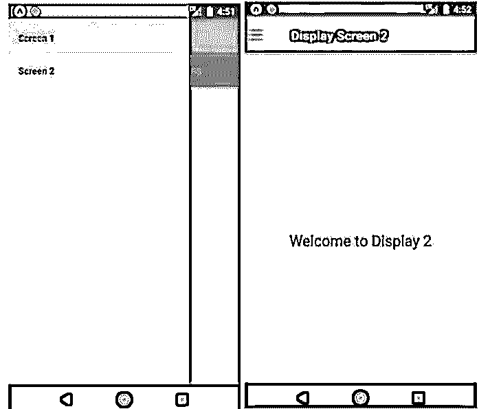

# 反应本机抽屉

> 原文：<https://www.educba.com/react-native-drawer/>

## React 本机抽屉简介

React 本机抽屉导航也称为导航抽屉，是一个全屏视图，在滑动面板上显示主导航菜单和活动。通常，当用户不使用它时，它是隐藏的，但我们可以通过从屏幕边缘滑动手指或触摸抽屉图标来让它出现在屏幕上。React-Native 使用 React 导航库为 Android 和 iOS 平台提供支持。

使用以下方法打开和关闭抽屉:

<small>网页开发、编程语言、软件测试&其他</small>

*   this . props . navigation . open drawer()；
*   this . props . navigation . close drawer()；

为了切换抽屉，我们需要调用以下代码:

*   this . props . navigation . toggledrawer()；

**创建语法:**

`constDrawerNavigatorExample = createDrawerNavigator({ Screen1: {
screen: FirstActivity_StackNavigator, navigationOptions: {
drawerLabel: 'Demo Screen 1',
},
},
},`

### 例子

下面是一些例子:

#### 示例#1

反应-原生抽屉。

**代码:**

**Display1.js**

`import React, { Component } from 'react';
import { StyleSheet
, View
, Text } from 'react-native';
export default class Display1 extends Component {
render() { return (
<View style={styles.MainContainer}>
<Text style={{ fontSize: 23 }}> Welcome to Screen 1 </Text>
</View>
);
}
}
const styles = StyleSheet.create({ MainContainer: {
flex: 1,
paddingTop: 20, alignItems: 'center', marginTop: 50, justifyContent: 'center',
},
});`

**Display2.js**

`import React, { Component } from 'react'; import { StyleSheet
, View
, Text } from 'react-native';
export default class Screen2 extends Component{ render(){
return(
<View style={styles.MainContainer}>
<Text style={{ fontSize: 23 }}> Welcome to Screen 2 </Text>
</View>
);
}
}
const styles = StyleSheet.create({ MainContainer: {
flex: 1,
paddingTop: 20, alignItems: 'center', marginTop: 50, justifyContent: 'center',
},
});`

**Display3.js**

`import React, { Component } from 'react'; import { StyleSheet
, View
, Text } from 'react-native';
export default class Screen3 extends Component{ render(){
return(
<View style={styles.MainContainer}>
<Text style={{ fontSize: 23 }}> Welcome to Screen 3 </Text>
</View>
);
}
}
const styles = StyleSheet.create({
MainContainer: {
flex: 1,
paddingTop: 20,
alignItems: 'center',
marginTop: 50,
justifyContent: 'center',
},
});`

**App.js**

`import React, { Component } from 'react';
import { View, Image, TouchableOpacity } from 'react-native';
import { createDrawerNavigator, createStackNavigator, createAppContainer,
} from 'react-navigation';
import Display1 from './pages/Display1'; import Display2 from './pages/Display2'; import Display3 from './pages/Display3';
class NavigationDrawerStructure extends Component {
toggleDrawer = () => {
this.props.navigationProps.toggleDrawer();
};
render() {
return (
<View style={{ flexDirection: 'row' }}>
<TouchableOpacityonPress={this.toggleDrawer.bind(this)}>
<Image
source={require('./image/drawer.png')}
style={{ width: 24, height: 24, marginLeft: 4 }}
/>
</TouchableOpacity>
</View>
);
}
}
const Display1_StackNavigator = createStackNavigator({ First: {
screen: Display1,
navigationOptions: ({ navigation }) => ({ title: 'Display Screen 1',
headerLeft: <NavigationDrawerStructurenavigationProps={navigation}
/>,
headerStyle: { backgroundColor: '#88ff00',
},
headerTintColor: '#ffffff',
}),
},
});
const Display2_StackNavigator = createStackNavigator({ Second: {
screen: Display2,
navigationOptions: ({ navigation }) => ({
title: 'Display Screen 2',
headerLeft: <NavigationDrawerStructurenavigationProps={navigation}
/>,
headerStyle: { backgroundColor: '#ff0565',
},
headerTintColor: '#ffffff',
}),
},
});
const Display3_StackNavigator = createStackNavigator({ Third: {
screen: Display3,
navigationOptions: ({ navigation }) => ({ title: 'Display Screen 3',
headerLeft: <NavigationDrawerStructurenavigationProps={navigation}
/>,
headerStyle: { backgroundColor: '#00d5ff',
},
headerTintColor: '#ffffff',
}),
},
});
constDrawerNavigatorExample = createDrawerNavigator({ Display1: {
screen: Display1_StackNavigator,
navigationOptions: {
drawerLabel: 'Display Screen 1',
},
},
Display2: {
screen: Display2_StackNavigator, navigationOptions: {
drawerLabel: 'Display Screen 2',
},
},
Display3: {
screen: Display3_StackNavigator, navigationOptions: {
drawerLabel: 'Display Screen 3',
},
},
});
export default createAppContainer(DrawerNavigatorExample);`

**输出:**

#### 实施例 2

react-Native-Drawer with screen 1 with tab:Drawer 的不同页面。

**代码:**

**a .屏幕 1**

**HomeDisplay.js】的缩写**

`import React from 'react';
import { Text, View } from 'react-native';
export default class HomeScreen extends React.Component{ render(){
return(
<View style={{ flex: 1, justifyContent: 'center',alignItems: 'center'}}>
<Text>Welcome to Home Screen</Text>
</View>
);
}
}`

**SettingDisplay.js**

`import React from 'react';
import { Text, View } from 'react-native';
export default class SettingsScreen extends React.Component{ render(){
return(
<View style={{ flex: 1, justifyContent: 'center',alignItems: 'center'}}>
<Text>Welcome to Settings</Text>
</View>
);;
}
}`

**TabCombiner.js**

`import React from 'react';
import { createAppContainer, createStackNavigator,
createMaterialTopTabNavigator,
} from 'react-navigation';
import HomeScreen from './HomeDisplay';
import SettingsScreen from './SettingsDisplay';
constTabScreen = createMaterialTopTabNavigator(
{
Home: { screen: HomeScreen },
Settings: { screen: SettingsScreen },
},
{
tabBarPosition: 'top', swipeEnabled: true, animationEnabled: true, tabBarOptions: {
activeTintColor: '#FFFFFF', inactiveTintColor: '#f7fffe', style: {
backgroundColor: '#7ade4b',
},
labelStyle: { textAlign: 'center',
},
indicatorStyle: { borderBottomColor: '#7268ad', borderBottomWidth: 2,
},
},
}
);
constTabCombiner = createStackNavigator({ TabScreen: {
screen: TabScreen, navigationOptions: {
header: null,
},
},
});
export default TabCombiner;`

**b. Screen2.js**

`import React, { Component } from 'react'; import { StyleSheet
, View
, Text } from 'react-native';
export default class Display2 extends Component{ render(){
return(
<View style={styles.MainContainer}>
<Text style={{ fontSize: 23 }}> Welcome to Display 2 </Text>
</View>
);
}
}
const styles = StyleSheet.create({ MainContainer: {
flex: 1,
paddingTop: 20, alignItems: 'center', marginTop: 50, justifyContent: 'center',
},
});`

**App.js**

`import React, { Component } from 'react';
import {
StyleSheet, Platform, View,
Text, Image,
TouchableOpacity,
} from 'react-native';
import { createDrawerNavigator, createStackNavigator, createAppContainer
} from 'react-navigation';
import TabHelper from './pages/TabPages/TabCombiner'; import Screen2 from './pages/Display2';
class NavigationDrawerStructure extends Component { toggleDrawer = () => {
this.props.navigationProps.toggleDrawer();
};
render() { return (
<View style={{ flexDirection: 'row' }}>
<TouchableOpacityonPress={this.toggleDrawer.bind(this)}>
<Image
source={require('./image/drawer.png')}
style={{ width: 25, height: 25, marginLeft: 5 }}
/>
</TouchableOpacity>
</View>
);
}
}
constFirstActivity_StackNavigator = createStackNavigator({ First: {
screen: TabHelper,
navigationOptions: ({ navigation }) => ({ title: 'Display Screen 1',
headerLeft: <NavigationDrawerStructurenavigationProps={navigation}
/>,
headerStyle: { backgroundColor: '#b914f5', shadowOpacity: 0,
elevation: 0,
},
headerTintColor: '#fff',
}),
},
});
const Screen2_StackNavigator = createStackNavigator({ Second: {
screen: Screen2,
navigationOptions: ({ navigation }) => ({ title: 'Display Screen 2',
headerLeft: <NavigationDrawerStructurenavigationProps={navigation}
/>,
headerStyle: { backgroundColor: '#f70a6d',
},
headerTintColor: '#fff',
}),
},
});
constDrawerNavigatorExample = createDrawerNavigator({ Screen1: {
screen: FirstActivity_StackNavigator, navigationOptions: {
drawerLabel: 'Screen 1',
},
},
Screen2: {
screen: Screen2_StackNavigator, navigationOptions: {
drawerLabel: 'Screen 2',
},
},
});
export default createAppContainer(DrawerNavigatorExample);`

**输出:**

### 结论

从上面的例子我们可以了解如何实现 React 原生抽屉，以及如何根据我们的需求使用它们。

### 推荐文章

这是一个反应本地抽屉的指南。在这里，我们讨论了原生抽屉的介绍和例子。您也可以看看以下文章，了解更多信息–

1.  [React 原生库](https://www.educba.com/react-native-libraries/)
2.  [反应原生图像](https://www.educba.com/react-native-image/)
3.  [反应自然状态](https://www.educba.com/react-native-state/)
4.  [反应原生架构](https://www.educba.com/react-native-architecture/)

