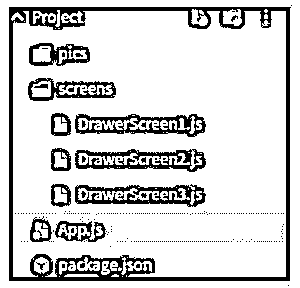
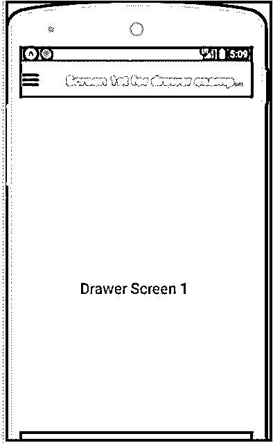
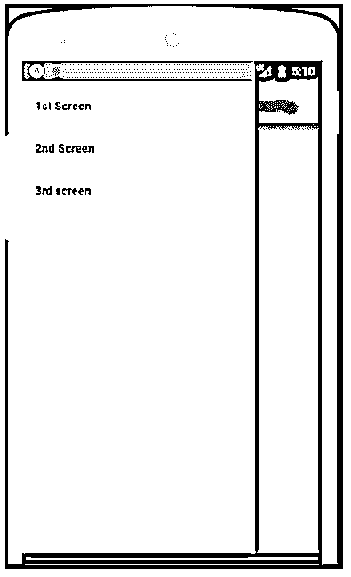
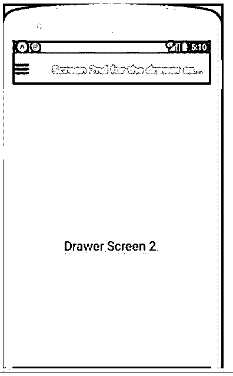
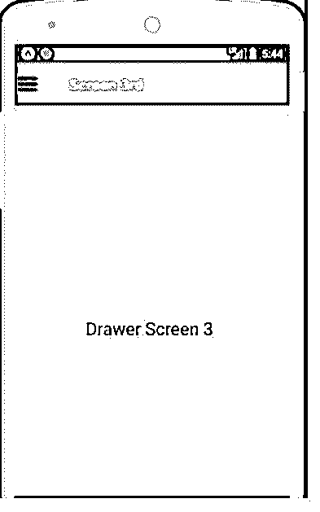

# 反应本机抽屉导航

> 原文：<https://www.educba.com/react-native-drawer-navigation/>


## React 本机抽屉导航简介

React 本机抽屉导航是基于社区的 react 本机库。抽屉导航的主要用途是它会打开一个导航(当我们打开任何应用程序时，如果我们触摸屏幕，导航菜单就会出现一些重要的内容)。最初，抽屉导航将不可见(当用户触摸屏幕时，它会出现，这意味着默认情况下它会隐藏，当手指触摸或轻扫屏幕边缘时，导航会打开)，抽屉导航库将从 npm 包 react-navigation 库中使用，我们可以将该库导入到我们的项目中。

**语法:**

<small>网页开发、编程语言、软件测试&其他</small>

我们可以将语法定义为以下步骤:

*   第一步，我们导入所有相关的 react native、react 和 Drawer 导航库。
*   在第二步中，我们创建了一个名为 drawer example 的类，在这个类中，我们返回了导航，当用户将手指在边缘滑动到应用程序中时，它可以保存导航信息。
*   在返回部分中，我们创建了标题、内容 1 和内容 2。

**代码:**

```
import { createDrawerNavigator } from '@react-navigation/drawer';//importing the drawer library from the react native
const DrawerNavigation = createDrawerNavigator();//creating the
export default function drawerExample() { //exporting the class drawerExample as the default class
return (
<DrawerNavigation.Navigator>
<DrawerNavigation.Screen name="Header" component={Header} />
<DrawerNavigation.Screen name="Content1" component={Content1} />
<DrawerNavigation.Screen name="Content2" component={Content2} />
</DrawerNavigation.Navigator>
);
}
```

### 抽屉导航在 React Native 中是如何工作的？

*   第一步，我们从 react 本地导航社区库中导入抽屉库。
*   一旦我们导入，我们需要为它定义默认屏幕。如果没有活动发生，这里将会显示默认屏幕。
*   在这个里面我们可以定义第一个和第三个等等来显示，点击它们就会打开。
*   通过在 createStackNavigator 中使用 first、second 等，我们可以告诉 react native navigator 哪些屏幕应该是第一次可见的。
*   createStackNavigator，在 IOS 屏幕上从右浮动，在 android 屏幕上会淡入。在 IOS 的情况下，它可以配置为从底部滑动。
*   createAppContainer，该属性允许您管理应用程序的状态，并将顶部导航器链接到应用程序环境。

### React 本机抽屉导航示例

以下示例包含 react 本机抽屉实现的完整结构和布局。

*   首先，我们创建了一个名为 NavigationDrawerExample 的主要 react 本地组件，它将包含主要逻辑。
*   在这个组件中，我们使用了抽屉屏幕 1、抽屉屏幕 2 和抽屉屏幕 3。
*   所有抽屉屏幕页面都在屏幕文件夹内，我们可以在图像中看到文件夹结构。
*   我们将第一个屏幕设为默认屏幕，滑动或点击它将通过调用它们打开其他页面。
*   所有抽屉屏幕都有自己的信息和数据。此外，我们给了每个屏幕的小设计。
*   我们制作了一个图片文件夹，可以放一些图片，最终用户也可以看到。

下面的屏幕是代码的结构。这里 App.js 包含了主要组件和 App.js 调用和使用其他东西。

下面给出了架构步骤:

*   这个文件夹包含我们想要在任何屏幕上显示的任何图像。
*   **屏幕:**在这个文件夹中，我们又创建了三个文件，分别名为 DrawerScreen1.js、DrawerScreen2.js 和 DrawerScreen3.js。在打开导航时，如果我们单击屏幕，就会调用这些组件。
*   **App.js:** 这里包含了导航的主要逻辑。

遵循以下输出屏幕示例。




这是 react 本机抽屉示例的主要组件。

**代码:**

```
import React, { Component } from 'react';
//importing react components.
import { View, Image, TouchableOpacity } from 'react-native';
// importing all the basic components needed for react native
import {
createDrawerNavigator,
createStackNavigator,
createAppContainer,
} from 'react-navigation';//importing all the required attribute for the drawer and navigation
importing the screen which need to be displayed here in the main component.
import DrawerScreen1 from './screens/DrawerScreen1';
import DrawerScreen2 from './screens/DrawerScreen2';
import DrawerScreen3 from './screens/DrawerScreen3';
//defining the main component class which extend react core component
class NavigationDrawerExample extends Component {
toggleDrawer = () => {
this.props.navigationProps.toggleDrawer();
};
render() {
return (
<View style={{ flexDirection: 'row' }}>
<TouchableOpacity onPress={this.toggleDrawer.bind(this)}>
{/*We can use any image and that image can be displayed here*/}
<Image
source={require('./pics/drawer.png')}
style={{ width: 25, height: 25, marginLeft: 5 }}
/>
</TouchableOpacity>
</View>
);
}
}
const defaultScreenForDrawer = createStackNavigator({
//first screen which will be visible as the default screen
First: {
screen: DrawerScreen1,
navigationOptions: ({ navigation }) => ({
title: 'Screen 1 for drawer example',
headerLeft: <NavigationDrawerExample navigationProps={navigation} />,
headerStyle: {
backgroundColor: 'green',
},
headerTintColor: 'red',
}),
},
});
//second screen which will be visible on the clicking the navigation open
const Screen2ForDrawer = createStackNavigator({
Second: {
screen: DrawerScreen2,
navigationOptions: ({ navigation }) => ({
title: 'Screen 2',
headerLeft: <NavigationDrawerExample navigationProps={navigation} />,
headerStyle: {
backgroundColor: 'green',
},
headerTintColor: 'red',
}),
},
});
//3rd screen which will be visible for the click on the r3d screen
const Screen3ForDrawer = createStackNavigator({
Third: {
screen: DrawerScreen3,
navigationOptions: ({ navigation }) => ({
title: 'Screen 3',
headerLeft: <NavigationDrawerExample navigationProps={navigation} />,
headerStyle: {
backgroundColor: 'green',
},
headerTintColor: 'red',
}),
},
});
//content for the screen first which is going to display on clicking the 1st screen or default content
const DrawerNavigatorExample = createDrawerNavigator({
Screen1: {
screen: defaultScreenForDrawer,
navigationOptions: {
drawerLabel: 'First Screen',
},
},
//content for the 2nd screen which is going to be displayed for clicking on the 2nd screen
Screen2: {
screen: Screen2ForDrawer,
navigationOptions: {
drawerLabel: '2nd Screen',
},
},
//content for the 3rd screen which is going to be displayed on clicking the 3rd screen.
Screen3: {
screen: Screen3ForDrawer,
navigationOptions: {
drawerLabel: '3rd screen',
},
},
});
export default createAppContainer(DrawerNavigatorExample);
```

**输出:**













### 结论

在本教程中，我们学习了 react 本机导航库，我们了解了它如何处理许多导航屏幕，以及我们如何显示与许多屏幕相关的数据。我们还学习了它显示默认屏幕和点击或执行特定活动时的屏幕的工作原理。

### 推荐文章

这是一个反应原生抽屉导航的指南。在这里，我们讨论介绍，抽屉导航如何在 react native 中工作，以及相应的例子。您也可以看看以下文章，了解更多信息–

1.  [React Native ListView](https://www.educba.com/react-native-listview/)
2.  [反应原生文本输入](https://www.educba.com/react-native-textinput/)
3.  [React 原生库](https://www.educba.com/react-native-libraries/)
4.  [React 原生搜索栏](https://www.educba.com/react-native-search-bar/)


