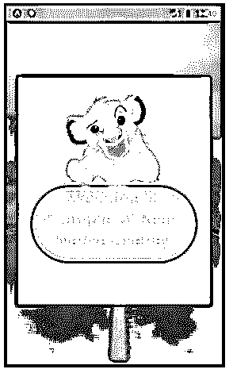
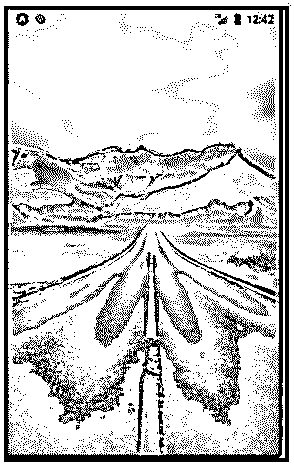
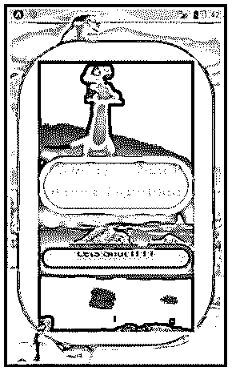
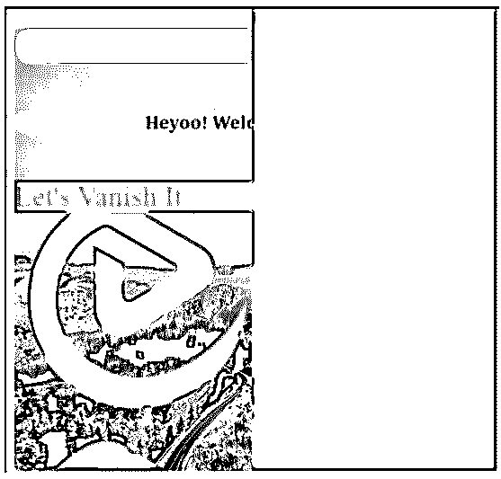
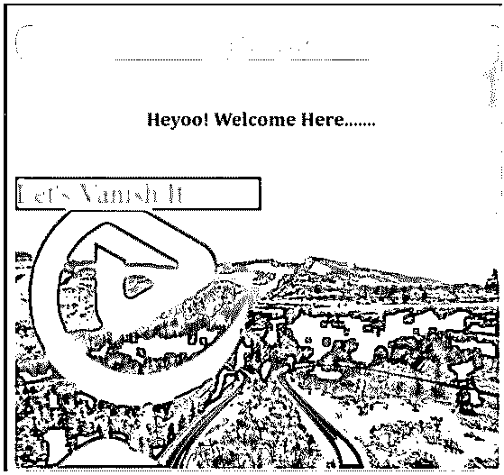

# 反应本机覆盖

> 原文：<https://www.educba.com/react-native-overlay/>

## React 本机覆盖介绍

在使用应用程序时，我们可能会面临各种各样的错误或 bug 或一些不便。这些错误或不便的原因应该进一步传达给用户。为了传达这些信息，使用了覆盖。一个视图或一个盒子，其中的一些内容浮在应用程序的内容之上，这被称为覆盖。叠加是通知用户或从用户处获取信息的最简单有效的方式之一。React Native 还提供了一个在应用程序中设置覆盖的选项。

**语法:**

<small>网页开发、编程语言、软件测试&其他</small>

`import Overlay from 'react-native-modal-overlay';
<Overlay>
…… props ……
</Overlay>`

### React 本机覆盖的示例

下面是提到的例子:

#### 示例#1

下面的代码执行中会出现一个覆盖窗口，当我们点击覆盖窗口之外的任何地方时，它就会消失。我们已经使用不同的样式组件对覆盖窗口进行了样式化。

**代码:**

**App.js**

`import React
, { Component} from 'react';
import Overlay from 'react-native-modal-overlay';
import {
SafeAreaView
, View
, Text
, ImageBackground
, StyleSheet
, Image
, Button
, Alert
} from 'react-native';
export default class EDUCBA extends Component {
onClose = () => this.setState(
{
modalVisible: false
});
state = {
modalVisible: true,
}
render() {
return (
<ImageBackground
source={{
uri:
'https://images.pexels.com/photos/1955134/pexels-photo-1955134.jpeg?auto=compress&cs=tinysrgb&dpr=1&w=500',
}}
style={{flex: 1}}
>
<View>
<Overlay
visible={this.state.modalVisible}
onClose={this.onClose}
closeOnTouchOutside
style={
{ fontSize: 36
, marginBottom: 48
, color: '#faf569'
, backgroundColor: '#54f0cb'
, alignItems: 'center'
, borderWidth: 10
, textAlign: 'center'
,  borderRadius: 100
, borderColor: '#d938f5'
, justifyContent: 'center'}
}>
<ImageBackground
source={{
uri:
'https://images.pexels.com/photos/1978126/pexels-photo-1978126.jpeg?auto=compress&cs=tinysrgb&dpr=2&h=650&w=940',
}}
style={{flex: 1}}
/>
<Image
source={{
uri:
'http://pngimg.com/uploads/lion_king/small/lion_king_PNG90.png',
}}
style={{
height: 150,
marginTop: 10,
width: 160,
}}
/>
<Text
style={
{ fontSize: 30
, marginBottom: 48
, color: '#faf569'
, backgroundColor: '#54f0cb'
, alignItems: 'center'
, borderWidth: 10
, textAlign: 'center'
,  borderRadius: 100
, borderColor: '#d938f5'
, justifyContent: 'center'}
}>
Welcome to Example of React Native Overlay
</Text>
</Overlay>
</View>
</ImageBackground>
);
}
}`

**输出:**

**关于代码执行:**

**在叠加窗口外点击:**

#### 实施例 2

下面还有一个覆盖窗口出现在代码执行上，当我们点击“让我们关闭 ITTT”时它消失了。我们已经使用不同的样式组件，包括图像、文本和图像背景，对覆盖窗口进行了样式化。

**代码:**

**App.js**

`import React
, { Component
, Fragment} from 'react';
import Overlay from 'react-native-modal-overlay';
import {
SafeAreaView
, View
, Text
, ImageBackground
, StyleSheet
, Image
, Button
, Alert
} from 'react-native';
export default class EDUCBA extends Component {
onClose = () => this.setState(
{
modalVisible: false
});
state = {
modalVisible: true,
}
render() {
return (
<ImageBackground
source={{
uri:
'https://images.pexels.com/photos/2437299/pexels-photo-2437299.jpeg?auto=compress&cs=tinysrgb&dpr=1&w=500',
}}
style={{flex: 1}}
>
<Image
source={{
uri:
'http://pngimg.com/uploads/lion_king/small/lion_king_PNG69.png',
}}
style={{
height: 150 ,
marginTop: 10 ,
width: 160 ,
}}
/>
<Image
source={{
uri:
'http://pngimg.com/uploads/lion_king/small/lion_king_PNG50.png',
}}
style={{
height: 150 ,
marginTop: 10 ,
width: 160 ,
}}
/>
<Image
source={{
uri:
'http://pngimg.com/uploads/lion_king/small/lion_king_PNG63.png',
}}
style={{
height: 150 ,
marginTop: 10 ,
width: 160 ,
}}
/>
<Image
source={{
uri:
'http://pngimg.com/uploads/lion_king/small/lion_king_PNG49.png',
}}
style={{
height: 150 ,
marginTop: 10 ,
width: 160 ,
}}
/>
<Image
source={{
uri:
'http://pngimg.com/uploads/lion_king/small/lion_king_PNG90.png',
}}
style={{
height: 150 ,
marginTop: 10 ,
width: 160 ,
}}
/>
<View>
<Overlay
visible={
this.state.modalVisible
}
onClose={
this.onClose
}
closeOnTouchOutside
animationType="zoomIn"
containerStyle={
{
backgroundColor: 'rgba(97, 18, 370, 0.58)'
}}
childrenWrapperStyle={
{
backgroundColor: '#f5f76a'
, borderRadius: 100
}}
animationDuration={500}>
{
(hideModal, overlayState) => (
<ImageBackground
source={{
uri:
'https://images.pexels.com/photos/1933239/pexels-photo-1933239.jpeg?auto=compress&cs=tinysrgb&dpr=1&w=500',
}}
style={{
height: 450
, marginTop: 10
, width: 260
,  borderRadius: 100
}}
>
<Image
source={{
uri:
'http://pngimg.com/uploads/lion_king/small/lion_king_PNG31.png',
}}
style={{
height: 150 ,
marginTop: 10 ,
width: 160 ,
}}
/>
<View>
<Fragment>
<Text
style={
{ fontSize: 30
, marginBottom: 48
, color: '#faf569'
, backgroundColor: '#54f0cb'
, alignItems: 'center'
, borderWidth: 10
, textAlign: 'center'
,  borderRadius: 100
, borderColor: '#d938f5'
, justifyContent: 'center'}
}
>Overlay in React Native Examplee</Text>
<Text
onPress={hideModal}
style={
{ fontSize: 20
, marginBottom: 48
, color: '#db1d4f'
, backgroundColor: '#cff768'
, alignItems: 'center'
, borderWidth: 10
, textAlign: 'center'
,  borderRadius: 100
, borderColor: '#273cdb'
, justifyContent: 'center'}
}>
Lets Shut ITTT</Text>
</Fragment>
</View>
</ImageBackground>
)
}
</Overlay>
</View>
</ImageBackground>
);
}
}`

**输出:**

**关于代码执行:**

**点击“让我们关上 ITTT”:**

#### 实施例 3

下面还有一个覆盖窗口，出现在代码执行窗口的右侧，当我们点击“让它消失”时，它就消失了。我们使用背景色作为样式组件来设计叠加窗口。

**代码:**

**index.js**

`import React from "react"; import ReactDOM from "react-dom";
import "./styles.css";
function Arrow(props) {
return (

);
}
class App extends React.Component {
state = {
overlayVisible: true ,
overlayID: null
};
clickHandle = e => {
e.preventDefault();
this.setState(
{
overlayVisible: !this.state.overlayVisible
});
this.setState(
{
overlayID: e.target.id
});
console.log(
e.target.id
);
};
render() {
return (

<h1 style={
{ fontSize: 30
, marginBottom: 48
, color: '#faf569'
, backgroundColor: '#54f0cb'
, alignItems: 'center'
, borderWidth: 10
, textAlign: 'center'
,  borderRadius: 100
, borderColor: '#d938f5'
, justifyContent: 'center'}
}
>EDUCBA
</h1>
<h2 style={
{ fontSize: 20
, marginBottom: 48
, color: '#db1d4f'
, backgroundColor: '#cff768'
, alignItems: 'center'
, borderWidth: 10
, textAlign: 'center'
,  borderRadius: 100
, borderColor: '#273cdb'
, justifyContent: 'center'}
}
>Heyoo! Welcome Here.......</h2>

{}
<Arrow onClick={this.clickHandle} />
{this.state.overlayVisible && (

{
this.state.overlayID
}

)}

);
}
}
const rootElement = document.getElementById(
"root"
);
ReactDOM.render(
<App />
, rootElement);`

**输出:**

**关于代码执行:**

**点击“让它消失吧”:**

### 结论

这些例子将有助于理解根据不同情况实施叠加。这篇文章将帮助读者为他们自己的应用程序创建覆盖图，并使它们对用户更具交互性。

### 推荐文章

这是一个反应原生叠加的指南。这里我们分别讨论 react native overlay 的介绍和例子。您也可以看看以下文章，了解更多信息–

1.  [反应原生 SVG](https://www.educba.com/react-native-svg/)
2.  [反应原生模态](https://www.educba.com/react-native-modal/)
3.  [反应原生标签栏](https://www.educba.com/react-native-tab-bar/)
4.  [反应原生形态](https://www.educba.com/react-native-form/)

