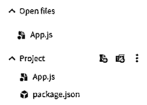
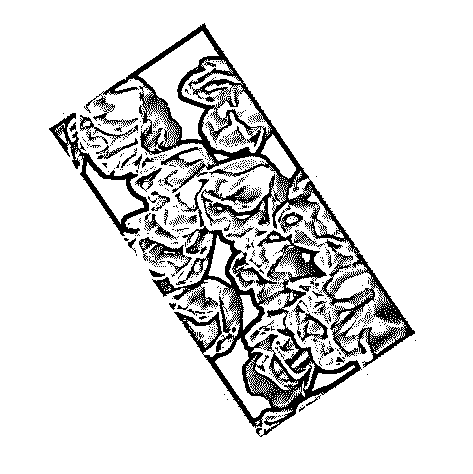
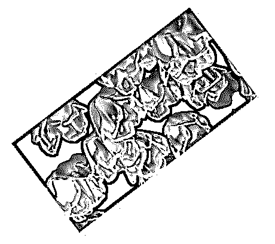
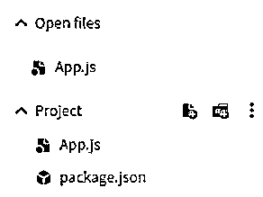
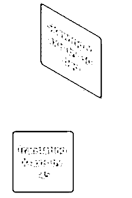
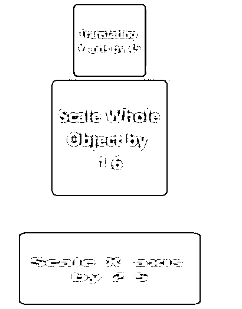
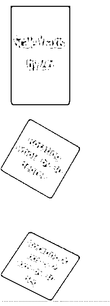
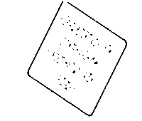
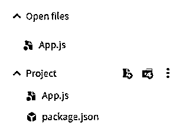

# 反应本机转换

> 原文：<https://www.educba.com/react-native-transform/>

## React 本机转换简介

下面的文章提供了 React 本机转换的概要。变换用于增强和改变组件的外观和位置。转换是用于在二维或三维中设计样式和执行转换的属性。重叠是转换中的一个关注点，因为在对组件应用转换后，布局保持不变，这有时会导致转换后的组件与相邻组件重叠。可以在变换后的组件或相邻组件上应用边距和填充，这样我们可以防止重叠。

**使用 React 本机转换的语法:**

<small>网页开发、编程语言、软件测试&其他</small>

`transform([{ rotateX: '60deg' }, { rotateZ: '1.0472rad' }]);`

或者

`transform([{ skewX: '45deg' }]);`

### 使用 React 本机转换

Transform 将转换对象保存为一个数组，每个对象代表一个要转换为键的属性以及将用于转换的值。这些对象不能组合在一起，每个对象都应该有自己的一对键或值。

例如，如果我们使用旋转变换。旋转变换需要以度数或弧度提供变换。

`transform([{ rotateX: '60deg' }, { rotateZ: '1.0472rad' }])`

就像旋转一样，倾斜变换也要求以度为单位进行变换。

`transform([{ skewX: '60deg' }])`

### React 本机转换的示例

下面是提到的例子:

#### 示例#1

使用动画旋转 Imageview。

在下面的例子中，我们使用了 transform 在 360 度和 0 度的输出范围内旋转图像。

**代码:**

`transform: [{ rotate: RotateData }],`

图像的整个旋转以动画的形式显示。

用于实现以下代码的文件是:

**App.js**

**代码:**

`import React from 'react';
import { StyleSheet
, View
, Animated
, Image
, Easing } from 'react-native';
export default class App extends React.Component {
constructor() {
super();
this.RotateValueHolder = new Animated.Value(0);
}
componentDidMount() {
this.StartImageRotateFunction();
}
StartImageRotateFunction() {
this.RotateValueHolder.setValue(0);
Animated.timing(this.RotateValueHolder, {
toValue: 1,
duration: 4000,
easing: Easing.linear,
}).start(() => this.StartImageRotateFunction());
}
render() {
const RotateData = this.RotateValueHolder.interpolate({
inputRange: [0, 1],
outputRange: ['360deg', '0deg'],
});
return (
<View style={styles.container}>
<Animated.Image
style={{
width: 300,
height: 150,
transform: [{ rotate: RotateData }],
}}
source={{
uri:
'https://images.pexels.com/photos/2480075/pexels-photo-2480075.jpeg?auto=compress&cs=tinysrgb&dpr=2&h=650&w=940',
}}
/>
</View>
);
}
}
const styles = StyleSheet.create({
container: {
flex: 1,
justifyContent: 'center',
alignItems: 'center',
backgroundColor: '#ffea73',
},
});`

**输出:**

#### 实施例 2

不同转换方法的示例。

在下面的例子中，我们用不同的转换方法显示了输出。

**代码:**

`transform: [
{ skewX: "35deg" },
{ skewY: "35deg" }
]`

和

`transform: [{ translateX: -45 }]`

和

`transform: [{ scale: 1.6 }]`

和

`transform: [{ rotate: "30deg" }]`

用于实现以下代码的文件是:

**App.js**

**代码:**

`import React
, { Component } from "react";
import { SafeAreaView
, ScrollView
, StyleSheet
, Text
, View } from "react-native";
class App extends Component {
render() {
return (
<SafeAreaView style={styles.container}>
<ScrollView
contentContainerStyle={styles.scrollContentContainer}
>
<View style={styles.box}>
<Text style={styles.text}>Object before Transforming</Text>
</View>
<View style={[styles.box, {
transform: [
{ skewX: "35deg" },
{ skewY: "35deg" }
] }]}>
<Text style={styles.text}>Skewing X-axis & Y-axis by 35 deg</Text>
</View>
<View style={[styles.box, {
transform: [{ skewX: "30deg" }] }]}>
<Text style={styles.text}>Skewing X-axis by 30 deg</Text>
</View>
<View style={[styles.box, {
transform: [{ skewY: "30deg" }] }]}>
<Text style={styles.text}>Skewing Y-axis by 30 deg</Text>
</View>
<View style={[styles.box, {
transform: [{ translateX: -45 }] }]}>
<Text style={styles.text}>Translating X-axis by -45</Text>
</View>
<View style={[styles.box, {
transform: [{ translateY: 45 }] }]}>
<Text style={styles.text}>Translating Y-axis by 45</Text>
</View>
<View style={[styles.box, {
transform: [{ scale: 1.6 }] }]}>
<Text style={styles.text}>Scale Whole Object by 1.6</Text>
</View>
<View style={[styles.box, {
transform: [{ scaleX: 2.5 }] }]}>
<Text style={styles.text}>Scale X-axis by 2.5</Text>
</View>
<View style={[styles.box, {
transform: [{ scaleY: 1.8 }] }]}>
<Text style={styles.text}>Scale Y-axis by 2.5</Text>
</View>
<View style={[styles.box, {
transform: [{ rotate: "30deg" }] }]}>
<Text style={styles.text}>Rotating whole by 30 degree</Text>
</View>
<View style={[styles.box, {
transform: [
{ rotateX: "30deg" },
{ rotateZ: "30deg" }
] }]}>
<Text style={styles.text}>Rotating X-axis & Z-axis by 30 deg</Text>
</View>
<View style={[styles.box, {
transform: [
{ rotateY: "30deg" },
{ rotateZ: "30deg" }
] }]}>
<Text style={styles.text}>Rotating Y-axis & Z-axis by 30 deg</Text>
</View>
</ScrollView>
</SafeAreaView>
);
}
}
const styles = StyleSheet.create({
container: {
flex: 1
},
scrollContentContainer: {
alignItems: "center",
paddingBottom: 55
},
box: {
height: 99,
width: 99,
borderRadius: 5,
marginVertical: 39,
backgroundColor: "#e675f0",
alignItems: "center",
justifyContent: "center"
},
text: {
fontSize: 15,
fontWeight: "bold",
margin: 6,
color: "#fffa5e",
textAlign: "center"
}
});
export default App;`

**输出:**

#### 实施例 3

不同图像视图中不同角度变换的示例。

在下面的例子中，我们使用了 transform 来旋转两幅图像，一幅顺时针旋转，另一幅逆时针旋转，输出范围分别从 0 度到 360 度和 360 度到 0 度。

**代码:**

`transform: [{ rotate: RotateData }],`

用于实现以下代码的文件是:

**App.js**

**代码:**

`import React from 'react';
import { StyleSheet
, View
, Animated
, Image
, Easing } from 'react-native';
export default class App extends React.Component {
constructor() {
super();
this.RotateValueHolder = new Animated.Value(0);
}
componentDidMount() {
this.StartImageRotateFunction();
}
StartImageRotateFunction() {
this.RotateValueHolder.setValue(0);
Animated.timing(this.RotateValueHolder, {
toValue: 1,
duration: 4000,
easing: Easing.linear,
}).start(() => this.StartImageRotateFunction());
}
render() {
const RotateData = this.RotateValueHolder.interpolate({
inputRange: [0, 1],
outputRange: ['0deg', '360deg'],
});
const RotateData1 = this.RotateValueHolder.interpolate({
inputRange: [0, 1],
outputRange: ['360deg', '0deg'],
});
return (
<View style={styles.container}>
<Animated.Image
style={{
width: 200,
height: 100,
transform: [{ rotate: RotateData }],
}}
source={{
uri:
'https://images.pexels.com/photos/1133957/pexels-photo-1133957.jpeg?auto=compress&cs=tinysrgb&dpr=2&h=650&w=940',
}}
/>
<View style={styles.container}>
<Animated.Image
style={{
width: 200,
height: 100,
transform: [{ rotate: RotateData1 }],
}}
source={{
uri:
'https://images.pexels.com/photos/593655/pexels-photo-593655.jpeg?auto=compress&cs=tinysrgb&dpr=1&w=500',
}}
/>
</View>
</View>
);
}
}
const styles = StyleSheet.create({
container: {
flex: 1,
justifyContent: 'center',
alignItems: 'center',
backgroundColor: '#f78f65',
},
});`

**输出:**

### 结论

在上述文章的基础上，我们看到了 React Native Transform 的概念，以及它如何帮助我们转换所使用的组件并使我们的应用程序看起来更好。我们经历了 React Native Transform 的工作，示例帮助我们了解如何根据需求使用它。

### 推荐文章

这是一个反应原生转换的指南。在这里，我们讨论 React 原生转换的介绍，并分别使用示例。您也可以看看以下文章，了解更多信息–

1.  [反应原生模态](https://www.educba.com/react-native-modal/)
2.  [React 本地认证](https://www.educba.com/react-native-authentication/)
3.  [React 组件库](https://www.educba.com/react-component-library/)
4.  [反应自然取向](https://www.educba.com/react-native-orientation/)

