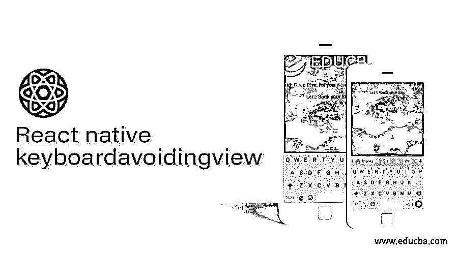
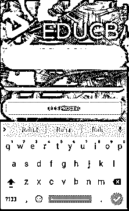
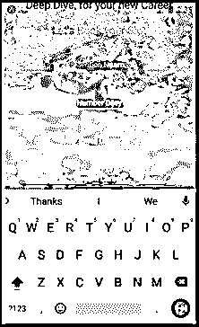

# React 本机键盘避免视图

> 原文：<https://www.educba.com/react-native-keyboardavoidingview/>

## React 本机键盘简介避免视图

键盘是智能手机的重要组成部分。各种应用程序需要用户填写一些文本或信息，为此屏幕上会自动出现一个键盘。键盘回避视图通常用于关闭键盘。它用于包装我们通过文本输入制作的完整表单，并在文本输入框外触摸时关闭键盘。键盘回避视图对 iOS 非常有用，因为它有一个关闭键盘的后退按钮。默认情况下，该特性可用于 React 原生文本输入。当使用请求焦点键盘时，需要使用回避视图。本文通过不同的例子解释了键盘避视的概念。在这个主题中，我们将学习 React 本机键盘回避视图。

**Keyboardavoidingview 语法**

<small>网页开发、编程语言、软件测试&其他</small>

以下语法显示了在基于 React 本机的应用程序中导入 keyboardAvoidingView 的语法，并重点介绍了在基于 React 本机的应用程序中 keyboardAvoidingView 的用法。

`import { View
, KeyboardAvoidingView
, Image
, TextInput
, StyleSheet
, Text
, ImageBackground
, Platform
, TouchableWithoutFeedback
, Button
, Keyboard  } from 'react-native';
<KeyboardAvoidingView>
// style according to your requirement
</KeyboardAvoidingView>`

### React 本机键盘避免视图示例

React Native 中的 Keyboardavoidingview 用法举例说明:

#### 示例#1

下面，我们在基于 React Native 的应用程序中开发了一个页面，该页面使用不同的 React Native 组件进行样式化，包括样式表、图像、文本、图像背景和按钮。我们还从 react-native 导入了 keyboard 和 keyboardAvoidView 组件。当我们点击绿线上方的数据输入，键盘出现让用户输入数据的最佳用户体验。

**[I]app . js—**

`import React from 'react';
import { View
, KeyboardAvoidingView
, Image
, TextInput
, StyleSheet
, Text
, ImageBackground
, Platform
, TouchableWithoutFeedback
, Button
, Keyboard  } from 'react-native';
const styles = StyleSheet.create({
docker: {
flex: 1,
alignItems: 'center'
},
inside: {
padding: 24,
flex: 1,
justifyContent: "space-around"
},
input: {
height: 40,
borderColor: "#bbed64",
color: '#e32480',
textShadowColor : '#79edd0',
borderBottomWidth: 10,
marginBottom: 36,
borderRadius: 100/2
},
});
const keyboardavoidingviewexample = () => {
return (
<ImageBackground
source={{
uri:
'https://images.pexels.com/photos/1862695/pexels-photo-1862695.jpeg?auto=compress&cs=tinysrgb&dpr=1&w=500',
}}
style={{flex: 1}}
>
<KeyboardAvoidingView
behavior={Platform.OS === "ios"
? "padding"
: "height"}
style={styles.docker}
>
<TouchableWithoutFeedback onPress={Keyboard.dismiss}>
<View style={
styles.inside
}>
<Image
source={{
uri:
'https://cdn.educba.com/academy/wp-content/uploads/2020/05/cropped-website_logo_transparent_background_white.png',
}}
style={{
height: 130,
marginTop: 10,
width: 350,
}}
/>
<Text style={
{ fontSize: 36
, marginBottom: 48
, color: '#faf569'
, backgroundColor: '#54f0cb'
, alignItems: 'center'
, borderWidth: 10
, textAlign: 'center'
,  borderRadius: 100
, borderColor: '#d938f5'
, justifyContent: 'center'}
}>EDUCBA
</Text>
<TextInput
placeholder="Yourentry"
style={
styles.input
} />
<View
style={{
backgroundColor: "#d83ef0",
marginTop: 12,
color: '#f2bf7c',
borderWidth: 10,
borderRadius: 100,
borderColor: '#f0294d'
}}>
<Button
title=
"Let's Proceed"
onPress={() => null} />
</View>
</View>
</TouchableWithoutFeedback>
</KeyboardAvoidingView>
</ImageBackground>
);
};
export default keyboardavoidingviewexample;`

**输出:**

*   **关于代码执行—**

*   **在绿线上方输入您的条目时—**

#### 实施例 2

下面，我们在基于 React Native 的应用程序中开发了一个页面，它使用不同的 React Native 组件进行样式化，包括样式表、图像、文本、图像背景、scrollview、touchableopacity 和按钮。我们还从 react-native 导入了 keyboard 和 keyboardAvoidView 组件。当我们点击“提及 Naam”进行数据输入时，句子键盘出现，让用户以最佳的用户体验输入数据。当我们点击“数字键盘”进行数据输入时，数字键盘出现，让用户以最佳的用户体验输入数据。同样，点击“电子邮件 Dijey”和“梦想职业”文本时，分别出现不同的键盘。

**【我】App.js**

`import React
, {useState
, createRef} from 'react';
import {
SafeAreaView
, StyleSheet
, ImageBackground
, TextInput
, View
, Image
, Button
, Text
, KeyboardAvoidingView
, Keyboard
, TouchableOpacity
, Dimensions
, ScrollView
} from 'react-native';
const styles = StyleSheet.create({
container: {
flex: 1,
backgroundColor: 'white',
},
textInputStyle: {
flexDirection: 'row',
height: 40,
marginTop: 20,
marginLeft: 35,
marginRight: 35,
margin: 10,
},
});
const App = () => {
const userRegisterFunction = () => {
alert('User Registered');
};
const [naam
, setUserNaam] = useState('');
const [Email
, setUserEmail] = useState('');
const [number
, setUserNumber] = useState('');
const [career
, setUsercareer] = useState('');
return (
<SafeAreaView style={styles.container}>
<ScrollView keyboardShouldPersistTaps="handled">
<View style={styles.container}>
<View>
<ImageBackground
source={{
uri:
'https://images.pexels.com/photos/4784955/pexels-photo-4784955.jpeg?auto=compress&cs=tinysrgb&dpr=1&w=500',
}}
style={{flex: 1}}
>
<Image
source={{
uri:
'https://cdn.educba.com/academy/wp-content/uploads/2020/05/cropped-website_logo_transparent_background_white.png',
}}
style={{
height: 130,
marginTop: 10,
width: 350,
}}
/>
<Text style={{fontSize: 20,
textAlign: 'center',
margin: 10,}}>
Deep Dive, for your new Career
</Text>
<Text style={{fontSize: 20,
textAlign: 'center',
margin: 10,
color: '#9c062c',}}>
Let's Book your Slot
</Text>
<KeyboardAvoidingView enabled>
<View style={styles.textInputStyle}>
<TextInput
style={
{flex: 1
, color: '#1218db'}
}
onChangeText={
(naam) => setUserNaam(naam)
}
underlineColorAndroid="#e016b1"
textAlign= 'center'
placeholder="Mention Naam"
placeholderTextColor="#fafaff"
autoCapitalize="sentences"
ref={naamInputRef}
returnKeyType="next"
onSubmitEditing={() =>
EmailInputRef.current &&
EmailInputRef.current.focus()
}
blurOnSubmit={false}
/>
</View>
<View style={styles.textInputStyle}>
<TextInput
style={
{flex: 1
, color: '#1218db'}
}
onChangeText={
(number) => setUserNumber(number)
}
underlineColorAndroid="#4cfcee"
textAlign= 'center'
placeholder="Number Dijey"
placeholderTextColor="#fafaff"
autoCapitalize="sentences"
keyboardType="numeric"
ref={numberInputRef}
onSubmitEditing={() =>
careerInputRef.current &&
careerInputRef.current.focus()
}
blurOnSubmit={false}
/>
</View>
<View style={styles.textInputStyle}>
<TextInput
style={
{
flex: 1
, color: '#1218db'
}
}
onChangeText={
(Email) => setUserEmail(Email)
}
underlineColorAndroid="#fbff17"
textAlign= 'center'
placeholder="Email Dijeye"
placeholderTextColor="#fafaff"
autoCapitalize="sentences"
keyboardType="email-address"
ref={EmailInputRef}
returnKeyType="next"
onSubmitEditing={() =>
numberInputRef.current &&
numberInputRef.current.focus()
}
blurOnSubmit={false}
/>
</View>
<View style={styles.textInputStyle}>
<TextInput
style={
{flex: 1
, color: '#1218db'}
}
onChangeText={
(career) => setUsercareer(career)
}
underlineColorAndroid="#1326f2"
borderColor= '#222dbf'
textAlign= 'center'
placeholder="Dream Career"
placeholderTextColor="#fafaff"
autoCapitalize="sentences"
ref={careerInputRef}
returnKeyType="next"
onSubmitEditing={Keyboard.dismiss}
blurOnSubmit={false}
/>
</View>
<TouchableOpacity
style={{
backgroundColor: '#bbf765',
borderWidth: 5,
color: '#FFFFFF',
borderColor: '#222dbf',
height: 40,
alignItems: 'center',
borderRadius: 50,
marginLeft: 35,
marginRight: 35,
marginTop: 30,
}}
activeOpacity={0.5}
onPress={userRegisterFunction}>
<Text style={
{color: '#0d0c0d',
paddingVertical: 10,
backgroundColor: '#f0a356',
fontSize: 16,}}>
ENTER DREAM CAREER
</Text>
</TouchableOpacity>
</KeyboardAvoidingView>
</ImageBackground>
</View>
</View>
</ScrollView>
</SafeAreaView>
);
const naamInputRef = createRef();
const EmailInputRef = createRef();
const numberInputRef = createRef();
const careerInputRef = createRef();
};
export default App;`

**输出:**

*   **关于代码执行—**

*   **点击填写“提 Naam”——**

*   **点击填写“数字 Dijey”——**

*   **点击“电子邮件 Dijey”——**

*   **点击填写“梦想职业”——**

### 结论

基于上面的文章，我们理解了 React Native 中键盘避免视图的概念。这篇文章解释了键盘避免视图实现的多个例子。这篇文章将帮助初涉网络的开发者理解键盘回避视图。

### 推荐文章

这是一个反应原生键盘避免视图的指南。这里我们用多个例子来讨论 React Native 中键盘避免视图的概念。您也可以看看以下文章，了解更多信息–

1.  [反应原生模态](https://www.educba.com/react-native-modal/)
2.  [反应本色](https://www.educba.com/react-native-color/)
3.  [React 本地认证](https://www.educba.com/react-native-authentication/)
4.  [MobX 反应原生](https://www.educba.com/mobx-react-native/)

