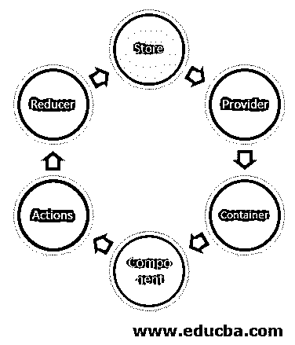
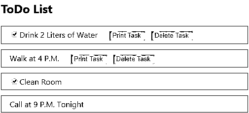

# React Redux 连接

> 原文：<https://www.educba.com/react-redux-connect/>

## React-Redux Connect 简介

Redux 是最好的状态管理工具之一，只要任务是构建一个可伸缩的应用程序。最初，工作起来很复杂，但是 Redux 作为开发者的救星，提供了良好的代码库。使用 Redux 的主要挑战是将组件连接到 Redux 存储和动作。大多数情况下，每个人都将所有 Redux 绑定保存在一个地方；很快，这在复杂的组件层次结构中变得更加典型。

### React Redux Connect 是怎么做的举例？

<small>网页开发、编程语言、软件测试&其他</small>

上图向我们展示了基于 react 的应用程序是如何工作的。

让我们借助一些例子来看看。

#### 1.src 文件夹中的组件-

*   组件列表待办事项文件夹
*   App.css
*   App.js
*   应用测试网站
*   ComponentPageView.js
*   工人服务
*   action.js
*   index.css
*   索引. js
*   reducingreducers.js
*   storingstore.js

#### 2.ComponentListTodo 文件夹中的组件-

a) ComponentButton.js

`import React, { Component } from 'react';
import { connect } from 'react-redux'
class ComponentButton extends Component {
render() {
const { itemId, deleteItem, printItem } = this.props;
return (

<button onClick={() => printItem(itemId)} className="btn btn-print">Print Task</button>
<button onClick={() => deleteItem(itemId)} className="btn btn-del">Delete Task</button>

)
}
}
export default ComponentButton;`

b) ComponentCheck.js

`import React from 'react';
export default function ComponentCheck({itemId, itemText, isChecked, toggleItem}){
return (

<input
type="checkbox"
onChange={() => toggleItem(itemId)} checked={isChecked}
/>
{itemText}

)}`

c) ComponentItemToDo.js

`import React, { Component } from 'react';
import { connect } from 'react-redux'
import ComponentText from "./ComponentText";
import ComponentCheck from './ComponentCheck';
import { deleteItem, printItem, togglCheck } from '../action';
import ComponentButton from './ComponentButton';
class ComponentItemTodo extends Component{
render(){
const  { itemId, item, togglCheck, deleteItem, printItem } = this.props;
return (

{ item.isCheckItem ? (
<ComponentCheck itemId={itemId} itemText={item.label} isChecked={item.isChecked} toggleItem={togglCheck}
/>
) : (
<ComponentText itemId={itemId} itemText={item.label}
/>
)}
{
item.hasActions && (
<ComponentButton itemId={itemId} printItem={printItem} deleteItem={deleteItem}
/>
)
}

)
}
}
const DispatchmapToProps = { deleteItem, printItem, togglCheck };
export default connect(null, DispatchmapToProps)(ComponentItemTodo);`

**d) ComponentText.js**

`import React from 'react';
export default function ComponentText({ itemId, itemText }){ return (

{itemText}

)}`

**e) index.js**

`import React, { Component } from 'react';
import { connect } from 'react-redux'
import ComponentItemToDo from './ComponentItemToDo';
class ComponentListTodo extends Component{ render(){
const { items } = this.props;
return (

<h2>ToDo List</h2>
{items.map((item, idx) => (
<ComponentItemToDo item={item} itemId={idx} key={idx}
/>
))}

)
}
}
function StatemapToProps(state) { return {
items: state.tasks
}
}
export default connect(StatemapToProps, null)(ComponentListTodo);`

#### 3.App.css

`.App {
text-align: center;
}
.App-logo {
animation: App-logo-spin infinite 20s linear; height: 40vmin;
pointer-events: none;
}
.App-header {
background-color: #53cfa5;
min-height: 100vh;
display: flex;
flex-direction: column;
align-items: center;
justify-content: center;
font-size: calc(10px + 2vmin);
color: #8c9c96;
}
.App-link {
color: #61dafb;
}
@keyframes App-logo-spin {
from {
transform: rotate(0deg);
}
to {
transform: rotate(360deg);
}
}`

#### 4.App.js

`import React from 'react';
import { Provider } from 'react-redux'
import stores from './storingstore';
import ComponentPageView from './ComponentPageView';
function Application() { return (
<Provider store={stores}>
<ComponentPageView />
</Provider>
);
}
export default Application`

#### 5.应用测试网站

从“React”导入 React；

`import ReactDOM from "react-dom";
import Application from "./App";
it("crashes without renders", () => {
const div = document.createElement("div");
ReactDOM.render(<Application />, div);
ReactDOM.unmountComponentAtNode(div);
});`

#### 6.ComponentPageView.js

`import React, { Component } from "react";
import ComponentListTodo from "./ComponentListTodo";
export default class ComponentPageView extends Component {
render() {
return <ComponentListTodo />;
}
}`

#### 7.工人服务

`const isLocalhost = Boolean( window.location.hostname === "localhost" ||
window.location.hostname === "[::1]" ||
window.location.hostname.match(
/^127(?:\.(?:25[0-5]|2[0-4][0-9]|[01]?[0-9][0-9]?)){3}$/
)
);
export function register(config) {
if (process.env.NODE_ENV === "production" && "Workerservice" in navigator) {
const publicUrl = new URL(process.env.PUBLIC_URL, window.location.href);
if (publicUrl.origin !== window.location.origin) {
return;
}
window.addEventListener("load", () => {
const swUrl = `${process.env.PUBLIC_URL}/worker-service.js`;
if (isLocalhost) {
checkValidServiceWorker(swUrl, config);
navigator.serviceWorker.ready.then(() => { console.log("."
);
});
} else {
registerValidSW(swUrl, config);
}
});
}
}
function registerValidSW(swUrl, config) {
navigator.serviceWorker
.register(swUrl)
.then(registration => {
registration.onupdatefound = () => {
const installingWorker = registration.installing;
if (installingWorker == null) {
return;
}
installingWorker.onstatechange = () => {
if (installingWorker.state === "installed") {
if (navigator.serviceWorker.controller) {
console.log( "." );
if (config && config.onUpdate) {
config.onUpdate(registration);
}
} else {
console.log("Cache Content for offline use.");
if (config && config.onSuccess) {
config.onSuccess(registration);
}
}
}
};
};
})
.catch(error => {
console.error("Error while service worker registration:", error);
});
}
function checkValidServiceWorker(swUrl, config) {
fetch(swUrl)
.then(response => {
const contentType = response.headers.get("content-type");
if (
response.status === 404 ||
(contentType != null && contentType.indexOf("javascript") === -1)
) {
navigator.serviceWorker.ready.then(registration => {
registration.unregister().then(() => {
window.location.reload();
});
});
} else {
registerValidSW(swUrl, config);
}
})
.catch(() => {
console.log("Application in Offline Mode because No internet connection discovered.");
});
}
export function unregister() {
if ("Workerservice" in navigator) {
navigator.serviceWorker.ready.then(registration => {
registration.unregister();
});
}
}`

#### 8.action.js

`export const DELETE_ITEM = "DELETE_ITEM";
export const PRINT_ITEM = "PRINT_ITEM";
export const TOGGLE_CHECK = "TOGGLE_CHECK";
export function deleteItem(itemIndex) {
return {
type: DELETE_ITEM,
itemIndex
};
}
export function printItem(itemIndex) {
return {
type: PRINT_ITEM, itemIndex
};
}
export function togglCheck(itemIndex) {
return {
type: TOGGLE_CHECK,
itemIndex
};
}`

#### 9.index.css

`body {
margin: 0;
font-family:  BlinkMacSystemFont,-apple-system, "Helvetica Neue", "Droid Sans", "Fira Sans", "Cantarell","Ubuntu", "Oxygen", "Roboto", "Segoe UI",
sans-serif;
-webkit-font-smoothing: antialiased;
-moz-osx-font-smoothing: grayscale;
}
code {
font-family: "Courier New", Consolas, Monaco, Menlo, source-code-pro, monospace;
}
.todo-list{
width: 501px;
margin-left: auto;
margin-right: auto;
margin-top: 41px;
background-color: #ffa8c5;
}
.list-item{
border: 1px solid #3c403e;
padding: 6px;
margin-top: 11px;
}
.list-item .list-item-text{
display: inline-block;
margin-left: 11px;
background-color: #bbf582;
}
.list-item .list-item-text{
display: inline-block;
margin-left: 11px;
}
.list-item .list-item-button{
display: inline-block;
margin-left: 11px;
}
.list-item .list-item-button button{
margin-left: 11px;
background-color: #7eb7ed;
}`

#### 10.索引. js

`import React from "react";
import ReactDOM from "react-dom";
import "./index.css";
import Application from "./App";
import * as Workerservice from "./Workerservice";
ReactDOM.render(<Application />, document.getElementById("root"));
Workerservice.unregister()`

#### 11.reducingreducers.js

`import { DELETE_ITEM, PRINT_ITEM, TOGGLE_CHECK } from './action';
const initialState = {
tasks: [
{
label: "Drink 2 Liters of Water",
isCheckItem: true,
hasActions: true,
isChecked: true
},
{
label: "Walk at 4 P.M.",
isCheckItem: false,
hasActions: true,
isChecked: false
},
{
label: "Clean Room",
isCheckItem: true,
hasActions: false,
isChecked: true
},
{
label: "Call at 9 P.M. Tonight",
isCheckItem: false,
hasActions: false,
isChecked: false
}
] }
export default function todoReducer(state, action) {
if (typeof state === 'undefined') {
return initialState
}
switch(action.type){
case DELETE_ITEM:
console.log("deleting");
break;
case PRINT_ITEM:
console.log("printing");
break;
case TOGGLE_CHECK:
state = {
...state,
tasks: state.tasks.map(
(task, i) => i === action.itemIndex ?
{...task, isChecked: !task.isChecked}
: task
)
}
}
return state
}`

#### 12.storingstore.js

`import { createStore } from "redux";
import todoReducer from "./reducingreducers";
export default createStore(todoReducer)`

**输出:**

### 结论

在以上讨论的基础上，我们明确了在一个应用程序中使 React Redux 连接的部分。我们用 Redux Connect 成功地创建了一个待办事项 React 应用程序。

### 推荐文章

这是 React Redux Connect 的指南。在这里，我们将通过图表和相应的例子来讨论它是如何工作的。您也可以阅读以下文章，了解更多信息——

1.  [反应构造器](https://www.educba.com/react-constructor/)
2.  [React 原生图表](https://www.educba.com/react-native-charts/)
3.  [React-原生边框样式](https://www.educba.com/react-native-border-style/)
4.  [反应原生动画](https://www.educba.com/react-native-animation/)

