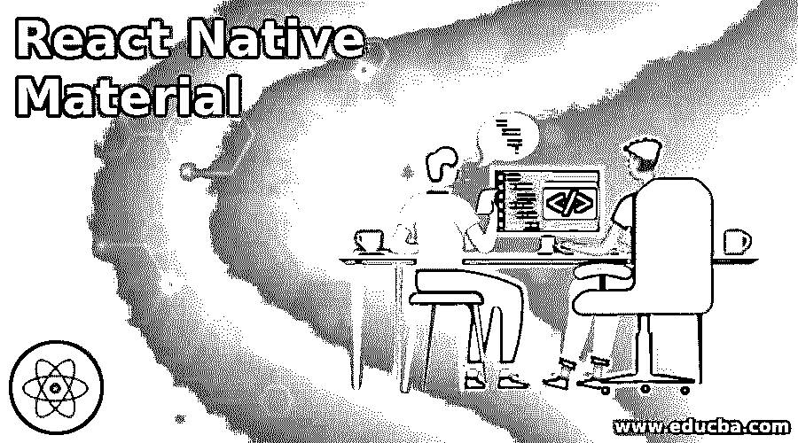
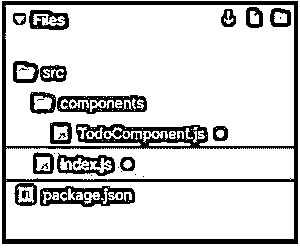
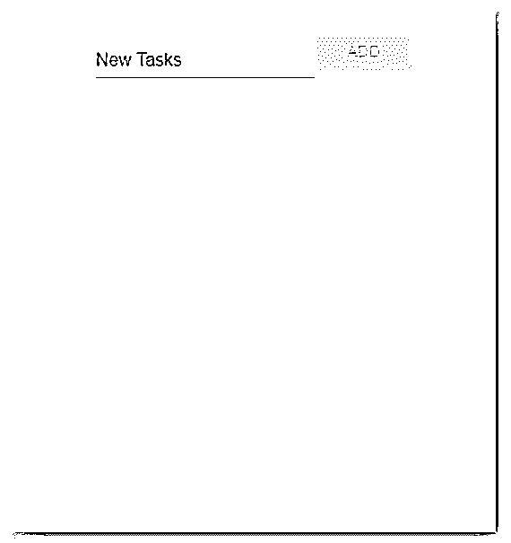
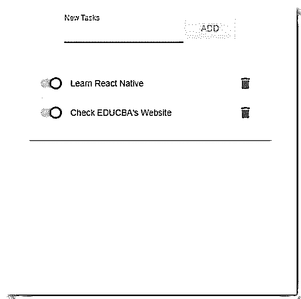
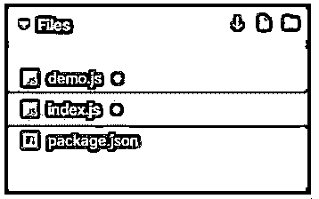
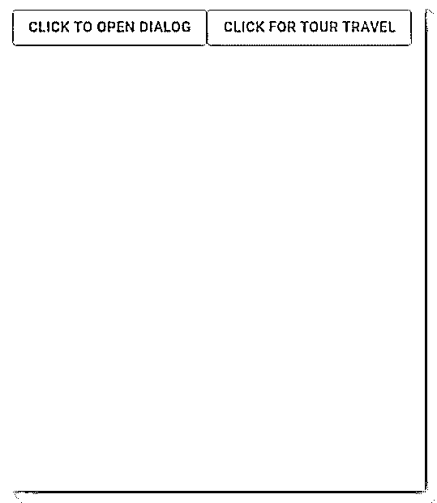
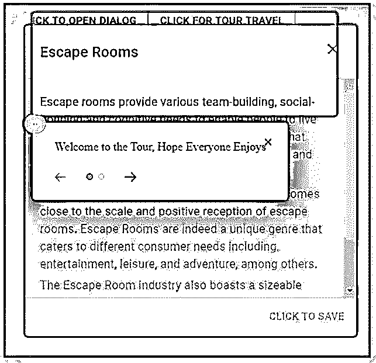
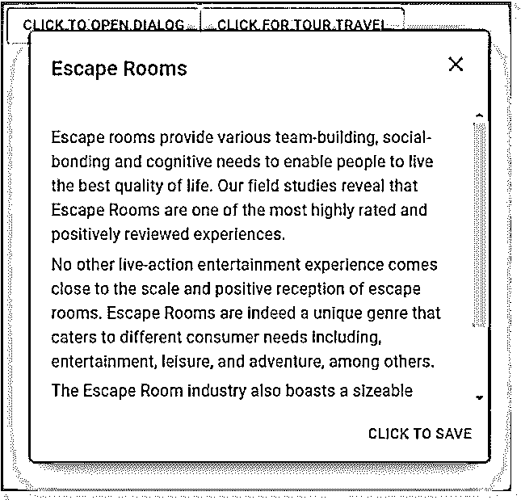

# 与天然材料反应

> 原文：<https://www.educba.com/react-native-material/>

## 介绍如何反应天然材料

以下文章提供了 React Native Material 的概要。五年前，React Native 的工作相当乏味。过去缺少库或用户界面工具包来创建类似本机的用户界面元素，但现在情况不同了。现在，React Native 是开发人员中的最新趋势。有一个这样的库可以帮助创建一些令人兴奋的 UI 元素，这些元素可以作为应用程序的吸引点。材料用户界面库帮助我们创建了令人敬畏的材料底部导航，一切都在 JavaScript 中。它不需要本机依赖，非常容易使用，应用程序看起来很棒。

### 用反应原生材料举例

下面列举了一些例子:

<small>网页开发、编程语言、软件测试&其他</small>

#### 示例 1

基于待办事项 App。

src 文件夹中的组件:

*   组件文件夹
*   索引. js

组件文件夹中的组件:

*   TodoComponent.js

用于实现以下示例的文件是:

形容词（adjective 的缩写）TodoComponent.js

**代码:**

`import React from "react";
import TextField from "material-ui/TextField";
import Button from "material-ui/Button";
import IconButton from "material-ui/IconButton";
import Card from "material-ui/Card";
import Divider from "material-ui/Divider";
import Switch from "material-ui/Switch";
import DeleteIcon from "material-ui-icons/Delete";
import Tooltip from "material-ui/Tooltip";
import { FormGroup, FormControlLabel } from "material-ui/Form";
const styles = {
done: {
textDecoration: "line-through",
opacity: ".25",
display: "flex",
width: "99%"
},
header: {
justifyContent: "center",
display: "flex",
flexDirection: "row",
alignItems: "center"
},
main: {
width: "101%",
maxWidth: "401px",
margin: "21px auto"
},
card: {
padding: "21px",
margin: "21px 0"
},
todo: {
position: "relative",
display: "flex",
flexFow: "row",
alignContent: "space-between"
},
label: {
display: "flex",
width: "101%"
},
divider: {
position: "absolute",
width: "101%",
top: 0
}
};
class TodoComponent extends React.Component {
state = {
tasks: [],
newTask: ""
};
onTextUpdate = e => {
this.setState({ newTask: e.target.value });
};
addTask = () => {
let { tasks, newTask } = this.state;
tasks.push({ text: newTask, done: false });
this.setState({ tasks: tasks, newTask: "" });
};
deleteTask = task => {
let { tasks } = this.state;
tasks.splice(tasks.indexOf(task), 1);
this.setState({ tasks: tasks, newTask: "" });
};
toggle = task => {
let { tasks } = this.state;
tasks[tasks.indexOf(task)].done = !tasks[tasks.indexOf(task)].done;
this.setState({ tasks: tasks, newTask: "" });
};
render() {
const { tasks, newTask } = this.state;
return (

<TextField
label="New Tasks"
value={newTask}
onChange={this.onTextUpdate}
/>
<Button
variant="raised"
color="secondary"
disabled={!newTask}
onClick={this.addTask}
>
Add
</Button>

{tasks.length > 0 && (
<Card style={styles.card}>
<FormGroup>
{tasks.map((task, index) => (

{index > 0 ? <Divider style={styles.divider} /> : ""}
<FormControlLabel
control={
<Switch
color="secondary"
checked={!task.done}
onChange={() => this.toggle(task)}
/>
}
label={task.text}
style={task.done ? styles.done : styles.label}
/>
<Tooltip title="Click to Delete" placement="top">
<IconButton
aria-label="delete"
onClick={() => this.deleteTask(task)}
>
<DeleteIcon />
</IconButton>
</Tooltip>

))}
</FormGroup>
</Card>
)}

);
}
}
export default TodoComponent;`

b.索引. js

**代码:**

`import React from "react";
import { render } from "react-dom";
import TodoComponent from "./components/TodoComponent";
import { MuiThemeProvider, createMuiTheme } from "material-ui/styles";
import blue from "material-ui/colors/pink";
const theme = createMuiTheme({
palette: {
primary: blue,
type: "light"
}
});
const App = () => (
<MuiThemeProvider theme={theme}>
<TodoComponent />
</MuiThemeProvider>
);
render(<App />, document.getElementById("root"));`

**输出:**

#### 实施例 2

带对话的漫游。

要构建的组件:

*   演示. js
*   索引. js

用于实现以下示例的文件是:

形容词（adjective 的缩写）演示. js

**代码:**

`import React from "react";
import { withStyles } from "@material-ui/core/styles";
import Button from "@material-ui/core/Button";
import Dialog from "@material-ui/core/Dialog";
import MuiDialogTitle from "@material-ui/core/DialogTitle";
import MuiDialogContent from "@material-ui/core/DialogContent";
import MuiDialogActions from "@material-ui/core/DialogActions";
import IconButton from "@material-ui/core/IconButton";
import CloseIcon from "@material-ui/icons/Close";
import Typography from "@material-ui/core/Typography";
import Slide from "@material-ui/core/Slide";
import Tour from "reactour";
const Transition = React.forwardRef(function Transition(props, ref) {
return <Slide direction="up" ref={ref} {...props} />;
});
const styles = theme => ({
root: {
margin: 0,
padding: theme.spacing(2.5)
},
closeButton: {
position: "absolute",
right: theme.spacing(1),
top: theme.spacing(1),
color: theme.palette.grey[501] }
});
const DialogTitle = withStyles(styles)(props => {
const { children
, classes
, onClose
, ...other } = props;
return (
<MuiDialogTitle disableTypography className={classes.root} {...other}>
<Typography variant="h6">{children}</Typography>
{onClose ? (
<IconButton
aria-label="close"
className={classes.closeButton}
onClick={onClose}
>
<CloseIcon />
</IconButton>
) : null}
</MuiDialogTitle>
);
});
const DialogContent = withStyles(theme => ({
root: {
padding: theme.spacing(2.5)
}
}))(MuiDialogContent);
const DialogActions = withStyles(theme => ({
root: {
margin: 0.1,
padding: theme.spacing(1)
}
}))(MuiDialogActions);
const tourConfig = [
{
selector: '[data-tut="reactour__iso"]',
content: `Welcome to the Tour, Hope Everyone Enjoys`
},
{
selector: '[data-tut="reactour__logo"]',
content: `& this will be a exciting journey`
}
];
export default function CustomizedDialogs() {
const accentColor = "#8fc965";
const [open, setOpen] = React.useState(false);
const [isTourOpen, setTourOpen] = React.useState(false);
const handleClickOpen = () => {
setOpen(true);
};
const handleClose = () => {
setOpen(false);
};
const closeTour = () => {
setTourOpen(false);
};
const openTour = () => {
handleClickOpen(true);
setTourOpen(true);
};
return (

{ <Button variant="outlined" color="primary" onClick={handleClickOpen}>
Click to Open dialog
</Button> }
<Button variant="outlined" color="secondary" onClick={openTour}>
Click for Tour Travel
</Button>
<Tour
onRequestClose={closeTour}
disableInteraction={false}
steps={tourConfig}
isOpen={isTourOpen}
maskClassName="mask"
className="helper"
rounded={5}
accentColor={accentColor}
/>
<Dialog
TransitionComponent={Slide}
onClose={handleClose}
aria-labelledby="customized-dialog-title"
open={open}
>
<DialogTitle id="customized-dialog-title" onClose={handleClose}>
Escape Rooms
</DialogTitle>
<DialogContent dividers>
<Typography data-tut="reactour__iso" gutterBottom>
Escape rooms provide various team-building, social-bonding and cognitive  needs to enable people to live the best quality of life. Our field studies reveal that Escape Rooms are one of the most highly rated and positively reviewed experiences.
</Typography>
<Typography gutterBottom>
No other live-action entertainment experience comes close to the scale and positive reception of escape rooms. Escape Rooms are indeed a unique genre that caters to different consumer needs including, entertainment, leisure, and adventure, among others.
</Typography>
<Typography gutterBottom>
The Escape Room industry also boasts a sizeable workforce comprising multidisciplinary roles including Game masters & Support Staff, Business Development Managers, Team Leads & Managers.
</Typography>
</DialogContent>
<DialogActions>
<Button
data-tut="reactour__logo"
autoFocus
onClick={handleClose}
color="secondary"
>
Click to Save
</Button>
</DialogActions>
</Dialog>

);
}`

b.索引. js

**代码:**

`import React from 'react';
import ReactDOM from 'react-dom';
import Demo from './demo';
ReactDOM.render(<Demo />, document.querySelector('#root'));`

**输出:**

### 结论

在上面两个例子的基础上，我们理解了如何使用 React 原生素材库创建一些牛逼的 UI 元素。在第一个例子中，我们做了一个待办事项应用程序，它记录下了任务，它有一个开关，帮助我们了解任务是已经完成还是尚未完成。在第二个例子中，我们使用材料设计创建了一个应用程序，它有对话框弹出我们的行动。这些例子提供了丰富的信息，并且一定给出了一些关于使用 UI 库的想法。

### 推荐文章

这是一个反应原生材料的指南。这里我们讨论一下反应原生材料的介绍与用途以及各自的例子。您也可以看看以下文章，了解更多信息–

1.  [React Native 中的造型](https://www.educba.com/styling-in-react-native/)
2.  [React 本地认证](https://www.educba.com/react-native-authentication/)
3.  [反应原生旋转木马](https://www.educba.com/react-native-carousel/)
4.  [React Native Redux](https://www.educba.com/react-native-redux/)

