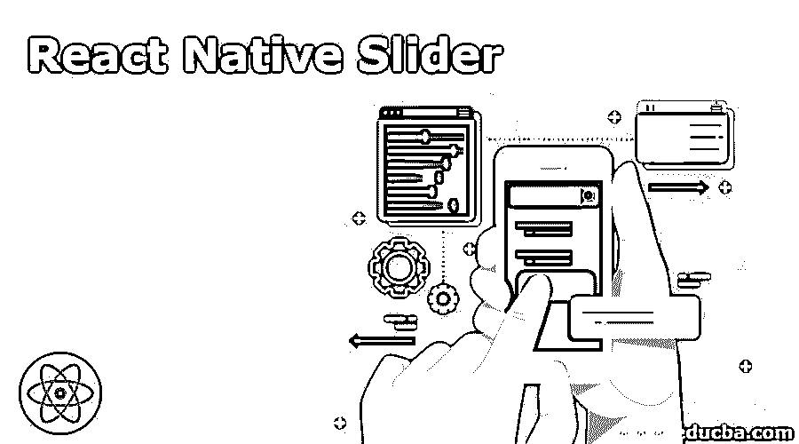
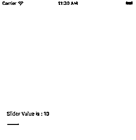
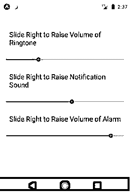
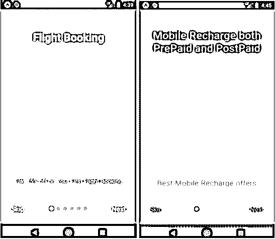
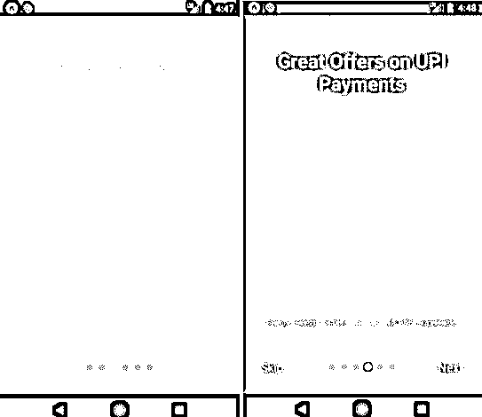
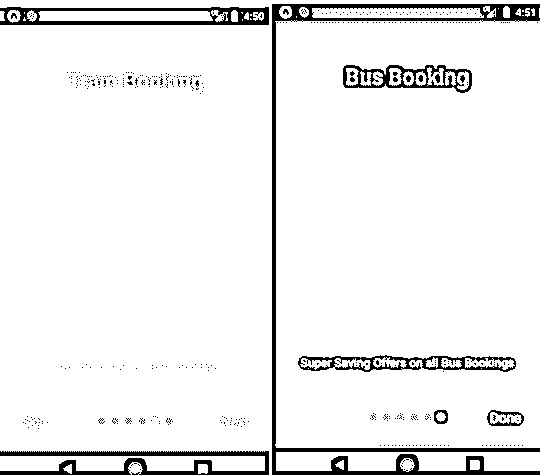
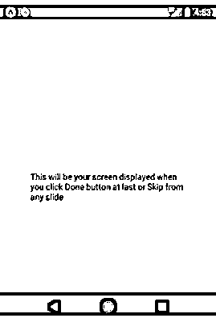

# 反应原生滑块

> 原文：<https://www.educba.com/react-native-slider/>

## React 原生滑块简介

Slider 被定义为 React Native 的组件，用于从一系列值中选择单个值。在我们的手机中，我们可以看到滑块来增加或减少音量或亮度。与按钮相比，滑块非常方便，在滑块的帮助下，增加或减少音量或亮度或任何事情都可以非常容易和有效地进行。React Native 提供了多种滑块，如多滑块，真棒滑块，自定义滑块等。下表中提到了用于构建 React 原生滑块的一些不同的道具:

| **道具** | **描述** |
| 风格 | 它用于滑块的造型和设计。 |
| 使残废 | 它的默认值是 FALSE，如果设置为 TRUE，则不能移动滑块。 |
| 最大值 | 其默认值为 1。它是滑块在初始阶段的最大值。 |

**语法:**

<small>网页开发、编程语言、软件测试&其他</small>

*   在 React Native 中导入滑块的语法:

`import Slider from '@react-native-community/slider'
<Slider maximumValue={100} minimumValue={0} step={1} value='initial value' />`

*   在 React Native 中导入简介滑块的语法:

`<AppIntroSlider slides={Data related to the slides like FlatList} onDone={Handler for done button click} showSkipButton={default not}
onSkip={Handler for skip button click} />`

### 滑块如何在 React Native 中工作？

下面我们将了解滑块如何在 react native 中工作:

#### 1.安装滑块库

**代码:**

`npm install @react-native-community/slider –save
or
yarn  add  @react-native-community/slider`

#### 2.使用滑块库

**代码:**

`import React, { Component } from 'react';
import { Slider, View, Text, StyleSheet } from 'react-native';
export default class App extends Component { constructor(props) {
super(props); this.state = {
sliderValue: '10',
};
}
render() { return (
<View style={styles.container}>
<Text style={{ color: '#000000' }}>
Slider Value is : {this.state.sliderValue}
</Text>
<Slider maximumValue="100" minimumValue="0" step="1"
value={this.state.sliderValue}
onValueChange={sliderValue => this.setState({ sliderValue })}
/>
</View>
);
}
}
const styles = StyleSheet.create({ container: {
flex: 1,
padding: 19, justifyContent: 'center', backgroundColor: '#ffef8a',
},
});`

**输出:**

图片 1

### React Native 中滑块的示例

以下是 React Native 中的滑块示例

#### 1.多个滑块

**代码:**

`import React, {Component} from 'react';
import {Slider, Platform, StyleSheet, Text, View} from 'react-native';
export default class App extends Component{ constructor(props) {
super(props); this.state = {
singleSliderValues: [], multiSliderValues: [],
}
}
render() { return (
<View style={styles.container}>
<Text style={styles.title}>Slide Right to Raise Volume of Ringtone</Text>
<Slider min={0} max={9}
LRpadding={45} callback={this.multiSliderValueCallback} single={false}
/>
<Text style={styles.title}>Slide Right to Raise Notification Sound</Text>
<Slider min={0} max={9}
LRpadding={45} callback={this.singleSliderValueCallback} single={true}/>
<Text style={styles.title}>Slide Right to Raise Volume of Alarm</Text>
<Slider min={0} max={9}
LRpadding={45} callback={this.multiSliderValueCallback} single={false}
/>
</View>
);
}
singleSliderValueCallback =(values)=> { this.setState({singleSliderValues : values})
}
multiSliderValueCallback = (values) => { this.setState({multiSliderValues : values})
}
multiSliderValueCallback = (values) => { this.setState({multiSliderValues : values})
}
}
const styles = StyleSheet.create({ container: {top:50,backgroundColor: '#baff52',},
title:{ padding:25, fontSize:19,
}
})`

**输出:**

图 2 显示了不同的多滑块。这些是 React Native 中多滑块的基本版本。

图片 2

#### 2.基本 React 原生应用程序简介滑块

**代码:**

`import React from 'react';
import { StyleSheet, View, Text } from 'react-native';
import AppIntroSlider from 'react-native-app-intro-slider';
export default class App extends React.Component { constructor(props) {
super(props); this.state = {
showRealApp: false,
};
}
_onDone = () => {this.setState({ showRealApp: true });};
_onSkip = () => {this.setState({ showRealApp: true });
};
render() {
if (this.state.showRealApp) {
return (<View style={{ flex: 1, justifyContent: 'center', alignItems: 'center', padding: 51,}}>
<Text>
This will be your screen displayed when you click Done button at last or Skip from any slide
</Text>
</View>
);
} else {
return (
<AppIntroSlider slides={slides}
onDone={this._onDone}
showSkipButton={true}
onSkip={this._onSkip}
/>
);
}
}
}
const styles = StyleSheet.create({ image: {width: 199,height: 199,},
text: {
color: '#575446',
fontSize: 21,
},
title: { fontSize: 29,fontWeight: 'bold', color: '#f5f3eb',backgroundColor: 'transparent', textAlign: 'center',marginTop: 16,},});
const slides = [
{key: 's1',
title: 'Flight Booking', titleStyle: styles.title,
text: 'Flat 75% off on Your First Flight Booking', image: {
uri:'http://aboutreact.com/wp- content/uploads/2018/08/flight_ticket_booking.png',},imageStyle: styles.image, backgroundColor: '#4295ed',},
{
key: 's2',
text: 'Best Mobile Recharge offers',
title: 'Mobile Recharge both PrePaid and PostPaid', titleStyle: styles.title,
textStyle: styles.text, image: {
uri:'http://aboutreact.com/wp- content/uploads/2018/08/mobile_recharge.png',
},
imageStyle: styles.image, backgroundColor: '#db4cf5',
},
{
key: 's3',
title: 'Amazing Deals', titleStyle: styles.title,
text: ' Amazing Deals on all services by us', image: {
uri: 'http://aboutreact.com/wp- content/uploads/2018/08/best_deals1.png',
},
imageStyle: styles.image, backgroundColor: '#fadd4b',
},
{
key: 's4',
title: 'Great Offers on UPI Payments', titleStyle: styles.title,
text: 'Enjoy Great offers on our all UPI paymets', image: {
uri: 'http://aboutreact.com/wp- content/uploads/2018/08/discount1.png',
},
imageStyle: styles.image, backgroundColor: '#ff4f6f',
},
{
key: 's5',
title: 'Train Booking', titleStyle: styles.title,
text: ' 15% off on every Train booking', image: {
uri:'http://aboutreact.com/wp- content/uploads/2018/08/train_ticket_booking.png',
},
imageStyle: styles.image, backgroundColor: '#89fa55',
},
{
key: 's6',
title: 'Bus Booking', titleStyle: styles.title,
text: 'Super Saving Offers on all Bus Bookings',
image: { uri:'http://aboutreact.com/wp- content/uploads/2018/08/bus_ticket_booking.png',
},
imageStyle: styles.image, backgroundColor: '#eb0000',
},
];`

**输出:**

图 3、图 4、图 5、图 6、图 7 和图 8 显示了应用简介滑块的不同幻灯片，而图 9 显示了当点击“跳过”任一幻灯片或“完成”最后一张幻灯片时将出现的窗口。

图 3 和图 4

图 5 和图 6

图 7 和图 8

图 9

### 结论

我们在日常生活中遇到了各种各样的滑块，这些滑块帮助我们使工作变得更加容易。在滑块的帮助下，只需在屏幕上做个手势，就可以在几秒钟内从最小值达到最大值。在以上讨论的基础上，我们知道了什么是 React Native Slider，也知道了可以用来开发 Slider 的不同道具。我们还讨论了语法和工作原理。上面分享的例子显示了不同的滑块，如基本滑块，多个滑块，应用程序介绍滑块等。可以在 React Native 中高效地开发。React Native 提供了多种选项来以非常高效和简单的方式开发滑块，这有助于为移动应用程序提供最佳的用户界面。

### 推荐文章

这是一个反应原生滑块的指南。这里我们讨论 Slider 如何在 React Native 中工作，以及它的例子和代码实现。您也可以浏览我们推荐的其他文章，了解更多信息——

1.  [React 原生表|如何工作？](https://www.educba.com/react-native-table/)
2.  [React 原生动画介绍](https://www.educba.com/react-native-animation/)
3.  [React Native AsyncStorage |如何工作？](https://www.educba.com/react-native-asyncstorage/)
4.  [React 原生进度条|如何构建？](https://www.educba.com/react-native-progress-bar/)

