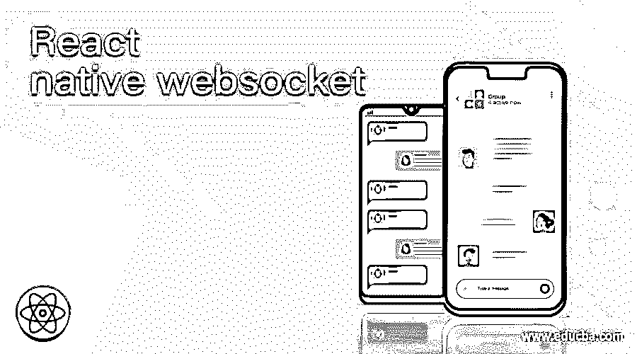
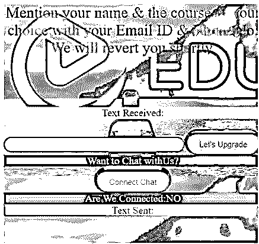
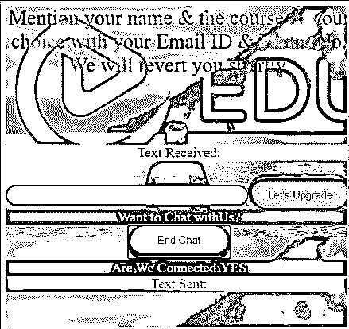
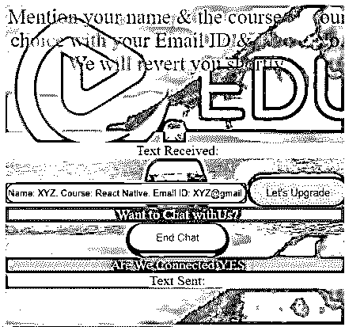
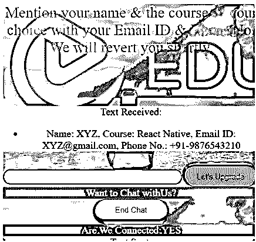
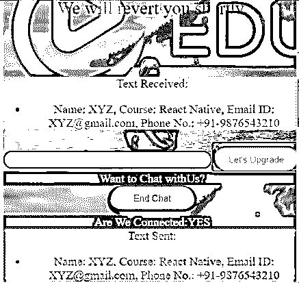

# React 本机 websocket

> 原文：<https://www.educba.com/react-native-websocket/>

## React Native WebSocket 简介

对于双方的客户机和服务器之间的持久连接，使用 WebSocket。使用 WebSocket，只要连接到服务器，用户就可以随时发送数据。通过 WebSocket 握手过程，客户端建立 WebSocket 连接。当客户端向服务器发送一个常规的 HTTP 请求时，WebSocket 握手的过程就开始了。这个请求包含一个 upgrade 头，通知服务器客户机想要建立一个 WebSocket 连接。WebSocket URLs 使用 ws 方案，对于安全的 WebSocket 连接，使用 wss，这相当于 HTTPS。用于实时数据传输的实时 web 连接由 WebSocket 提供。在本主题中，我们将了解 React native websocket。

**WebSocket 语法:**

<small>网页开发、编程语言、软件测试&其他</small>

*   **导入 WebSocket 的语法:**

`import { webSocket } from "rxjs/webSocket";`

*   **使用 WebSocket:**

`const WS_SERVER = "wss://echo.websocket.org";
process({ getState, action$, cancelled$ }) {
const wsSubject$ = webSocket(WS_SERVER);
action$
.pipe(
filter(action => action.type === actions.sendMsg.toString()),
tap(x => wsSubject$.next(getState().messageToSend)),
takeUntil(cancelled$)
)
.subscribe();
return wsSubject$.pipe(map(x => actions.msgReceived(x)));
}
});`

### 用一个例子说明在 React Native 中使用 WebSocket

以下是不同的例子:

#### 例子

下面的例子显示了 WebSocket 在基于 React Native 的聊天应用程序中的用法。其中 WebSocket 建立发送方和接收方之间的连接。发送和接收的文本都显示在屏幕上。应用程序的不同组件使用不同的 React 本机样式工具进行样式化，以获得更好的用户体验。

用于正确执行代码的文件有:

**【I】index . js**

`import React from "react";
import "./styles.css";
import { flow
, set
, update } from "lodash/fp";
import ReactDOM from "react-dom";
import { createStore
, applyMiddleware
, compose } from "redux";
import { connect
, Provider } from "react-redux";
import { filter
, tap
, map
, takeUntil } from "rxjs/operators";
import { createActions
, createReducer } from "@jeffbski/redux-util";
import { createLogic
, createLogicMiddleware } from "redux-logic";
import { webSocket } from "rxjs/webSocket";
function App({
connected,
inputMsg,
sentMsgs,
receivedMsgs,
connect,
disconnect,
inputMsgChanged,
sendMsg
}) {
return (

Mention your name & the course of your choice with your Email ID & Phone No. We will revert you shortly.

Text Received:
<ul>{receivedMsgs.map(x => <li>{x}</li>)}</ul>

<form onSubmit={sendMsg}
>
<input name="inputMsg"
value={inputMsg}
onChange={inputMsgChanged}
style={{
color: '#212dcf'
, height: '30px'
, width: '350px'
, textAlign: 'center'
, borderColor: '#de071c'
, borderRadius: '50px'
}} />
<button
type="submit"
disabled={!connected}
style={{
color: '#991450'
, height: '50px'
, width: '150px'
, backgroundColor: '#8ef73e'
, borderRadius: '50px'
, borderRightWidth: '5px'
, borderRightColor: '#b30b1b'
, borderLeftWidth: '5px'
, borderLeftColor: '#0b0ebd'
, borderTopWidth: '10px'
, borderTopColor: '#e3431b'
, borderBottomColor: '#22c0f5'
, fontSize: '15px'
}}>
Let's Upgrade
</button>
</form>

Want to Chat withUs?

{connected ? (
<button
onClick={disconnect}
style={{
color: '#e30b1d'
, height: '50px'
, width: '150px'
, backgroundColor: '#f5ee67'
, borderRadius: '50px'
, borderRightWidth: '5px'
, borderRightColor: '#31cc43'
, borderLeftWidth: '5px'
, borderLeftColor: '#0c0c70'
, borderBottomWidth: '10px'
, borderTopColor: '#ad1599'
, borderBottomColor: '#3e700c'
, fontSize: '15px'
}}>End Chat</button>
) : (
<button
onClick={connect}
style={{
color: '#0d0c0d'
, height: '50px'
, width: '150px'
, backgroundColor: '#f57ff3'
, borderRadius: '50px'
, borderRightWidth: '5px'
, borderRightColor: '#f58c58'
, borderLeftWidth: '5px'
, borderLeftColor: '#f50c18'
, borderTopWidth: '10px'
, borderTopColor: '#140ddb'
, borderBottomColor: '#ba1658'
, fontSize: '15px'
}}>Connect Chat</button>
)}

Are We Connected:{connected ? "YES" : "NO"}

Text Sent:
<ul>{sentMsgs.map(x => <li>{x}</li>)}</ul>

);
}
const actions = createActions(
{
sendMsg: ev => {
ev.preventDefault();
},
inputMsgChanged: ev => ev.target.value
},
"msgReceived",
"connect",
"disconnect"
);
const WS_SERVER = "wss://echo.websocket.org";
const initialState = {
connected: false,
inputMsg: "",
messageToSend: "",
sentMsgs: [],
receivedMsgs: [] };
const wsListenLogic = createLogic({
type: actions.connect,
cancelType: actions.disconnect,
latest: true,
warnTimeout: 0,
process({ getState, action$, cancelled$ }) {
const wsSubject$ = webSocket(WS_SERVER);
action$
.pipe(
filter(action => action.type === actions.sendMsg.toString()),
tap(x => wsSubject$.next(getState().messageToSend)),
takeUntil(cancelled$)
)
.subscribe();
return wsSubject$.pipe(map(x => actions.msgReceived(x)));
}
});
const composeEnhancers = window.__REDUX_DEVTOOLS_EXTENSION_COMPOSE__ || compose;
const reducer = createReducer(
{
[actions.inputMsgChanged]: (state, action) =>
flow(
set("inputMsg", action.payload),
set("messageToSend", action.payload)
)(state),
[actions.sendMsg]: (state, action) =>
flow(
update("sentMsgs", arr => arr.concat(state.inputMsg)),
set("inputMsg", "")
)(state),
[actions.msgReceived]: (state, action) =>
update("receivedMsgs", arr => arr.concat(action.payload), state),
[actions.connect]: (state, action) => set("connected", true, state),
[actions.disconnect]: (state, action) => set("connected", false, state)
},
initialState
);
const injectedDeps = {};
const arrLogic = [wsListenLogic];
const logicMiddleware = createLogicMiddleware(arrLogic, injectedDeps);
const store = createStore(
reducer,
initialState,
composeEnhancers(applyMiddleware(logicMiddleware))
);
const ConnectedApp = connect(
state => ({
connected: state.connected,
inputMsg: state.inputMsg,
sentMsgs: state.sentMsgs,
receivedMsgs: state.receivedMsgs
}),
{
connect: actions.connect,
disconnect: actions.disconnect,
inputMsgChanged: actions.inputMsgChanged,
sendMsg: actions.sendMsg
}
)(App);
ReactDOM.render(
<Provider store={store}>
<ConnectedApp />
</Provider>,
document.getElementById("appContainer")
);`

**【ii】styles . CSS**

`.App {
font-family: 'Gill Sans'
, 'Gill Sans MT'
, Calibri
, 'Trebuchet MS'
, sans-serif;
text-align: center;
}
.Heading {
height: 300px;
padding: 0px;
color: #f5e942;
}
.Titling {
font-size: 2em;
}
.menu-item.active {
border-bottom-left-radius: 50px;
border-bottom-right-radius: 50px;
border-top-left-radius: 50px;
border-top-right-radius: 50px;
border: 5px #ff0015 solid;
}
.menu-item {
border-bottom-left-radius: 50px;
border-bottom-right-radius: 50px;
border-top-left-radius: 50px;
border-top-right-radius: 50px;
padding: 0 10px;
margin: 1px 1px;
user-select: none;
cursor: pointer;
color: #9af241;
border: 1px transparent solid;
}
* {
box-sizing: border-box;
}
.menu-item-wrapper {
border-bottom-left-radius: 50px;
border-bottom-right-radius: 50px;
border-top-left-radius: 50px;
border-top-right-radius: 50px;
border: 1px transparent solid;
}`

**输出:**

*   **关于代码执行—**

*   **点击“连接聊天”——**

*   **在聊天框中输入内容时—**

*   **输入数据后点击“升级”——**

### 结论

基于上面的文章，我们理解了 WebSocket 的概念。WebSocket 对于通过服务器建立发送方和接收方之间的连接是非常必要的。本文将帮助读者理解 WebSocket 并在他们自己的基于网络的应用程序中应用它。

### 推荐文章

这是 React native websocket 的指南。这里我们讨论在 React Native 中使用 WebSocket 用一个例子来说明。您也可以看看以下文章，了解更多信息–

1.  [反应原生形态](https://www.educba.com/react-native-form/)
2.  [反应原生权限](https://www.educba.com/react-native-permissions/)
3.  [反应原生迅捷](https://www.educba.com/react-native-swift/)
4.  [反应道具](https://www.educba.com/react-props/)

