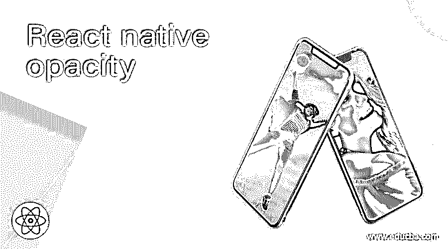
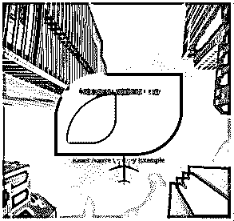
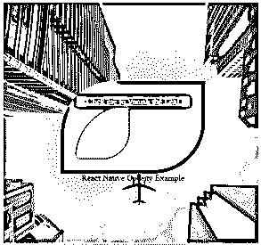
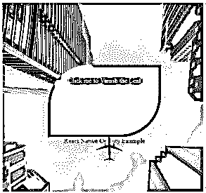
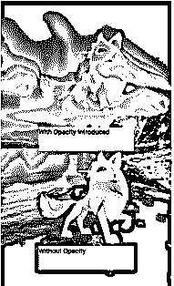
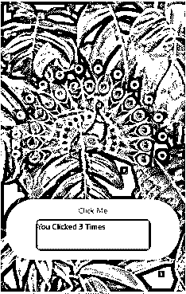
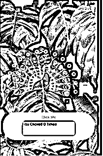
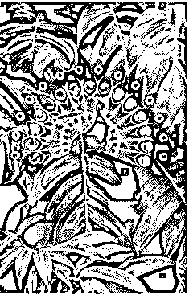
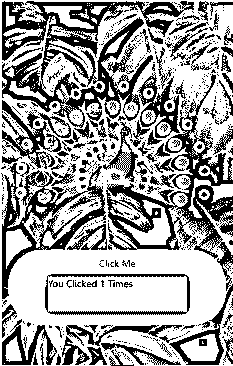

# 反应自然不透明度

> 原文：<https://www.educba.com/react-native-opacity/>

## 反应自然不透明度简介

要在基于 React Native 的应用程序中设置图像或视图组件的 Alpha，需要使用 style 的属性 opacity。开发者可以按照他的要求，以固定的方式将形状或图像背景做成透明的；在固定百分比中，通过设置 alpha 使视图变得透明。不透明度支持的值在 0 到 1 的范围内，例如 0 . 2，. 5，. 8 等。透明度级别由不透明度级别描述，其中 0 表示完全透明，0.5 表示 50%可见，1 表示完全不透明。在本文中，我们将通过不同的示例来定义 React Native 中不同组件的不透明度。

**语法:**

<small>网页开发、编程语言、软件测试&其他</small>

*   **用于定义文本、图像、形状等组件的不透明度。**

`<View style={{width: 150
, height: 200
, backgroundColor:' #181e94’
, opacity: .5
, marginBottom: 12}} />`

*   **用于 React Native 中不同组件的可控不透明度**

`state = { opacityValue: 2 };
handleOpacityDecrease = () => {
this.setState(({ opacityValue }) => ({
opacityValue: opacityValue - 0.1
}));`

### 反应自然不透明度的示例

下面给出了不同的例子:

#### 示例#1

下面的例子显示了基本的不透明度场景，其中图像和两个圆的不透明度是在代码中预定义的。整个页面的样式是使用不同的 React 本地组件完成的，如背景图像、图像、颜色等。

**【我】App.js**

`import React
, { Component } from 'react';
import { Platform
, StyleSheet
, View
, Image
, ImageBackground } from 'react-native';
const styles = StyleSheet.create({
Docker :{
paddingTop: (Platform.OS) === 'ios' ? 20 : 0,
justifyContent: 'center',
flex:1,
alignItems: 'center',
}
});
export default class Application extends Component{
render() {
return (
<ImageBackground
source={{
uri:
'https://images.pexels.com/photos/230887/pexels-photo-230887.jpeg?auto=compress&cs=tinysrgb&dpr=1&w=500',
}}
style={{flex: 1}}
>
<View style={styles.Docker}>
<View style={{width: 100
, height: 100
, backgroundColor:'#c2fa41'
,  opacity: .2
, marginBottom: 12
, borderRadius: 100/2
, borderWidth: 10
, borderColor: '#bf0d19'}} />
<Image
source = {{ uri: 'https://images.pexels.com/photos/6167767/pexels-photo-6167767.jpeg?auto=compress&cs=tinysrgb&dpr=1&w=500' }}
style = {{borderRightColor: '#6ed8f5'
, width: 200
, borderTopLeftRadius: 100/2
, borderRightWidth: 10
, height: 300
, borderLeftWidth: 10
, resizeMode: 'center'
, borderLeftColor: '#ed5fb7'
, opacity: .5
, borderBottomRightRadius: 100/2
}}
/>
<View style={{width: 100
, height: 100
, backgroundColor:'#fff12e'
,  opacity: .2
, marginTop: 12
, borderRadius: 100/2
, borderWidth: 10
, borderColor: '#ad5fe8'}} />
</View>
</ImageBackground>
);
}
}`

**输出:**

#### 实施例 2

下面的例子显示了高级不透明度场景，其中绿叶形状的不透明度可以通过单击“…..点击我，让树叶消失…文本；你点击得越多，树叶就变得越透明。整个页面的样式是使用不同的 React 本地组件完成的，如背景图像、文本、颜色等。

**【I】index . js**

`import React from "react";
import ReactDOM from "react-dom";
import styled from "styled-components";
class Application extends React.Component {
state = { opacityValue: 2 };
handleOpacityDecrease = () => {
this.setState(({ opacityValue }) => ({
opacityValue: opacityValue - 0.1
}));
};
render() {
const { opacityValue } = this.state;
return (

<BigBox style={{
color: '#c90e17'
}}>
<OpacityBox
style={{
color: '#8290a1'
}}
onClick={this.handleOpacityDecrease}
className="box_to_hover">
.....Click me to Vanish the Leaf.....
<SmallBox style={{
color: '#910a39'
}}
opacityValue={opacityValue} />
</OpacityBox>
React Native Opcaity Example
</BigBox>

);
}
}
const SmallBox = styled.div`
border-bottom-right-radius: 50px;
width: 100px;
border-top-left-radius: 100px;
border: 10px;
height: 100px;
border-bottom-left-radius: 0px;
background: #0b966c;
opacity: ${({ opacityValue }) => opacityValue};
`;
const BigBox = styled.div`
height: 100vh;
margin: 0 auto;
display: flex;
flex-direction: column;
align-items: center;
justify-content: center;
`;
const OpacityBox = styled.div`
background-color: #a10539;
border-top-left-radius: 100px;
cursor: pointer;
border-bottom-right-radius: 100px;
padding: 30px;
margin-top: 10px;
`;
ReactDOM.render(<Application />, document.getElementById("root"));`

**输出:**

*   **关于代码执行—**

*   点击“…”，在一定程度上降低不透明度..点击我，让树叶消失…行-

*   **使整片叶子完全透明—**

#### 实施例 3

下面的例子显示了一个已经在代码中预定义的图像的不透明度，实际的图像也显示在代码中。整个页面的样式是使用不同的 React 本地组件完成的，如背景图像、文本、颜色等。

用于正确执行代码的文件有:

**【我】App.js**

`import React from 'react';
import { SafeAreaView
, StyleSheet
, View
, Image
, Text
, ImageBackground } from 'react-native';
const styles = StyleSheet.create({
docker: {
alignItems: 'center',
flex: 1,
marginTop: 20,
margin: 15,
padding: 20,
},
});
const Application = () => {
return (
<SafeAreaView style={{ flex: 1 }}>
<ImageBackground
source={{
uri:
'https://images.pexels.com/photos/1562058/pexels-photo-1562058.jpeg?auto=compress&cs=tinysrgb&dpr=1&w=500',
}}
style={{flex: 1}}
>
<View style={styles.docker}>
<Image
style={{
width: 200,
height: 200,
resizeMode: 'center',
opacity: 0.4,
}}
source={{
uri:
'https://pngimg.com/uploads/arctic_fox/arctic_fox_PNG41386.png',
}}
/>
<Text style={{
width: 200,
height: 50,
backgroundColor: '#a8f571',
alignContent: 'center'
}}>With Opacity Introduced</Text>
<Image
source={{
uri:
'https://pngimg.com/uploads/arctic_fox/arctic_fox_PNG41386.png',
}}
style={{
width: 200,
height: 200,
resizeMode: 'center',
}}
/>
<Text style={{
width: 200,
height: 50,
backgroundColor: '#a8f571',
alignContent: 'center',
}}>Without Opacity</Text>
</View>
</ImageBackground>
</SafeAreaView>
);
};
export default Application;`

**输出:**

*   **在 iOS 平台上—**

*   **在安卓平台上—**

#### 实施例 4

下面的例子显示了可触摸的不透明度场景，其中“点击我”按钮的不透明度发生变化，例如，每当点击它时。该按钮包括一个计数器，用于计算点击该按钮的次数。整个页面的样式是使用不同的 React 本地组件完成的，如背景图像、文本、颜色等。

**【我】App.js**

`import React
, { useState } from "react";
import { StyleSheet
, Text
, TouchableOpacity
, View
, Image
, ImageBackground } from "react-native";
const styles = StyleSheet.create({
docker: {
flex: 1,
justifyContent: "center",
paddingHorizontal: 10
},
clickibutton: {
alignItems: "center",
backgroundColor: "#ba49f2",
padding: 10,
borderRadius: 50,
},
counting: {
alignItems: "center",
padding: 10
}
});
const Application = () => {
const [count
, setCount] = useState(0);
const onPress =
() =>
setCount(
prevCount =>
prevCount + 1);
return (
<ImageBackground
source={{
uri:
'https://images.pexels.com/photos/3571551/pexels-photo-3571551.jpeg?auto=compress&cs=tinysrgb&dpr=1&w=500',
}}
style={{flex: 1}}
>
<View style={styles.docker}>
<Image
source={{
uri:
'https://pngimg.com/uploads/peacock/peacock_PNG30.png',
}}
style={{
width: 300,
height: 300,
resizeMode: 'center',
opacity: 0.5,
}}
/>
<TouchableOpacity
style={styles.clickibutton}
onPress={onPress}
>
<Text>Click Me</Text>
<View style={styles.counting}>
<Text style={{
width: 200,
height: 50,
backgroundColor: '#a8f571',
alignContent: 'center',
color: '#181e94'
}}>
You Clicked {count} Times
</Text>
</View>
</TouchableOpacity>
</View>
</ImageBackground>
);
};
export default Application;`

**输出:**

*   **在网络平台上—**

*   **在 iOS 平台上—**

*   **在安卓平台上—**

*   **点击“点击我”——**

*   **第一次点击后—**

### 结论

根据上面的文章，我们理解了不透明的概念。为了让我们的应用程序更有吸引力，不透明性是非常必要的。这篇文章将帮助读者理解并在他们自己的 React Native 应用程序中应用 React Native 不透明性。

### 推荐文章

这是一个反应自然不透明的指南。这里我们讨论不同的例子来定义 React Native 中不同组件的不透明度。您也可以看看以下文章，了解更多信息–

1.  [反应原生权限](https://www.educba.com/react-native-permissions/)
2.  [反应误差边界](https://www.educba.com/react-error-boundaries/)
3.  [反应原生标签栏](https://www.educba.com/react-native-tab-bar/)
4.  [React component will update()](https://www.educba.com/react-componentwillupdate/)

