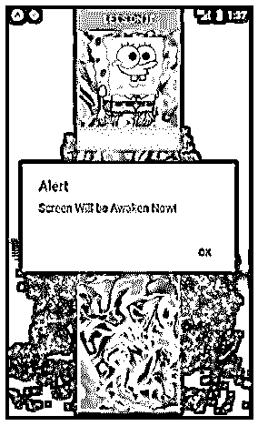
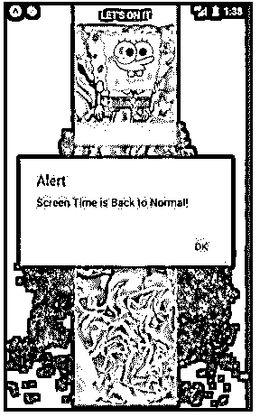
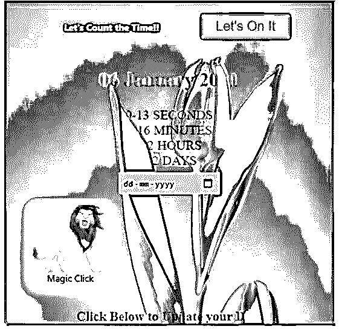
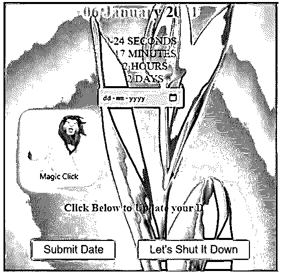
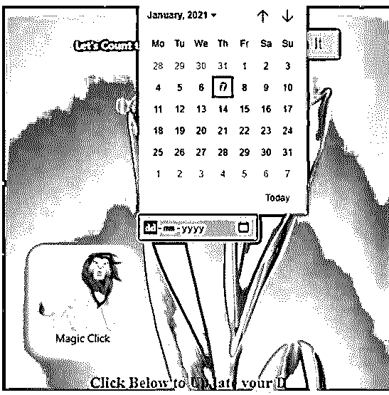
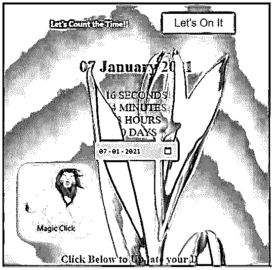
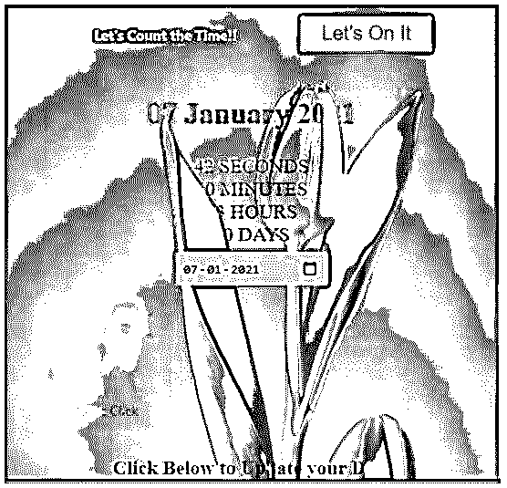
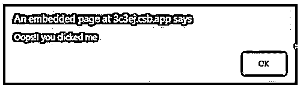

# 保持清醒

> 原文：<https://www.educba.com/react-native-keep-awake/>

## 反应原生保持清醒简介

使用智能手机时，有很多情况下我们必须调整屏幕超时。屏幕超时是手机中一个非常有用的功能，我们可以管理屏幕进入睡眠的时间间隔。React native 还提供了一个名为 keep awake 的包，我们可以在其中设计我们的应用程序，使屏幕在用户希望应用程序保持清醒的时间内保持活动。用户可以让应用程序保持清醒，直到他们按下电源按钮，这一功能可以帮助用户浏览地图或观看视频。

**语法:**

<small>网页开发、编程语言、软件测试&其他</small>

1.在 React Native 中导入保持唤醒的语法。

`import { activateKeepAwake
, deactivateKeepAwake } from 'expo-keep-awake';`

2.在 React Native 中使用保持清醒的语法。

`_activate = () => {
activateKeepAwake();
alert('Screen Will be Awaken Now!');
};
_deactivate = () => {
deactivateKeepAwake();
alert('Screen Time is Back to Normal!');
};`

### React 本地保持清醒的例子

下面是提到的例子:

#### 示例#1

下面的代码解释了保持唤醒功能的工作原理，其中 2 个按钮启用和禁用保持唤醒功能。

*   **让我们来看看:**用于启用保持清醒功能。
*   **让我们关闭它:**用于禁用保持清醒功能。

**代码:**

**a. App.js**

`import React from 'react';
import { activateKeepAwake
, deactivateKeepAwake } from 'expo-keep-awake';
import { Button
, View
, Text
, ImageBackground
, StyleSheet
, Image
} from 'react-native';
export default class KeepAwakeExample extends React.Component {
_activate = () => {
activateKeepAwake();
alert('Screen Will be Awaken Now!');
};
_deactivate = () => {
deactivateKeepAwake();
alert('Screen Time is Back to Normal!');
};
render() {
return (
<ImageBackground
source={{
uri:
'https://images.pexels.com/photos/1669072/pexels-photo-1669072.jpeg?auto=compress&cs=tinysrgb&dpr=1&w=500',
}}
style={{flex: 1}}
>
<View style={{ flex: 1
, alignItems: 'center'
, justifyContent: 'center' }}>
<ImageBackground
source={{
uri:
'https://images.pexels.com/photos/4623061/pexels-photo-4623061.jpeg?auto=compress&cs=tinysrgb&dpr=1&w=500',
}}
style={{flex: 1}}
>
<Button
color="#841584"
onPress={this._activate}
title="Let's On It"
/>
<Image
source={{
uri:
'https://pngimg.com/uploads/spongebob/spongebob_PNG63.png',
}}
style={{
height: 130,
marginTop: 10,
width: 150,
}}
/>
<Button
onPress={this._deactivate}
color="#8af547"
title="Let's Shut It Down"
/>
</ImageBackground>
</View>
</ImageBackground>
);
}
}`

**输出:**

**一、关于代码执行:**

**二。点击“开始吧”按钮:**

**三世。点击“关机”按钮:**

#### 实施例 2

在下面的代码中，我们在基于日历的应用程序中使用了两个提交类型按钮“让我们开始”和“让我们关闭”。“Let's On It”按钮无限期启用保持唤醒功能，直到单击“Let's Shut It Down”按钮禁用保持唤醒功能，日历应用程序的每个功能都在下面的输出图像中进行了解释。

**代码:**

**a. App.jsx**

`import React
, { Component } from "react";
import { View
, Text
, ImageBackground
, StyleSheet
, Image
, TouchableOpacity
} from 'react-native';
import { activateKeepAwake
, deactivateKeepAwake } from 'expo-keep-awake';
import styled from "styled-components";
import Clock from "./Countdown";
import moment from "moment";
import "./styles.css";
const decoration = StyleSheet.create({
titleee: {
fontSize: 28,
fontWeight: 'bold',
textAlign: 'center',
padding: 10,
color: '#a8f740',
},
button: {
backgroundColor: '#859a9b',
alignContent: 'center',
borderRadius: 20,
padding: 10,
height: 140,
marginBottom: 20,
width: 140,
shadowColor: '#f7f560',
shadowOffset: { width: 0
, height: 5 },
shadowRadius: 10,
shadowOpacity: 0.35,
},
docker: {
flex: 1,
padding: 10,
},
styletext:{
textAlign: 'center',
textDecorationColor: "yellow",
color: '#47f5d2',
textShadowColor: "red",
textShadowRadius: 10,
margin: 24,
fontWeight: "bold",
padding: 20,
marginVertical: 4,
textSize: 30,
},
});
const TimeWrapper = styled.section`
text-align: center;
input {
padding: 0.5em;
margin: 0.5em;
background: papayawhip;
border: none;
border-radius: 3px;
}
`;
const Button = styled.button`
color: palevioletred;
font-size: 1em;
margin: 1em;
padding: 0.25em 1em;
border: 2px solid palevioletred;
border-radius: 3px;
`;
export default class KeepAwakeExample extends React.Component {
_activate = () => {
activateKeepAwake();
alert('Screen Will be Awaken Now!');
}
handleClick() {
this.changeDeadline();
}
_deactivate = () => {
deactivateKeepAwake();
alert('Screen Time is Back to Normal!');
}
constructor(props) {
super(props);
this.state = {
deadline: "January 6, 2021",
newDeadline: ""
};
}
changeDeadline() {
this.setState({ deadline: this.state.newDeadline });
}
render() {
return (
<ImageBackground
source={{
uri:
'https://images.pexels.com/photos/36729/tulip-flower-bloom-pink.jpg?auto=compress&cs=tinysrgb&dpr=1&w=500',
}}
style={{flex: 1}}
>
<View style={{ flex: 1
, alignItems: 'center'
, justifyContent: 'center' }}
>
<TimeWrapper className="App">
<Text style={decoration.styletext}>
Let's Count the Time!!</Text>
<Button
color="#841584"
type="submit"
onPress={this._activate}
title="Let's On It"
>
Let's On It
</Button>
<h2>{moment(this.state.deadline).format("DD MMMM YYYY")}</h2>
<Clock deadline={this.state.deadline} />
<input
type="date"
placeholder="new date"
onChange={event => {
this.setState({ newDeadline: event.target.value });
}}
/>
<TouchableOpacity
style={decoration.button}
onPress={()=>{alert("Oops!! you clicked me")}}
>
<ImageBackground
source={{
uri: 'https://pngimg.com/uploads/lion/lion_PNG23267.png'
}}
style={{flex: 1}}
>
</ImageBackground>
<Text>Magic Click<Pop-up>
</Pop-up></Text>
</TouchableOpacity>
<h4>Click Below to Update your Date</h4>
<Button
type="submit"
onClick={() => this.handleClick()}>
Submit Date
</Button>
<Button
onPress={this._deactivate}
type="submit"
color="#8af547"
title="Let's Shut It Down"
>
Let's Shut It Down
</Button>
</TimeWrapper>
</View>
</ImageBackground>
);
}
}`

**b. Countdown.jsx**

`import React
, { Component } from "react";
import styled from "styled-components";
const ClockWrapper = styled.div`
display: flex;
flex-direction: column;
`;
var moment = require("moment");
moment().format();
class Clock extends Component {
constructor(props) {
super(props);
this.state = {
days: 0,
hours: 0,
minutes: 0,
seconds: 0
};
}
leadingZero(num) {
return num < 10 ? "0" + num : num;
}
componentDidMount() {
this.getTimeUntil(this.props.deadline);
setInterval(() => this.getTimeUntil(this.props.deadline), 1000);
}
render() {
return (
<ClockWrapper>

{this.leadingZero(this.state.seconds)} SECONDS

{this.leadingZero(this.state.minutes)} MINUTES

{this.leadingZero(this.state.hours)} HOURS

{this.leadingZero(this.state.days)} DAYS

</ClockWrapper>
);
}
getTimeUntil(deadline) {
const time = Date.parse(
deadline) - Date.parse(
new Date()
);
const days = Math.floor(
time / (
1000
* 60
* 60
* 24
));
const hours = Math.floor(
(
time / (
1000
* 60
* 60
)
) % 24);
const minutes = Math.floor(
(
time / 1000 / 60
) % 60);
const seconds = Math.floor(
(
time / 1000
) % 60);
this.setState({
days: days,
hours: hours,
minutes: minutes,
seconds: seconds
});
}
}
export default Clock;`

**c. index.js**

`import React from "react";
import ReactDOM from "react-dom";
import Application from "./App";
const rootElement = document.getElementById("root");
ReactDOM.render(
<Application />
, rootElement
);`

**d. styles.css**

`.App {
font-size: 20px;
font-family: 'Times New Roman'
, Times
, serif;
color: #80081c;
text-align: center;
}`

**输出:**

**一、代码执行:**

**二。点击“日历图标”:**

**三世。设定所需日期:**

**四。点击“神奇点击”按钮:**

### 结论

在上述文章的基础上，它根据应用程序的要求，通过不同的示例来帮助读者理解实现。本文还解释了工作原理和语法。

### 推荐文章

这是一个保持清醒的本土反应指南。这里我们分别讨论介绍、工作、语法和不同的例子。您也可以看看以下文章，了解更多信息–

1.  [反应原生 SVG](https://www.educba.com/react-native-svg/)
2.  [反应原生模态](https://www.educba.com/react-native-modal/)
3.  [反应原生标签栏](https://www.educba.com/react-native-tab-bar/)
4.  [React 原生菜单](https://www.educba.com/react-native-menu/)

