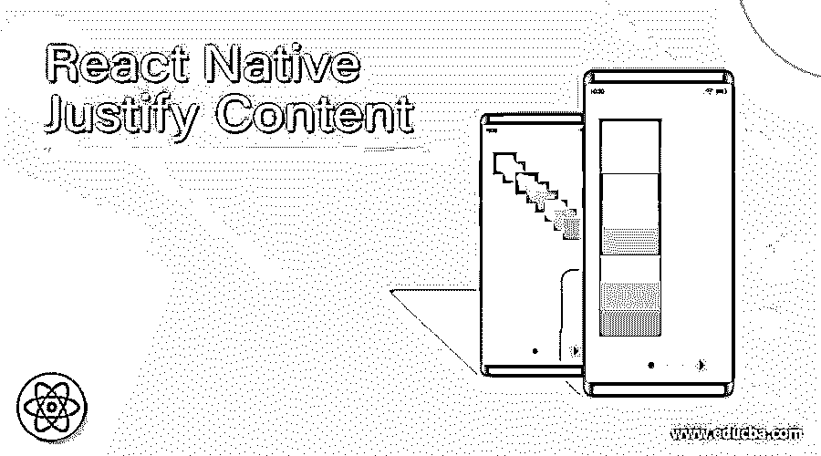
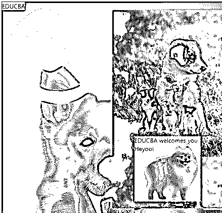
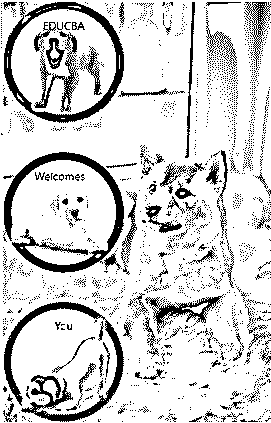
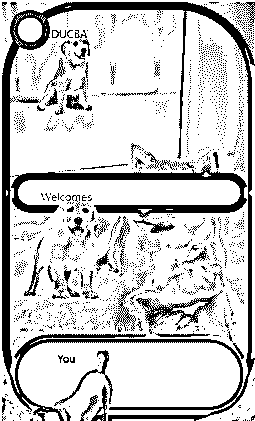

# 反应本机调整内容

> 原文：<https://www.educba.com/react-native-justify-content/>

## React 本机调整内容简介

设计内容是 web 开发中的一门艺术。为了使网页看起来更有吸引力，内容更丰富，需要进行美学处理。“调整内容”就是这样一个功能，它有助于以某种方式对齐对象和文本，使网站或应用程序看起来更丰富、更整洁。通过调整内容，我们可以在容器的主轴下对齐子容器。在本文中，我们将解释 justify-content 的概念及其语法。对于在制作应用程序或网站时实现 justify-content，解释了不同的示例。

**React Native Justify 内容语法:**

<small>网页开发、编程语言、软件测试&其他</small>

`<Text
style={{
flex: 1
, alignItems: "center"
, justifyContent: "center"
, backgroundColor: "#f5f269"
, color: "#0b40a1"
}}/>`

类似地，它可以用于调整背景图像、图像、视图等中的内容。

### React 本机调整内容的示例

React Native 中的证明内容举例说明:

#### 示例#1

下面我们使用了 justify-content 来对齐整个容器主轴中心的子元素。

**[I]app . js—**

`import React from "react";
import { View
, Text
, Image } from "react-native";
class Application extends React.Component {
render() {
return (

<Text
style={{
flex: 1
, alignItems: "center"
, justifyContent: "center"
, backgroundColor: "#f5f269"
, color: "#0b40a1"
}}>
EDUCBA
</Text>
<View
style={{
flex: 1
, alignItems: "center"
, justifyContent: "center"
, backgroundColor: "#c4ff45"
, height:'450px'
, width: '250px'
, padding: 3
, backgroundImage: 'url("https://images.pexels.com/photos/1346086/pexels-photo-1346086.jpeg?auto=compress&cs=tinysrgb&dpr=1&w=500")' ,
top: "0" ,
left: "50%" ,
bottom: "0" ,
}}
>
<View>
<Image
source={{
uri:
'http://pngimg.com/uploads/dog/small/dog_PNG195.png',
}}
style={{
height: 130,
marginTop: 10,
width: 150,
}}
/>
<Text
style={{
flex: 1
, alignItems: "center"
, justifyContent: "center"
, backgroundColor: "#c4ff45"
, color: "#c90c3f"
}}>
EDUCBA welcomes you
</Text>
<Text
color="#bdf545"
style={{
backgroundImage: 'url("http://pngimg.com/uploads/dog/small/dog_PNG50386.png")' ,
width: 150 ,
height: 130 ,
position: "absolute" ,
top: "100%" ,
left: "0%" ,
bottom: "0" ,
alignItems: "center" ,
justifyContent: "center" ,
background: "#c4ff45" ,
fontSize: "100" ,
color: "#a10840"
}}
>
Heyoo!
</Text>
</View>
</View>

);
}
}
export default Application;`

**【二】index . js—**

`import { AppRegistry } from "react-native";
import Application from "./App";
AppRegistry.registerComponent(
"Application"
, () => Application);
AppRegistry.runApplication(
"Application"
, {
rootTag: document.getElementById(
"react-root")
});`

**输出:**

#### 实施例 2

下面，我们使用了 justify-content 来对齐子元素，使它们在整个容器的主轴上居中。

**[I]app . js—**

`import React from 'react';
import { View
, Text
, StyleSheet
, TouchableOpacity
, ImageBackground
, Image
} from 'react-native';
const Example2 = () => {
return (
<ImageBackground
source={
{
uri:
'https://images.pexels.com/photos/1805164/pexels-photo-1805164.jpeg?auto=compress&cs=tinysrgb&dpr=1&w=500',
}
}
style={
{
flex: 1
}
}
>
<View style={{
flex: 1,
flexDirection: 'center',
justifyContent: 'space-between',
}}>
<View
style={
{width: 150
, height: 150
, backgroundColor: '#c2f08d'
, alignItems: 'center'
, borderWidth: 10
, textAlign: 'center'
, borderRadius: 100
, borderColor: '#b80d2c'
, position: 'absolute-center'
}} >
<ImageBackground
source={{
uri:
'http://pngimg.com/uploads/dog/small/dog_png2399.png',
}}
style={{
height: 120,
marginTop: 10,
width: 120,
}}
>
<Text
style={{
flex: 1
, alignItems: "center"
, justifyContent: "center"
, color: "#c90c3f"
}}>
EDUCBA
</Text>
</ImageBackground>
</View>
<View
style={
{width: 150
, height: 150
, backgroundColor: '#f0ee8b'
, alignItems: 'center'
, borderWidth: 10
, textAlign: 'center'
, borderRadius: 100
, borderColor: '#0d2fb8'
, alignItems: 'stretch'
}} >
<ImageBackground
source={{
uri:
'http://pngimg.com/uploads/dog/small/dog_PNG2446.png',
}}
style={{
height: 120,
marginTop: 10,
width: 120,
}}
>
<Text
style={{
flex: 1
, alignItems: "center"
, justifyContent: "center"
, color: "#c90c3f"
}}>
Welcomes
</Text>
</ImageBackground>
</View>
<View
style={
{width: 150
, height: 150
, backgroundColor: '#8aedd4'
, alignItems: 'center'
, borderWidth: 10
, textAlign: 'center'
, borderRadius: 100
, borderColor: '#d938f5'
}} >
<ImageBackground
source={{
uri:
'http://pngimg.com/uploads/dog/small/dog_PNG161.png',
}}
style={{
height: 120,
marginTop: 10,
width: 120,
}}
>
<Text
style={{
flex: 1
, alignItems: "center"
, justifyContent: "center"
, color: "#c90c3f"
}}>
You
</Text>
</ImageBackground>
</View>
</View>
</ImageBackground>
);
};
export default Example2;`

**输出:**

#### 实施例 3

下面我们使用了 justify-content 来对齐子容器，使它们之间的空间沿着整个容器主轴的 y 轴。

**[I]app . js—**

`import React from 'react';
import { View
, Text
, StyleSheet
, TouchableOpacity
, ImageBackground
, Image
} from 'react-native';
const Example3 = () => {
return (
<ImageBackground
source={
{
uri:
'https://images.pexels.com/photos/1805164/pexels-photo-1805164.jpeg?auto=compress&cs=tinysrgb&dpr=1&w=500',
}
}
style={
{
flex: 1
}
}
>
<View style={{
flex: 1,
flexDirection: 'column' ,
justifyContent: 'space-between' ,
alignItems: 'stretch'
, borderWidth: 10
, textAlign: 'center'
, borderRadius: 100
, borderColor: '#0d2fb8'
}}>
<View style={{width: 50
, height: 50
, backgroundColor: '#ed98c2'
, borderWidth: 10
, textAlign: 'center'
, borderRadius: 100
, borderColor: '#7203a6'
, justifyContent: 'space-between'}} >
<ImageBackground
source={{
uri:
'http://pngimg.com/uploads/labrador_retriever/small/labrador_retriever_PNG87.png',
}}
style={{
height: 120,
marginTop: 10,
width: 120,
}}
>
<Text
style={{
flex: 1
, alignItems: "center"
, justifyContent: "center"
, color: "#c90c3f"
}}>
EDUCBA
</Text>
</ImageBackground>
</View>
<View style={{height: 50
, backgroundColor: '#97f0df'
, borderWidth: 10
, textAlign: 'center'
, borderRadius: 100
, borderColor: '#a30559'
, justifyContent: 'space-between'}} >
<ImageBackground
source={{
uri:
'http://pngimg.com/uploads/labrador_retriever/small/labrador_retriever_PNG83.png',
}}
style={{
height: 140,
marginTop: 10,
width: 120,
}}
>
<Text
style={{
flex: 1
, alignItems: "center"
, justifyContent: "center"
, color: "#c90c3f"
}}>
Welcomes
</Text>
</ImageBackground>
</View>
<View style={{height: 100
, backgroundColor: '#eef09c'
, borderWidth: 10
, textAlign: 'center'
, borderRadius: 100
, borderColor: '#03a670'
, justifyContent: 'space-between'}} >
<ImageBackground
source={{
uri:
'http://pngimg.com/uploads/dog/small/dog_PNG161.png',
}}
style={{
height: 120,
marginTop: 10,
width: 120,
}}
>
<Text
style={{
flex: 1
, alignItems: "center"
, justifyContent: "center"
, color: "#c90c3f"
}}>
You
</Text>
</ImageBackground>
</View>
</View>
</ImageBackground>
);
};
export default Example3;`

**输出:**

### 结论

根据上面的文章，我们可以理解 justify-content 的概念及其在 app 开发或 web 开发中的重要性。本文通过各种示例解释了这个概念，这将有助于读者理解 justify-content 的实现。

### 推荐文章

这是一个反应本地调整内容的指南。这里我们分别讨论介绍，语法，代码实现的例子。您也可以看看以下文章，了解更多信息–

1.  [反应原生 SVG](https://www.educba.com/react-native-svg/)
2.  [反应原生模态](https://www.educba.com/react-native-modal/)
3.  [反应原生标签栏](https://www.educba.com/react-native-tab-bar/)
4.  [反应原生形态](https://www.educba.com/react-native-form/)

