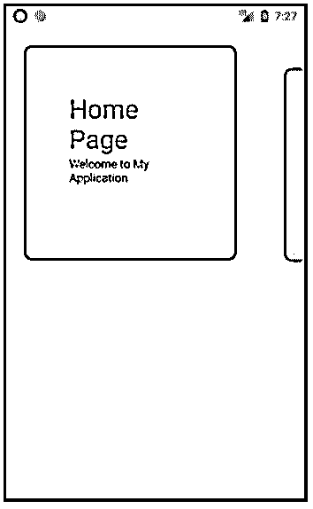
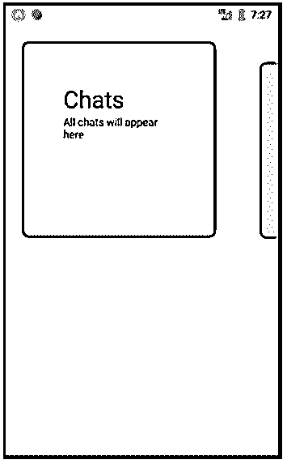
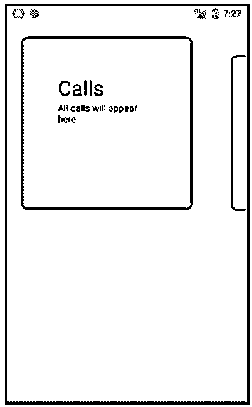
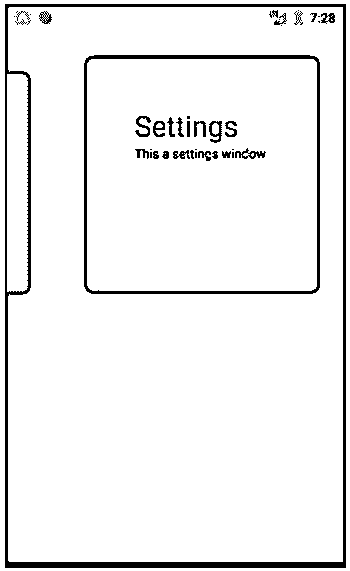
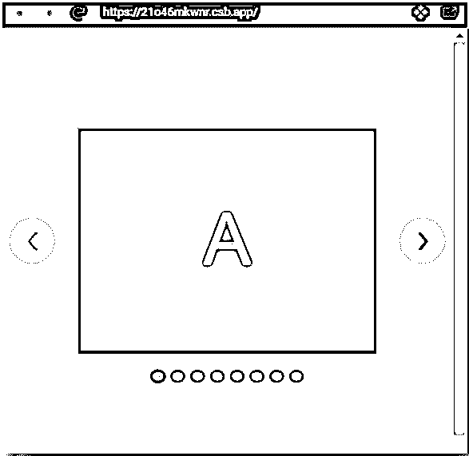
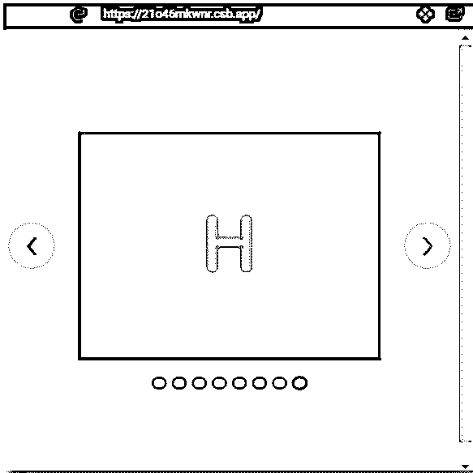
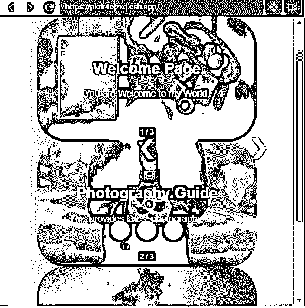
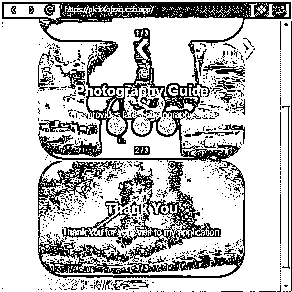

# 反应本机旋转木马

> 原文：<https://www.educba.com/react-native-carousel/>


## React 原生旋转木马简介

这是 React Native Carousel 的概要。众所周知，Native Carousel 是我们主页上的一组图像或横幅，每隔一段时间或通过动作就会发生变化。旋转木马也已经成为应用程序的重要组成部分之一。它使应用程序看起来更漂亮，更容易直接到达应用程序的所需部分，也增加了应用程序和用户之间的互动。它支持为应用程序创建一个轮播。在本文中，我们将讨论如何使用 Carousel 的多个例子。这些例子将让你更好地理解旋转木马。

**语法:**

<small>网页开发、编程语言、软件测试&其他</small>

```
import Carousel from 'react-native-snap-carousel'; export class MyCarousel extends Component {
_renderItem = ({item, index}) =>{ return (
<View style={styles.slide}>
<Text style={styles.title}>{ item.title }</Text>
</View>
);
}
render () {
return (
<Carousel
ref={(c) =>{ this._carousel = c; }} data={this.state.entries} renderItem={this._renderItem} sliderWidth={sliderWidth} itemWidth={itemWidth}
/>
);
}}
```

### React Native Carousel 的功能及示例

下面是一些例子:

#### 1.基本本地旋转木马

src 文件夹中的组件:

*   App.js

##### APP.js

```
import * as React from 'react'; import {
Text, View,
SafeAreaView } from 'react-native';
import Carousel from 'react-native-snap-carousel';
export default class App extends React.Component {
constructor(props){ super(props); this.state = {
activeIndex:0, carouselItems: [
{
title:"Home Page",
text: "Welcome to My Application",
},
{
title:"Chats",
text: "All chats will appear here",
},
{
title:"Calls",
text: "All calls will appear here",
},
{
title:"Gallery", text: "Your Photos",
},
{
title:"Settings",
text: "This a settings window",
},
]
}
}
_renderItem({item,index}){ return (
<View style={{ backgroundColor:'#e4fa96', borderRadius: 6,
height: 251,
padding: 51,
marginLeft: 26,
marginRight: 26, }}>
<Text style={{fontSize: 31}}>{item.title}</Text>
<Text>{item.text}</Text>
</View>
)
}
render() {
return (
<SafeAreaView style={{flex: 1, backgroundColor:'#a1285e', paddingTop: 51, }}>
<View style={
{ flex: 1, flexDirection:'row', justifyContent: 'center', }
}>
<Carousel layout={"default"}
ref={ref => this.carousel = ref} data={this.state.carouselItems} sliderWidth={301} itemWidth={301} renderItem={this._renderItem}
onSnapToItem = { index => this.setState({activeIndex:index}) } />
</View>
</SafeAreaView>
);
}
}
```

**输出:**













#### 2.水平和垂直滑道

src 文件夹中的组件:

*   App.js
*   索引. js

##### App.js

```
import React from 'react';
import { StyleSheet, Text, View } from 'react-native'; import { Carousel } from '@ant-design/react-native';
export default class BasicCarouselExample extends React.Component{ constructor(){
super(); this.state={selectedIndex:0};
}
componentDidMount(){
setInterval(() => { this.setState({selectedIndex:(this.state.selectedIndex+1)%5})
}, 1000);
}
onHorizontalSelectedIndexChange(index) {
console.log('horizontal change to', index);
}
onVerticalSelectedIndexChange(index) {
console.log('vertical change to', index);
}
render() { console.log(this.state.selectedIndex); return (
<View style={{ marginTop: 31 }}>
<View style={{ paddingHorizontal: 16 }}>
<Text>Landscape</Text>
<Carousel style={styles.wrapper}
selectedIndex={this.state.selectedIndex} autoplay
infinite afterChange={this.onHorizontalSelectedIndexChange}
>
<View
style={[styles.containerHorizontal, { backgroundColor:
'#c37bdb' }]}
>
<Text>Slide 1</Text>
</View>
<View
style={[styles.containerHorizontal, { backgroundColor:
'#cbed80' }]}
>
<Text>Slide 2</Text>
</View>
<View
style={[ styles.containerHorizontal,
{ backgroundColor: '#7ac4f5' },
]}
>
<Text>Slide 3</Text>
</View>
<View
style={[styles.containerHorizontal, { backgroundColor:
'#fff985' }]}
>
<Text>Slide 4</Text>
</View>
<View
style={[ styles.containerHorizontal,
{ backgroundColor: '#7cf796' },
]}
>
<Text>Slide 5</Text>
</View>
</Carousel>
<Text>Height will be adjusted according to the Content</Text>
<Text>{React.Children.count(this.props.children)}</Text>
</View>
<View style={{ paddingHorizontal: 16 }}>
<Text>Portrait</Text>
<Carousel style={styles.wrapper} selectedIndex={2} autoplay
infinite afterChange={this.onVerticalSelectedIndexChange} vertical
>
<View
style={[styles.containerVertical, { backgroundColor:
'#f2ca6d' }]}
>
<Text>Slide 1</Text>
</View>
<View
style={[styles.containerVertical, { backgroundColor:
'#f76fdc' }]}
>
<Text>Slide 2</Text>
</View>
<View
style={[styles.containerVertical, { backgroundColor:
'#ff4f58' }]}
>
<Text>Slide 3</Text>
</View>
<View
style={[styles.containerVertical, { backgroundColor:
'#95ff4f' }]}
>
<Text>Slide 4</Text>
</View>
<View
style={[styles.containerVertical, { backgroundColor:
'#6668e8' }]}
>
<Text>Slide 5</Text>
</View>
</Carousel>
<Text>
Kindly use height of Content equlivent to the height of the
Slide
</Text>
<Text>{React.Children.count(this.props.children)}</Text>
</View>
</View>
);
}
}
const styles = StyleSheet.create({ wrapper: {
backgroundColor: '#faf5f5',
},
containerHorizontal: { flexGrow: 2, alignItems: 'center',
justifyContent: 'center', height: 151,
},
containerVertical: { flexGrow: 1, alignItems: 'center',
justifyContent: 'center', height: 151,
},
text: {
color: '#faf5f5', fontSize: 37,
},
});
```

##### 索引. js

```
import { AppRegistry } from "react-native"; import App from "./App";
AppRegistry.registerComponent("App", () => App);
AppRegistry.runApplication("App", { rootTag: document.getElementById("root")
});
```

**输出:**
T3】


#### 3.天然弹性旋转木马

src 文件夹中的组件:

*   Item.js
*   索引. js
*   样式. css

##### Item.js

```
import styled from "styled-components";
export default styled.div` display: flex;
justify-content: center;
align-items: center; height: 251px; width:101%;
background-color:#cc3f59; color:#4de3b6;
margin: 0 16px; font-size:5em;
`;
```

##### 索引. js

```
import React from "react";
import ReactDOM from "react-dom";
import Carousel from "react-elastic-carousel"; import Item from "./Item";
import "./styles.css";
constbreakPoints = [
{ width: 1, itemsToShow: 1 },
{ width: 551, itemsToShow: 2},
{ width: 769, itemsToShow: 3},
{ width: 1201, itemsToShow: 4}
];
function App() { return (
<div className="App">
<Carousel breakPoints={breakPoints}>
<Item>A</Item>
<Item>B</Item>
<Item>C</Item>
<Item>D</Item>
<Item>E</Item>
<Item>F</Item>
<Item>G</Item>
<Item>H</Item>
</Carousel>
</div>
);
}
constrootElement = document.getElementById("root"); ReactDOM.render(<App />, rootElement); 
```

##### 样式. css

```
.App {
font-family: sans-serif; display:flex;
align-items: center; justify-content:center; height:101vh;
}
```

**输出:**







#### 4.带有图像的本机旋转木马

**src 文件夹内的组件:**

 ***   carousel.js
*   索引. js
*   样式. css

##### carousel.js

```
import React from "react";
export default class Carousel extends React.Component{ constructor(props) {
super(props);
this.state = {
isVisible: "none"
};
}
render() { return (
<div className="demo-wrapper">
<div className="slideshow-wrapper">
<div className="slideshow-container">
<div className="mySlides fade">
<div className="carouselcaption">
<div className="numbertext">1 / 3</div>
<h2 className="text">Welcome Page</h2>
<p className="featuredtext"> You are Welcome to my World.
</p>
</div>

</div>
<div className="mySlides fade">
<div className="carouselcaption">
<div className="numbertext">2 / 3</div>
<h2 className="text"> Photography Guide
</h2>
<p className="featuredtext">
This provides latest photography skills
</p>
</div>

</div>
<div className="mySlides fade">
<div className="carouselcaption">
<div className="numbertext">3 / 3</div>
<h2 className="text">Thank You</h2>
<p className="featuredtext">
Thank You for your visit to my application.
</p>
</div>

</div>
</div>
</div>
<a className="carouselprevprev" onclick="plusSlides(-1)">
❮
</a>
<a className="carouselnext next" onclick="plusSlides(1)">❯
</a>
<div className="carouseldots">


</div>
</div>
);
}
}
```

##### 索引. js

```
import React from "react";
import ReactDOM from "react-dom"; import Carousel from "./carousel";
import "normalize.css"; import "./styles.css";
function App() { return (
<div className="App">
<Carousel />
</div>
);
}
constrootElement = document.getElementById("root");
ReactDOM.render(<App />, rootElement);
```

##### 样式. css

```
.App {
font-family: sans-serif; text-align: center; padding: 1;
margin: 1;
}
.demo-wrapper { display: flex;
justify-content: center; align-items: center; flex-wrap: wrap;
margin: 0; padding: 4rem;
background-color: #595656;
min-height: calc(101vh - 9rem);
background-image: linear-gradient(to right, #e78fff 0%, #e65c95 100%);
}
.slideshow-wrapper { overflow: hidden; position: relative; height: auto; margin: 0 auto;
padding: 0;
width: 100%;
}
.mySlides { overflow: hidden;
position: relative;
margin: 0;
padding: 0;
text-align: center; border-radius: 3rem;
}
.carouselcaption { position: absolute; top: 0;
left: 0;
right: 0;
bottom: 0;
padding: 0;
margin: 0;
z-index: 11;
background: linear-gradient(to top, rgba(0, 0, 0, 0.9), rgba(0, 0, 0,
0.1) 40%);
display: flex;
justify-content: center; align-items: center; flex-wrap: wrap;
flex-direction: column;
}
.carouselimage { margin: 0 auto; vertical-align: middle; width:101%;
}
.slideshow-container {
margin: 0;
padding: 0;
}
.prev,
.next {
cursor: pointer; position: absolute; z-index:13;
top: calc(51% - 21px); width:auto;
padding: 2rem 3rem; color: #fcfafa; font-weight: bold; font-size: 3rem;
transition: 0.7s ease; border-radius: 0 4px 4px 0; user-select: none;
}
.next { right: 0;
border-radius: 4px 0 0 4px;
}
.prev:hover,
.next:hover {
background-color: rgba(0, 0, 0, 0.9);
}
.text {
color: #f2eded; text-align: center; font-size: 5vw; padding: 0;
margin: 0.6rem;
}
.featuredtext { color: #ffffff; font-size: 3vw; padding: 0;
margin: 0.6rem auto;
}
.numbertext { color: #ffffff;
font-size: 0.76rem; position: absolute; top: auto;
left: 0;
right: 0; bottom: 0.6rem;
}
.carouseldots { position: absolute; z-index: 13;
top: auto;
left: 0;
right: 0; bottom: 3rem; margin: 0 auto;
padding: 0; display: flex;
justify-content: center; align-items: center; flex-direction: row;
}
.dot {
cursor: pointer; height: 2rem; width: 2rem; margin: 0 0.4rem;
background-color: #e0dada; border-radius: 51%; display: inline-block;
transition: background-color 0.4s ease;
}
.active,
.dot:hover {
background-color: #ffffff;
}
.fade {
-webkit-animation-name: fade;
-webkit-animation-duration: 1.4s;
animation-name: fade; animation-duration: 1.4s;
}
@-webkit-keyframes fade { from {
opacity: 0.3;
}
to {
opacity: 1;
}
}
@keyframes fade { from {
opacity: 0.3;
}
to {
opacity: 1;
}
}
@media only screen and (max-width: 301px) {
}
```

**输出:**







### 结论

根据上面的例子，我们了解了如何用基本的幻灯片制作一个简单的旋转木马，然后我们做了一个在一个页面上使用多个旋转木马的例子，最后，我们制作了一个导入了图片的旋转木马。我希望这三个例子能让你更好地理解旋转木马，以及如何从基础到高级使用它。

### 推荐文章

这是一个反应原生旋转木马的指南。在这里，我们讨论 react-native carousel 的介绍和工作方式，以及不同的示例和代码实现。您也可以看看以下文章，了解更多信息–

1.  [反应本地本地存储](https://www.educba.com/react-native-local-storage/)
2.  [反应原生导航](https://www.educba.com/react-native-navigation/)
3.  [MobX 反应原生](https://www.educba.com/mobx-react-native/)
4.  [React Native Redux](https://www.educba.com/react-native-redux/)**