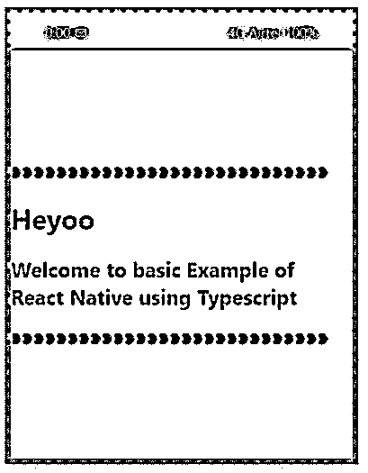
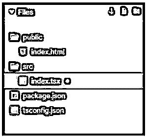
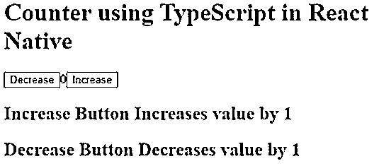
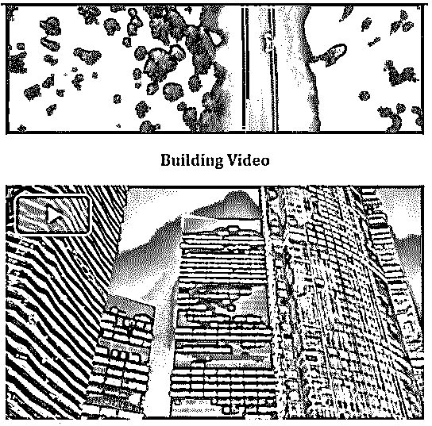

# React 本机类型脚本

> 原文：<https://www.educba.com/react-native-typescript/>

## React 本机类型脚本简介

以下文章提供了 React 本机类型脚本的概述。TypeScript 为我们提供了非强制性的接口、静态类型和类。Typescript 在开发人员中非常受欢迎，这些开发人员早期使用比 JavaScript 更结构化的语言，但是现在他们已经开始使用 JavaScript 了。TypeScript 提供了更好的工具，并允许集成开发环境提供一个更好的环境，该环境可以在键入代码时发现常见错误，而不是一次性键入整个代码并运行它。对于创建大型健壮的 JavaScript 项目，使用 TypeScript 可能会产生更好的软件。TypeScript 非常好地向后兼容了 JavaScript 的版本。

### 打字稿的工作

*   当我们将任何常规项目的 package.json 文件与使用 Typescript 的项目的 package.json 文件进行匹配时，我们将能够看到在 devDependencies 中存在一些@types 的模块。
*   对于我们所依赖的库，这些模块作为类型声明文件工作。因此，库中使用的类型很容易被 Typescript 理解。
*   react Native Typescript Transformer 是一种 Babel Transformer，它有助于。tsx 代码，使其能够在 React Native 环境中轻松使用。
*   Typescript 库帮助我们使用 Typescript 的特性。

**使用 TypeScript 创建 React 本地项目的语法:**

<small>网页开发、编程语言、软件测试&其他</small>

`react-native init RNTypeScript
--template typescript
&& node RNTypeScript/setup.js`

### React 本机类型脚本的示例

下面是提到的例子:

#### 示例#1

在 React Native 中使用 TypeScript 的基本示例。

在下面的示例中，一个简单的内容使用 TypeScript 以不同的颜色样式显示在应用程序内的一个框中。构建应用程序的所有依赖项都是从 package.json 下载的。

用于实现以下代码的文件是:

**a. App.tsx**

`import * as React from "react";
import { View
, Text
, StyleSheet } from "react-native";
const styles = StyleSheet.create({
container: {
flex: 1,
backgroundColor: "#84f5ea",
justifyContent: "center",
alignItems: "center"
}
});
function App() {
return (
<View style={styles.container}>
<Text>
<h3>{'\u2765'}{'\u2765'}{'\u2765'}{'\u2765'}{'\u2765'}{'\u2765'}{'\u2765'}{'\u2765'}{'\u2765'}{'\u2765'}{'\u2765'}{'\u2765'}{'\u2765'}{'\u2765'}{'\u2765'}{'\u2765'}{'\u2765'}{'\u2765'}{'\u2765'}{'\u2765'}{'\u2765'}{'\u2765'}{'\u2765'}{'\u2765'}{'\u2765'}{'\u2765'}{'\u2765'}{'\u2765'}</h3>
<h1>Heyoo</h1>
<h2>Welcome to basic Example of React Native using Typescript</h2>
<h3>{'\u2765'}{'\u2765'}{'\u2765'}{'\u2765'}{'\u2765'}{'\u2765'}{'\u2765'}{'\u2765'}{'\u2765'}{'\u2765'}{'\u2765'}{'\u2765'}{'\u2765'}{'\u2765'}{'\u2765'}{'\u2765'}{'\u2765'}{'\u2765'}{'\u2765'}{'\u2765'}{'\u2765'}{'\u2765'}{'\u2765'}{'\u2765'}{'\u2765'}{'\u2765'}{'\u2765'}{'\u2765'}</h3>
</Text>
</View>
);
}
export default App;`

**b. index.tsx**

`import * as React from "react";
import { View
, Text
, StyleSheet
, AppRegistry } from "react-native";
import App from "./App";
const styles = StyleSheet.create({
window: {
margin: 12,
flex: 1,
flexDirection: "column",
borderWidth: 6,
borderStyle: "dotted",
maxWidth: 360,
backgroundColor: "#e32d9a"
},
statusBar: {
height: 38,
paddingHorizontal: 35,
flexDirection: "row",
justifyContent: "space-between",
alignItems: "center",
},
statusBarItem: {
color: "#e8f5b8"
},
app: {
flex: 1,
backgroundColor: "#e994f7"
}
});
const PhoneWindow = (props: any) => (
<View style={styles.window}>
<View style={styles.statusBar}>
<Text style={styles.statusBarItem}>0:00 {'\u2709'}</Text>
<Text style={styles.statusBarItem}>{"4G Airtel 100%"}</Text>
</View>
<View style={styles.app}>
<App />
</View>
</View>
);
const rootTag = document.getElementById("root");
AppRegistry.registerComponent("App", () => PhoneWindow);
AppRegistry.runApplication("App", { rootTag });`

**c. tsconfig.json**

`{
"include": [
"./src/*"
],
"compilerOptions": {
"lib": [
"dom",
"es2017"
],
"jsx": "react"
}
}`

**输出:**

#### 实施例 2

在 React Native 中使用 TypeScript 的计数器。

在下面的例子中，我们在应用程序中使用 TypeScript 开发了一个计数器，其中“增加”按钮将值增加 1,“减少”按钮将值减少 1。

用于实现以下代码的文件是:

**a. index.tsx**

`import * as React from "react";
import { render } from "react-dom";
interface IState {
count: number;
}
class App extends React.Component<{}, IState> {
public readonly state = {
count: 0
};
private handleClick = (
event: React.MouseEvent<HTMLButtonElement>
) => {
const type: string = event.currentTarget.title;
this.setState(({ count }) => ({
count: type === "decrement" ?
count - 1
: count + 1
}));
};
public render() {
return (

<h1>Counter using TypeScript in React Native</h1>
<button title="decrement" onClick={this.handleClick}>
Decrease
</button>
{this.state.count}
<button title="increment" onClick={this.handleClick}>
Increase
</button>
<h2>Increase Button Increases value by 1</h2>
<h2>Decrease Button Decreases value by 1</h2>

);
}
}
render(<App />, document.getElementById("root"));`

**b. tsconfig.json**

`{
"compilerOptions": {
"outDir": "build/dist",
"module": "esnext",
"target": "es5",
"lib": ["es6", "dom"],
"sourceMap": true,
"allowJs": true,
"jsx": "react",
"moduleResolution": "node",
"rootDir": "src",
"forceConsistentCasingInFileNames": true,
"noImplicitReturns": true,
"noImplicitThis": true,
"noImplicitAny": true,
"strictNullChecks": true,
"suppressImplicitAnyIndexErrors": true,
"noUnusedLocals": true
},
"exclude": [
"node_modules",
"build",
"scripts",
"acceptance-tests",
"webpack",
"jest",
"src/setupTests.ts"
] }`

**输出:**

#### 实施例 3

使用 TypeScript 在 React 本机应用程序中进行视频链接。

在下面的例子中，我们使用 import videojs 从“video.js”通过 TypeScript 将 2 个 mp4 视频链接到应用程序；.

用于实现以下代码的文件有:

**a. index.tsx**

`import * as React from "react";
import { render } from "react-dom";
import VideoPlayer1 from "./video";
import VideoPlayer2 from "./video";
import "./styles.css";
const videoJsOptions1 = {
sources: [
{
src: "https://vod-progressive.akamaized.net/exp=1597215699~acl=%2A%2F1091076383.mp4%2A~hmac=79427f80a30ea33800277ff3ae1acb4a6534099d2a8eede24126830bc8ebf635/vimeo-prod-skyfire-std-us/01/2696/11/288484037/1091076383.mp4?filename=Pexels+Videos+1394254.mp4",
type: "video/mp4"
}
] };
const videoJsOptions2 = {
sources: [
{
src: "https://vod-progressive.akamaized.net/exp=1597216269~acl=%2A%2F588677125.mp4%2A~hmac=723c7ca3177420e005ffcbfd22667b5f1e2b6eaf1155c735fd1213445dc452c9/vimeo-prod-skyfire-std-us/01/1033/7/180168748/588677125.mp4?filename=Time+Lapse+Video+of+Tall+Buildings.mp4",
type: "video/mp4"
}
] };
function App() {
return (

<h1>Welcome to my Video Page</h1>
<h3>Nature Video</h3>
<VideoPlayer1 options={videoJsOptions1} />
<h3>Building Video</h3>
<VideoPlayer2 options={videoJsOptions2} />

);
}
const rootElement = document.getElementById("root");
render(<App />, rootElement);`

**b. styles.css**

`.App {
font-family: Cambria
, Cochin
, Georgia
, Times
, 'Times New Roman'
, serif;
text-align: center;
text-decoration-style: dotted;
}`

**c. video.tsx**

`import * as React from "react";
import videojs from "video.js";
import "video.js/dist/video-js.css";
interface IVideoPlayerProps {
options: videojs.PlayerOptions;
}
const initialOptions: videojs.PlayerOptions = {
controls: true,
fluid: true,
controlBar: {
volumePanel: {
inline: false
}
}
};
const VideoPlayer: React.FC<IVideoPlayerProps> = ({ options }) => {
const videoNode = React.useRef<HTMLVideoElement>();
const player = React.useRef<videojs.Player>();
React.useEffect(() => {
player.current = videojs(videoNode.current, {
...initialOptions,
...options
}).ready(function() {
});
return () => {
if (player.current) {
player.current.dispose();
}
};
}, [options]);
return <video ref={videoNode} className="video-js" />;
};
export default VideoPlayer;`

**d. tsconfig.json**

`{
"include": [
"./src/*"
],
"compilerOptions": {
"lib": [
"dom",
"es2015"
],
"jsx": "react"
}
}`

**输出:**

### 推荐文章

这是一个反应原生类型脚本的指南。这里我们分别讨论引言、打字稿的工作和例子。您也可以看看以下文章，了解更多信息–

1.  [反应原生模态](https://www.educba.com/react-native-modal/)
2.  [反应原生旋转木马](https://www.educba.com/react-native-carousel/)
3.  [React 本机调试器](https://www.educba.com/react-native-debugger/)
4.  [反应原生抽屉](https://www.educba.com/react-native-drawer/)

