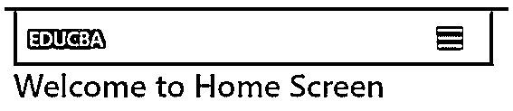
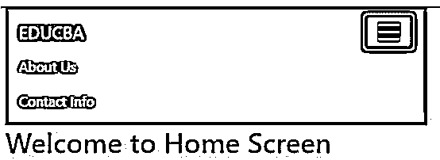
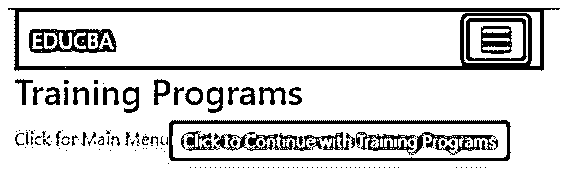
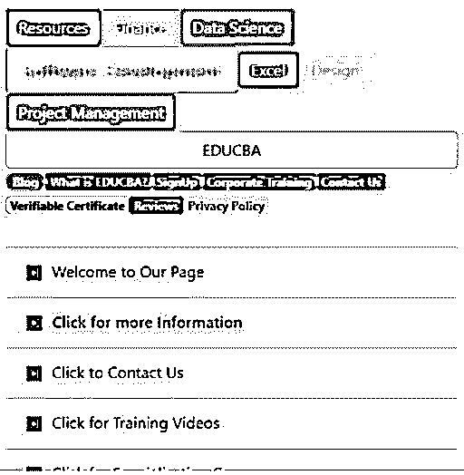
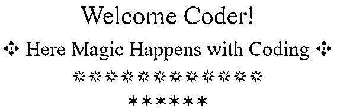

# 反应引导

> 原文：<https://www.educba.com/react-bootstrap/>

## React 引导程序简介

React Bootstrap 旨在取代 Bootstrap JavaScript，并使其与任何用户界面生态系统更加兼容。每一个组件都是从零开始构建的，不依赖于 jQuery。多年来，它不断发展，已经成为用户界面基础的最佳选择。使用 bootstrap 样式表，它可以使用所有的 Bootstrap 方案来使网站变得精彩。每个功能都完全由 React 控制，使其更易于使用。

### React 引导的工作原理及在 React 中添加引导的方法

*   在 React 引导包的帮助下。
*   借助自举依赖安装。
*   借助 Bootstrap CDN。

#### 1.借助引导包在 react 中添加引导

要在 React 中包含 bootstrap，有两种方法:

<small>网页开发、编程语言、软件测试&其他</small>

*   反应引导
*   反应阱

**react-bootstrap 示例:**

下面的例子着重于使用 react-bootstrap 的加法:

它随 npm 一起安装:

`npm install –save react-bootstrap`

我们的 App.js 文件包括:

`import "bootstrap/dist/css/bootstrap.min.css";`

一旦我们安装了软件包，这些组件就可以在任何组件文件中使用。

公用文件夹中的组件:

*   index.html

src 文件夹中的组件:

*   AOC folder
*   App.css
*   App.js
*   Menu.js
*   索引. js
*   样式. css

AOC 文件夹中的组件:

*   AboutUS.js
*   关于 us description . js

形容词（adjective 的缩写）index.html

**代码:**

`<!DOCTYPE html>
<html lang="en">
<head>
<meta charset="utf-8" />
<meta name="viewport" content="width=device-width, initial-scale=1" />
<title>React-Bootstrap</title>
</head>
<body>

</body>
</html>`

b.AboutUS.js

**代码:**

`import React
, { Component } from "react";
import { Jumbotron
, Button } from "react-bootstrap";
import { Link } from "react-router-dom";
export default class PasoAOCInicio extends Component {
constructor() {
super();
this.state = {
name: "React"
};
}
render() {
return (
<Jumbotron>
<h1>EDUCBA</h1>

EDUCBA is a best platform for online training and video courses.
We provide trainings related to latest emerging technologies.
We help in building up the careers of professionals into these emerging fields.

<Button
variant="primary"
to="/AOC/pasoAOCDatosIdentificativos"
as={Link}
>
Click for the Training Programs
</Button>

</Jumbotron>
);
}
}`

碳（carbon 的缩写）关于 us description . js

**代码:**

`import React
, { Component } from "react";
import { Button } from "react-bootstrap";
import { Link } from "react-router-dom";
export default class PasoAOCDatosIdentificativos extends Component {
constructor() {
super();
this.state = {
name: "React"
};
}
render() {
return (

<h2>Training Programs</h2>
<Link to="">Click for Main Menu</Link>
<Button
variant="primary"
to="/AOC/pasoAOCDatosIdentificativos"
as={Link}
>
Click to Continue with Training Programs
</Button>

);
}
}`

d.App.css

e.App.js

**代码:**

`import React
, { useState } from "react";
import { Row
, Col } from "react-bootstrap";
import { HashRouter as Router
, Route
, Redirect } from "react-router-dom";
import PasoAOCInicio from "./AOC/AboutUS.js";
import PasoAOCDatosIdentificativos from "./AOC/AboutUsdescriptive.js";
import Menu from "./Menu";
import "bootstrap/dist/css/bootstrap.min.css";
import "./App.css";
const Home = () => <h2>Welcome to Home Screen</h2>;
const Pagina2 = () => <h2>Contact Us</h2>;
const App = () => (

<Row>
<Col>
<Menu />
</Col>
</Row>
<Row>
<Col>
<Route path="/" exact component={Home} />
<Route path="/home" component={Home} />
<Route path="/AOC/pasoAOCInicio" component={PasoAOCInicio} />
<Route
path="/AOC/pasoAOCDatosIdentificativos"
component={PasoAOCDatosIdentificativos}
/>
<Route path="/pagina2" component={Pagina2} />
</Col>
</Row>

);
export default App;`

氟（fluorine 的缩写）Menu.js

**代码:**

`import React from "react";
import Navbar from "react-bootstrap/Navbar";
import Nav from "react-bootstrap/Nav";
import { NavLink } from "react-router-dom";
const Menu = () => (
<Navbar collapseOnSelect expand="lg" bg="dark" variant="dark">
<Navbar.Brand href="#">EDUCBA</Navbar.Brand>
<Navbar.Toggle aria-controls="basic-navbar-nav" />
<Navbar.Collapse id="basic-navbar-nav">
<Nav className="mr-auto">
<Nav.Link as={NavLink} to="/AOC/pasoAOCInicio">
About Us
</Nav.Link>
<Nav.Link as={NavLink} to="/pagina2">
Contact Info
</Nav.Link>
</Nav>
</Navbar.Collapse>
</Navbar>
);
export default Menu;`

g.索引. js

**代码:**

`import React from "react";
import ReactDOM from "react-dom";
import HashRouter from "react-router-dom/HashRouter";
import Container from "react-bootstrap/Container";
import App from "./App";
ReactDOM.render(
<HashRouter>
<Container fluid="true">
<App />
</Container>
</HashRouter>,
document.getElementById("root")
);`

h.样式. css

**代码:**

`.App {
font-family: 'Times New Roman', Times, serif;
text-align: center;
}`

**输出:**

**带有反应陷阱的示例**

下面的例子着重于使用 reactstrap 的加法:

它随 npm 一起安装:

`npm install -g create-react-app`

我们的 index.jsx 文件包括:

`import "bootstrap/dist/css/bootstrap.css";`

一旦我们安装了 reactstrap 包，reactstrap 组件就可以在任何组件文件中使用。

公用文件夹中的组件:

*   index.html

src 文件夹中的组件:

*   BadgeList 文件夹
*   面包屑文件夹
*   按钮列表文件夹
*   下拉文件夹
*   列表组文件夹
*   AlertList.jsx
*   索引. js

BadgeList 文件夹中的组件:

*   index.jsx

面包屑文件夹中的组件:

*   索引. jsx
*   样式. css

按钮列表文件夹中的组件:

*   索引. jsx
*   样式. css

下拉文件夹中的组件:

*   indexxjsx

ListGroup 文件夹中的组件:

*   索引. jsx
*   样式. css

形容词（adjective 的缩写）index.jsx(在 BadgeList 文件夹中)

**代码:**

`import React from "react";
import { Badge } from "reactstrap";
const BadgeList = props => {
return (

<Badge color="secondary" pill>
Blog
</Badge>
<Badge color="primary" tag="div">
What is EDUCBA?
</Badge>
<Badge color="danger">SignUp</Badge>
<Badge color="success">Corporate Training</Badge>
<Badge color="info">Contact Us</Badge>
<Badge color="warning">Verifiable Certificate</Badge>
<Badge color="dark">Reviews</Badge>
<Badge color="light">Privacy Policy</Badge>

);
};
export default BadgeList;`

b.index.jsx(在 Breadcrumb 文件夹中)

**代码:**

`import React from "react";
import { Breadcrumb
, BreadcrumbItem } from "reactstrap";
import "bootstrap/dist/css/bootstrap.css";
import "./styles.css";
const styles = {
marginBottom: "21px"
};
const Bread = props => {
return (

<Breadcrumb tag="nav">
<BreadcrumbItem tag="a" href="#">
Click for Home Screen
</BreadcrumbItem>
<BreadcrumbItem tag="a" href="#">
Click for Blog Menu
</BreadcrumbItem>
<BreadcrumbItem tag="a" href="#">
Click for Training Menu
</BreadcrumbItem>
<BreadcrumbItem active tag="span">
Click for SignUp Menu
</BreadcrumbItem>
</Breadcrumb>

);
};
export default Bread;`

碳（carbon 的缩写）styles.css(在 Breadcrumb 文件夹中)

**代码:**

`.breadcrumb {
background-color: opaque;
}`

d.index.jsx(在 ButtonList 文件夹中)

**代码:**

`import React from "react";
import { Button } from "reactstrap";
import "bootstrap/dist/css/bootstrap.css";
import "./styles.css";
const ButtonList = props => {
return (

<Button active>Resources</Button>
<Button disabled>Finance</Button>
<Button href="#">Data Science</Button>
<Button color="success" size="lg">
Software Development
</Button>
<Button color="danger" className="add-class">
Excel
</Button>
<Button color="warning" outline>
Design
</Button>
<Button tag="span">Project Management</Button>
<Button color="warning" block>
EDUCBA
</Button>

);
};
export default ButtonList;`

e.styles.css(在 ButtonList 文件夹中)

**代码:**

`.btn-success {
background-color: #f082ff;
}`

氟（fluorine 的缩写）index.jsx(在下拉文件夹中)

**代码:**

`import React from "react";
import {
Dropdown
, DropdownToggle
, DropdownMenu
, DropdownItem
} from "reactstrap";
import "bootstrap/dist/css/bootstrap.css";
export default class DropdownComponent extends React.Component {
constructor(props) {
super(props);
this.toggle = this.toggle.bind(this);
this.state = {
dropdownOpen: false
};
}
toggle() {
this.setState({
dropdownOpen: !this.state.dropdownOpen
});
}
render() {
return (
<Dropdown isOpen={this.state.dropdownOpen} toggle={this.toggle}>
<DropdownToggle caret>Bundle Certification Courses</DropdownToggle>
<DropdownMenu>
<DropdownItem header>Financial Analyst Course</DropdownItem>
<DropdownItem disabled>Data Science Course</DropdownItem>
<DropdownItem>Software Development Course</DropdownItem>
<DropdownItem divider />
<DropdownItem>Excel VBA Course</DropdownItem>
</DropdownMenu>
</Dropdown>
);
}
}`

g.index.jsx(在 ListGroup 文件夹中)

**代码:**

`import React from "react";
import { ListGroup
, ListGroupItem } from "reactstrap";
import "./styles.css";
const Listgroup = props => {
return (
<ListGroup flush>
<ListGroupItem>Welcome to Our Page</ListGroupItem>
<ListGroupItem tag="a" href="#">
Click for more Information
</ListGroupItem>
<ListGroupItem>Click to Contact Us</ListGroupItem>
<ListGroupItem>Click for Training Videos</ListGroupItem>
<ListGroupItem>Click for Specialization Courses</ListGroupItem>
</ListGroup>
);
};
export default Listgroup;`

h.styles.css(在 ListGroup 文件夹中)

**代码:**

`.list-group {
margin: 31px 0;
}
a.list-group-item {
font-weight: 601;
}
.list-group-item::before {
content: "▶︎";
display: inline-block;
padding-right: 9px;
font-size: 13px;
line-height: 2;
}`

i. AlertList.jsx(在 src 文件夹中)

**代码:**

`import React from "react";
import { Alert } from "reactstrap";
const AlertList = props => {
return (

<Alert>Label</Alert>

);
};
export default AlertList;`

j.index.js(在 src 文件夹中)

**代码:**

`import React from "react";
import ReactDOM from "react-dom";
import ButtonList from "./ButtonList";
import BadgeList from "./BadgeList";
import AlertList from "./AlertList";
import Listgroup from "./ListGroup";
import Bread from "./Breadcrumb";
import DropdownComponent from "./Dropdown";
const styles = {
margin: "21px"
};
const App = () => {
return (

<ButtonList />
<BadgeList />
<Listgroup />
<Bread />
<DropdownComponent />

);
};
ReactDOM.render(<App />, document.getElementById("root"));`

k.index.html(在公共文件夹中)

**代码:**

`<!DOCTYPE html>
<html lang="en">
<head>
<meta charset="utf-8">
<meta name="viewport" content="width=device-width, initial-scale=1, shrink-to-fit=no">
<meta name="theme-color" content="#f082ff">
<link rel="manifest" href="%PUBLIC_URL%/manifest.json">
<link rel="shortcut icon" href="%PUBLIC_URL%/favicon.ico">
<title>React App</title>
</head>
<body>
<noscript>
To run this kindly enable JavaScript.
</noscript>

</body>
</html>`

**输出:**

#### 2.借助引导依赖安装在 react 中添加引导

它随 npm 一起安装:

`npm install bootstrap
npm install jquery popper.js`

我们的 index.js 文件包括:

`import "../node_modules/bootstrap/dist/css/bootstrap.min.css";`

现在让我们编码:

公用文件夹中的组件:

*   index.html

src 文件夹中的组件:

*   组件文件夹
*   索引. js
*   样式. css

组件文件夹中的组件:

*   模板文件夹
*   HelloWorld.js

模板文件夹中的组件:

*   HelloWorldHtml.jsx

形容词（adjective 的缩写）HelloWorldHtml.jsx

**代码:**

`import React from "react";
export const HelloWorldHtml = () => {
return (

<h1>Ciao!</h1>

Let’s Explore

<button className="btn btn-dark">Click to Proceed</button>

);
};`

b.HelloWorld.js

**代码:**

`import React, { Component } from "react";
import { HelloWorldHtml } from "./templates/HelloWorldHtml.jsx";
class HelloWorld extends Component {
render() {
return <HelloWorldHtml />;
}
}
export default HelloWorld;`

碳（carbon 的缩写）索引. js

**代码:**

`import React from "react";
import ReactDOM from "react-dom";
import bootstrap from "bootstrap";
import "../node_modules/bootstrap/dist/css/bootstrap.min.css";
import HelloWorld from "./components/HelloWorld";
function App() {
return (

<HelloWorld />

);
}
const rootElement = document.getElementById("root");
ReactDOM.render(<App />, rootElement);`

d.样式. css

e.index.html

**代码:**

`<!DOCTYPE html>
<html lang="en">
<head>
<meta charset="utf-8" />
<meta
name="viewport"
content="width=device-width, initial-scale=1, shrink-to-fit=no"
/>
<link rel="manifest" href="%PUBLIC_URL%/manifest.json" />
<link rel="shortcut icon" href="%PUBLIC_URL%/favicon.ico" />
<title>React Bootstrap Application</title>
</head>
<body>

</body>
</html>`

**输出:**

#### 3.借助自举 CDN 在 react 中添加自举

这是添加 bootstrap 的最简单方法。像任何其他 CDN 一样，CDN 在 index.html 的公共文件夹或 react 项目中。

以下是 index.html 文件中使用的 CDN url:

**<link rel = " manifest " href = " % PUBLIC _ URL %/manifest . JSON ">**

**< link rel= "快捷图标" href = " % PUBLIC _ URL %/favicon . ico ">**

使用的组件/文件:

*   Hello.js
*   index.html
*   index.js

形容词（adjective 的缩写）Hello.js

**代码:**

`import React from 'react';
export default ({ name }) => <h1>Welcome {name}!</h1>;`

b.index.html

**代码:**

`<!DOCTYPE html>
<html lang="en">
<head>
<meta charset="utf-8">
<meta name="viewport" content="width=device-width, initial-scale=1, shrink-to-fit=no">
<meta name="theme-color" content="#f082ff">
<link rel="manifest" href="%PUBLIC_URL%/manifest.json">
<link rel="shortcut icon" href="%PUBLIC_URL%/favicon.ico">
<title>React BootStrap CDN App</title>
</head>
<body>
<noscript>
To run this please enable JavaScript.
</noscript>

</body>
</html>

`

碳（carbon 的缩写）索引. js

**代码:**

`import React from 'react';
import { render } from 'react-dom';
import Hello from './Hello';
const styles = {
fontFamily: 'times',
textAlign: 'center',
};
class App extends React.Component {
render() {
return (

<Hello name="Coder" />
<h2>{'\u2725'} Here Magic Happens with Coding {'\u2725'}</h2>
<h3>{'\u2735'}{'\u2735'}{'\u2735'}{'\u2735'}{'\u2735'}{'\u2735'}{'\u2735'}{'\u2735'}{'\u2735'}{'\u2735'}{'\u2735'}{'\u2735'}</h3>
<h4>{'\u2736'}{'\u2736'}{'\u2736'}{'\u2736'}{'\u2736'}{'\u2736'}</h4>

);
}
}
render(<App />, document.getElementById('root'));`

**输出:**

**

** 

### 结论

在上述文章的基础上，我们看到了如何使用它以及使用它的不同方法。我们通过不同的例子来了解它的工作原理以及如何根据网站的不同需求来使用它。

### 推荐文章

这是一个反应引导的指南。这里我们分别讨论在 react 中添加 bootstrap 的介绍和使用方法。您也可以看看以下文章，了解更多信息–

1.  [React Native SectionList](https://www.educba.com/react-native-sectionlist/)
2.  [React 本地认证](https://www.educba.com/react-native-authentication/)
3.  [React-原生日历](https://www.educba.com/react-native-calendar/)
4.  [反应原生模板](https://www.educba.com/react-native-template/)

