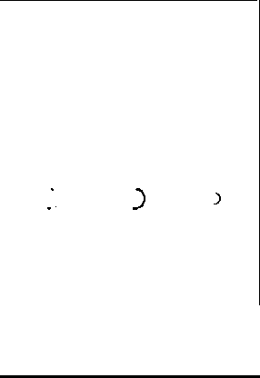

# 反应本地活性指示剂

> 原文：<https://www.educba.com/react-native-activityindicator/>


## 反应本地活动指示符的定义

React native activity indicator 是一个指示器组件，将用于创建加载器指示器，在该指示器中，我们还可以为指示器添加自定义样式和大小(这将用于根据我们的屏幕制作大小)，react-native activity 指示器的主要功能是它具有 animate 属性(animate 属性，将用于隐藏活动指示器)，我们可以为给定的指示器活动定义颜色属性(颜色属性，将用于处理不同情况下的指示器活动的颜色)。

### 反应本地活动指示器是如何工作的？

反应本地指示器活动工作原理我们可以在下面给出的步骤中定义。

<small>网页开发、编程语言、软件测试&其他</small>

*   导入的模块将用于传递参数(如颜色、大小和动画)
*   当我们定义动画属性时，我们需要为它传递一个布尔值(真和假)。它的值将是决定因素，如果它的值是假的，它将隐藏活动指标。
*   它有我们将在指示器活动中传递的颜色属性，这个属性将改变指示器的颜色。如果我们想将指示器设置为某种特定的颜色，例如在成功加载的情况下，我们可以将它们设置为绿色。万一失败，我们也设置一些其他颜色。
*   当我们将属性 size 的值传递给它时，它将改变活动指示器的大小。在许多情况下，我们希望根据屏幕将一个指示器放入任何特定的大小，我们可以定义它的值并为它传递相同的值。

### 反应本地活动指示符道具

反应本地活动指示符道具如下:

#### 大小

此属性用于管理指示器的大小，很多时候，指示器的大小可能不适合任何给定的设备，在这种情况下，我们可以使用此属性来管理不同应用程序大小的各种大小。

#### 颜色

颜色属性用于为指示器的项目着色，在不同类型的指示中，我们可以根据需要使用不同的颜色，例如，如果是与任何成功相关的，我们可以使用绿色信号，如果是任何警告或任何危险，我们可以使用红色。安卓和 IOS 默认会是青色和灰色。

#### 鼓舞

该属性是一个真或假的布尔值。该值定义了指示器的可见性，如果为真，则指示器可见，如果为假，则指示器不可见。例如，假设我们有一种情况，我们想显示某个给定时间的指标，只有在这种情况下，我们可以定义设置时间，在该设置时间内，我们可以将其值更改为 false，指标将不可见。

### 例子

下面的例子包含了所有上述属性的使用，让我用步骤 b 来解释下面的例子。

#### 示例#1

*   在第一步中，我们创建了一个类名指示器示例，这个类扩展了 react js 的核心 react-native 类。
*   我们正在导入 react-native ActivityIndicator 属性，它将被进一步使用。
*   我们已经定义了一个默认为真的指示器动画状态值，因为我们已经定义了用于隐藏指示器的属性动画。
*   我们定义了一个函数 closeIndicator，它包含了指示器动画设置值的定时器逻辑。
*   在 render 函数中，我们返回一些指示器。第一个指示器是粉红色的，它包含 animator 属性，当我们为它设置了定时器功能时，它将被改变。该定时器功能将调用并更改指示器动画的值。我们把它的大小定义为大
*   我们为绿色和大尺寸定义的第二个指标
*   渲染函数中的第三个指示器，我们定义了小尺寸和红色。
*   最后，我们为它定义了 indicatorStyle，它将被设计来寻找指标。在这一节中，无论我们写什么，都必须提到活动指标。

为了更好地理解，请遵循下面给出的输出示例和屏幕。

**代码:**

```
import React, { Component } from 'react'
import {
ActivityIndicator,
AppRegistry,
StyleSheet,
Text,
View,
} from 'react-native'
export default class indicatorExample extends Component {
state = { indicatorAnimating: true }
closeIndicator = () => setTimeout(() => this.setState({
indicatorAnimating: false }), 6000)
componentDidMount = () => this.closeIndicator()
render() {
const indicatorAnimating = this.state.indicatorAnimating
return (
<View style={[indicagtorStyle.containerStyle, indicagtorStyle.horizontalStyle]} >
<ActivityIndicator  animating = {indicatorAnimating} size="large" color="pink" />
<ActivityIndicator size="large" color="green" />
<ActivityIndicator size="small" color="red" />
</View>
)
}
}
const indicagtorStyle = StyleSheet.create({
containerStyle: {
flex: 1,
justifyContent: 'center'
},
horizontalStyle: {
flexDirection: 'row',
justifyContent: 'space-around',
padding: 11
}
})
AppRegistry.registerComponent('App', () => ActivityIndicatorDemo)
```

**输出:**




#### 实施例 2

下面的例子是为 react-native 的属性设置动画。我们可以在下面的步骤中解释这个例子。

*   我们定义了一个 react 本地类，名字表示我们扩展 react 核心类的例子
*   在类内部，我们定义了设置超时函数，它将动画属性改为 false，该属性被初始化为动画值 true。
*   渲染函数将得到一个调用，它将显示活动指示器 6 秒钟，之后动画值将变为 false，这将隐藏活动指示器。

**代码:**

```
import React, { Component } from 'react'
import {
ActivityIndicator,
AppRegistry,
StyleSheet,
Text,
View,
} from 'react-native'
export default class indicatorExample extends Component {
state = { indicatorAnimating: true }
closeIndicator = () => setTimeout(() => this.setState({
indicatorAnimating: false }), 6000)
componentDidMount = () => this.closeIndicator()
render() {
const indicatorAnimating = this.state.indicatorAnimating
return (
<View style={[indicagtorStyle.containerStyle, indicagtorStyle.horizontalStyle]} >
<ActivityIndicator  animating = {indicatorAnimating} size="large" color="pink" />
</View>
)
}
}
const indicagtorStyle = StyleSheet.create({
containerStyle: {
flex: 1,
justifyContent: 'center'
},
horizontalStyle: {
flexDirection: 'row',
justifyContent: 'space-around',
padding: 11
}
})
AppRegistry.registerComponent('App', () => ActivityIndicatorDemo)
```

**输出:**


### 推荐文章

这是对本地活动指示器作出反应的指南。在这里，我们讨论 react native activityindicator 如何与不同的示例及其代码实现一起工作。您也可以阅读以下文章，了解更多信息——

1.  [React Native ListView](https://www.educba.com/react-native-listview/)
2.  [React Native ScrollView](https://www.educba.com/react-native-scrollview/)
3.  [反应原生状态栏](https://www.educba.com/react-native-statusbar/)
4.  [反应原生 Flexbox](https://www.educba.com/react-native-flexbox/)


