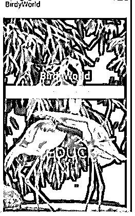
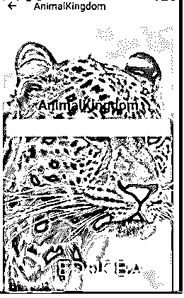
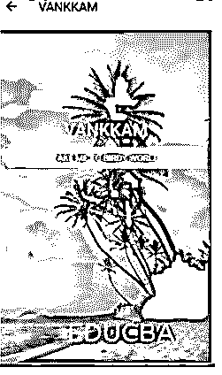
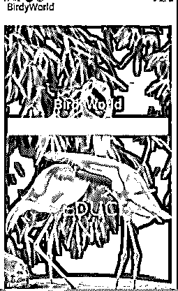

# 全局变量本地反应

> 原文：<https://www.educba.com/global-variable-react-native/>

## 全局变量 React Native 简介

以下文章提供了全局变量 React Native 的概要。默认情况下，react native 中有两种变量。这些类型的变量是局部变量和全局变量。为了在定义的范围内使用变量，使用局部变量；为了在整个代码中使用变量，并在代码之间的任何地方自由地改变变量的值，必须使用全局变量。React Native 支持全局变量，它允许在执行多个活动时自由使用它们。

**语法:**

<small>网页开发、编程语言、软件测试&其他</small>

单独开发的变量存储在全局变量中。

`module.Store = {
BirdyWorld() {
return 'BirdyWorld';
},
AnimalKingdom() {
return 'AnimalKingdom';
},
VANKKAM() {
return 'VANKKAM'
}
};
if (global) {
global.Store = module.Store;
}`

### 全局变量反应本地与示例

对于开发任何移动或 web 应用程序，编码人员都有必要声明全局范围变量。全局范围变量是在首次初始化后，可以从代码、屏幕或活动的任何部分访问的变量。它还允许从代码的任何部分修改变量值。全局变量的使用方式与局部变量相同；唯一的区别是范围是全局的。使用 React Native 时，只需在变量前添加一个全局前缀，就可以创建全局范围变量。

**举例:**

在下面的代码中，用于正确执行的主要组件是:

*   BirdyWorld.js
*   AnimalKingdom.js
*   欢迎. js
*   Everywhere.js
*   App.js

下面，所有导航器元素都是单独开发的；然后，它们被存储在全局变量中，然后通过单击相应的按钮调用该变量来浏览不同的页面。下面开发的应用程序是通过一个全局变量在不同窗口间导航的完美例子。首先，代码执行时会出现 BirdyWorld 窗口，当点击“欢迎来到 BIRDY LAND”按钮时，它会进入 AnimalKingdom 窗口，当点击“欢迎来到动物王国”按钮时，它会进入 VANKKAM 窗口。最后，当点击“带我去鸟世界”按钮时，它会回到鸟世界窗口。

形容词（adjective 的缩写）BirdyWorld.js

**代码:**

`import React
, { Component } from 'react';
import Constants from 'expo-constants';
import { SafeAreaView
, View
, Text
, ImageBackground
, StyleSheet
, Image
, Button
, Alert
} from 'react-native';
export default class BirdyWorld extends Component {
render() {
return (
<SafeAreaView style={
decoration.docker
}>
<ImageBackground
source={{
uri:
'https://images.pexels.com/photos/1181181/pexels-photo-1181181.jpeg?auto=compress&cs=tinysrgb&dpr=1&w=500',
}}
style={
{flex: 1}
}
>
<View style={
decoration.dockers
}>
<Text style={
decoration.titleee
}>
{
Store.BirdyWorld()
}</Text>
<Button
color="#3bedbe"
borderRightColor= "#f58c58"
borderLeftColor= "#f50c18"
borderTopColor= "#140ddb"
borderBottomColor= "#ba1658"
title='Welcome to Birdy Land'
onPress={() => {
this.props.navigation.navigate('AnimalKingdom')
}} />
<Image
source={{
uri:
'https://cdn.educba.com/academy/wp-content/uploads/2020/05/cropped-website_logo_transparent_background_white.png.webp',
}}
style={{
width: 300,
height: 300,
resizeMode: 'center',
opacity: 0.5,
}}
/>
</View>
</ImageBackground>
</SafeAreaView>
)
}
}
const decoration = StyleSheet.create({
dockers: {
flex: 1,
justifyContent: 'center',
paddingTop: Constants.statusBarHeight,
padding: 8,
},
docker: {
flex: 1,
padding: 10,
},
titleee: {
fontSize: 28,
fontWeight: 'bold',
textAlign: 'center',
padding: 10,
color: '#cbf268',
},
});`

b.AnimalKingdom.js

**代码:**

`import React
, { Component } from 'react';
import Constants from 'expo-constants';
import { SafeAreaView
, View
, Text
, ImageBackground
, StyleSheet
, Image
, Button
, Alert } from 'react-native';
export default class AnimalKingdom extends Component {
render() {
return (
<SafeAreaView style={decoration.docker}>
<ImageBackground
source={{
uri:
'https://images.pexels.com/photos/87403/cheetah-leopard-animal-big-87403.jpeg?auto=compress&cs=tinysrgb&dpr=1&w=500',
}}
style={
{flex: 1}
}
>
<View style={
decoration.dockers
}>
<Text style={
decoration.titleee
}>{
Store.AnimalKingdom()
}
</Text>
<Button
color="#fcb058"
borderRightColor= "#f58c58"
borderLeftColor= "#f50c18"
borderTopColor= "#140ddb"
borderBottomColor= "#ba1658"
title='WElcome TO ANIMAL KINGDOM'
onPress={() => {
this.props.navigation.navigate('VANKKAM')
}} />
</View>
<Image
source={{
uri:
'https://cdn.educba.com/academy/wp-content/uploads/2020/05/cropped-website_logo_transparent_background_white.png.webp',
}}
style={{
width: 300,
height: 300,
resizeMode: 'center',
opacity: 0.5,
}}
/>
</ImageBackground>
</SafeAreaView>
)
}
}
const decoration = StyleSheet.create({
dockers: {
flex: 1,
justifyContent: 'center',
paddingTop: Constants.statusBarHeight,
padding: 8,
},
docker: {
flex: 1,
padding: 10,
},
titleee: {
fontSize: 28,
fontWeight: 'bold',
textAlign: 'center',
padding: 10,
color: '#0d0c0f',
},
});`

碳（carbon 的缩写）欢迎. js

**代码:**

`import React
, { Component } from 'react';
import Constants from 'expo-constants';
import { SafeAreaView
, View
, Text
, ImageBackground
, StyleSheet
, Image
, Button
, Alert } from 'react-native';
export default class VANKKAM extends Component {
render() {
return (
<SafeAreaView style={
decoration.docker
}>
<ImageBackground
source={{
uri:
'https://images.pexels.com/photos/3214944/pexels-photo-3214944.jpeg?auto=compress&cs=tinysrgb&dpr=1&w=500',
}}
style={
{flex: 1}
}
>
<View style={
decoration.dockers
}>
<Text style={
decoration.titleee
}
>{
Store.VANKKAM()
}</Text>
<Button
color="#ed3469"
borderRightColor= "#f58c58"
borderLeftColor= "#f50c18"
borderTopColor= "#140ddb"
borderBottomColor= "#ba1658"
title='TAKE ME TO BIRDY WORLD'
onPress={() => {
this.props.navigation.navigate('BirdyWorld')
}} />
</View>
<Image
source={{
uri:
'https://cdn.educba.com/academy/wp-content/uploads/2020/05/cropped-website_logo_transparent_background_white.png.webp',
}}
style={{
width: 300,
height: 300,
resizeMode: 'center',
opacity: 0.5,
}}
/>
</ImageBackground>
</SafeAreaView>
)
}
}
const decoration = StyleSheet.create({
dockers: {
flex: 1,
justifyContent: 'center',
paddingTop: Constants.statusBarHeight,
padding: 8,
},
docker: {
flex: 1,
padding: 10,
},
titleee: {
fontSize: 28,
fontWeight: 'bold',
textAlign: 'center',
padding: 10,
color: '#e7f754',
},
});`

d.Everywhere.js

**代码:**

`module.Store = {
BirdyWorld() {
return 'BirdyWorld';
},
AnimalKingdom() {
return 'AnimalKingdom';
},
VANKKAM() {
return 'VANKKAM'
}
};
if (global) {
global.Store = module.Store;
}`

e.App.js

**代码:**

`import React from 'react';
import { SafeAreaView
, View
, Text
, ImageBackground
, StyleSheet
, Image
, Button
, Alert
} from 'react-native';
import VANKKAM from './Welcome';
import AnimalKingdom from './AnimalKingdom';
import BirdyWorld from './BirdyWorld';
import './Everywhere';
import { createStackNavigator
, createAppContainer } from 'react-navigation';
const Application = createStackNavigator({
BirdyWorld: {
screen: BirdyWorld,
navigationOptions: {
title: 'BirdyWorld',
},
},
VANKKAM: {
screen: VANKKAM,
navigationOptions: {
title: 'VANKKAM',
},
},
AnimalKingdom: {
screen: AnimalKingdom,
navigationOptions: {
title: 'AnimalKingdom',
},
},
});
export default createAppContainer(Application);`

**输出:**

**关于代码执行:**

**点击“欢迎来到小鸟乐园”按钮:**

**点击“欢迎来到动物王国”按钮:**

**点击“带我去小鸟世界”按钮:**

### 结论

在上面代码的基础上，我们理解了 reactions native 中全局变量的概念。此外，我们了解了如何全局使用变量，以及在 react native 中编码时它如何帮助我们。

### 推荐文章

这是一个全局变量 React Native 的指南。这里我们分别用一个例子来讨论引入和全局变量 react native。您也可以看看以下文章，了解更多信息–

1.  [React 原生字体](https://www.educba.com/react-native-fonts/)
2.  [反应原生叠加](https://www.educba.com/react-native-overlay/)
3.  [反应原生元素](https://www.educba.com/react-native-element/)
4.  [React 原生键盘回避视图](https://www.educba.com/react-native-keyboardavoidingview/)

