# Ruby 命令

> 原文：<https://www.educba.com/ruby-commands/>

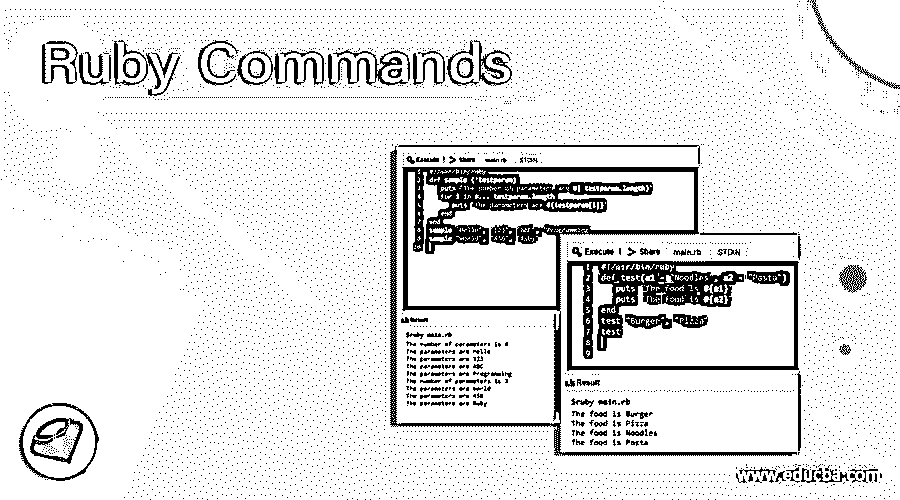

## Ruby 命令简介

Ruby 是一种开源编程语言。它是被解释的，也是面向对象的。红宝石是由松本幸宏创作的。Ruby 是以一种宝石命名的，因此它的创造者称它为编程语言中的瑰宝。这里我们将讨论不同类型的 Ruby 命令。

Ruby 的设计考虑了以下因素——简单性、扩展性、完整性和可移植性。Ruby 可以在大多数基于 UNIX 的平台上工作。Ruby 的主要部分是在 Linux 上构建的。Ruby 还可以在 Windows、DOS、Mac 等常见平台上运行。

<small>网页开发、编程语言、软件测试&其他</small>

### 基本 Ruby 命令

以下是解释的基本命令。

#### 1.用 Ruby 打印字符串的简单命令

`#!/usr/bin/ruby –w
puts “Hello, Ruby!”`

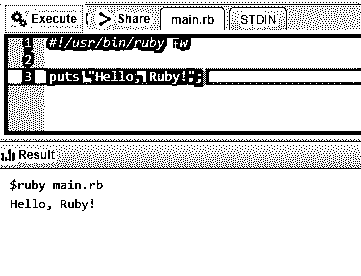

#### 2.使用 EOF 打印多行字符串的简单命令

`#!/usr/bin/ruby –w
print <<EOF
Multiple line string.
First wayEOF
print <<"EOF";                # same as above
Multiple line string.
Second way
EOF`

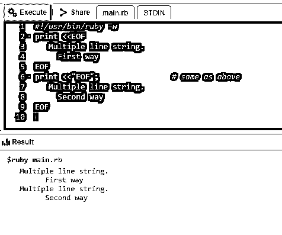

#### 3.使用执行命令打印多行字符串的简单命令

`#!/usr/bin/ruby –w
print <<`EOC`                 # execute commands
echo First Statement
echo Second Statement
EOC`

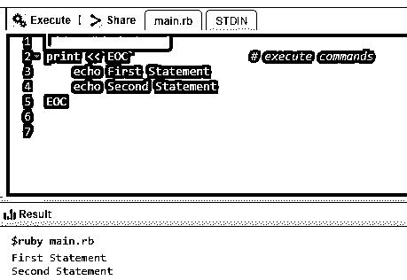

#### 4.通过堆叠打印多行字符串的简单命令。

`#!/usr/bin/ruby –w
print <<"a", <<"b"  # you can stack them
I said foo.
a
I said bar.
b`

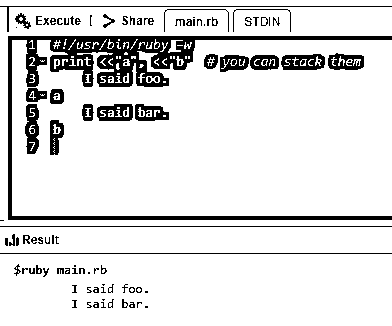

#### 5.Ruby BEGIN 语句

`#!/usr/bin/ruby
puts "This statement comes later"
BEGIN {
puts "This statement will be printed in the beginning"
}`

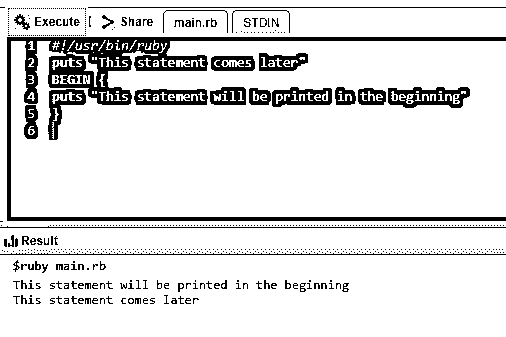

#### 6.Ruby END 语句

`#!/usr/bin/ruby
puts "This is main body"
END {
puts "This block executes in the end"
}
BEGIN {
puts "This block executes in the beginning"
}`

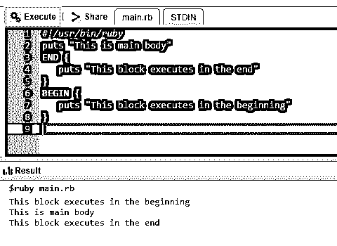

#### 7.拼音单行注释

`#!/usr/bin/ruby
# This is a single line comment.
uts "This is not a comment" # This is again a single line
comment.`

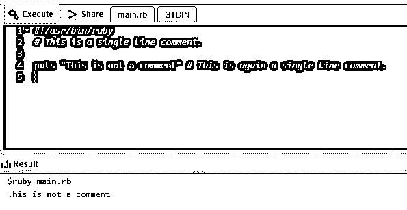

#### 8.拼音多行注释

`#!/usr/bin/ruby=begin
This is a multiple line comment.=end
puts "This is not a comment" # This is a single line comment.`

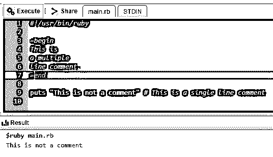

#### 9.Ruby 类中的成员函数。创建一个对象并调用一个方法。

`#!/usr/bin/ruby
class Demo
def testmethod
puts "Hello World!"
end
end
# Now using above class to create objects
object = Demo.new
object.testmethod`

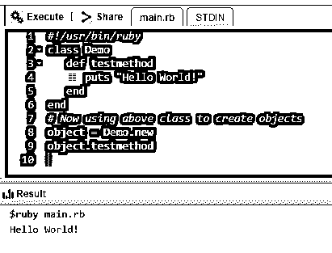

#### 10.Ruby 中的全局变量

`#!/usr/bin/ruby
$globalvariable=123
class FirstClass
def printglobal
puts "Global variable in FirstClass is #$globalvariable"
end
end
class SecondClass
def printglobal
puts "Global variable in SecondClass is #$globalvariable
end
end
class1obj = FirstClass.new
class1obj.printglobal
class2obj = SecondClass.new
class2obj.printglobal`

### 中间命令

下面是解释的中间命令。

#### 1.如果…否则在 Ruby 中

`#!/usr/bin/ruby
x = 1
if x > 2
puts "x is greater than 2"
elsif x <= 2 and x!=0
puts "x is 1"
else
puts "I can't guess the number"
end`

#### 2.红宝石色表壳

`<#!/usr/bin/ruby
$age =  17
case $age
when 0 .. 17
puts "Not eligible to vote"
when > 17
puts "Eligible to vote"
else
puts "incorrect age"
end`

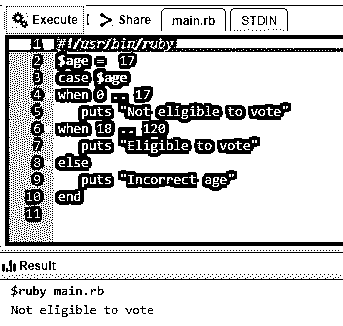

#### 3.Ruby 中的循环

*   **3。** **1。While 循环**

`#!/usr/bin/ruby
$i = 0
$num = 10
while $i <
$num  do
puts("Inside the loop i = #$i" )
$i = $i + 1
end`

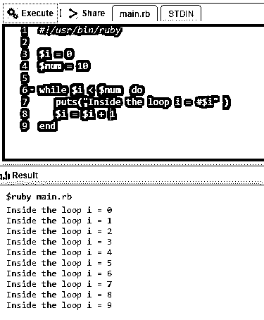

*   **3.2。直到循环**

`#!/usr/bin/ruby
$i = 0
$num = 4
until $i > $num  do
puts("Inside the loop i = #$i" )
$i = $i + 1;
end`

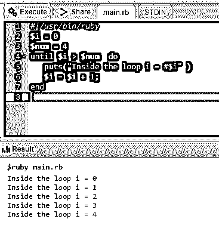

*   **3.3。** **为循环**

`#!/usr/bin/ruby
for i in 0..9
puts "Local variable value is #{i}"
end`

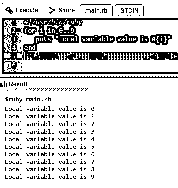

*   **3.4。中断语句**

`#!/usr/bin/ruby
for i in 0..5
if i > 3 then
break
end   puts "Local variable is #{i}"
end`

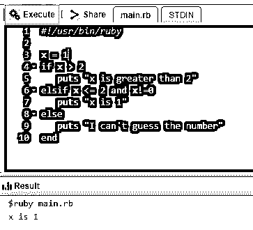

*   **3.5。下一条语句**

`#!/usr/bin/ruby
for i in 0..10
if i < 6 then
next
end
puts "Local variable is #{i}"
end`

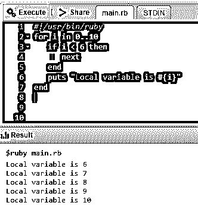

#### 4.Ruby 中的方法语法

`#!/usr/bin/ruby
def test(a1 = "Noodles", a2 = "Pasta")
puts "The food is #{a1}"
puts "The food is #{a2}"
end
test "Burger", "Pizza"
test`

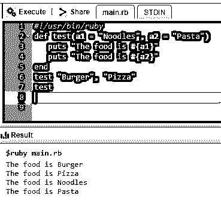

#### 5.Ruby 中的 Return 语句

`#!/usr/bin/ruby
def testreturn
a = 10
b = 20
c = 30
return a, b, c
endvar1 = testreturn
puts var1`

#### 6.Ruby 中的参数化方法

`#!/usr/bin/ruby
def sample (*testparam)
puts "The number of parameters are #{ testparam.length}"
for i in 0... testparam.length
puts "The parameters are #{testparam[i]}"
end
end
sample "Hello", "123", "ABC", "Programming"
sample "World", "456", "Ruby"`

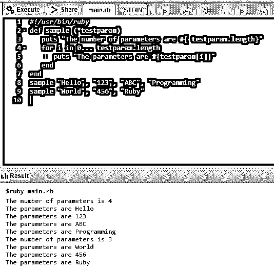

#### 7.使用 yield 语句实现块

`#!/usr/bin/ruby
def test
yield
end
test{ puts "Hello world"}`

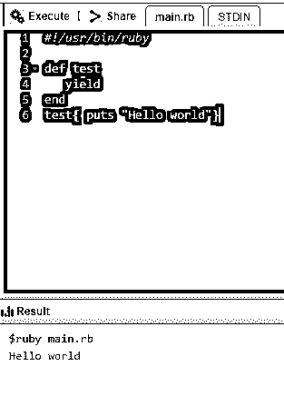

#### 8.Ruby 中的开始和结束块

`#!/usr/bin/ruby
BEGIN {    # BEGIN block code
puts "BEGIN code block"
}
END {
# END block code
puts "END code block"
}
# MAIN block code
puts "MAIN code block"`

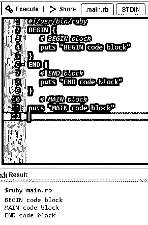

#### 9.Ruby 中的字符串表达式替换

`#!/usr/bin/ruby
a, b, c = 1, 2, 3
puts "The value of a is #{ a }."
puts "The sum of b and c is #{ b + c }."
puts "The average is #{ (a + b + c)/3 }."`

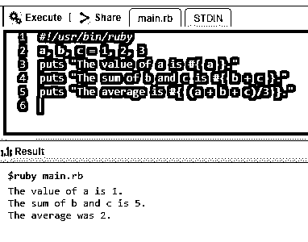

#### 10.在 Ruby 中创建数组

`#!/usr/bin/ruby
names = Array.new(10)
puts names.size  # returns 10
puts names.length # returns 10`

### 高级 Ruby 命令

以下是解释的高级命令。

#### 1.Ruby 中的 Getter 和 Setter 方法

`#!/usr/bin/ruby -w
# defining a class
class Box
# constructor method
def initialize(l, b, h)
@length, @width, @height = l, b, h
end
# accessor methods
def printLength
@length
end
def printBreadth
@breadth
end
def printHeight
@height
end
end
# create
an object
box = Box.new(10, 30, 40)
# use accessor methods
l = box.printLength()
b = box.printBreadth()
h = box.printHeight()
puts "Box Length : #{l}"
puts "Box Breadth : #{b}"
puts “Box Height : #{h}”`

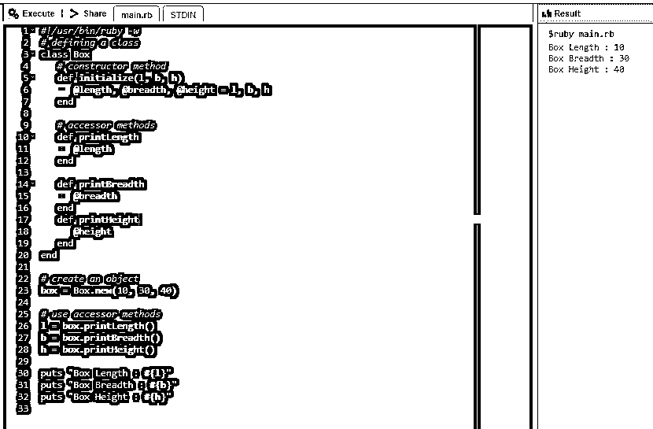

#### 2.使用 Ruby 编写通用网关接口脚本

`#!/usr/bin/ruby
require 'cgi'
cgi = CGI.new
puts cgi.header
puts "<html><body>This is a test</body></html&gt;"`

#### 3.使用 Ruby 进行套接字编程

*   **3.1。一个使用 Ruby 的服务器的简单例子**

`require 'socket'                 # Get sockets from stdlib
server = TCPServer.open(8090)    # listen on port 8090
loop {                           # Running the server infinitely
client = server.accept        # Connecting client wait time
client.puts(Time.now.ctime)   # send time to client
client.puts "Closing the connection!"
client.close                  # Client disconnect
}`

*   **3.2。一个使用 Ruby** 的客户端的简单例子

`require 'socket'        # Get socket from stdlib
hostname = 'localhost'          # Set hostname
port = 8090 # Set portsock = TCPSocket.open(hostname, port)
while line = sock.gets     # Read lines from the socket
puts line.chop       # print with platform line terminator
end
sock.close                 # Socket closing`

#### 4.Ruby 中的多线程示例

`#!/usr/bin/ruby
def function1
i = 0
while i<=2
puts "function1 at: #{Time.now}"
sleep(2)      i = i+1
end
end
def function2
j = 0
while j<=2
puts "function2 at: #{Time.now}"
sleep(1)
j = j+1
end
end
puts "Started At #{Time.now}"
t1 = Thread.new{function1()}
t2 = Thread.new{function2()}
t1.join
t2.join
puts "End at #{Time.now}"`

### 使用 Ruby 命令的提示和技巧

因为在任何编程语言上工作都需要知识和升级的意愿，这种情况也不例外。使用基本命令并练习和掌握这些命令是掌握这门美丽语言的关键。

### 结论

Ruby command 是一种免费的开源编程语言；它灵活且功能丰富。顾名思义，ruby 确实是一种入门成本非常低的宝石语言。它的即插即用功能和易读的语法使它非常用户友好。它的高级脚本工具也总结了它的受欢迎程度。

### 推荐文章

这是 Ruby 命令的指南。在这里，我们讨论了概念、基本、中级和高级 Ruby 命令，以及有效使用的技巧和诀窍。您也可以阅读以下文章，了解更多信息——

1.  [红宝石常数](https://www.educba.com/ruby-constants/)
2.  [Ruby 中的循环](https://www.educba.com/loops-in-ruby/)
3.  [Ruby 数据类型](https://www.educba.com/ruby-data-types/)
4.  [Ruby 数组方法](https://www.educba.com/ruby-array-methods/)

