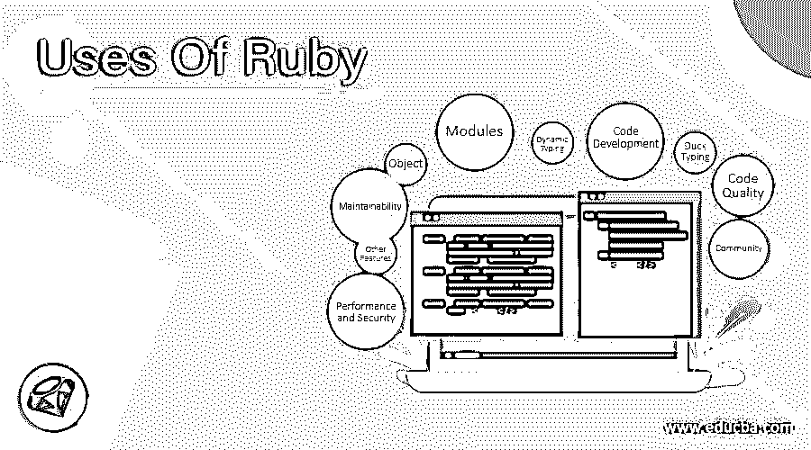

# Ruby 的用途

> 原文：<https://www.educba.com/uses-of-ruby/>

## Ruby 使用简介

Ruby 主要是设计或遵循最小惊讶原则(POLA)。它的主要思想是为用户减少使用的复杂性。而开发程序员可以享受用 Ruby 编程的乐趣。Ruby 提供了很多优秀的特性，比如对面向对象语言的支持、继承、垃圾收集、动态和鸭式类型、重载、异常处理、内置支持、对所有主要平台的支持、与其他语言的兼容性以及变量范围等。

### 红宝石

Ruby 是一种开源编程语言。它也被称为脚本语言，是动态的、解释的和面向对象的。它是由松本幸宏在 1993 年创造和开发的。它于 1995 年首次发布或出现。它支持跨平台操作系统。它是用 C 语言写的。Ruby 的语法基本上与 Perl 和 Python 类似[。它是可扩展的，并且具有大量代码的项目易于维护。](https://www.educba.com/perl-vs-python/)

<small>网页开发、编程语言、软件测试&其他</small>

### Ruby 的 10 大用途

使用 Ruby 有很多好处。下面是 Ruby 的 10 大用途列表。

#### 1.目标

在 Ruby 中，一切都是对象。这意味着 Ruby 中的每个对象都可以是唯一的，并且拥有自己的方法和属性，因为当类的对象被创建时，它可以获得自己的类，称为 singleton。Ruby 只是用指向类的“self”来执行代码。它有助于从任何位置评估类上下文中的代码。

#### 2.模块

使用 Ruby 有不同的和令人敬畏的模块，允许在运行时动态添加类层次结构的新元素。添加的模块可以在运行时进行动态评估，从而更容易扩展所需的功能。Ruby 还提供了生命周期挂钩，它允许有效或健壮地使用模块来将扩展相互隔离。

#### 3.代码开发

在 Ruby 中，已经看到开发代码比其他编程语言快得多。从统计数据来看，ruby 并不是运行和处理请求最快的语言，但是用 ruby 开发软件产品要比其他语言快得多。

#### 4.动态打字

使用 Ruby 有一个很好的特性，那就是动态类型，这意味着变量的类型可以改变，可以在解释器解析的时候被动态解析。动态类型确实有助于项目，同时在开发的进一步阶段进行更改。而在静态类型中，变量的类型最初是由解释器定义和解析的，这不允许我们进一步改变类型。因此，动态类型化在项目开发的不同阶段起着至关重要的作用。

#### 5.鸭子打字

在 Ruby 中，Duck typing 指的是不太关心类的对象，而是主要关心可以调用的方法以及将要对这些方法执行的操作。在 ruby 中，我们不声明方法的类型，一切都只基于对象，这些 ruby 对象可以单独修改。我们主要依靠对象功能，这有助于定义类型对象。

#### 6.代码质量

Ruby 代码是直观的，它为应用程序提供了高质量的代码，并且更容易读写。代码的质量主要取决于遵循的最佳实践和对通用标准的遵从。Ruby 是测试生成干净代码的一个完整部分的完美工具。Ruby 有一个标准库，提供完整的测试工具套件。

#### 7.可维护性

Ruby 是直观的，它使得开发者易于维护和理解。这使得代码运行得越来越快。程序员或开发人员维护大块代码花费的精力更少，并且已经编写的代码可以再次使用，这意味着不需要每次都编写相同的代码。由于 ruby 代码很容易理解，所以很容易找到错误并快速修复它们。

#### 8.性能和安全性

Ruby 在开发应用程序时有干净的代码，这使得它运行流畅，性能卓越，没有任何问题。应用程序因此运行得更快，并且它还提供或确保了应用程序的安全性。Ruby 的使用确保了应用程序的高性能和安全交付，以获得愉快的客户体验，这使得它成为开发人员在 Ruby 中开发应用程序的首选。

#### 9.其他功能

它支持自由格式，意味着程序的编写可以从任何行和列开始。它还区分大小写，意味着小写和大写字母完全不同。在 ruby 中，如果我们想要注释任何东西，就使用#表示解释器不会考虑。在 ruby 中，关键字主要是指保留关键字。一行中的多条语句必须用分号隔开，但行尾不需要分号。

#### 10.社区

Ruby 有一个非常活跃、乐观的大型社区。社区在各方面帮助开发者。它支持新开发人员在提供材料、书籍、课程和其他讨论平台的帮助下学习。它还维护 ruby 的[应用程序，并提供关于最新框架、库和工具的最新信息，这些都是为了使 ruby 更好而开发的，因此我们可以使用 ruby 并为用户或客户开发新的应用程序。Ruby 给出了流行的](https://www.educba.com/ruby-commands/)[框架 Ruby on Rails](https://www.educba.com/ruby-vs-ruby-on-rails/) ，该框架在开发人员中广泛用于应用程序的开发。

### 结论

Ruby 主要被设计成一种通用脚本语言，为 ruby 的不同应用提供了广泛的支持。它主要用于 web 应用程序、标准库、服务器和其他系统工具。Ruby 的一大优势是元编程。Ruby 现在越来越受开发人员的欢迎，因为它为开发应用程序提供了新的框架。这对维护代码也很有帮助。

Ruby 有更多的学习曲线，但是它更容易编写和理解。因此，初学者或学生可以轻松快速地学习它。Ruby 的使用是开源的，很容易获得，这有助于轻松使用这种语言。在线社区支持和论坛也让事情变得更简单。

### 推荐文章

这是真实世界中的 Ruby 指南。这里我们已经讨论了 Ruby 类对象、模块、社区、代码开发等不同用途的基本概念。您也可以阅读以下文章，了解更多信息——

1.  [Matlab 的用途](https://www.educba.com/uses-of-matlab/)
2.  [JavaScript 的使用](https://www.educba.com/uses-of-javascript/)
3.  [树莓酱的用途](https://www.educba.com/uses-of-raspberry-pi/)
4.  [JavaScript 的使用](https://www.educba.com/uses-of-javascript/)

