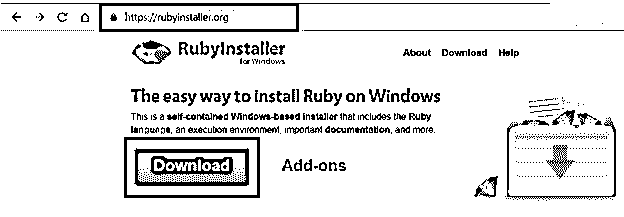
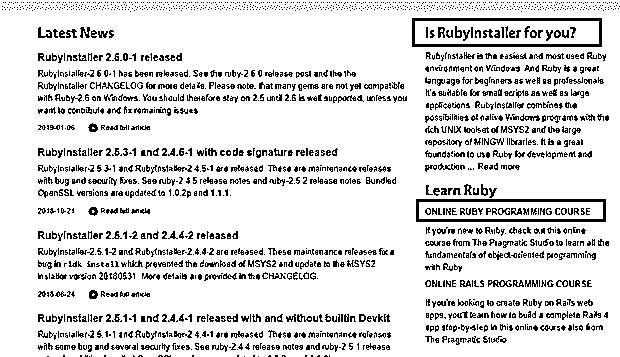
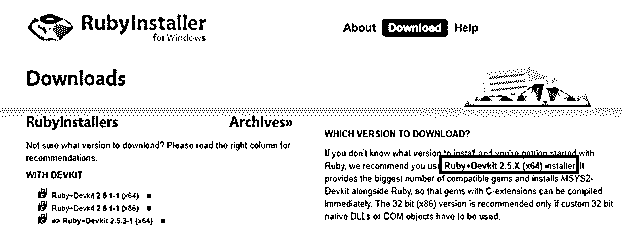
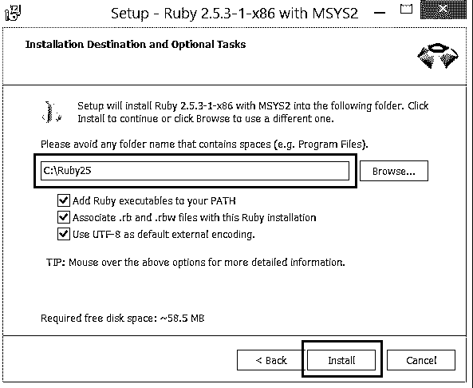
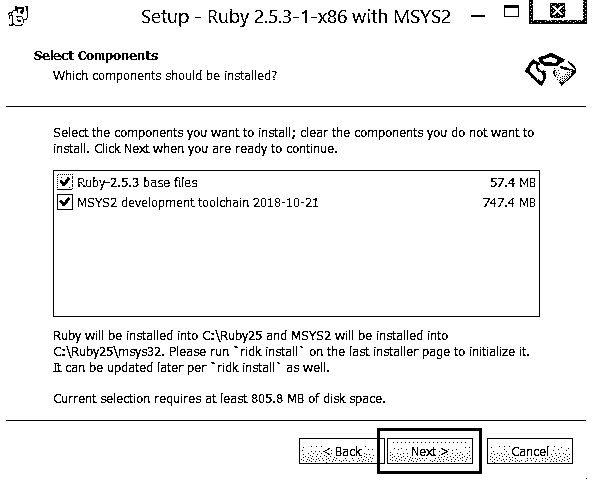
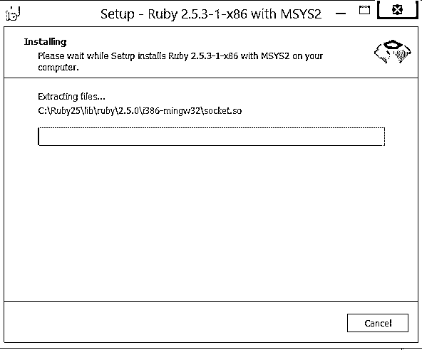
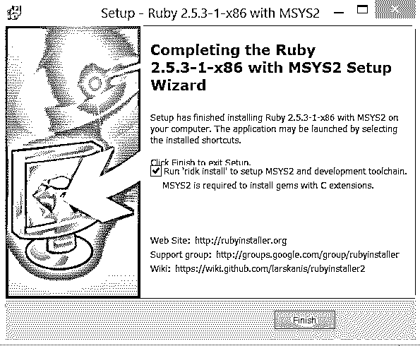

# 如何安装 Ruby？

> 原文：<https://www.educba.com/install-ruby/>

## 如何安装 Ruby？

下面这篇文章提供了如何安装 Ruby？Ruby 受到了不同语言的影响，比如 Perl、Smalltalk、Lisp，根据它的创造者，来自日本的松本幸宏所说。 [Ruby 的语法类似于 Perl](https://www.educba.com/perl-vs-ruby/) ，而解释类似于 Smalltalk，但与 Python 有很大不同。它支持函数式和面向对象的编程。它有一个动态类型系统，内存管理可以在没有任何干预的情况下完成。它是一种动态的通用编程语言。

关键字用于定义类和方法，而代码块可以由关键字或括号来定义。当使用 sigil 时，它会改变变量范围的语义。在类外定义函数/变量并使它们成为对象的一部分被称为过程化编程。当一切都是一个对象，或者它有匿名函数、闭包和延续，每个语句都有一个值，函数返回最后一次求值，那么它就被称为面向对象编程。

<small>网页开发、编程语言、软件测试&其他</small>

### Ruby 的特性

下面是提到的特征:

*   可以进行异常处理和运算符重载。
*   通过继承和元类完全面向对象。
*   默认参数。
*   变量作用域的级别用符号表示，如全局、类、实例和局部。
*   RubyGems 被用作集中的包管理。
*   REPL 是一个交互式的红宝石外壳。
*   支持 Unicode 和多字符编码。
*   YAML、 [JSON 和 XML](https://www.educba.com/json-vs-xml/) 是可用的标准库模块。

独立设置中的库被称为“gem”

每个宝石包括:

*   密码
*   证明文件
*   宝石规格(Gemspec)

RubyGems 是一个包处理程序，它为分发 Ruby 程序提供了标准格式。gems 的安装通过这个很容易处理。RubyGems 与 Ruby 运行时加载器集成在一起。这将从库文件夹中加载已安装的 gem。Gems 与基于 CPU 架构、系统操作系统和版本的特定平台设计的 ruby 一起工作。

每个宝石都包含三个重要的东西。

*   名字
*   版本
*   平台

### 安装 Ruby 的步骤

在 Debian GNU/ [Linux 和 Ubuntu](https://www.educba.com/linux-vs-ubuntu/) 中，我们可以安装 Ruby 如下图所示:

$ sudo apt-get 安装 ruby-full

ruby-full 包在 Debian 和 Ubuntu 上提供了旧的稳定版本。

使用 RHEL、 [CentOS 和 Fedora 的 yum 包管理器。](https://www.educba.com/centos-vs-fedora/)

$ sudo yum 安装 ruby

通过此安装的版本是发布时可用的最新版本。

### 使用安装程序更新 Ruby

如果已经安装的 Ruby 版本过期，可以使用第三方安装程序安装新版本。可以在同一个系统上安装多个版本的 Ruby。有专门的工具可以帮助在不同版本之间切换。当我们使用 RVM (Ruby-Version-Manager)时，不需要单独的第三方安装程序。

#### 1.Ruby 构建

Ruby-build 是 rbenv 的一个插件。用这个可以编译和安装不同版本的 Ruby。

*   马科斯
*   Linux 操作系统
*   类似 UNIX 的操作系统

#### 2.Ruby 安装

使用 Ruby-install 可以编译不同版本的 Ruby 并安装到任意目录中。在 MacOs 和 Linux 机器上，Chruby 是一个工具，用于在同一台机器上安装的不同 ruby 版本之间切换。

#### 3.Ruby 安装程序

Ruby Installer 为 Windows 上完整的 Ruby 开发环境提供了非常完整的设置。

### 如何在 Windows 上安装 Ruby

*   open-> https://ruby installer . org/

*   任何没有 Ruby 相关知识的人都可以考虑选择深入了解。
*   你可以从给定的链接“RubyInstaller 适合你吗？”

*   提供的 Ruby+Devkit(版本)是可下载的 Ruby 中最稳定和经过全面测试的版本。

*   下载完成后，双击打开安装程序。

将出现以下窗口:

*   单击“我接受许可”和下一步。

*   在下一个对话框中，您可以更改目标路径。

您可以将鼠标指针移到复选框上，查看选项的简要说明。

1.  UTF-8 选项用于设置环境变量。
2.  将。rb，还有。rbw 文件允许你双击或者简单地在 shell 上输入命令名来运行 Ruby。
3.  添加 Ruby 可执行文件允许你从任何地方安装 Ruby。这可能会影响现有的 Ruby 安装。

*   点击安装。
*   如果你想和 Ruby 一起安装 MYS2 开发链，请勾选这个复选框。点击下一步。

*   安装完成后，单击 Finish。

*   你已经准备好了。

**Mac-OS 上的 Ruby:**Mac OS 预装了 Ruby。你可以在你的终端上运行 ruby-v；它会指向预装版本。

### Ruby on Rails 简介

Ruby on Rails 是一个用 Ruby 编写的框架，用于开发服务器端的 web 应用程序。Rails 需要一种语言将动态网页嵌入到 HTML 代码中。当时，rails 的创造者认为 Ruby 是比其他语言更好的选择。模型-视图-控制器(MVC)模式被用来组织应用程序编程。Ruby on Rails 通常通过一些前端 web 服务器连接到互联网。

#### 1.模型

数据库和 Ruby 文件被映射到 Ruby on Rails 框架中的一个表。这被称为模型。开发人员可以随意忽略命名约定，为表、模型和相关文件选择不同的名称。但是最佳实践是这样命名:app/models 目录中的文件“user.rb”可以与数据库中的表“users”相关联。

#### 2.控制器

Rails 的服务器端组件被称为控制器。它决定将哪个文件传送给来自 web 服务器的外部请求。搜索功能需要一个查询来查找匹配搜索的数据。然后，控制器将数据的某个子集传递给相应的视图，以创建一个 HTML 文档，其中包含一个每个数据占一行的表格。控制器呈现一个或多个动作，它基本上是一个指定如何响应外部请求的块。

#### 3.视角

在运行时，Erb 文件被评估并转换为 HTML。这是使用视图实现的。Rails 包含了一些工具，可以让开发人员更容易地为一个基本的网站构建模型和视图。

### 推荐文章

这是如何安装 Ruby 的指南。这里我们已经讨论了安装 Ruby 的基本说明和最简单的方法。您也可以阅读以下文章，了解更多信息——

1.  [Ruby vs Python 性能](https://www.educba.com/ruby-vs-python-performance/)
2.  [Ruby vs Node](https://www.educba.com/ruby-vs-node/)
3.  [红宝石的用途](https://www.educba.com/uses-of-ruby/)
4.  [红宝石块](https://www.educba.com/ruby-block/)

