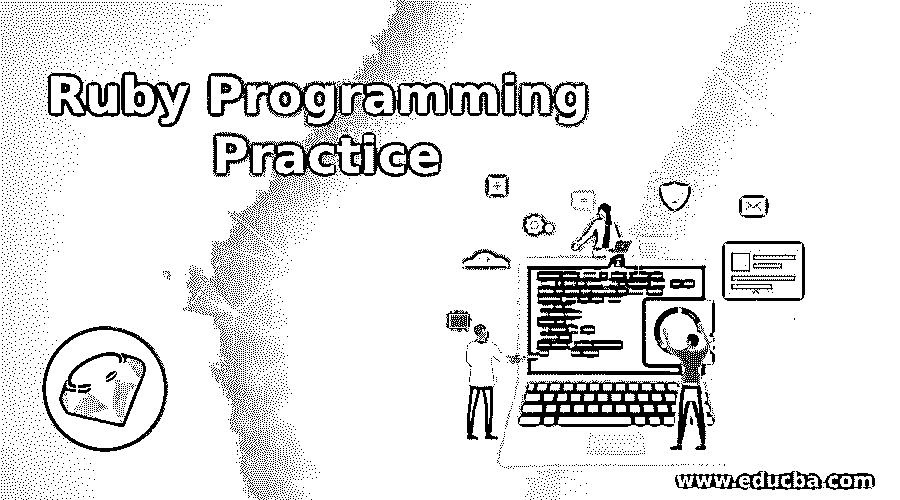
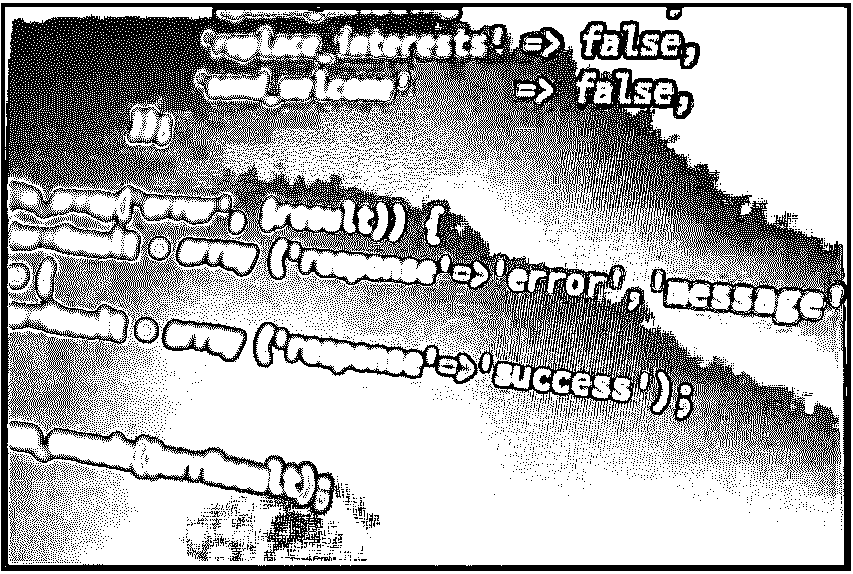
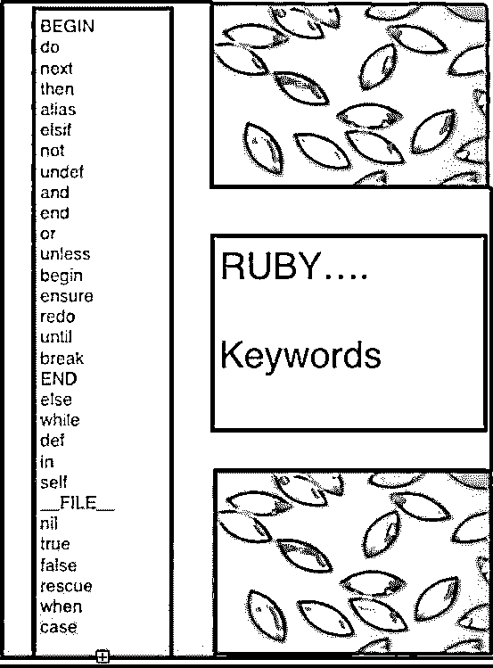

# Ruby 编程实践

> 原文：<https://www.educba.com/ruby-programming-practice/>

## Ruby 编程实践入门

想知道是什么让 Ruby 成为编程语言中的瑰宝吗？它被称为实用而巧妙，当谈到性能时，它确实是一颗闪亮的星星。Ruby 编程实践是一个真正的发现，因为用它的创造者 Yukihiro“Matz”Matsumoto 的话说，它融合了不同的语言，创造了一种自然而不简单的语言，反映了生活。事实上，松本将红宝石比作人体内部的复杂性和外部的简单性。那么，ruby 编程语言真的是牡蛎中的明珠吗？让我们来了解一下 ruby 编程练习是用来做什么的。

### Ruby 编程实践:无价的语言

鉴于其方便和美观的特性，ruby 编程实践被认为是世界上领先的编程语言之一。松本混合了他喜欢的编程语言，创建了 ruby 编程实践，它是 Perl、Ada、Eiffel、Lisp 和 Smalltalk 的组合。

<small>网页开发、编程语言、软件测试&其他</small>

Ruby 的创造者试图形成一种新的语言，这种语言遵循平衡的函数式但又是命令式的编程。

### Ruby 背后的历史

Ruby 编程实践发布于 1995 年。自成立以来，它吸引了来自世界各地的编码员。在 2006 年，Ruby 编程实践通过 Ruby Talk 获得了全球认可，这是讨论 Ruby 编程语言的主要邮件列表，每天有 200 条消息。

Ruby 目前是最受欢迎的编程语言指数的前十名之一，比如 TIOBE T1。

### Ruby on Rails:移动中

与这种编程语言相关的最著名的软件框架之一是 Ruby on Rails Developer。也被称为 Rails，这是一个扩展 Ruby 编程语言的软件库。它的创造者是大卫·海涅梅尔·汉森。这是添加到 Ruby 编程语言中的软件代码。它是使用操作系统命令行界面安装的软件包库。Rail 是一个方便协作和维护的 web 框架。

约定被编码为 Rails API，在线文档。那么 Rails 是如何工作的呢？它将 ruby 编程实践基础与 HTML、CSS 和 JavaScript 结合起来，开发出在服务器上运行的 web 应用程序。由于运行在 web 服务器上，Rails 是一个服务器端或后端 web 应用程序平台。像 Rails 这样的 web 开发框架非常适合那些想要创建复杂网站的人。

 

### Ruby:一个开源的宝石

Ruby 编程实践是完全免费的，而且可以很容易地使用、复制、修改和分发。Matt 还研究了其他语言来寻找理想的语法。他想要一种比 Perl 更强大、比 Python 更面向对象的脚本语言。Ruby 编程实践在很大程度上涉及到将每个信息或代码视为一个具有自身属性和动作的对象。

面向对象的编程将属性实例变量和动作作为方法调用。这种纯面向对象的方法是通过代码来描述的，它将一个动作应用于一个数字。Ruby 编程实践在表达所有类型的方法和实例变量方面类似于 Smalltalk。适用于对象的规则也适用于完整的编程语言。

### 扭曲规则:Ruby 的灵活性

Ruby 是一种灵活的语言，因为它允许用户自由地修改各个部分。用户可以随意删除或重新定义重要部分。现有的部分可以构建，Ruby 编程示例对编码人员没有任何限制。例如，减法是用减号(-)运算符执行的，但是如果要使用可读的世界减号，可以将它添加到 Ruby 编程的内置数值类中:

数字类

定义减(x)

自我。-(十)

结束

结束

Ruby 的操作符也可以重新定义。

Ruby 突出其灵活性的另一个特性是块，这是以前尝试过命令式语言的用户最喜欢的特性之一。块源自函数式语言。黑色是任何方法的闭包，描述了方法应该采取的方式，可供程序员使用。Ruby 编程教程中还有许多其他方法，为编码人员编写自己的代码块来填充该方法应该如何工作的细节留有余地。

### 露比的混音

与其他面向对象的语言不同，Ruby 编程教程只有一个继承。Ruby 编程语言也遵循了 Objective C 中称为类别的模块的概念。模块是方法的集合。模块可以按类混合，这样它的所有方法都可以免费接收。

这比多重继承好，多重继承太复杂，限制太多。Ruby 编程教程使用有限的标点符号和使用关键字的函数。这确保了它不需要变量声明，并使用简单的命名约定将变量的范围表示为局部、实例或全局。

### Ruby:超越基础

以下是 Ruby 编程实践的一些关键特性:

#### 传播它的光芒:超越红宝石

Ruby 编程教程几乎没有不同的实现，在社区中，它也被称为 MRI 或 Matz 的 Ruby 解释器(根据其创建者)或 CRuby(因为它是用 C 编写的)。但是除了 Ruby 之外，Ruby 编程教程的其他实现也有一些特殊的特性。

 

JRuby 是 Ruby 与 JVM 或 Java 虚拟机的结合，使用 JVM 优化 JIT 编译器、并发线程、工具生态系统、大量的库集合和垃圾收集器。

Ruby in Ruby: Rubinius 构建在 LLVM 之上，有一个漂亮的虚拟机，其他语言也在其上构建

Ruby 与苹果的 Cocoa: MacRuby 只是为 Mac OS X 用户提供的与苹果的 Cocoa 紧密集成的 Ruby。使用它，您可以非常轻松地编写桌面应用程序。

这是 ruby 编程语言的一个轻量级实现。它在应用程序中提供链接和嵌入。mruby 是由松本幸弘马茨开发的。

*   IronRuby 是 Ruby 与。NET 框架。
*   MagLev 是一个 Ruby 实现，集成了对象持久性和分布式共享缓存。
*   Cardinal 是为 Perl g 或 Parrot 虚拟机编译的 Ruby 编程教程。
*   RubySpec 是 Ruby 编程语言的可执行规范。

### Ruby 是怎么读的？

Ruby 编程练习的解释器从左到右、从上到下读取代码。当有语法错误时，会发送一条错误消息。这也会影响程序中逻辑流的控制。在 ruby 的核心，编程是对象，因为这种编程语言是面向对象的。

[Ruby 方法](https://www.educba.com/ruby-methods/):方法是可以在对象上执行的动作的定义。它有内置的对象定义和方法。类是一个蓝图，它允许创建某种类型的对象和与对象相关的方法。继承是类的一个特殊属性。

 

ruby 编程练习的另一个有趣的方面是，它评估一些东西并返回一个允许继续评估的副本。一个类是一个配方，最终产品是一个实例。数据操作位于 ruby 编程教程的核心。一系列或一系列字符是指一个字符串。在 Ruby 编程教程中，字符串是特殊字符、数字和字母的组合。

有两种工具用于管理许多数据，即数组和散列。

数组显示了典型集合的图像:

动物

狗[0]

奶牛[1]

马[2]

兔子[3]

每种动物的索引或关键字(这里的元素)代表它的编号。密钥是从 0 开始的整数或整数。第一个元素是[0]，第二个元素是[1]。数组的键的范围总是从[0]到(长度-1)，或者最后一个元素是数组的总长度减 1。为了用 Ruby 编写代码，我们用下面的方式写:

animal=['狗'，'牛'，'马'，'兔']= >('狗'，'牛'，'马'，'兔']=> animal.count =>4

对于每个元素，必须使用单引号，因为字符串存储在每个元素中。Ruby 的 array 类有开箱即用的方法，比如 count。这只是计算数组中元素的总数并输出这个值。这是一个动物数组，我们可以简单地通过分配数组名称和索引号来访问每个项目。这个在 animal[4]处得到[nil]，所以 Ruby 编程练习会自动将 animal[5]、animal[6]、animal[7]等设置为 nil。要向该数组中添加另一个动物项目，需要做的就是:

>动物[5]= '猴子'

= >“猴子”

>动物

=> ["狗"，"牛"，"马"，"兔子"，"猴子"]

>食物。数数

= >食物.计数

=>5

您也可以使用 append 操作符<

Ruby 编程的另一个有趣的方面是，你可以在每个元素中存储任何东西，而不仅仅是字符串。有些元素可以是字符串，有些可以是数字。对于多维数组，Ruby 编程会检查使用的方法。

ruby 编程中的迭代器帮助用户遍历存储多个元素的数据结构，并检查每个元素。

### Ruby:创造奇迹的散列和破坏性合并

哈希是另一种包含键值对集合的集合类型。键-值对分别是键和它的值或者容器的名称和内容的组合。哈希是由逗号分隔的键值对的列表。Ruby 编程的另一个有趣的特性是破坏性合并，可以在方法调用的结尾添加一个感叹号，从而可以用返回值替换方法调用方的值。

<address> </address>

散列法适用于以类似于字符串的冒号开头的对象类型的符号。散列使得存储值变得容易，并且便于解释器的检索。

### Ruby:不同于其他编程语言

Ruby 的代码类似于 Perl、Java 和 Python。2 个独特的 [Ruby 特性是块和迭代器](https://www.educba.com/ruby-commands/)。另一个独特的属性是符号不等于字符串，最好将其描述为标识。任何具有相同字符的符号都引用内存中相似的对象。当使用一个新的字符串时，Ruby 编程会自动为它分配内存。在符号和字符串之间的权衡中，总是要考虑哪个更重要——对象的身份和它的内容。在 Ruby 编程中，一切都是对象，矛盾的是常量并不是真正的常量。

这种编程语言还强制执行命名约定，即标识符以大写字母开头，是常量，如果以$符号开头，则是全局变量，如果以@开头，则是实例变量。如果标识符以@@开头，这就是所谓的类变量。方法名必须以大写字母开头。在 Ruby 中，除了 nil 和 false 之外的所有值都被认为是真的，而在 C 和 Python 等其他语言中，0 和其他可能的值，包括空列表，都是假的。

在 Java 中，public 是任何人都可以访问的，而 protected 是指类的实例，同一包中的后代类可以访问它，private 是指除了类的实例之外，没有人可以访问方法。在 Ruby 编程中，私有方法是指在没有显式接收者的情况下可以调用的方法。然而，当我们考虑可以从一个类或子类实例调用的受保护方法，而另一个实例作为接收者时，这种差异就出现了。

Ruby 编程类是开放的，方法允许以问号或感叹号结尾。Ruby 编程的另一个特征是它的持久性。如果找不到响应某个消息的方法，Ruby 编程不会放弃。它用找不到的方法名和参数调用缺少方法的方法。

### 在 Ruby 中，对象就是一切。

Ruby 编程是一种真正面向对象的语言。所有被操纵的都是对象，甚至操纵的结果也被称为对象。在 Ruby 中，类被定义为表示每个实体。类是状态和使用它的方法的组合。

> **面向对象的虚拟代码=来自真实世界的建模概念**

与 Java、C 和 Perl 相比，Ruby 使用关键字来表示主体的结尾。Ruby 编程的另一个与众不同的特性是，在它投入使用之前，正则表达式支持已经内置于 Awk、Perl 和 Python 等脚本语言中。

**Line-oriented language = Expressions and statement term****I****Nate at the Line****'****s end**

**Ruby 编程中的保留字列表**

 

### 结论

在所有编程语言中，Ruby 编程练习闪耀着难以模仿的光芒。Ruby 编程练习有许多有趣的方面和属性。这种编程语言除了自由和灵活之外，还有一系列多维的特性。在开源或免费的编程应用中，ruby 编程有着无人能出其右的辉煌。就像它的名字一样，它确实是编程语言中的一颗宝石。

### 推荐文章

这是 Ruby 编程实践的指南。这里我们已经分别讨论了 ruby 的基本概念、历史、如何阅读。您也可以浏览我们推荐的其他文章，了解更多信息——

1.  [Ruby vs Ruby On Rails](https://www.educba.com/ruby-vs-ruby-on-rails/)
2.  [红宝石块](https://www.educba.com/ruby-block/)
3.  [Ruby 调试器](https://www.educba.com/ruby-debugger/)

