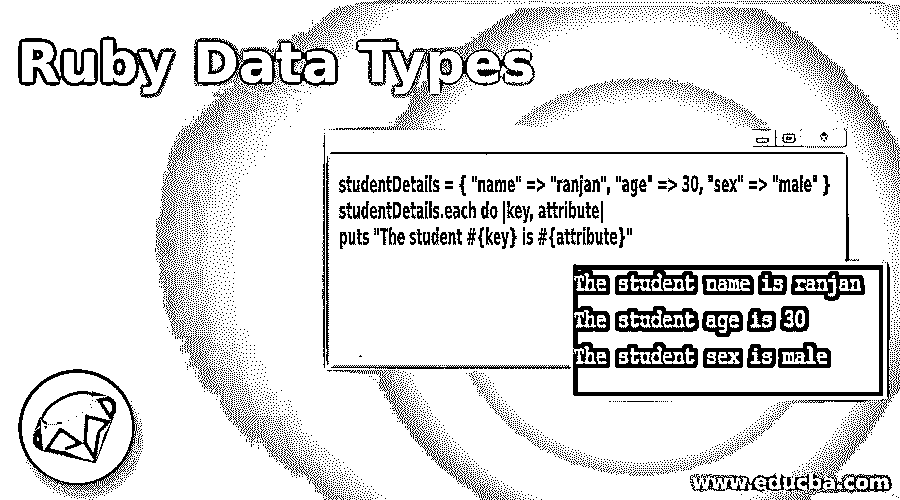
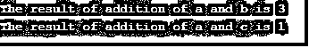

# Ruby 数据类型

> 原文：<https://www.educba.com/ruby-data-types/>

## Ruby 数据类型简介

数据类型是一种通知操作系统变量在其代码旅程中将要保存的数据类型的方式，例如，如果我们将数据称为整数，如 a=1，这意味着我们通知系统变量 a 将保存数值，在这种情况下，系统将分配适当的空间。 同样的，如果我们写 a=true，这意味着我们在指示系统 a 只能是布尔值，系统只能分配一位空间，在 Ruby 中，它支持数字、布尔值、字符串、散列、数组、符号等数据类型，我们将在示例和解释部分学习每种数据类型。

### Ruby 数据的类型

正如我们所提到的，数据类型是一种方式，它指示系统我们将要分配给任何变量或变量类型的数据类型，它将在整个过程中保存。让我用一个例子来解释每一个。注意，Ruby 中的每种数据类型都是一个类，因为 Ruby 是一种纯面向对象的语言。

<small>网页开发、编程语言、软件测试&其他</small>

#### 1.混杂

这是一种以键值对形式保存数据的数据类型，例如{a=>1，b=>3}。在这里，使用基于散列的数据类型的主要好处是，它们具有键值结构，我们可以在散列变量中保存任何类型的数据，这意味着它允许保存多种数据类型，例如 a={name=>"ranjan "，age=>30，sex=>"male"}。让我给你举一个散列数据类型的例子。我们可以看到下面的例子，这里我们定义了一个 studentDetails 哈希变量，并为学生分配了一些键值，在每个循环的帮助下，我们在这里打印每个属性。Ruby 还提供了各种与散列相关的方法，用于操作和其他实用程序。

定义包含学生详细信息的散列

**代码:**

`studentDetails = { "name" => "ranjan", "age" => 30, "sex" => "male" }
studentDetails.each do |key, attribute|
puts "The student #{key} is #{attribute}"`

**输出:**

#### 2.数组

数组也是一种数据类型，可以保存多种类型的数据，如哈希，但它不同于哈希数据类型，因为在哈希的情况下，每个元素都有一个用于标识值的键，但在数组的情况下，它没有任何键，这意味着将自动创建数组属性值的索引。在数组中，索引总是一个连续的整数值，如 0，1，2，3，4 ….让我们看一个 Ruby 中数组数据类型的例子。在下面的例子中，我们定义了一个名为 **studentDetails** 的变量，并为学生分配了一些数组属性。在函数 **each_with_index** 的帮助下，我们迭代数组的每个元素并打印数据的值和索引。

**代码:**

`studentDetails = ["ranjan", 30, "male","Chennai" ] studentDetails.each_with_index do |value, index|
puts "The student #{index} index value is #{value}"`

**输出:**

#### 3.数字

在这种数据类型中，它只允许数字变量，所以如果我们定义了一个具有数值的变量，并且我们试图对具有字符串或其他非数字变量的变量进行添加或任何其他操作，它将抛出一个错误，因为我们已经指示系统关于变量的类型和变量的内存分配。例如，a=1，b =“x ”,如果我们执行 a+b 的加法，它将不起作用。让我给你看一些例子。

在下面我提到了三个处理数字数据类型的例子。

这里我们添加了一个数字变量，其字符串包含变量，输出为 error，因为两者的数据类型不同。请按照下面的例子以及输出屏幕。

**代码:**

`a=1
b="x"
puts a+b`

**输出:**

在这个例子中，我们将两个数字相加，一个是整数，另一个也是整数，因此输出将没有任何外部活动。请按照下面的例子以及输出屏幕。

**代码:**

`a=1
c=2
puts "The result of addition is #{a+c}"`

**输出:**

在这个数字示例中，我们添加了两个变量，一个是数字变量，另一个是字符串变量，但是我们在函数 **to_i** 的帮助下将字符串类型转换为整数。请按照下面的例子以及输出屏幕。

**代码:**

`a=1
b="2"
puts "The result of addition of a and b is #{a+b.to_i}"
c="x"
puts "The result of addition of a and c is #{a+c.to_i}"`

**输出:**

#### 4.布尔代数学体系的

在这个数据类型变量中，我们只能给布尔值赋值，比如 true 或 false，所以它只占用一位内存空间。在下面的例子中，我们定义了一个变量 friend，并给它赋值 **true** 。请按照下面的例子以及输出屏幕。

**代码:**

`friend =true
if(friend)
puts "We are friends"
else
puts "No , we are not friends"`

**输出:**

#### 5.用线串

正如我们所知的字符串，它是用单引号(')或双引号("")括起来的。同样，每个字符串都是其主类的对象，主类是一个字符串类。我们可以在下面看到一些字符串的例子。

**代码:**

`a="y"
b=2
puts "The result of string concatenation of a and c  is #{a+b.to_s}"
c="x"
puts "The result of string concatenation of a and c  is #{a+c}"`

**输出:**

#### 6.标志

符号与任何字符串都非常相似，但在符号的情况下，它的大小非常小，这意味着它们是轻量级的字符串。请看下面的例子。

**代码:**

`students = {:name => "Ranjan", :address => "Chennai", :Job => "developer"}
puts students[:name] puts students[:address] puts students[:Job]`

**输出:**

### 结论

在本教程中，我们学习了 Ruby 中可用的数据类型，并了解了它们的实际用途，我们学习了不同场景下的工作和各种内存和空间实用程序，我们展示了所有数据类型的一些真实案例。

### 推荐文章

这是 Ruby 数据类型指南。在这里，我们讨论了 Ruby 数据类型的介绍，7 大类型的解释，代码和输出的例子。您也可以浏览我们的其他相关文章，了解更多信息——

1.  [红宝石的破碎](https://www.educba.com/break-in-ruby/)
2.  [红宝石系列](https://www.educba.com/ruby-ranges/)
3.  [下一个红宝石](https://www.educba.com/next-in-ruby/)
4.  [Ruby 中的类](https://www.educba.com/class-in-ruby/)

