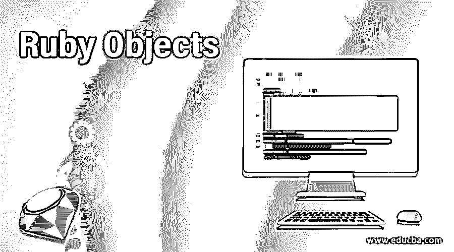
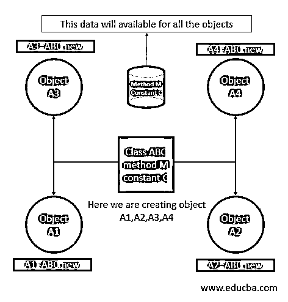
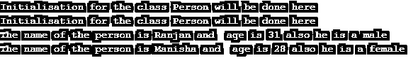

# Ruby 对象

> 原文：<https://www.educba.com/ruby-objects/>

## Ruby 对象的定义

Ruby 是一种纯面向对象的语言，Ruby 中的一切都是对象，因为 Ruby 支持封装、继承、操作符重载和多态等，要在 Ruby 中创建一个对象，我们可以使用 new 关键字，我们可以从任何类中创建一个无限的对象，每个对象都可以访问类的属性(就像类的方法，并在类中不断定义)，我们可以使用类名创建的对象逐个访问属性， 对象最重要的用途是它们非常便携，因为它们可以包含任何数据，如方法和变量(obj.methodname 和 object.variableName ),而且每个对象都指向相同的内存位置，用于访问方法和变量，而无需分配新的内存。

### 如何在 Ruby 中创建对象？

要在 Ruby 中创建一个对象，我们可以使用 new 关键字和类名，如 ABC.new。让我解释下面的例子。

<small>网页开发、编程语言、软件测试&其他</small>

*   我们定义了一个类名为 ABC 的类，我们可以看到我们在类名(ABC)前使用了 class 关键字。我们将使用这个类名来创建使用新关键字的对象。
*   在类内部，我们给出了一些注释部分，在这里我们也可以放一些方法和常量来代替注释。
*   在这个类中，我们使用了 initialize 方法，这是一个预定义的初始化方法。
*   最后，我们在一个新的
*   当我们从这个类中创建对象时，这个类也会自动初始化这个方法，并完成变量的初始化工作。这里的对象包含了 ABC 类的所有变量和方法。

请参见下面 Ruby 中类创建的语法。

`class ABC
#Do the initialisation here
def initialize(param1, param2)
# Here we are initialising the variables .
@param1 = param1
@param2 = param2
end
#Write here your methods and constants
end
#Create object from class ClassName
A1 =ABC.new(param1, param2)#Creation Of Object A1
A2 =ABC.new(param1, param2)#Creation Of Object A2
A3 =ABC.new(param1, param2)#Creation Of Object A3
A4 =ABC.new(param1, param2)#Creation Of Object A4`

### Ruby 中的对象是如何工作的？

如果你见过任何土木工程师为桥梁建筑设计或绘制一些建筑。一旦土木工程师画出任何设计，这个设计就可以用来建造许多建筑。因为那张图纸包含了我们建造任何建筑或桥梁所需的一切。同样，Ruby 中的对象扮演了建筑物的角色，所有的类都扮演了画纸的角色。每当我们创建一个对象并且该对象包含类的属性时。我们可以借助下面的流程图来解释 Ruby 中类的工作方式。

*   这里我们有一个名为 ABC 的类，这个类包含一个方法和一个常量。
*   这里，new 关键字将通知 Ruby 编译器关于从类名 ABC 创建对象的指令。
*   一旦 Ruby 编译器读取了新的关键字，它将访问或者更专业地说，关联类属性的方法和变量的内存。
*   现在我们正在从 ABC 类创建许多对象，如对象 A1、对象 A2、对象 A3 和对象 A4。
*   从这个类创建的每个对象内部都包含相同的方法和常数。这意味着，如果需要，这些对象可以随时访问方法 M 和变量 c。

为了更好的理解，请看下面的 Ruby 类的流程图。

### 用 Ruby 实现对象的例子

下面是一个创建对象的例子，以及它在 Ruby 中的用途。这个程序的目的是显示个人信息。我们可以在下面的步骤中解释下面的例子。

*   首先，我们创建了一个名为 Person 的类。
*   接下来，我们创建了一个 Ruby 内置方法 initialize，它将被用作 Ruby 类内部的构造函数来初始化基本的东西。
*   我们在类中编写了 display_person 方法，该方法将显示传递给它的属性的数据。
*   接下来，我们在一个新关键字的帮助下从 person 类创建一个对象，并调用 display_person 方法和必需的参数来显示 Person 数据。

#### 示例#1

请查看下面的代码示例以及输出屏幕。

**代码:**

`class Person
# Method for initialisation inside the class
def initialize()
# Initialising work
puts "Initialisation for the class Person will be done here"
end
def display_person(name,age,sex)
puts "The name of the person is #{name} and  age is #{age} also he is a #{sex}"
end
end
# Creating an objects and passing parameters  for initialization
personObjec1 = Person.new()
personObject2 = Person.new()
personObjec1.display_person("Ranjan", 31, "male")
personObjec1.display_person("Manisha", 28, "female")`

**输出:**

#### 实施例 2

下面是一个创建对象的例子，以及它在 Ruby 中的用途。这个程序的目的是显示个人信息。我们可以在下面的步骤中解释下面的例子。

*   首先，我们创建了一个名为 Person 的类，在 Person 类的帮助下，我们将使用一个新的关键字创建对象。
*   接下来，我们创建了一个 Ruby 内置方法 initialize，它将作为 Ruby 类中的构造函数来初始化用户详细信息，以便在其他方法中使用。
*   我们在类中编写了一个 display_person 方法，它将显示在对象创建时传递给 initialize 的属性的数据。
*   接下来，我们从 Person 类创建一个对象，并调用 display_person 方法，不需要任何参数，因为将使用我们在初始化时传递的参数。

请查看下面的代码示例以及输出屏幕。

**代码:**

`class Person
# Method for initialisation inside the class
def initialize(name ,age ,sex )
# Initialising
@name = name
@age = age
@sex =sex
end
def display_person()
puts "The name of the person is #{@name} and  age is #{@age} also he is a #{@sex}"
end
end
# Creating an objects and passing parameters  for initialization
personObjec1 = Person.new("Ranjan", 31, "male")
personObjec2 = Person.new("Manisha", 28, "female")
personObjec1.display_person()
personObjec2.display_person()`

**输出:**

### 推荐文章

这是一个 Ruby 对象的指南。在这里，我们还讨论了定义和如何在 ruby 中创建对象，以及不同的例子和代码实现。您也可以看看以下文章，了解更多信息–

1.  [Ruby 模块](https://www.educba.com/ruby-modules/)
2.  [红宝石变量](https://www.educba.com/ruby-variables/)
3.  [Ruby 命令](https://www.educba.com/ruby-commands/)
4.  [红宝石的用途](https://www.educba.com/uses-of-ruby/)

