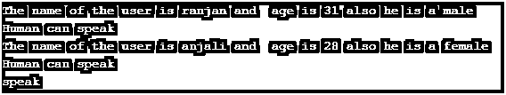
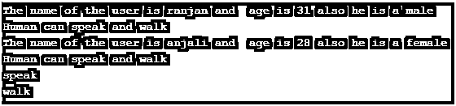
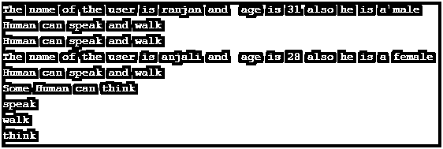

# Ruby 常量

> 原文：<https://www.educba.com/ruby-constants/>

## Ruby 常量介绍

在 Ruby 中，常量是另一种类型的变量，唯一的区别是我们不能在整个程序中改变常量的值。万一我们试图改变变量的值，它将引发一个警告错误。在 Ruby 中，常量总是以大写字母开头，但是你会看到许多程序员喜欢把程序的所有字母都写成大写字母，这是常量在 Ruby 中的主要好处，如果我们希望某个变量对于任何特定的程序都是相同的，那么所有其他的方法和类都可以使用相同的值，我们将变量定义为常量。

**列出所有的 Ruby 常量:**

<small>网页开发、编程语言、软件测试&其他</small>

在理解 Ruby 中的各种常量列表之前，我们需要理解几点。

*   常量是这样一个变量，一旦我们用大写字母定义了一个变量，编译器就会认为它是常量，如果我们试图改变常量，它就会抛出一个警告。
*   我们可以将 Ruby 中的任何常量分为两类:一类是在类内部定义的常量，可以在类外部用 **::** 操作符访问；另一类是我们在程序顶部定义的常量，可以由任何类和方法访问。
*   我们可以在程序的顶部说 constant 是一个全局常量。
*   全局常量的一个例子是整个程序的环境变量。

### Ruby 常量的实现示例

让我们看一些 Ruby 中常量列表的例子:

#### 示例#1

在这个例子中，我们看到了在程序顶部定义的常数，以及在程序内部和外部使用它们的方法。

*   首先，我们定义了一个名为 speak 的全局常量。这个常数可以直接用常数的名字用于所有的类和方法。
*   接下来，我们创建了一个名为 Human 的类，它将使用常量。
*   接下来，我们创建了一个 Ruby 内置方法 initialize，它将被用作 Ruby 类内部的构造函数来进行初始化。
*   我们在类中编写了 display_human_data 方法，该方法将显示传递给它的属性的数据。
*   接下来，我们从类 Human 创建一个对象，并使用所需的参数调用 display_human_data 方法来显示用户数据。

请看下面的例子。

**代码:**

`SPEAK="speak"
class Human
# Method for initialisation inside the class
definitialize(name ,age ,gender )
# Initialising the variables
@name = name
@age = age
@gender =gender
end
defdisplay_human_data()
puts "The name of the user is #{@name} and  age is #{@age} also he is a #{@gender}"
end
defdisplay_common()
puts "Human can #{SPEAK}"
end
end
# Creating an objects and passing parameters  for initialization
object1 = Human.new("ranjan", 31, "male")
object2 = Human.new("anjali", 28, "female")
object1.display_human_data()
object1.display_common()
object2.display_human_data()
object2.display_common()
puts SPEAK`

**输出:**

#### 实施例 2

在这个例子中，我们关注的是类内部定义的常量和类外部定义的常量，以及常量类型的使用方式。

*   首先，我们定义了一个名为 speak 的全局常量。这个常数可以直接用常数的名字用于所有的类和方法。
*   然后在这个类中，我们取了另一个常量，叫做 WALK。
*   接下来，我们创建了一个名为 Human 的类。
*   接下来，我们创建了一个 Ruby 内置方法 initialize，它将被用作 Ruby 类内部的构造函数来进行初始化。
*   我们在类中编写了 display_human_data 方法，该方法将显示传递给它的属性的数据。
*   接下来，我们从类 Human 创建一个对象，并使用所需的参数调用 display_human_data 方法来显示用户数据。
*   在类之外，我们能够直接访问我们在程序顶部定义的常量，并且访问我们需要使用::运算符的类的常量。

请参见下面的例子:

**代码:**

`SPEAK="speak"
class Human
WALK ="walk"
# Method for initialisation inside the class
definitialize(name ,age ,gender )
# Initialising the variables
@name = name
@age = age
@gender =gender
end
defdisplay_human_data()
puts "The name of the user is #{@name} and  age is #{@age} also he is a #{@gender}"
end
defdisplay_common()
puts "Human can #{SPEAK} and #{WALK}"
end
end
# Creating an objects and passing parameters for initialization
object1 = Human.new("ranjan", 31, "male")
object2 = Human.new("anjali", 28, "female")
object1.display_human_data()
object1.display_common()
object2.display_human_data()
object2.display_common()
puts SPEAK
puts Human::WALK`

**输出:**

#### 实施例 3

这个例子包含了类内常量和类外常量的混合。

*   首先，我们定义了一个名为 speak 的全局常量。这个常数可以直接用常数的名字用于所有的类和方法。
*   然后在课堂上，我们采用了另一个常量，叫做边走边想。
*   接下来，我们创建了一个名为 Human 的类。
*   接下来，我们创建了一个 Ruby 内置方法 initialize，它将被用作 Ruby 类内部的构造函数来进行初始化。
*   我们在类中编写了 display_human_data 方法，该方法将显示传递给它的属性的数据。
*   接下来，我们将从类 Human 创建一个对象，并调用 display_human_data 方法和所需的参数来显示用户数据。
*   我们还创建了一个名为 display _ uniqueto 的方法来显示人类不变的独特事物。

请看下面的例子。

**代码:**

`SPEAK="speak"
class Human
WALK ="walk"
THINK="think"
# Method for initialisation inside the class
definitialize(name ,age ,gender )
# Initialising the variables
@name = name
@age = age
@gender =gender
end
defdisplay_human_data()
puts "The name of the user is #{@name} and  age is #{@age} also he is a #{@gender}"
end
defdisplay_common()
puts "Human can #{SPEAK} and #{WALK}"
end
defdisplay_unique()
puts "Some Human can #{THINK}"
end
end
# Creating an objects and passing parameters  for initialization
object1 = Human.new("ranjan", 31, "male")
object2 = Human.new("anjali", 28, "female")
object1.display_human_data()
object1.display_common()
object1.display_common()
object2.display_human_data()
object2.display_common()
object2.display_unique()
puts SPEAK
puts Human::WALK
puts Human::THINK`

**输出:**

### 结论

从本教程中，我们学习了 Ruby 中常量的基本概念，了解了在 Ruby 中使用常量的重要性。我们看到了各种例子，描述了 Ruby 中的常量列表。

### 推荐文章

这是一个 Ruby 常量指南。在这里我们讨论了 Ruby 中常量的基本概念，我们了解了在 Ruby 中使用常量的重要性及其不同的例子。您也可以浏览我们推荐的其他文章，了解更多信息——

1.  [红宝石评论](https://www.educba.com/ruby-comments/)
2.  [Ruby 数组方法](https://www.educba.com/ruby-array-methods/)
3.  [Ruby 数据类型](https://www.educba.com/ruby-data-types/)

