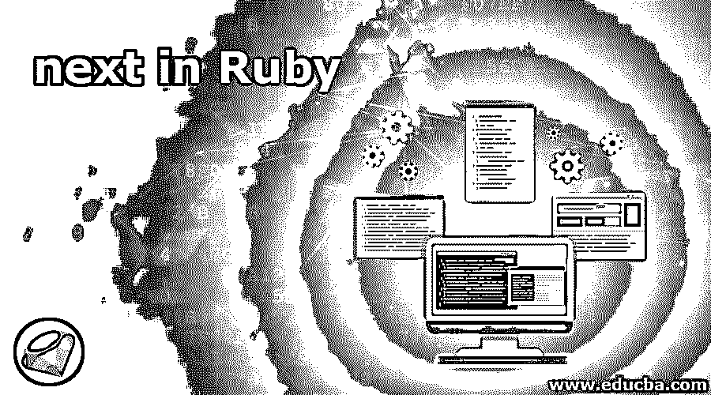
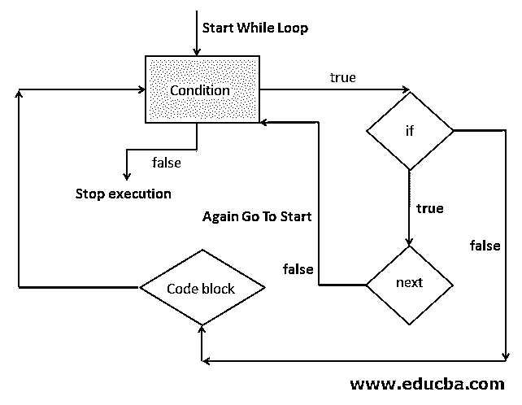
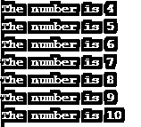
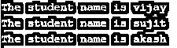
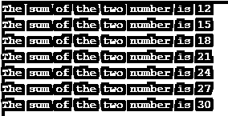

# 接下来是 Ruby

> 原文：<https://www.educba.com/next-in-ruby/>

## Ruby next 语句简介

我们在 Ruby 中使用过循环，我们知道循环在 Ruby 中非常有用，因为它们提供了一种方便的方式来多次执行同一段代码，但是如果我们想要跳过对某个元素的执行而不是完全停止循环，会发生什么呢，所以在这种情况下，我们在 Ruby 中有一个非常有用的属性，这就是 next。接下来提供了一种在任何给定时间跳过循环执行并从其他元素开始的方法，例如，如果您正在搜索任何数据，并且您不想对某个元素执行代码块执行，那么您可以使用 next 来跳过执行，简单来说，我们可以说它允许我们转到任何特定的执行元素。

**语法:**

<small>网页开发、编程语言、软件测试&其他</small>

下面是 Ruby 中 next 语句的语法，我们可以在下面的步骤中解释 Ruby next 的语法。

*   在示例中，首先我们要运行 while 循环，我们使用 while 循环和表达式，这里表达式是条件，当表达式成功(true)时，将执行输出代码块。
*   接下来，我们编写了一个 if 条件，检查条件是失败还是成功，如果条件为真，将调用下一条语句。
*   在这里，next 语句将跳过执行并再次转到 while 循环条件检查，如果再次，如果条件为真，next 将调用，命令将转到 while。
*   一旦，如果条件失败或只是条件，将为假，它将转到代码块执行。

`#We can consider any loop, i have taken an example of the while loop.
while expression
if(condition)
next
end
#here we will write the code which will execute
end`

### 在 Ruby 中 next 语句是如何工作的？

在下一条语句的帮助下，我们将能够节省不必要的代码执行，并且我们将能够节省我们昂贵的资源和过程。让我们借助下面的流程图来理解 Ruby 中“next”的工作方式。

*   首先，它将启动 while 循环条件检查。
*   如果条件为成功或真，则进行 If 语句检查，否则循环将停止或退出循环。
*   如果 if 条件为真，将调用下一条语句，下一条语句将再次调用“while”语句块来检查具有新属性的条件。一旦 if 条件为假，它将转到代码块并执行它。
*   我们以 while 循环为例，但也可以用其他循环做同样的事情。

**Note:** In case if we want to halt the execution of the loop (we do not want to execute the next block of statement ) in that case we also simply use the return in any loop , because return will work for any type of the loop .But if we want to continue the loop with skipping some conditions we can use the next .next is similar to continue of other languages like in c and c++.

请查看 Ruby 中下一条语句的流程图。

### 接下来用 Ruby 实现的例子

以下是 Ruby 中 next 语句的示例:

#### 示例#1

下面是我们打印数字的例子。这里我们打印从 4 到 10 的数字。我们可以在下面的步骤中解释下面的代码。

*   这里我们运行一个 while 循环来检查数字，while 条件语句只检查数字是否在 0 到 10 之间。
*   如果该数字大于 10 或小于 0，循环将被停止。
*   但是这里我们的目标是只打印从 4 到 10 的数字，所以 next 在这里将扮演重要的角色。
*   这里我们使用了一个 if 条件，它检查要打印的数字是否大于 4，如果数字小于 4，它将调用下一条语句，循环将再次运行下一个数字。

**代码:**

`#Here in this example we are printing number start from 4 to 10 out of number from 0 to 10
for number in 0..10
if number < 4 then
next
end
puts "The number is #{number}"
end`

**输出:**

#### 实施例 2

在下面的例子中，我们选取了一些学生并对他们运行循环，我们程序的目标是一旦我们找到用户“ranjan ”,我们将打印剩余的用户，这意味着继续跳过循环，直到用户“ranjan”到达循环中。我们也可以在下面的步骤中解释下面的代码。

*   首先我们取了一组学生变量。
*   我们正在运行一个循环，在这里我们使用了一个条件来检查变量 I 是否小于 4，这意味着 I 应该小于学生数组的长度。
*   在 if 块中，我们检查用户“ranjan ”,直到它没有得到用户“ranjan ”,它将不会打印任何东西。
*   这意味着我们能够跳转到一个特定的条件，而不用停止整个循环。

**代码:**

`#Here we printed all the students after ranjan.
student = ['ajay','ranjan','vijay','sujit','akash'] i=0
while i<4 do
i += 1
next if student[i] == 'ranjan'
puts "The student name is #{student[i]}"
end`

**输出:**

#### 示例 3:

这段代码的目标是不断地将 3 加到一个从 0 开始的数中，直到这个数小于 12，我们才打印任何东西。一旦数字的总和达到 12，它将开始打印，直到 30。

**代码:**

`number =0
while number<30
number += 3
if  number + 3 <= 12
next
end
puts "The sum of the two number is #{number}"
end`

**输出:**

### 结论

从这些教程中，借助一些有用的例子，我们学习了 Ruby 中 next 语句的一些重要用途和基本概念，我们还学习了 next 在流程图中的工作方式，我们还关注了 next 在现实世界中的用法。

### 推荐文章

这是 Ruby 下一步的指南。在这里，我们借助一些有用的例子及其流程图，讨论了 Ruby 中 next 语句的一些重要用途和基本概念。您也可以浏览我们推荐的其他文章，了解更多信息——

1.  [Ruby 命令](https://www.educba.com/ruby-commands/)
2.  [红宝石系列](https://www.educba.com/ruby-ranges/)
3.  [Ruby 中的类](https://www.educba.com/class-in-ruby/)
4.  [Ruby 异常](https://www.educba.com/ruby-exceptions/)

