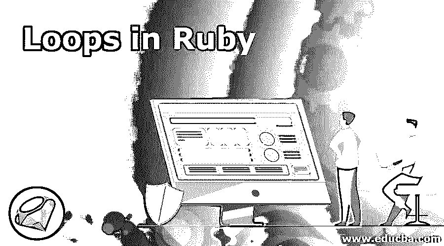
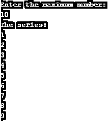

# Ruby 中的循环

> 原文：<https://www.educba.com/loops-in-ruby/>

## Ruby 循环简介

Ruby 中的循环用于在给定的重复次数内执行相同的代码块，或者直到满足某个条件，当需要多次执行相同的语句或任务时使用，例如，如果您想要打印从 1 到 10 的数字，而不是打印每个数字，我们可以使用循环来自动执行任务。循环的使用也减少了程序中使用的行数，因此减少了代码的长度并使某些任务自动化。

### Ruby 中的循环类型

Ruby 中有以下四种类型的循环:

<small>网页开发、编程语言、软件测试&其他</small>

1.  for 循环
2.  while 循环
3.  do-while 循环
4.  直到循环

现在我们将逐一详细讨论这一切。

#### 1.For 循环

for 循环是入口控制循环，用于根据条件重复执行某些操作。For 循环首先检查条件，如果条件为真，那么它将迭代循环，这就是它被称为入口控制循环的原因。在 for 循环中，迭代次数是根据条件决定的，因此它适用于迭代次数固定的程序。

**语法:**

`for variable in expression do
statement to be executed
end`

在上面提到的语法中，for 是在 for 循环中使用的关键字，variable 是变量的名称(变量名称可以是除保留关键字之外的任何名称)。in 也是检查表达式后的条件的关键字，表达式是用于评估代码或程序的条件。do 是关键字，如果条件为真，则在循环内转移流控制，否则将转移流控制到 end，并将终止程序。在 for 循环内部，声明了需要执行的语句。end 是用于终止代码的关键字。

在 ruby 中实现 for 循环的示例:

**代码:**

`puts("Enter the maximum number: ")
num = gets.chomp.to_i
puts("The series: ")
for i in 1..num do
puts(i)
end`

**输出:**

**说明:**

在这里，我们编写了一个程序，根据用户的意愿打印系列。程序首先通过显示“输入最大数量”来提示一条消息。变量 num 用于存储用户输入的值。gets.chomp 将允许用户输入他们的值..num condition 用于打印从 1 到用户指定的最大值的系列。该循环将迭代，直到条件变为假，并打印结果。

#### 2.While 循环

与 for 循环一样，while 循环也用于重复迭代程序，直到条件给出错误结果。当循环首先检查条件时，如果条件为真，它将把流控制转移到循环内部，并重复相同的过程，直到条件变为假。while 循环适用于要执行的迭代次数不固定的程序。

**语法:**

`while condition
statement to be executed
end`

在上述语法中，虽然它是用于 while 循环的关键字，但是条件用于评估由用户定义的程序。如果条件为真，它将执行循环中定义的语句，否则将终止程序并将流控制转移到循环之外。end 是用于终止程序的关键字。

在 ruby 中实现 while 循环的示例:

**代码:**

`x = 1
puts("Enter the maximum number: ")
num = gets.chomp.to_i
puts("The series: ")
while x <= num
puts(x)
x += 1
end`

**输出:**

**说明:**

在这里，我们编写了一个程序来打印一系列的数字，就像我们在 for 循环中所做的一样，同样的代码也是为 while 循环编写的。唯一的区别是这里我们有 while 语法和不同的条件。这里我们写了一个程序，变量 x 用 1 初始化，变量 num 的值由用户定义。直到 x 的值小于或等于 num，它将打印该值，并将 x 的值递增 1。

#### 3.Do While 循环

Do While 循环与 While 循环非常相似，唯一的区别是 do-while 循环至少执行一次，因为用于评估程序的条件是在循环结束时编写的，因此循环至少执行一次。

**语法:**

`loop do
Statement to be executed
break if condition
end`

在上述语法中，do 是用于 do-while 循环的关键字，do 循环将转移循环内的流控制，并且语句将被执行。如果皮重，则中断关键字，如果条件为真，将中断循环，并将流程控制转移到 end 语句，该语句将终止程序。在 ruby 中实现 do while 循环的程序

**代码:**

`loop do
puts "Checking for answer"
x = gets.chomp
if x != '10'
break
end
end`

**输出:**

#### 4.直到循环

until loop 也用于重复执行循环。until loop 将迭代循环，直到条件变为真。

**语法:**

`until condition
statement to be executed
end`

在上述语法中，until 是用于 until 循环的关键字，until 关键字将检查条件并执行循环，直到所述条件不为真。一旦条件变为真，它将终止代码。

在 ruby 中实现 until 循环的示例:

代码:

`x = 1
puts("Enter the maximum number: ")
num = gets.chomp.to_i
puts("The series: ")
until x == num
puts(x)
x += 1
end`

**输出:**

使用 until 关键字为上述所有程序编写了相同的程序。概念和逻辑与其他示例相同。

### 推荐文章

这是 Ruby 中循环的指南。这里我们讨论什么是 Ruby 中的循环和各种类型，以及代码实现的语法和例子。您也可以浏览我们推荐的其他文章，了解更多信息——

1.  [While Ruby 中的循环](https://www.educba.com/while-loop-in-ruby/)
2.  [Ruby 数组方法](https://www.educba.com/ruby-array-methods/)
3.  [红宝石的破碎](https://www.educba.com/break-in-ruby/)
4.  [红宝石直到循环](https://www.educba.com/ruby-until-loop/)

