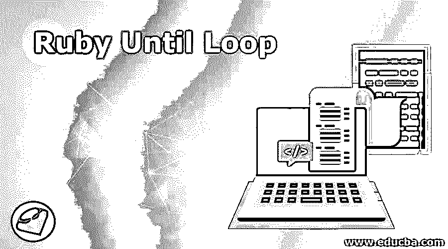
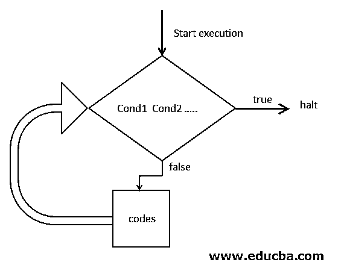
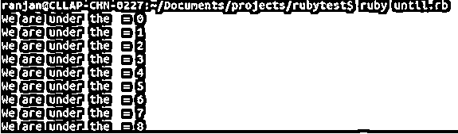
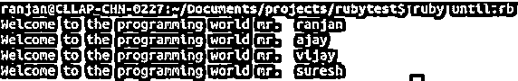
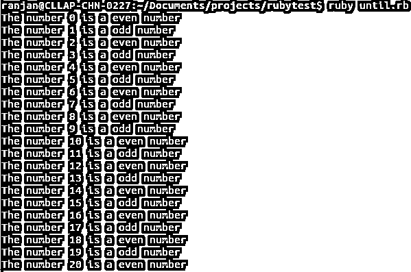

# Ruby 直到循环

> 原文：<https://www.educba.com/ruby-until-loop/>

## Ruby Until 循环简介

ruby 中的 Until Loop 允许开发人员在不同的时间运行同一段代码，或者更明确地说，Until loop 是一种根据情况需要多次运行相同代码的方式，在 Ruby 中，until 是一个关键字，它由条件块组成，循环的流程取决于条件块，until loop 与 while loop 正好相反， 这意味着它在条件中等待真，一旦条件变为真，循环将停止，所以我们可以根据我们的条件使用 until 循环。

**语法:**

<small>网页开发、编程语言、软件测试&其他</small>

请遵循下面给出的 until 循环的代码语法。

`until cond1 cond 2 ..  [do] //(code block)here we are going to write code
end`

**说明:**

*   **until** :这是 ruby 预定义的关键字，将用于一次又一次地执行同一段代码，它表示任何循环的开始。
*   **条件 1，条件 2..**:这些是在执行代码块之前要检查的条件。示例(a==9 & & b==8)这里“a”和“b”是任意整数值，两个条件是 cond1 和 cond2，如果任何一个条件为真，那么代码块将执行。
*   **do** :在 do 块的帮助下，即使条件成功或简单地条件组合为真，也能够至少执行一次代码。
*   **end** :该关键字表示从‘do’关键字开始的 until 循环块的结束。

### Ruby Until 循环流程图

下面是 Ruby 中 until 循环的流程图，我们可以在下面的步骤中解释下面的流程图。

*   第一次执行将从传递 cond1 和 cond2 形式的循环值开始，这意味着 cond1 和 cond2 所需的数据。
*   在循环中有一个条件块，它将检查真或假条件。基本上，这个条件是关于检查写在 until 循环中的表达式是返回 true 还是 false。
*   如果条件(条件 1 和条件 2)失败(两个条件的组合为假)，代码块将执行，如果条件为真，循环将中断。
*   它将继续，直到条件为假，这里的条件可以是 cond2 和 cond2 的组合条件，或者可以更多，并且它们的组合表达式应该为假，以继续代码块的执行。
*   如果条件(所有条件的组合)为真，循环将停止，直到循环结束。

**

** 

### Ruby 中的 Until 循环是如何工作的？

ruby 中 until 循环的工作原理可以在下面的步骤中解释:

*   ruby 中的 until 循环基于布尔值，这意味着它对条件的 true 和 false 值起作用。
*   每次循环检查条件，如果为 until 循环编写的条件为假，它将执行代码块，如果条件为真，until 循环将中断并结束。
*   用更专业的话来说，如果条件成功(条件输出=真)，那么循环将被打破。这里的条件可以是更多条件的组合。
*   如果条件为假，它将进入循环并执行代码块，它将继续这样做，直到条件输出为真。
*   借助 Ruby until 循环中的 do 关键字，即使条件成功(true ),它也会执行 altealt，这意味着一旦代码块执行，即使条件为 true。

### 实现 Ruby Until 循环的示例

**Note:** I have created a file with name until.rb you can create your own file with any name and paste the code i have written and run the command for executions.

#### 示例#1

我们可以用下面的步骤来解释下面的例子:

*   这里程序的目标是打印所有的数字，直到 8。
*   首先，我们用$像$temp 和$number 定义了一个全局变量。
*   我们已经将$temp 和$number 的值分别初始化为 0 和 8。
*   “直到循环”从条件开始，它将检查将要打印的$number 是否大于$a。
*   如果$number 大于$a，它将打印该数字，一旦$a 的值达到 8，它将为真(！条件)并且循环将被停止。

**代码:**

`$temp = 0
$number = 8
until $temp > $number  do
puts("We are under the  = #$temp" )
$temp +=1;
end`

**输出:**

#### 实施例 2

我们可以用下面的步骤来解释下面的例子:

*   在下面的例子中，我们用问候来欢迎一群学生。
*   首先，我们定义了一组学生的全局变量。
*   我们定义了一个全局变量$a，用于检查学生数组的长度。
*   最后，在条件中，我们检查数组的长度是否大于$a 变量。这样我们就可以遍历所有的数组并打印出每个学生的问候。
*   一旦条件为真，循环将停止。

**代码:**

`$a=0
until !($students.length()>$a)  do
@s=$students[$a] puts("Welcome to the programming world mr.  #@s" )
$a +=1
end`

**输出:**

#### 实施例 3

我们可以用下面的步骤来解释下面的例子:

*   在下面的例子中，我们在 until 循环的帮助下检查给定的数字是奇数还是偶数。
*   我们定义了一个全局变量$number，并赋值为 20，这意味着直到 220，我们都在检查偶数和奇数。
*   我们使用了 ruby 方法 odd of number，它会告诉我们这个数字是奇数还是偶数。

**代码:**

`$number = 0
until !($number <= 20)
if $number.odd?
puts "The number #$number is a odd number"
else
puts "The number #$number is a even number"
end
$number += 1
end`

**输出:**

### 结论

从这些教程中，我们学习了 until 循环的工作原理以及它在现实生活中的重要用途，我们学习了 while 循环的相反原理，我们还学习了 until 循环在 Ruby 中的工作原理以及它的通用语法和条件流程图(多个条件的组合如果为假则成功，如果为真则失败)。

### 推荐文章

这是一个 Ruby Until 循环的指南。在这里，我们讨论 Ruby Until 循环的介绍及其语法，以及示例和代码实现。您也可以浏览我们推荐的其他文章，了解更多信息——

1.  [Ruby if else](https://www.educba.com/ruby-if-else/)
2.  [红宝石系列](https://www.educba.com/ruby-ranges/)
3.  [下一个红宝石](https://www.educba.com/next-in-ruby/)
4.  [Ruby 中的类](https://www.educba.com/class-in-ruby/)

