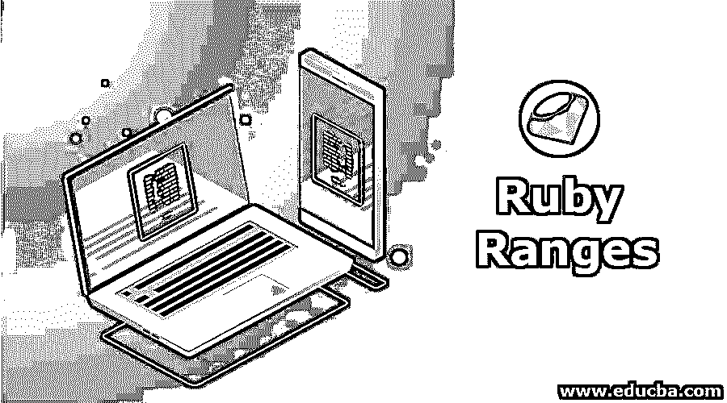
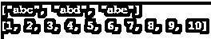
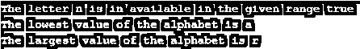
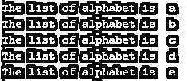

# 红宝石系列

> 原文：<https://www.educba.com/ruby-ranges/>

## Ruby 系列简介

Ruby 中的范围是处理一些序列的一种方式，这些序列是我们在日常生活中使用的任何东西，例如，A 到 Z，A 到 Z 或者从 1 到 100，所有这些都是范围。在 Ruby 中，范围可以用于三个更广泛的类别，比如序列、条件，我们也可以使用区间的范围，一般来说，如果你想使用从 1 到 100 的数字，那么我们可以简单地将范围从 1 到 100(1..100)使用双点(..)或者，如果我们想要忽略最大的数字，这意味着我们想要从 1 到 99 的范围，我们可以使用 1…100，这是三点(…)。

**语法:**

<small>网页开发、编程语言、软件测试&其他</small>

范围可以有三种不同的语法，三种不同的语法如下所示:

*   **使用范围作为序列的语法**:

在这里，我们可以使用它，如果我们想要一些序列从一个开始范围到另一个结束值。请看下面的语法，我们已经从头到尾分配了一些序列。您可以指定从数字范围到字符串范围的任何内容，例如..z 或 1..100.

`sequences = (start ..end).to_a
example (a..d).to_a (output will be a,b,c,d)`

*   **使用范围作为条件的语法:**

在这个用例中，你将能够得到数字的范围。在下面的例子中，我们有一个值，它可以是任何数字或字符串，它将进入 ruby 的 case 块，在那里它将使用某个已定义的语法进行检查，我们将它用于任何比较或某些特定条件，例如，如果您有一个数字 40，您想知道该数字的范围，那么您可以范围。一旦值匹配特定的范围，我们就可以打印消息或执行特定的操作，因为我们有关于范围的信息。

`value = any numeric or string value
result = case value
when start1..end1 then "messages according to the conditions"
when start2..end2 then "messages according to the conditions"
when start3..end3 then "messages according to the conditions"
end`

*   **使用范围作为间隔的语法:**

为此，我们可以使用运算符===，在下面的语法中，我们可以看到===的用法，用于获取是否在给定范围内的值。例如一个..g ===f，当 f 落在 a 到 g 的范围内时，输出为真。

`(start..end) === compare any value
(example , a..g===f ,output will be true)`

**Note:** We can also have some custom angles, for example, range of (abc..abe) and the output will be abc, abd, abce.

### 如何用各种方法表示 Ruby 范围？

下面，我们将借助示例学习如何使用各种方法来表示 Ruby 范围:

#### 示例# 1-**to _ a 方法**

此方法用于将范围转换为数组。在这个方法的帮助下，我们可以多次获取数组，我们需要创建一个大数组，将许多属性写入其中，在 to_a 方法的帮助下，我们将很容易地获取数组**。**参见以下示例以及屏幕输出。

**代码:**

`puts "#{("abc".."abe").to_a}"
puts "#{(1..10).to_a}"`

**输出:**

#### 示例 2—(最小值、最大值和包含值)方法

ranges 中的此方法返回给定范围中的最小值。如果我们有一个很大的范围，那么获取最小值或最大值将非常有用。我们还在范围上使用了 include 方法，该方法检查数字、字母或任何属于该范围的子字符串。参见下面的例子，我们已经使用了最小，最大和包括连同输出屏幕。

**代码:**

`alphabets = "a".."r"
puts "The letter n is in available in the given range #{alphabets.include?("n")}"
alphabet1 = alphabets.min
alphabet2 = alphabets.max
puts "The lowest value of the alphabet is #{alphabet1}"
puts "The largest value of the alphabet is #{alphabet2}"`

**输出:**

#### 示例 3–剔除方法

这里我们使用的是 range 的 reject 方法，借助这个方法我们可以返回字母的范围。在下面的例子中，如果字母小于“c ”,我们就简单地拒绝它，在代码块中，它将从 c 开始拒绝，直到最后一个范围值，即“e”。

**代码:**

`alphabets ="a".."e"
rejected = alphabets.reject {|i| i < "c" }
puts "Rejected letters start from c are  #{rejected}"`

**输出:**

#### 示例 4–每种方法

范围的每个方法都用于迭代范围内的所有值。在下面的例子中，我们打印从 a 到 e 范围内的所有值。请看下面的输出屏幕。

**代码:**

`alphabets ="a".."e"
alphabets.each do |alphabet|
puts "The list of alphabet is  #{alphabet}"
end`

**输出:**

#### 示例 5–案例方法

在案例的帮助下，我们检查特定的值范围，在下面的例子中，我们有一个学生的标记，我们希望了解该学生的分数。case 属性“when”将每次检查范围，如果匹配特定范围，它将打印该范围的消息。请按照下面的例子以及输出屏幕。

**代码:**

`mark =67
studentFinalGrade = case mark
when 0..28 then "The student got very less mark and failed in this paper"
when 29..40 then "The student got average marks and he got pass with D grade"
when 41..60 then "The student is ok and he got C grade"
when 61..81 then "The student is very good and he got B grade"
when 82..100 then "The student is very excellent and he got A grade"
else "The mark is not valid and no grade can be assigned"
end
puts  studentFinalGrade`

**输出:**

### 结论

从这些教程中，我们了解了 Ruby 中的 ranges，我们理解了它的用法和核心概念，比如它的方法，这是主要的优点，因为借助 ranges 方法，我们可以将转换为数组与给定的范围集进行比较，这将使开发人员的生活更加舒适。

### 推荐文章

这是一个红宝石系列指南。在这里，我们将借助一些有用的例子和代码实现，讨论如何使用各种方法来表示 Ruby 范围。您也可以浏览我们推荐的其他文章，了解更多信息——

1.  [Ruby 命令](https://www.educba.com/ruby-commands/)
2.  [Ruby 异常](https://www.educba.com/ruby-exceptions/)
3.  [Ruby 方法](https://www.educba.com/ruby-methods/)
4.  [Ruby do while](https://www.educba.com/ruby-do-while/)

