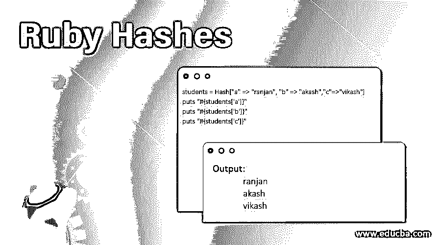
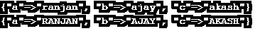
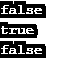

# Ruby 哈希

> 原文：<https://www.educba.com/ruby-hashes/>

## Ruby 哈希的定义

ruby 中的 Hash 是一种像数组一样存储数据的方式，唯一的区别是它以键值对的形式存储数据，而不是像{"name"=>"ranjan"}那样以索引的形式存储数据。我们可以在不知道索引值的情况下访问任何位置的值，因此不需要遍历整个散列来获得任何键的值，只需通过键的名称就可以获得值。如果被搜索的键的值不存在，它将返回 nil，这是非常有用的，因为在访问数据时，即使特定键的数据不存在，它也将返回 default。

**语法:**

<small>网页开发、编程语言、软件测试&其他</small>

在下面的语法中，我们可以看到带有键和值的散列，如果我们想访问值 3，那么通过 H["key3"]我们可以得到值。

`H={"key1"=>”value1”, "key2"=>”value2”,”key3”=>”value3”}`

### 如何在 Ruby 中创建哈希？

在 Ruby 中创建 hash 有多种方法，下面是一些重要的方法，

#### 1.使用新的类

我们可以简单地将字符串作为初始值传递，然后用 0 索引来访问它。在下面的例子中，我们创建了一个 student 的散列，student[0]给出了值，student[10]给出了默认值。

**代码:**

`student = Hash.new( "student" )
puts "#{student[0]}"
puts "#{student[10]}"`

**输出:**

#### 2.使用 Ruby 的 Hash 关键字

在下面的例子中，我们为 a、b 和 c 键赋值，在同一个键的帮助下，我们能够访问每个属性。请参见下面的输出屏幕示例。

**代码:**

`students = Hash["a" => "ranjan", "b" => "akash","c"=>"vikash"] puts "#{students['a']}"
puts "#{students['b']}"
puts "#{students['c']}"`

**输出:**

### 如何在 Ruby 中修改哈希？

为了修改 ruby 中的散列，我们可以使用 ruby 的每个或任何其他循环函数。在下面的例子中，我们用一个小写字母定义了一个学生数组，然后在 ruby 的 upcase 函数的帮助下，我们将它们改为大写字母。

**代码:**

`students ={"a" => "ranjan", "b" => "ajay", "c" =>"akash"}
puts students
students.each { |key, value| students[key] = value.upcase }
puts students`

**输出:**

### Ruby 中的哈希方法

*   新的:我们可以在一个新的 ruby 类的帮助下创建一个空的 hash。
*   **Try_convert** :该方法将用于将对象转换为哈希值。万一它不能转换，它将返回零。
*   **<** :检查一个 hash 是否是另一个 hash 的子集，如果是则返回 true。
*   **< =** :它会检查给定的 hash 是否相等或者是另一个 hash 的子集。如果一个哈希是另一个哈希的子集或者等于另一个哈希，则返回 true。
*   **==:** 它检查一个散列与另一个散列的相等条件。如果一个哈希等于另一个哈希，它将返回 true。
*   **clear** :如果我们想让散列的所有键值对都为空，那么我们可以使用这个属性。
*   **delete** :如果你想从散列中删除一个特定的键值对，我们可以使用这个属性。如果我们试图删除的键值对不可用，它将返回 nil。
*   **Delete_if** :这是我们用于条件删除的。在这里，在这种情况下，它将从我们将要编写的块逻辑的散列中删除每个键值对。
*   **each** :它将允许我们遍历给定散列的所有键值对。
*   **empty** :检查 hash 中的数据，如果 hash 中没有数据，返回 true。
*   **fetch** :这个方法将用于获取给定键的值。如果我们运行 fetch 方法的键不在那里，它将返回一个默认值。
*   **has_key** :该方法将用于检查该键是否存在，如果该键存在于 hash 中，则返回 true。
*   **has_value** :它将检查任何给定键的值，如果该值存在，则返回 true。
*   **to_s** :它将被用来把 hash 转换成 string。
*   **invert** :该方法用于创建一个新的 hash，交换键-值对，也就是说键将被值替换，值也将被键替换。假设如果一个相同的键将要被创建，那么，在这种情况下，最后一个键-值对将被考虑。
*   **length** :这个方法用于获取 hash 中键值对的数量。

### Ruby 散列的例子

在下面的例子中，我们使用了一个比较操作符来比较哈希值。这里 hash1 和包含一个公共键值，但它不等于 hash2，其中 hash2 和 hash3 包含所有公共键值对，因此它们是相等的。在屏幕输出中，我们可以看到 true 和 false 的布尔输出。

**代码:**

`hash1 = { "aa" => 11, "c" => 2 }
hash2 = {9 => 90, "h" => 10, "aa" => 11 }
hash3 = { "aa" => 11, "h" => 10, 9 => 90 }
hash4 = { "c" => 1, "y" => 2, "l" => 35 }
puts hash1 == hash2
puts hash2 == hash3
puts hash3 == hash4`

**输出:**

### Ruby 中哈希的优势

在 ruby 中使用散列有很多好处，下面给出了其中一些。

*   由于键-值对，它们总是唯一的，因为不会有重复的键。
*   要访问任何值，我们可以直接使用键，而不是在整个散列上循环。
*   Hashes 类有很多我上面已经提到的方法。
*   我们可以使用任何对象作为索引(就像在数组中我们只能使用整数索引)。
*   它包含缺省值，如果搜索的关键字没有找到，它将返回设置的缺省值，如果缺省值没有设置，它将返回零。

### 结论

从上面的教程中，我们了解了 Ruby 中散列的重要特性，我们了解了它的用途，它是一个重要的方法，在对散列进行任何困难的操作时都可以发挥重要的作用，我们最后展示了 Ruby 中散列的重要优势。

### 推荐文章

这是一个 Ruby 哈希指南。这里我们讨论 ruby 中的定义和散列方法，以及如何在 ruby 中创建和修改散列。您也可以看看以下文章，了解更多信息–

1.  [JavaScript vs Ruby](https://www.educba.com/javascript-vs-ruby/)
2.  [Ruby 编程实践](https://www.educba.com/ruby-programming-practice/)
3.  背对卡夫卡
4.  [轨道命令](https://www.educba.com/rails-commands/)

