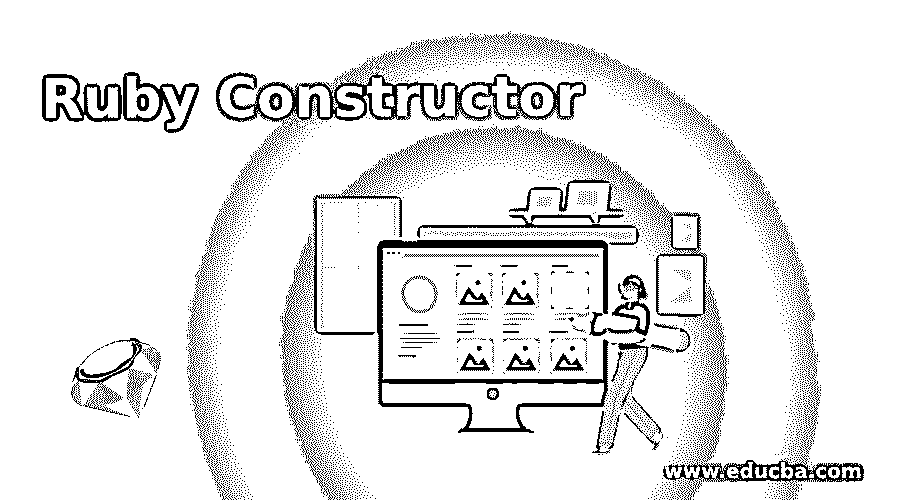
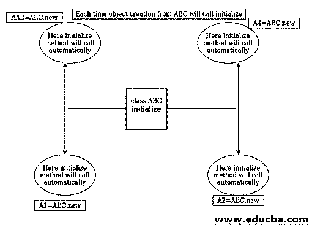
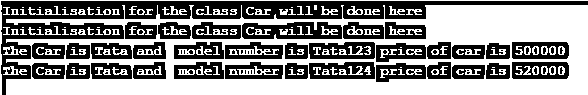

# Ruby 构造函数

> 原文：<https://www.educba.com/ruby-constructor/>

## Ruby 构造函数简介

Ruby 中的构造函数是类属性的一部分，它是一个预定义的方法，这取决于我们是否要使用构造函数，构造函数的主要目的是在调用类的任何方法之前初始化基本变量和所需的东西，构造函数的好处是我们不需要调用构造函数来初始化类，它将在从类创建对象时初始化， 要在 Ruby 的任何类中使用构造函数方法，我们可以使用 initialize 方法，它将在从类创建对象时被调用。

### 句法

下面是构造函数的语法，我们使用 new 操作符创建构造函数，一旦我们使用 new 操作符创建对象，它将自动调用 initialize 方法，我们可以在这里为使用该类的其他方法做一些初始化工作。要在 Ruby 中创建一个对象，我们可以使用 new 关键字和类的名称，比如 ConstructorExample.new，一旦我们使用了这个命令，它就会在内部调用这个方法进行初始化。关于 Ruby 中构造函数的用法，请看下面的例子。

<small>网页开发、编程语言、软件测试&其他</small>

让我解释下面的例子:

*   我们用类名 ConstructorExample 定义了一个类，可以看到我们在类名(ConstructorExample)前使用了 class 关键字。我们将使用这个类名来创建使用新关键字的对象，我们不需要在这里手动调用构造函数。
*   在构造函数方法里面，我们给出了一些注释部分，在这里我们也可以把一些方法和常量作为初始化来代替注释。
*   最后，我们在一个新关键字的帮助下，从类 ConstructorExample 创建一个对象，该关键字调用自动初始化方法。
*   当我们从这个类中创建对象时，这个类也会自动初始化这个方法，并完成变量的初始化工作。这里 Object 包含了 ConstructorExample 类的所有变量和方法。

请参见下面的 Ruby 类创建语法。

`class ConstructorExample
#Do the initialisation here
def initialize(param1, param2)
# Here we are initialising the variables .
#The initialisation can be setting value of param1 and param2 for uses in other method of this class
end
#Write here your methods and constants
end
#Here we are creating objects from class and at the same time it will call the initialize method where we can do some initialisation .
constructorInitialize1 =ConstructorExample.new(param1, param2)#Here automatic call for constructor will happen
constructorInitialize1 =ConstructorExample.new(param1, param2)#Here automatic call for constructor will happen
constructorInitialize1 =ConstructorExample.new(param1, param2)#Here automatic call for constructor will happen
constructorInitialize1 =ConstructorExample.new(param1, param2)#Here automatic call for constructor will happen`

### Ruby 中的构造函数是如何工作的？

构造函数是任何类的最重要的组成部分之一，它总是取决于我们对构造函数的使用要求，假设我们想进行一些初始化，以便从下一次调用类中的任何方法时，该方法将为任何调用使用一些固定的数据，在这种情况下，我们可以设置一些初始变量，每个将被调用的方法将使用构造函数初始化时设置的数据。

我们可以借助下图来解释构造函数。

*   这里我们有一个名为 ABC 的类，这个类包含一个方法和一个常量和 initialize 方法，默认情况下会调用这个方法，而不需要在创建对象时进行手动调用。
*   这里，new 关键字将通知 Ruby 编译器关于从类名 ABC 创建对象的指令，并且它将导致检查任何 initialize 方法和其中的任何代码是否存在，如果存在，则首先执行它们。
*   一旦 Ruby 编译器读取了 new 关键字，它将为该类创建一个对象，同时获取所有属性并初始化构造函数调用。
*   现在我们正在从 ABC 类创建许多对象，如对象 A1、对象 A2、对象 A3 和对象 A4，每个对象的创建都会有一个构造函数 initialize 调用来初始化常量和变量。

为了更好的理解，请看下面的 Ruby 构造函数的流程图。

### Ruby 构造函数的例子

以下是 ruby 构造函数的例子:

#### 示例#1

这里我们没有在 initialize 方法中初始化任何东西，我们只打印了几条消息来告诉你如何在不调用类中的对象创建的情况下初始化方法。

*   首先，我们创建了一个名为 Car 的类。
*   接下来，我们创建了一个 Ruby 内置方法 initialize，它将被用作 Ruby 类内部的构造函数来初始化基本的东西。
*   我们在类中编写了 display_car 方法，该方法将显示传递给它的属性的数据。
*   接下来，我们在一个新关键字的帮助下从 Car 类创建一个对象，并使用所需的参数调用 display_car 方法来显示汽车的详细信息。

请查看下面的代码示例以及输出屏幕。

**代码:**

`class Car
# Method for initialisation inside the class
def initialize()
# Initialising work
puts "Initialisation for the class Car will be done here"
end
def display_car(name,model,price)
puts "The Car is #{name} and  model number is #{model} price of car is #{price}"
end
end
# Creating an objects and passing parameters  for initialization to constructor
carObjec1 = Car.new()
carObjec2 = Car.new()
carObjec1.display_car("Tata", 'Tata123', 500000)
carObjec2.display_car("Tata", 'Tata124', 520000)`

**输出:**

#### 实施例 2

下面是一个例子，我们用一个类 Car 来初始化构造函数。这个程序旨在显示汽车信息。我们可以在下面的步骤中解释下面的例子。

*   首先，我们创建了一个名为 car 的类，在 Car 类的帮助下，我们将使用一个新的关键字创建对象，一旦创建了 Car 类的对象，它将调用 initialize 方法并设置基本的 Car 详细信息，以便下次调用时将显示初始设置值。
*   我们在类中编写了 display_car 方法，它将显示在对象创建时传递给 initialize 方法(扮演构造函数的角色)的属性数据。

请查看下面的代码示例以及输出屏幕。

**代码:**

`class Car
# Method for initialisation inside the class
def initialize(name ,model ,price )
# Initialising
@name = name
@model = model
@price =price
end
def display_car()
puts "The car is #{@name} and  model number is #{@model} and the price of car is #{@price}"
end
end
# Creating an objects and passing parameters  for initialization as the constructor will get automatically call
carObjec1 = Car.new("Tata", 'Tata123', 500000)
carObjec1 = Car.new("Tata", 'Tata124', 520000)
carObjec1.display_car()
carObjec1.display_car()`

**输出:**

### 结论

从这些教程中，我们借助一个有用的真实例子，学习了 Ruby 中构造函数的一些重要用途和基本概念。我们还借助图表和少量语法学习了构造函数的工作方式，在这里我们也很少关注构造函数在真实用例中的使用。

### 推荐文章

这是一个 Ruby 构造函数的指南。这里我们讨论用 Ruby 实现构造函数的例子，以及示例代码和工作原理。您也可以看看以下文章，了解更多信息–

1.  [红宝石运算符](https://www.educba.com/ruby-operators/)
2.  [Ruby on Rails 职业生涯](https://www.educba.com/career-in-ruby-on-rails/)
3.  [Ruby 命令](https://www.educba.com/ruby-commands/)
4.  [红宝石的用途](https://www.educba.com/uses-of-ruby/)

