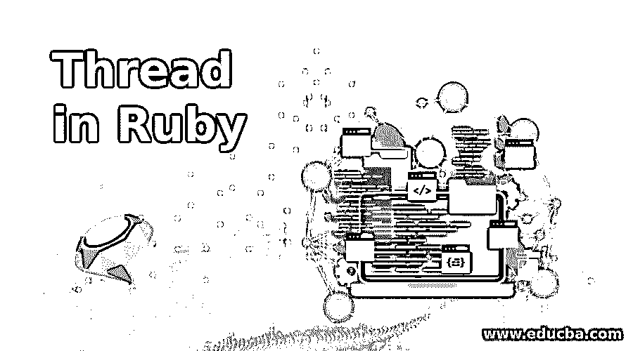
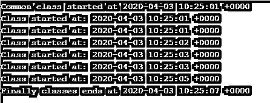
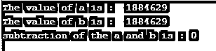
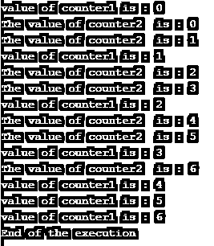

# 红宝石线

> 原文：<https://www.educba.com/thread-in-ruby/>

## Ruby 线程简介

Ruby 中的线程允许开发人员编写代码，他们可以同时编写和执行许多程序，用技术术语来说，假设我们要同时执行加法和乘法两个操作，这在正常情况下是不可能的，因为它会先执行加法或乘法，但是借助 Ruby 中的线程概念，它允许我们的代码同时运行加法和乘法， 这种方法的主要好处是允许在流程中使用最大的可用资源和并发性。

### Ruby 中的 Thread 是如何工作的？

线程是两个语句并行运行概念。但是 Ruby 中的线程与 Java 中的线程不同，因为 Ruby 中所有的线程都是在解释器中实现的，这意味着 Ruby 线程完全独立于操作系统，我们知道如果它独立于操作系统，它将是可移植的(基本上适用于任何操作系统)。Ruby 中线程的工作是基于生命周期方法的，我们可以在下面的步骤中解释 Ruby 的生命周期方法。

<small>网页开发、编程语言、软件测试&其他</small>

*   我们使用 new 在 Ruby 中创建新线程，我们也有类似 Thread.start 和 Thread.fork 的选项。
*   ruby 中的 Thread 是自动启动的，这意味着一旦有来自 CPU 的可用资源，我们就不需要手动启动它。
*   如果我们写 Thread.new(代码块)，这里 Thread 会运行其代码块中的代码，然后停止它。在 Ruby 中，它给出了许多处理正在运行的线程的方法来操纵和获取关于线程的信息。
*   Ruby 中的线程有一些重要的方法，比如 current(它包含当前线程的对象，在调用 Thread.current 时，它返回这个对象)。另一个方法是 Thread 中的 main，它包含在调用 Thread.main 方法时表示主线程的对象。
*   Ruby 中的 Thread 包含了一个非常漂亮的特性，那就是，我们可以通过调用一个叫做 join 的方法来等待任何特定线程的完成，所以如果我们调用 join，它会一直阻塞，直到这个线程完成。

### 如何在 Ruby 中初始化线程？

要初始化 Ruby 中的任何线程，我们只需要调用 Thread.new 和这个 Thread.new 中的任何相关块就可以启动了。参见下面的 Ruby 线程初始化语法。

`Thread.new {
# Here the block of code for running as the thread
}`

### 如何在 Ruby 中终止线程？

我们可以用通式来终止任何一个线程，就是 Thread.kill(thread)。如果代码运行时出现异常，Ruby 也给了我们一种处理方法，我们可以借助 abort_on_exception 方法终止线程或操作。我们只需要给它赋值 true 来停止线程的执行。例如 Thread.abort_on_exception = true。还有其他方法可以停止和退出。

### Ruby 中线程的例子

下面是下面提到的例子。

#### 示例#1

在下面的例子中，我们展示了两个函数同时运行，我们可以用以下方式解释下面的例子。

*   我们定义了两个函数 school1 和 school2，这些函数包含了增量的逻辑。
*   我们使用了 Thread.new(school1)和 Thread.new(school2 ),在执行这两个命令时，它将继续打印上课时间。
*   我们可以在输出中看到，许多打印包含与开始上课相同的时间。这意味着有两起处决同时发生。

请按照下面的例子以及输出屏幕。

**代码:**

`# This example explains to us how we are able to run multiple threads in the ruby
def school1
counter1 = 0
while counter1<=2
puts "Class started at: #{Time.now}"
sleep(2)
counter1 = counter1+1
end
end
def school2
counter2 = 0
while counter2<=2
puts "Class started at: #{Time.now}"
sleep(1)
counter2 = counter2+1
end
end
puts "Common class started at #{Time.now}"
school1Thread = Thread.new{school1()}
school2Thread = Thread.new{school2()}
school1Thread.join
school2Thread.join
puts "Finally classes end at #{Time.now}"`

**输出:**

#### 实施例 2

在这个例子中，我们同时对两个变量进行加法运算和减法运算。因此，我们可以在下面的步骤中解释下面的例子。

*   我们在这里导入了线程模块。
*   我们已经定义了一个变量减法，并将它的初始值指定为 0。
*   我们还定义了两个变量 a 和 b，因为这两个变量将在加法中起作用。
*   我们创建了两个线程，在一个线程中，我们执行加法或增量活动，在另一个线程中，我们执行减法活动。

**代码:**

`# importing the thread module
require 'thread'
a = b = 0
subtraction = 0
Thread.new do
loop do
a += 1
b += 1
end
end
Thread.new do
loop do
subtraction += (a - b).abs
end
end
sleep 1
puts "The value of a is :  #{a}"
puts "The value of b is :  #{b}"
puts "subtraction of the a and b is : #{subtraction}"`

**输出:**

#### 实施例 3

在下面的例子中，我们为计数器 1 和计数器 2 打印了从 1 到 6 的值。在下面的输出屏幕中，我们可以看到 counter1 和 counter2 都是并行打印的，有些时序可能不按顺序，这取决于执行空间对 CPU 语句的分配。

**代码:**

`def function1
counter1 = 0
while counter1 <= 6
puts "value of counter1 is : #{counter1}"
sleep(1)
counter1 = counter1 + 1
end
end
def function2
counter2 = 0
while counter2 <= 6
puts "The value of counter2  is : #{counter2}"
sleep(0.5)
counter2 = counter2 + 1
end
end
function1Thread = Thread.new{function1()}
function2Thread= Thread.new{function2()}
function1Thread.join
function2Thread.join
puts "End of the execution"`

**输出:**

### 结论

从这些教程中，我们学习了 Ruby 中线程的基本概念，了解了 Ruby 线程的工作、初始化和终止。最重要的是，我们在一些例子及其输出的帮助下了解了线程的实际应用。

### 推荐文章

这是一个 Ruby 线程指南。这里我们讨论了 Ruby 线程的工作、初始化和终止，并给出了例子。您也可以看看以下文章，了解更多信息–

1.  [如何安装 Ruby](https://www.educba.com/install-ruby/)
2.  [Ruby on Rails 职业生涯](https://www.educba.com/career-in-ruby-on-rails/)
3.  [红宝石的用途](https://www.educba.com/uses-of-ruby/)
4.  [Ruby 面试问题](https://www.educba.com/ruby-interview-questions/)

