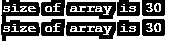
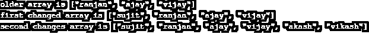
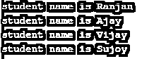
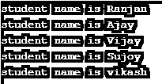
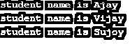
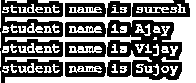

# Ruby 数组

> 原文：<https://www.educba.com/ruby-arrays/>

## Ruby 数组简介

ruby 中的数组是存储各种对象集合的方式，Ruby 数组中的每个元素都用一个索引值来访问， 索引值从 0 开始，这与在 c 或 java 中编程的情况相同，这里如果我们使用索引的任何负值，这意味着我们正在谈论数组的结尾，例如-1 表示最后一个元素，而-2 表示数组的倒数第二个元素，ruby 中数组的大小是不固定的，我们可以添加任意多的元素，大小将随着新元素的添加而自动增长，这些元素可以是整数、字符串、固定数、哈希或任何其他数组。

### 如何在 Ruby 中创建数组？

在 ruby 中创建数组有多种方法，下面给出了其中一些方法，

<small>网页开发、编程语言、软件测试&其他</small>

#### 通过使用新的类

通过使用一个新的类，我们可以定义数组，这里我们也可以定义我们将要使用的数组的大小。这是在 Ruby 中创建数组的最简单的方法。这里我们使用新的类并为数组元素指定长度。使用新类的简单方法。

**代码:**

`students = Array.new
Defining the size for the array ,
Student =Array.new(30)`

我们可以通过下面的方式用 Ruby 可用的方法 size 和 length 来查看数组的大小，

`student = Array.new(30)
$size=student.size
$length=student.length
puts "size of array is #$size"
puts "size of array is #$length"`

**输出:**

#### 通过赋值

我们还可以在 Ruby 中创建一个数组，方法是将值赋给每个元素的数组。在下面的例子中，我们简单地使用了这个新类，并向它传递了两个参数，一个是数组的长度，另一个是将被重复用作数组元素的元素。

**代码:**

`student = Array.new(7, "ranjan")
puts "student repeated name is #{student}"`

**输出:**

#### 使用块

我们可以定义一些块，在块中包含一些逻辑，无论在块中写入什么逻辑，都会产生相同的数组，见下面的例子。在下面的例子中，我们定义了逻辑为的块，以获得从 0 到 11 的每个数字的平方，因为数组的长度是 12。

**代码:**

`Number = Array.new(12) { |e| e = e * e }
puts "array with square from 0 to 11  is #{Number}"`

**输出:**

#### 使用数组作为函数

在这种创建数组的方法中，我们必须将一个参数作为函数传递给数组，该函数具有数组属性的首尾值序列，下面是它的示例。在下面的例子中，我们可以看到，我们已经将数组的参数从 10 传递到 20，它将自动理解它必须创建从 10 开始并以 20 结束的数组。

**代码:**

`numbers = Array(10..20)
puts "#{numbers}"`

**输出:**

### 如何在 Ruby 中添加数组元素？

在 Ruby 中，我们可以用很多方法向数组中添加元素，下面给出了一些重要的方法，

**1。将元素添加到数组**的末尾:在这里，我们以这种方式将数组元素添加到现有数组的末尾。首先我们在末尾添加了操作符< <，然后我们使用 push 方法在数组末尾添加了新的属性。请看下面的例子和输出屏幕。

**代码:**

`student = ["ranjan", "ajay", "vijay"] puts "older array is #{student}"
student << "sujit"
puts "first change  array is #{student}"
student.push("akash"
puts "second change array is #{student}"`

**输出:**

**2。将元素添加到数组的开头:**这样我们将元素添加到数组的开头。首先，我们使用 unshift 方法在数组的开头添加元素，然后使用+运算符在数组的开头添加新元素。在+运算符的帮助下，我们一次添加两个元素。请看下面的例子和输出屏幕。

**代码:**

`student = ["ranjan", "ajay", "vijay"] puts "older array is #{student}"
student.unshift("sujit")
puts "first changed array is #{student}"
student +=["akash","vikash"] puts "second changes array is #{student}"`

**输出:**

#### Ruby 中的各种数组操作

数组是 ruby 语言中最重要的东西，因为它包含需要多次操作的数据，所以要这样做我们需要对数组执行某些操作，这些操作可以是对数组数据进行循环，向数组中添加元素，从数组中删除任何元素，或者改变数组中现有元素的值。让我们逐一讨论。

*   在这个例子中，我们只是在学生数据数组上运行一个循环并打印它们。这是在 Ruby 数组上运行循环的例子。

**代码:**

`students = ["Ranjan", "Ajay", "Vijay", "Sujoy"] for b in students do
puts "student name is #{b}"
end`

**输出:**

*   在这里，我们将“vikash”添加到学生数组的末尾，因此这是一个向数组中添加新元素的示例。我们也可以通过在 Ruby 中使用 unshif 和+运算符在开头添加。

**代码:**

`students = ["Ranjan", "Ajay", "Vijay", "Sujoy"] students.push("vikash")
for b in students do
puts "student name is #{b}"
end`

**输出:**

*   这里我们从 student 的数组中删除元素“Ranjan”。我们在这里使用了删除 Ruby 数组的方法。

**代码:**

`students = ["Ranjan", "Ajay", "Vijay", "Sujoy"] students.delete("Ranjan")
for b in students do
puts "student name is #{b}"
end`

**输出:**

*   在本例中，我们只是更改了学生数组的“Ranjan”属性，并将其替换为“suresh”属性。

**代码:**

`students = ["Ranjan", "Ajay", "Vijay", "Sujoy"] students[0]="suresh"
for b in students do
puts "student name is #{b}"
end`

**输出:**

### 结论

从这些教程中，我们学习了 ruby 语言中的数组，学习了创建数组的方法和一些在实际情况中需要多次执行的重要操作。我们学习了如何在给定的 ruby 数组中添加一个元素，这对任何数组来说都是很常见的。

### 推荐文章

这是一个 Ruby 数组的指南。在这里，我们将借助一些有用的例子和代码实现，讨论如何使用各种方法在 Ruby 中创建数组。您也可以浏览我们推荐的其他文章，了解更多信息——

1.  [Ruby 工具](https://www.educba.com/ruby-tools/)
2.  [Ruby Case 语句](https://www.educba.com/ruby-case-statement/)
3.  [红宝石琴弦](https://www.educba.com/ruby-strings/)
4.  [红宝石需求](https://www.educba.com/ruby-require/)

