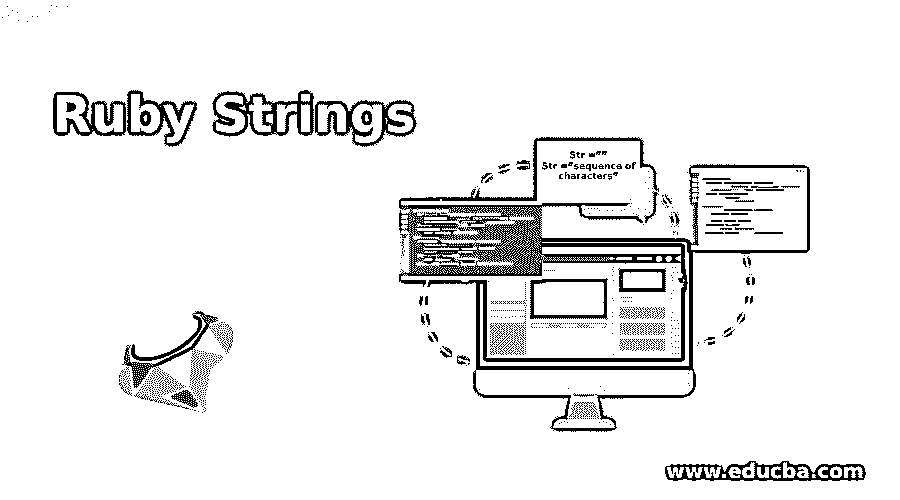
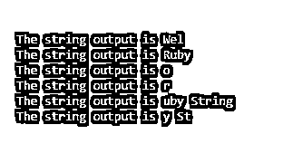
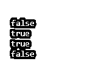
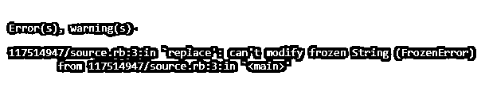

# 红宝石琴弦

> 原文：<https://www.educba.com/ruby-strings/>

## 红宝石字符串的定义

Ruby 中一个或多个字符序列的组合称为字符串，字符串可以是字母、数字和符号的组合。在 Ruby 中，字符串是一个对象，它可以是可变的，这意味着我们可以改变字符串，如果我们想创建任何字符串，那么我们需要将字符序列放在单引号内，或者将字符序列放在双引号内，我们不需要手动定义变量的数据类型，通过使用单引号或双引号，Ruby 会自动理解它是字符串类型。

### 如何在 Ruby 中定义和初始化字符串？

下面是 Ruby 中定义和初始化字符串的简单语法。我们可以用下面的方式解释下面的语法。

<small>网页开发、编程语言、软件测试&其他</small>

*   我们给变量的名字是 Str，你可以给任何其他的名字。
*   Str 最初分配黑色字符串值。通过使用双引号将空白值赋值，Ruby 编译器自动理解这就是字符串。
*   在下一行中，我们已经赋值“字符序列”，我们已经讨论过 Ruby 中的字符串是不可变的，因此这里 Str 变量的初始值是空字符串，之后，我们为它赋值。

`Str =””
Str =”sequence of characters”`

### Ruby 中字符串操作的例子

有许多字符串操作对于 Ruby 中与字符串相关的日常开发非常有用。让我们来理解字符串操作。

#### 1.接近

要访问字符串中的任何字母或特定位置非常容易，我们使用[]符号进行访问，它们的行为就像数组索引一样。我们也可以通过使用索引来获得值。在下面的例子中，我们试图从字符串变量 strAccess 中访问任何属性。我们能够通过这些信件的索引直接访问这些信件。

**代码:**

`strAccess = "Welcome to Ruby String concepts and enjoy the tutorial"
puts "The string output is #{strAccess["Wel"]}"
puts "The string output is #{strAccess['Ruby']}"
puts "The string output is #{strAccess[4]}"
puts "The string output is #{strAccess[-4]}"
puts "The string output is #{strAccess[12, 11]}"
puts "The string output is #{strAccess[14 .. 17]}"`

**输出:**

#### 2.连锁的

这是一种互相添加字符串的方式。很多时候，我们可能需要将两个字符串彼此相加，以便获得唯一的输出。在下面的例子中，我们通过三种不同的机制来实现这一点，在第一种机制中，我们使用预添加技术(+=)进行添加，在第二种方式中，我们使用 ruby cocate 的方法，concat 方法添加两个字符串，并将在字符串连接后返回一个字符串。我们可以使用 Ruby 定义的+或方法进行连接。

**代码:**

`variable1 = ""
variable1 += "My name is Raj"
variable1 += " I am from Mumbai"
variable1 += " I love Coding"
puts variable1
variable2 = ""
variable2.concat("Raj")
variable2.concat("Kumar")
puts variable2
variable3=23
variable4="Raj"
puts variable3.to_s+variable4`

**输出:**

#### 3.比较

字符串编程的比较是至关重要的工作之一。在 ruby 中有两种比较方式:一种是使用“=”操作符，另一种是使用 Ruby 的 eql 方法。在这两种情况下，我们都需要两个字符串进行比较。这些比较区分大小写，这意味着如果大小写匹配，则只有 true。在下面的例子中，我们将“raj”与“Raj”进行比较，结果返回 false，因为第一个字母的大小写不同。

**代码:**

`puts "Raj".eql?("raj")
puts "String".eql?("String")
puts "Raj"=="Raj"
puts "Raj"=="raj"`

**输出:**

#### 4.冻结

该功能将通过应用程序的整个流程来管理数据一致性。它允许我们通过使用冻结方法来固定任何包含字符串的变量的值。在下面的例子中，我们首先给变量 msg 赋值，在下一行中我们试图用其他字符串替换这个值，但是它会返回一个错误，因为它不允许我们替换我们已经给变量赋值的初始值。即使我们已经实现了冻结，我们也不能替换索引或者原始字符串中的任何字母。

**代码:**

`msg = "Hello friend, my name is Raj"
msg.freeze #Here we are freezing the string and it cannot modify now
msg.replace("ello friend, my name is Vijay") #It will return an error
puts msg[0] msg[0] = 'W' #It will return an error`

**输出:**

#### 5.复制

如果我们需要多次重复相同的字符串，那么我们可以使用复制。要使用复制，我们需要使用符号(*)。如果你知道乘法，它以类似的方式工作，我们只需要用*和我们想要的相同字符串的次数。不要与数字乘法混淆，因为在这种情况下，它的工作原理和乘法一样，只是在字符串的情况下它会改变它的行为。

**代码:**

`msg = "This is world is a beautiful place\n"
# Here we are using * operator to create number same string
puts msg * 5`

**输出:**

#### 6.插入文字

插值是一种将字符串和变量合并在一起的方法，在下面的例子中，我们将变量和字符串合并并打印出来。请查看下面的示例以及输出屏幕。

**代码:**

`location ="Mumbai"
age  = 25
name = "Raj"
puts "Hello friends ,my name is #{name} & my age is #{age} years old .I am from #{location}"`

**输出:**

### 结论

从本教程中，我们了解了 Ruby 字符串，并借助示例了解了 Ruby 字符串的用途及其各种重要操作。我们关注了一些重要的 Ruby 字符串操作及其定义。

### 推荐文章

这是一个红宝石字符串的指南。在这里，我们还讨论了定义以及如何在 ruby 中定义和初始化字符串，并举例说明了各种字符串操作。您也可以看看以下文章，了解更多信息–

1.  [Ruby 模块](https://www.educba.com/ruby-modules/)
2.  [Ruby 数组方法](https://www.educba.com/ruby-array-methods/)
3.  [Ruby 中的循环](https://www.educba.com/loops-in-ruby/)
4.  [红宝石运算符](https://www.educba.com/ruby-operators/)

