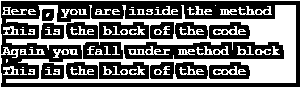

# 红宝石产量

> 原文：<https://www.educba.com/yield-in-ruby/>

## Ruby 中 Yield 的介绍

在 Ruby 中，如果我们想用块代码调用任何方法，那么我们可以使用 yield 语句。yield 是 Ruby 中的一个关键字，它允许开发人员从 yield 向块传递一些参数，传递给块的参数的数量没有限制，在 Ruby 中使用 yield 的主要优势是，如果我们面临任何情况，我们希望我们的方法根据调用块执行不同的功能，这意味着我们可以在块内定义一些逻辑，当方法被调用时，逻辑块将执行，借助于这种行为，任何人都可以根据需要用不同的块调用方法。

### 句法

下面是 yield 语句的一个非常简单的语法。在下面的语法中，我们在 method_name 中编写了两个 yield，每个 yield 包含块的参数值，这意味着 yield 会将参数值传递给块，或者用更一般的话来说，每次块都将得到一个调用，并从 yield 块获得传递的值。

<small>网页开发、编程语言、软件测试&其他</small>

请参见下面的语法。

`def method_name
yield argumentValue1
yield argumentValue2
end
method_name {|argument| "This is the block side"}`

### Yield 语句在 Ruby 中是如何工作的？

我们可以借助以下语句来解释 yield 在 Ruby 中的工作原理。

*   Yield 是 Ruby 中的一个关键字，当我们想要调用任何块时，我们可以使用 yield，只要我们在任何方法中写入 yield，它就会假定为一个阻塞调用。
*   从 yield 语句向块传递多个参数没有限制。
*   我们会多次将 yield 写在它试图调用 block 的方法中。
*   要将 yield 中的任何参数传递给块，我们可以在块中写||作为参数的名称。
*   {|number|放置“您的消息”}，yield 将调用 yield 5。所以这里 5 将是|number|的值。

### 在 Ruby 中实现 Yield 的示例

下面是提到的一些例子:

#### 示例#1

在下面的例子中，我们定义了一个名为 yieldExample 的方法，在这个方法中，我们编写了一些 puts 语句和 yield 语句。在此示例中，我们在调用 yieldExamle 方法时直接打印，而不向它传递任何参数。第一次它将调用并打印方法内容，下一次它将打印调用方法时使用的块代码。

**代码:**

#定义一个方法，在这个方法中，我们编写了 yield 语句。这些 yield 语句包含作为参数的消息，这些消息将在调用这些方法时打印出来。

`def yieldExample
puts "Here , you are inside the method"
yield
puts "Again you fall under method block"
yield
end
yieldExample {puts "This is the block of the code"}`

**输出:**

#### 实施例 2

在下面的例子中，我们定义了一个名为 yieldExample 的方法，在这个方法中，我们编写了一些 puts 语句和 yield 语句。在这个例子中，我们用参数作为数字调用方法，并在调用 yieldExamle 方法时打印数字，而不向它传递任何参数。当 yield 示例方法被调用时，它将打印编写在方法调用块中的输出，块将从 Yield 语句中读取其块的 number 变量。

**代码:**

#定义一个方法，在这个方法中我们写了 yield 语句，这些 yield 语句包含一些整数值作为参数，这些参数将在调用这个方法时打印出来。

`def yieldExample
yield 5
puts "You are inside the method yieldExample"
yield 100
end
yieldExample {|i| puts "This is the iteration number  #{i}"}`

**输出:**

#### 实施例 3

在下面的例子中，我们定义了一个名为 yieldExample 的方法，在这个方法中，我们编写了一些 puts 语句和 yield 语句。在这个例子中，我们使用参数作为一些用户的名字来调用方法，并在调用 yieldable 方法时打印这些名字，而不使用消息块。当 yield 示例方法被调用时，它将打印编写在方法调用块中的输出，块将从 Yield 语句中读取 names 变量。

**代码:**

#定义一个方法，在这个方法中，我们编写了 yield 语句。这些 yield 语句包含一些名称作为参数，这些名称将在调用这些方法时打印出来。

`def yieldExample
yield "Ranjan Kumar Pandey"
puts "Inside the method yieldExample"
yield "Ajay Sharma"
end
yieldExample {|name| puts "Your name is #{name}"}`

**输出:**

#### 实施例 4

在下面的例子中，我们定义了一个名为 yieldExample 的方法，在这个方法中，我们编写了一些 puts 语句和 yield 语句。这是一个完全不同的例子，因为我们在这里传递一些参数给 yield。通过使用这种方法，我们能够用一种方法执行多种算术运算。每次从块中调用算术方法时，它的 yield 方法将读取从块内||运算符传递的数据。

**代码:**

#定义一个方法，在该方法中，我们将 yield 编写为具有两个参数的方法。

`def arithmetic(a, b)
yield(a, b)
end
puts "The sum of the two numbers is #{arithmetic(8, 2) { |a, b| a + b }}" # addition of two number
puts "The multiplication of the two numbers is #{arithmetic(8, 2) { |a, b| a * b }}" # multiplication of two numbers
puts "The subtraction of the two numbers is #{arithmetic(8, 2) { |a, b| a - b }}" # subtraction of two numbers
puts "The division of the two numbers is #{arithmetic(8, 2) { |a, b| a / b }}" # division of two numbers`

**输出:**

### 结论

从这些教程中，我们了解了 Ruby 中 yield 的基础知识，我们也了解了 yield 的工作原理，我们知道当我们想从任何方法调用一个块时都可以使用 yield，yield 可以传递许多参数给这个块。

### 推荐文章

这是一个 Ruby 中的 Yield 指南。这里我们讨论 Ruby 中 Yield 的介绍，以及适当的语法、工作和相应的例子。您也可以浏览我们的其他相关文章，了解更多信息——

1.  [Ruby 命令](https://www.educba.com/ruby-commands/)
2.  [Ruby 模块](https://www.educba.com/ruby-modules/)
3.  [红宝石运算符](https://www.educba.com/ruby-operators/)
4.  [红宝石变量](https://www.educba.com/ruby-variables/)

